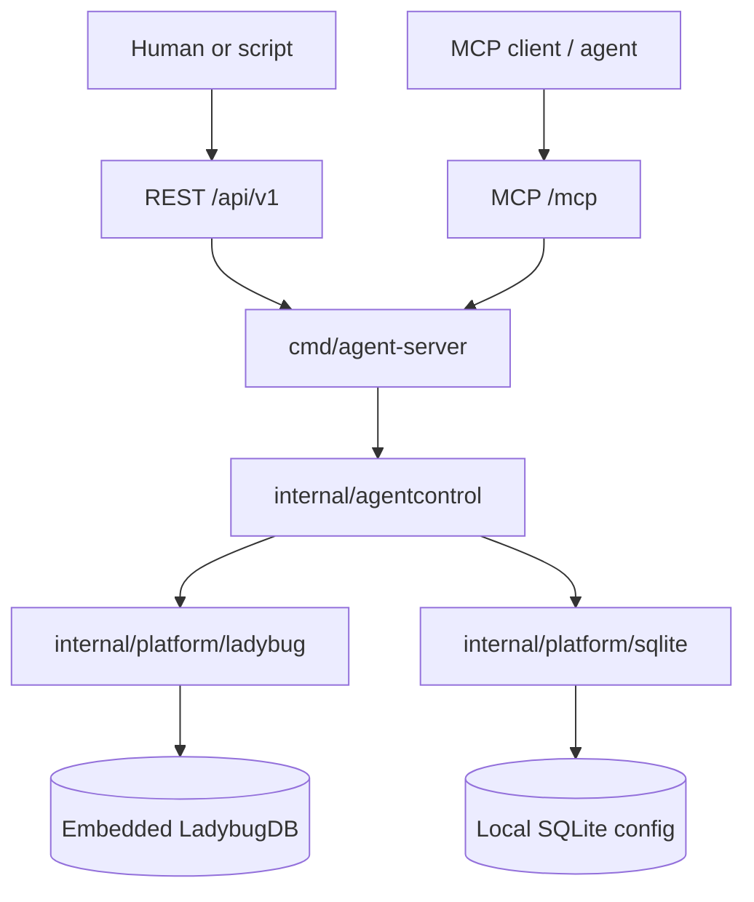
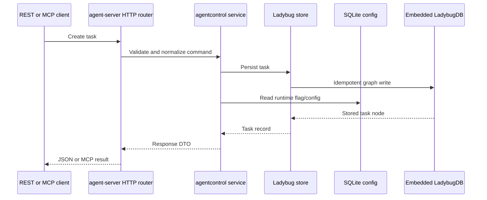

# Bootstrap Go Agent Microservices Monorepo

Status: Active
Last verified: 2026-05-30
Classification: Internal; PII-prohibited until policy owner approves
Owners: Engineering owner TBD; Security/DPO TBD

## Scope

Bootstrap this repository as a generic Go microservices monorepo for AI-agent work.

Goals:

- `.ai/` is the canonical vendor-neutral source of truth.
- `AGENTS.md` and `CLAUDE.md` are thin wrappers.
- Go baseline uses one root module until independent release boundaries exist.
- Local PostgreSQL/pgvector and Neo4j configuration is scrapped from bootstrap.
- LadybugDB is the simple embedded bootstrap graph persistence store.
- SQLite is the local app-configuration store.
- One Go `agent-server` exposes REST under `/api/v1` and MCP Streamable HTTP under `/mcp`.
- Persistence schema bootstrap is idempotent LadybugDB and SQLite initialization, not external database migrations.
- Research boundaries avoid hardcoding one AI provider.
- CI and verification gates are added after service/data layers exist.

Non-goals:

- No production Kubernetes, Terraform, or cloud deployment in bootstrap.
- No UI.
- No real secrets.
- No PostgreSQL, pgvector, or Neo4j configuration until an owner explicitly re-approves that data-store choice.
- No paid Neo4j Enterprise features without license approval.
- No raw LadybugDB query endpoint over REST or MCP.
- No raw SQLite query endpoint over REST or MCP.
- No secrets, tokens, raw prompts, raw fetched content, or PII in SQLite.
- No public or non-localhost server exposure until authn/authz, origin policy, rate limits, and audit logging are approved.
- No PII ingestion until Security/DPO approves purpose, retention, access, and deletion.
- No embedding model or vector dimension until ADR approval.

## Acceptance Criteria

- AC-1: `.ai/` contains canonical agent rules, skills, task/handoff templates, and provider adapter guidance.
- AC-2: `AGENTS.md` and `CLAUDE.md` are thin wrappers that load `.ai/`.
- AC-3: Go monorepo baseline builds and tests with Go 1.26.x.
- AC-4: No database Compose runtime is configured during bootstrap unless a new owner-approved ADR changes the datastore decision.
- AC-5: `agent-server` exposes `/healthz`, `/readyz`, REST `/api/v1`, and MCP `/mcp`.
- AC-6: LadybugDB graph schema and SQLite app-config schema bootstrap idempotently and without destructive resets.
- AC-7: Every phase has a copy-paste handoff prompt.
- AC-8: CI runs format, vet, unit tests, and secret scanning.

## Target Architecture



REST and MCP are transport adapters only. Both call the same internal domain/service interfaces. LadybugDB stores graph/task data; SQLite stores local app settings and non-secret runtime metadata.



## Phase 1 - Agent Workflow Foundation

Status: Completed
Verified: 2026-05-30

Files:

- `.ai/INDEX.md`
- `.ai/rules/00-operating-doctrine.md`
- `.ai/rules/10-security-privacy.md`
- `.ai/rules/20-go-service-standards.md`
- `.ai/rules/30-docker-data.md`
- `.ai/skills/README.md`
- `.ai/skills/project-plan/SKILL.md`
- `.ai/skills/project-implement/SKILL.md`
- `.ai/skills/project-review/SKILL.md`
- `.ai/skills/security-review/SKILL.md`
- `.ai/adapters/codex/README.md`
- `.ai/adapters/claude/README.md`
- `AGENTS.md`
- `CLAUDE.md`
- `.ai/handoffs/README.md`
- `.ai/tasks/active/README.md`
- `.ai/tasks/done/README.md`

Verifier:

- Open `AGENTS.md` and `CLAUDE.md`; both must point to `.ai/INDEX.md` and avoid duplicated policy.
- Check expected files exist.

Verification performed:

- `sed -n '1,80p' AGENTS.md`
- `sed -n '1,80p' CLAUDE.md`
- `find .ai -type f`
- `wc -l AGENTS.md CLAUDE.md`
- `grep -R -n -E '[[:blank:]]$' .ai AGENTS.md CLAUDE.md`

Prompt:

```text
Implement Phase 1 only in /home/mac/mivialabs/mivialabs-agents-monorepo. Create the vendor-neutral .ai rules, skills, adapter docs, AGENTS.md, CLAUDE.md, and handoff/task folders listed in the active bootstrap task. Do not create Go code, Docker files, databases, CI, or service scaffolding. Keep wrappers thin and make .ai the canonical source. Run file existence checks and report changed files plus residual gaps.
```

## Phase 2 - Repo And Go Baseline

Status: Completed
Verified: 2026-05-30

Files:

- `README.md`
- `docs/adr/0001-go-monorepo-architecture.md`
- `docs/research/2026-05-30-platform-baseline.md`
- `.gitignore`
- `.editorconfig`
- `.gitattributes`
- `go.mod`
- `doc.go`
- `Makefile`
- `scripts/check.sh`
- `scripts/test.sh`
- `scripts/lint.sh`

Verifier:

- `go version`
- `go mod tidy`
- `go test ./...`
- `make check`

Verification performed:

- `go version`
- `go mod tidy`
- `go test ./...`
- `make check`

Residual risk:

- Go is installed user-local under `/home/mac/.local/opt/go1.26.3`; commands run through WSL login shells resolve `/home/mac/.local/bin/go`.

Prompt:

```text
Implement Phase 2 only. Read .ai first. Add root Go monorepo baseline files, ADR-0001, research baseline, scripts, and Makefile. Use one root go.mod with Go 1.26/toolchain go1.26.3. Do not add Docker, database migrations, or service code yet. If Go is not installed, stop after file creation and report the exact missing tool.
```

## Phase 3 - LadybugDB Persistence And Interface Plan

Status: Completed
Verified: 2026-05-30

Files:

- `.gitignore`
- `go.mod`
- `go.sum`
- `tools/ladybug.go`
- `README.md`
- `Makefile`
- `.ai/rules/20-go-service-standards.md`
- `.ai/rules/30-docker-data.md`
- `.ai/tasks/active/bootstrap-go-agent-microservices-monorepo.md`
- `docs/adr/0002-ladybugdb-persistence-baseline.md`
- `docs/adr/0003-agent-server-rest-and-mcp-boundary.md`
- `docs/research/2026-05-30-platform-baseline.md`

Verifier:

- `go list -m github.com/LadybugDB/go-ladybug`
- `go list -m modernc.org/sqlite`
- `go mod tidy`
- `go test ./...`
- Confirm no `compose.yaml`, `infra/postgres`, `infra/neo4j`, or database secret examples exist.

Verification performed:

- `go list -m github.com/LadybugDB/go-ladybug`
- `go list -m modernc.org/sqlite`
- `go mod tidy`
- `go test ./...`
- `make check`
- `git diff --check`
- `Test-Path .../compose.yaml`
- `Test-Path .../infra`
- `Test-Path .../secrets`
- `Test-Path .../docker`

Residual risk:

- LadybugDB is selected for bootstrap graph persistence, but future service implementation still needs native library setup before importing it in normal build paths.
- SQLite is selected for local app configuration with `modernc.org/sqlite`; schema is implemented in Phase 4/5.
- Public/non-localhost REST or MCP exposure still requires authn/authz, origin policy, rate limits, and audit logging approval.

Prompt:

```text
Implement Phase 3 only. Select LadybugDB as the simple embedded graph persistence store and SQLite as the local app-configuration store using `modernc.org/sqlite`. Do not configure PostgreSQL, pgvector, Neo4j, Docker Compose database services, database secret examples, or external database migrations. Keep `github.com/LadybugDB/go-ladybug` and `modernc.org/sqlite` anchored through `tools/ladybug.go`, add ADRs for LadybugDB/SQLite persistence and REST/MCP server boundaries, and update README/research/rules/task docs. Run `go list -m github.com/LadybugDB/go-ladybug`, `go list -m modernc.org/sqlite`, `go mod tidy`, `go test ./...`, and confirm no external database runtime files were added.
```

## Phase 4 - Agent Server Skeleton

Status: Completed
Verified: 2026-05-30

Files:

- `cmd/agent-server/main.go`
- `internal/platform/config`
- `internal/platform/logging`
- `internal/platform/health`
- `internal/platform/httpserver`
- `internal/platform/ladybug`
- `internal/platform/sqlite`
- `internal/agentcontrol`
- `scripts/ladybug-libs.sh`

Verifier:

- `go test ./...`
- Native Ladybug library setup documented or scripted before `internal/platform/ladybug` imports `go-ladybug`.
- `go run ./cmd/agent-server`
- Local `/healthz`, `/readyz`, `/api/v1/tasks`, and `/mcp` smoke tests.

Verification performed:

- `go mod tidy`
- `go test ./internal/agentcontrol ./internal/platform/httpserver`
- `go test ./...`
- `make check`
- Local smoke test with `go run ./cmd/agent-server` on `127.0.0.1:18080`:
  - `GET /healthz`
  - `GET /readyz`
  - `POST /api/v1/tasks`
  - `GET /api/v1/tasks/{id}`
  - `POST /mcp` initialize
  - `POST /mcp` tools/list

Residual risk:

- LadybugDB native imports remain gated behind `ladybug_native`; normal `go test ./...` does not import `go-ladybug`.
- `scripts/ladybug-libs.sh` documents local native-library setup, but native Ladybug integration is not exercised until an explicit integration build path is approved.
- `agent-server` remains localhost-only and unauthenticated; non-localhost exposure still requires authn/authz, origin policy, rate limits, and audit logging approval.

Implementation details:

1. Create `cmd/agent-server/main.go` with config load, logger setup, HTTP router, signal handling, and graceful shutdown.
2. Create `internal/platform/config` for environment parsing:
   - `MIVIA_HTTP_ADDR`, default `127.0.0.1:8080`.
   - `MIVIA_LADYBUG_PATH`, default `data/mivialabs.lbug`.
   - `MIVIA_SQLITE_PATH`, default `data/mivialabs-config.sqlite`.
   - Request-size and timeout defaults.
3. Create `internal/platform/httpserver` with route registration, request ID middleware, recovery middleware, timeout middleware, and JSON response helpers.
4. Create `internal/platform/health` with liveness and readiness checks.
5. Create `internal/platform/ladybug` with a small interface first; import `go-ladybug` only after native library setup is scripted.
6. Create `internal/platform/sqlite` with a small app-config interface using `database/sql` plus `modernc.org/sqlite`; use in-memory SQLite for tests.
7. Create `internal/agentcontrol` with task DTOs, service interface, in-memory test store, Ladybug store adapter stub, and SQLite-backed app config hook.
8. Add REST adapter routes for:
   - `POST /api/v1/tasks`
   - `GET /api/v1/tasks/{id}`
9. Add MCP adapter skeleton at `/mcp`:
   - Handle initialize/discovery.
   - Return 405 or explicit unsupported responses for unimplemented streaming paths.
   - Validate `Origin`, `Accept`, `Content-Type`, and protocol version headers.
10. Keep MCP and REST handlers thin; no handler may execute raw LadybugDB or SQLite query strings from client input.

Prompt:

```text
Implement Phase 4 only. Add a single `cmd/agent-server` with shared config, logging, health, HTTP server, LadybugDB platform, and SQLite config packages. Add the minimal `internal/agentcontrol` service/store interfaces used by REST and MCP adapters. Expose `/healthz`, `/readyz`, a minimal REST `/api/v1/tasks` surface, and an MCP `/mcp` initialization/discovery skeleton. Do not add research logic, external AI providers, PostgreSQL, pgvector, Neo4j, Compose database services, raw database query endpoints, or public/non-localhost exposure. Before importing `go-ladybug` in normal build paths, add a native library setup script or documented build tag path so `go test ./...` remains reproducible. Run gofmt, go test ./..., and local smoke tests for health, readiness, REST, and MCP.
```

## Phase 5 - Contracts, LadybugDB Schema, REST, And MCP

Files:

- `api/openapi/agent-control.v1.yaml`
- `api/mcp/agent-control.v1.md`
- `internal/agentcontrol/model`
- `internal/agentcontrol/service`
- `internal/agentcontrol/store`
- `internal/agentcontrol/httpapi`
- `internal/agentcontrol/mcpapi`
- `internal/platform/ladybug/schema`
- `internal/platform/sqlite/schema`
- `docs/adr/0004-embedding-provider-and-vector-dimension.md`

Verifier:

- OpenAPI contract validates where tooling is available.
- MCP capability docs list resources, tools, input schemas, and output schemas.
- LadybugDB schema bootstrap is idempotent on an empty local graph database.
- SQLite schema bootstrap is idempotent on an empty local config database.
- Unit tests cover task creation, task lookup, REST validation, MCP tool dispatch, and no raw query exposure.
- `go test ./...`

Implementation details:

1. Create `api/openapi/agent-control.v1.yaml` with schemas for task create/get and research-run create/get.
2. Create `api/mcp/agent-control.v1.md` with MCP tools/resources:
   - `tasks.create`
   - `tasks.get`
   - `research_runs.create`
   - `research_runs.get`
   - `mivialabs://tasks/{id}`
   - `mivialabs://research-runs/{id}`
3. Create `internal/agentcontrol/model` for internal structs and status constants.
4. Create `internal/agentcontrol/service` for validation, lifecycle transitions, and transport-neutral business methods.
5. Create `internal/agentcontrol/store` with `TaskStore` and `ResearchRunStore` interfaces.
6. Create `internal/platform/ladybug/schema` with idempotent graph bootstrap for:
   - Node labels: `Agent`, `Task`, `ResearchRun`, `Source`, `Document`, `Chunk`, `RepoFile`.
   - Relationships: `AGENT_RAN_TASK`, `TASK_CREATED_RESEARCH_RUN`, `TASK_USED_SOURCE`, `DOCUMENT_HAS_CHUNK`, `DOCUMENT_LINKS_TO_DOCUMENT`, `TASK_TOUCHED_REPO_FILE`.
7. Create `internal/platform/sqlite/schema` with idempotent bootstrap for:
   - `app_settings`
   - `runtime_flags`
   - `schema_versions`
8. Add Ladybug-backed store methods for create/get only; defer search, graph traversal, and background processing.
9. Add SQLite-backed config methods for read/write of non-secret app settings and runtime flags.
10. Add tests for validation, schema bootstrap idempotency, create/get persistence, app-config persistence, REST adapter behavior, and MCP dispatch behavior.

Prompt:

```text
Implement Phase 5 only. Add the initial OpenAPI REST contract, MCP capability document, agentcontrol models/service/store, REST adapter, MCP adapter, idempotent LadybugDB graph schema bootstrap, and idempotent SQLite app-config schema bootstrap. Keep LadybugDB data simple: Agent, Task, ResearchRun, Source, Document, Chunk, and the relationships listed in ADR-0002. Keep SQLite limited to non-secret app settings, runtime flags, and schema_versions. Do not expose raw LadybugDB or SQLite queries. Do not add external AI providers, live browsing, PostgreSQL, pgvector, Neo4j, Compose database services, or destructive schema resets. Create ADR-0004 for embedding provider/vector dimension and leave provider/dimension unselected. Validate OpenAPI where tooling is available and run go test ./....
```

## Phase 6 - Research And Deep-Research Boundaries

Files:

- `internal/research/provider`
- `internal/research/web`
- `internal/research/deep`
- `internal/research/redaction`
- `internal/research/store`
- `internal/research/httpapi`
- `internal/research/mcpapi`
- `docs/security/research-data-handling.md`

Verifier:

- Unit tests for redaction.
- Unit tests for source hashing and duplicate detection.
- Unit tests for task state transitions.
- REST and MCP tests prove raw content is not logged or returned by default.
- No live network in unit tests.

Implementation details:

1. Create provider interfaces that return source metadata, summaries, hashes, and artifact references, not raw provider payloads.
2. Create fixture-only web and deep-research implementations; no live network in unit tests.
3. Create redaction utilities for credentials, obvious personal data patterns, URLs with sensitive query params, and provider payload fields.
4. Store research metadata through the Phase 5 store interfaces:
   - URL or artifact reference.
   - Retrieval timestamp.
   - Content hash.
   - Source type.
   - Redacted summary.
   - Policy metadata.
5. Add REST hooks under `/api/v1/research-runs`.
6. Add MCP tools/resources for research-run create/get only; defer broad crawling and provider execution.
7. Add `docs/security/research-data-handling.md` with PII prohibition, retention open questions, logging rules, and owner decisions required before live crawling.

Prompt:

```text
Implement Phase 6 only. Add research/deep-research package boundaries, provider interfaces, Ladybug-backed metadata storage adapters, redaction, REST adapter hooks, MCP tool/resource hooks, and fixture tests. Do not wire a real paid AI provider, embedding provider, or live browsing provider unless an ADR already approves it. No live network in unit tests. Prove raw content is not logged, raw fetched content is not returned by default, and sensitive fields are redacted in REST and MCP responses.
```

## Phase 7 - CI, Security, Observability, Runbooks

Files:

- `.github/workflows/ci.yml`
- `.github/dependabot.yml`
- `.gitleaks.toml`
- `docs/runbooks/local-dev.md`
- `docs/runbooks/incident.md`
- `docs/security/privacy-baseline.md`
- `docs/adr/0005-observability-baseline.md`

Verifier:

- CI workflow syntax validates.
- `make check`
- `go test ./...`
- Ladybug native library setup is either exercised in CI or explicitly gated behind a documented optional integration job.
- Secret scanning where installed.

Implementation details:

1. Add `.github/workflows/ci.yml` with format check, `go vet`, `go test ./...`, and optional Ladybug integration setup.
2. Add `.github/dependabot.yml` for Go modules and GitHub Actions.
3. Add `.gitleaks.toml` and document local secret scanning.
4. Add `docs/runbooks/local-dev.md` with Go setup, Ladybug native library setup, local server run command, REST smoke test, MCP smoke test, and troubleshooting.
5. Add `docs/runbooks/incident.md` with local-only bootstrap incident handling, logging constraints, and escalation owners.
6. Add `docs/security/privacy-baseline.md` with PII prohibition, logging exclusions, retention open questions, and DPO review gates.
7. Add `docs/adr/0005-observability-baseline.md` for structured logs now, metrics/tracing later.

Prompt:

```text
Implement Phase 7 only. Add CI, dependabot, secret scanning config, local-dev runbook, incident runbook, privacy baseline, and ADR-0005 for observability. CI must run gofmt check, go vet, go test ./..., and secret scanning. Ladybug native library setup must be either tested in CI or gated behind a clearly named optional integration job with residual risk documented. Keep observability minimal: structured logs with request ID, service, task ID, and no raw prompt/source/PII. Do not add PostgreSQL, pgvector, Neo4j, or database Compose runtime. Run make check, go test ./..., and secret scanning if installed.
```
