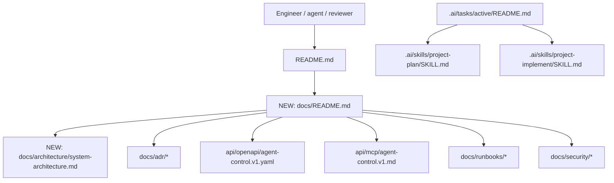
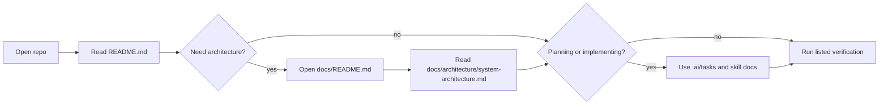
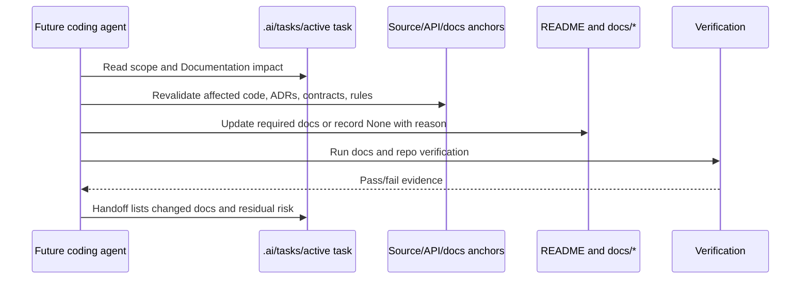

# Create Project README And Architecture Docs

| Field | Value |
| --- | --- |
| Ticket | N/A - free-text plan |
| Type | Task |
| Status | Draft |
| Author | plan-task skill |
| Date | 2026-05-30 |
| Classification | Internal; PII-prohibited |
| Owners | Engineering owner TBD; Security/DPO TBD |
| Linked Epic | N/A |

## 1. Context

The root `README.md` is stale: it says Phase 3 is current and that the repo has no service entrypoints, CI, Docker runtime, database migrations, or provider integrations, while the current worktree has `cmd/agent-server/main.go`, REST/MCP handlers, research metadata handlers, CI, and runbooks. The active bootstrap task is marked completed and already documents the intended high-level architecture with Mermaid diagrams. The repo's canonical planning skill stores active plans under `.ai/tasks/active/` and requires phase scope, verification commands, and copy-paste prompts. Confluence guidance from Rimthan Lab requires current README, architecture diagrams, ADR stewardship, API docs, runbooks, and documentation tasks during planning/review.

## 2. Problem statement

The repository lacks a short, current, enterprise-grade documentation entrypoint that explains the system architecture, data flows, API/MCP boundaries, safety constraints, and required docs-update discipline for future tasks.

## 3. Goals

- Make the root README accurate, short, and useful as the first entrypoint.
- Add a docs index that points readers to architecture, ADRs, API contracts, runbooks, and security policy.
- Add a source-grounded system architecture document with Mermaid flow and sequence diagrams.
- Require every future task plan and implementation handoff to include documentation creation or update decisions where feasible.
- Keep all documentation aligned with current code, ADRs, and security/privacy rules.

## 4. Non-goals

- No implementation code changes.
- No new API, MCP, datastore, auth, provider, embedding, crawling, deployment, or production architecture decisions.
- No Confluence publishing in this phase unless an owner explicitly asks for it.
- No PII, secrets, raw prompts, raw source content, provider payloads, or real credentials in docs, diagrams, examples, or smoke-test snippets.

## 5. Acceptance criteria

- [ ] AC-1: `README.md` states the current system shape: Go 1.26 root module, `cmd/agent-server`, localhost REST `/api/v1`, MCP `/mcp`, embedded LadybugDB abstraction, SQLite app-config, fixture-only research boundary, CI/runbooks, and no approved production/provider/PII posture.
- [ ] AC-2: `NEW: docs/README.md` exists and acts as a short documentation map for architecture, ADRs, API/MCP contracts, runbooks, and security docs.
- [ ] AC-3: `NEW: docs/architecture/system-architecture.md` exists and includes a short C4-style overview, component/data-flow Mermaid diagram, REST/MCP sequence diagram, data classification notes, and operational boundaries.
- [ ] AC-4: `.ai/tasks/active/README.md` and `.ai/skills/project-plan/SKILL.md` require future task plans to include a `Documentation impact` decision: required updates, new docs, diagrams, or explicit `None - reason`.
- [ ] AC-5: `.ai/skills/project-implement/SKILL.md` requires phase handoffs to list docs changed or explicitly justify no doc change.
- [ ] AC-6: The docs do not contain raw secrets, tokens, personal data, raw prompts, raw source content, or provider payload examples.
- [ ] AC-7: Verification commands in section 13 pass or failures are recorded with exact residual risk.

## 6. Constraints

- Workflow source of truth: `.ai/` remains canonical; root adapters and README must point to it, not duplicate policy.
- Task-plan location: active plans belong under `.ai/tasks/active/` unless a user names another path.
- Security/privacy: PII ingestion is prohibited until Security/DPO owner approval; docs must not include real secrets, credentials, tokens, raw prompts, raw fetched content, personal data, or proprietary third-party content.
- Provider posture: no AI provider, embedding model, vector dimension, retention behavior, or external crawling policy is approved until an ADR exists.
- Service standards: service entrypoints stay under `cmd/<service>/`, shared platform code under `internal/platform/`, domains under `internal/<domain>/`, API contracts under `api/`, REST under `/api/v1`, MCP under `/mcp`.
- Docker/data: no production Kubernetes/Terraform/cloud deployment in bootstrap; no PostgreSQL, pgvector, Neo4j, Compose database services, secret files, or database volumes during bootstrap.
- Runtime exposure: localhost-only bind remains required until authn/authz, origin policy, rate limits, and audit logging are approved.
- Confluence guidance: Tech Lead/System Architect guidance expects current READMEs, C4-style architecture docs, data-flow diagrams, ADRs, runbooks, and documentation tasks during planning/review.

## 7. Architecture / data flow

The README remains the entrypoint and links to deeper docs instead of becoming a long architecture dump. The new architecture doc becomes the stable system map, while `.ai/` rules enforce future documentation impact checks.

## 8. User flow

## 9. Sequence

## 10. Detailed implementation plan

1. **Root README** - in `README.md`:
   - Rewrite the current-phase section so it no longer claims Phase 3/no service entrypoints.
   - Keep it short: purpose, current runtime, architecture summary, quick start, docs map, security/privacy posture, local verification.
   - Link to `.ai/INDEX.md`, `docs/README.md`, `docs/architecture/system-architecture.md`, `api/openapi/agent-control.v1.yaml`, `api/mcp/agent-control.v1.md`, `docs/runbooks/local-dev.md`, `docs/security/privacy-baseline.md`, and `docs/security/research-data-handling.md`.
2. **Docs index** - create `NEW: docs/README.md`:
   - Add sections for architecture, ADRs, API/MCP contracts, runbooks, security/privacy, research notes, and task/handoff docs.
   - Keep each entry one sentence with a link.
3. **Architecture doc** - create `NEW: docs/architecture/system-architecture.md`:
   - Add status, date, classification, owner assumptions, and source-grounded scope.
   - Include a component/data-flow Mermaid diagram for REST, MCP, `internal/agentcontrol`, `internal/research`, Ladybug graph abstraction, SQLite config, and redaction boundary.
   - Include a REST/MCP request sequence diagram and a docs-update workflow sequence diagram.
   - Include constraints: localhost-only, no raw DB query endpoints, no real PII, no live providers, no vector dimension/provider decision.
4. **Task guidance** - update `.ai/tasks/active/README.md`:
   - Add required `Documentation impact` field to active task files.
   - Require every task to list docs to update or `None - reason`.
5. **Planning skill** - update `.ai/skills/project-plan/SKILL.md`:
   - Add a documentation-impact step after source grounding.
   - Require Mermaid diagrams for architecture/workflow/user-flow changes where feasible.
6. **Implementation skill** - update `.ai/skills/project-implement/SKILL.md`:
   - Require final handoffs to list docs changed, docs intentionally not changed, verification, and next docs owner decision if incomplete.
7. **Optional task sync** - update `.ai/tasks/active/bootstrap-go-agent-microservices-monorepo.md` only if the implementer needs to link this documentation task from the completed bootstrap summary.
8. **Tests and checks** - see section 13.

## 11. Data model changes

_None._ This is documentation and agent-workflow guidance only.

## 12. Contract / API changes

_None._ The OpenAPI and MCP contract files are documentation inputs and link targets only. Do not change endpoint schemas or runtime handlers in this task.

## 13. Testing strategy

- **Docs:** Verify every new/updated Markdown file opens and all relative links point to existing files.
- **Diagrams:** Confirm Mermaid fences start with `flowchart` or `sequenceDiagram` and contain no tabs.
- **Security:** Search changed docs for secret/token/example leakage markers and real PII patterns before delivery.
- **Repo checks:** Run `go test ./...` and `make check` after docs updates unless WSL/Go tooling is unavailable; if unavailable, record exact tool failure.
- **Contract:** If OpenAPI docs are edited despite this plan's non-goal, parse `api/openapi/agent-control.v1.yaml` with available YAML/OpenAPI tooling.

## 14. Observability

- **Logs:** No runtime log changes. Docs must state allowed log fields and prohibited payloads consistently with `docs/adr/0005-observability-baseline.md` and `docs/security/research-data-handling.md`.
- **Metrics:** None.
- **Traces:** None.
- **Dashboards:** None.

## 15. Documentation updates

- `README.md`
- `NEW: docs/README.md`
- `NEW: docs/architecture/system-architecture.md`
- `.ai/tasks/active/README.md`
- `.ai/skills/project-plan/SKILL.md`
- `.ai/skills/project-implement/SKILL.md`
- Optional: `.ai/tasks/active/bootstrap-go-agent-microservices-monorepo.md`

## 16. Rollout / migration

Docs-only rollout:

1. Create/update docs in one PR or local change set.
2. Run docs/link/security checks plus `go test ./...` and `make check` if tooling is available.
3. Human review by engineering owner for architecture accuracy.
4. Security/DPO review only if any doc text changes privacy posture, data retention, provider use, public exposure, or PII handling. Otherwise note that no policy posture changed.

Rollback is a normal documentation revert or follow-up docs correction. No data migration or runtime rollback is involved.

## 17. Security, privacy, compliance

- **PII surfaces touched:** none by implementation; docs must not include PII examples.
- **Vault interactions:** none.
- **PDPL / NCA-ECC / SAMA / ZATCA / TGA touchpoints:** docs must preserve current PII prohibition and owner-review gates; no legal interpretation is added.
- **AuthN / AuthZ changes:** none.
- **Data residency:** internal/local bootstrap only; no production data residency claim beyond existing open decisions.
- **Secrets:** docs must not include real `.env`, tokens, credentials, private keys, or provider payloads.

## 18. Risks and mitigations

| Risk | Likelihood | Impact | Mitigation |
| --- | --- | --- | --- |
| README repeats stale phase status again | M | M | Link to source-grounded architecture docs and keep README short. |
| Architecture doc overclaims production readiness | M | H | State localhost-only, no approved public exposure, no approved providers, no PII ingestion. |
| Future agents skip docs updates | M | M | Add `Documentation impact` requirements to task README and planning/implementation skills. |
| Mermaid diagrams drift from code | M | M | Anchor diagrams to files listed in section 21 and require review when handlers/contracts change. |
| Docs accidentally include sensitive examples | L | H | Run secret/PII marker search and keep examples synthetic/redacted. |

## 19. Out of scope

- Runtime code edits.
- Public deployment or production runbook promises.
- Provider/model/vector selection.
- Authn/authz design.
- Data retention/deletion policy decisions.
- Confluence publishing.

## 20. Open questions

- Engineering owner: Should `docs/architecture/system-architecture.md` be mirrored to Confluence now, or kept repo-local until the architecture stabilizes?
- Engineering owner: Should the docs use only Mermaid, or should a future ADR approve Structurizr/C4-as-code for richer architecture views?
- Security/DPO owner: Who owns final approval of the privacy wording before any future public/provider work?

## 21. References

- **Jira:** N/A - no Jira ticket supplied.
- **Confluence:** Tech Lead Guide (ID 267649316, space RL, last modified Feb 08 2026); System Architect Guide (ID 267518164, space RL, last modified Feb 08 2026); Enterprise Starter Kit (ID 267518306, space RL, last modified Mar 08 2026).
- **In-repo docs:** `README.md:5` current phase heading; `README.md:7` stale Phase 3/no-service claim; `.ai/tasks/active/README.md:7` one-task-per-file rule; `.ai/tasks/active/README.md:8` required status/verification/prompt fields; `.ai/skills/project-plan/SKILL.md:15` output-location heading; `.ai/skills/project-plan/SKILL.md:17` active-plan location; `.ai/tasks/active/bootstrap-go-agent-microservices-monorepo.md:50` target architecture heading; `.ai/tasks/active/bootstrap-go-agent-microservices-monorepo.md:52` existing architecture diagram; `.ai/tasks/active/bootstrap-go-agent-microservices-monorepo.md:78` existing sequence diagram.
- **ADRs:** `docs/adr/0001-go-monorepo-architecture.md`; `docs/adr/0002-ladybugdb-persistence-baseline.md`; `docs/adr/0003-agent-server-rest-and-mcp-boundary.md:12` agent-server decision; `docs/adr/0003-agent-server-rest-and-mcp-boundary.md:22` REST/MCP shared-service/no raw-query boundary; `docs/adr/0003-agent-server-rest-and-mcp-boundary.md:50` MCP request constraints; `docs/adr/0004-embedding-provider-and-vector-dimension.md`; `docs/adr/0005-observability-baseline.md`.
- **Policies:** `.ai/rules/10-security-privacy.md:5` internal default; `.ai/rules/10-security-privacy.md:6` PII approval gate; `.ai/rules/10-security-privacy.md:10` sensitive data commit prohibition; `.ai/rules/10-security-privacy.md:27` provider/embedding ADR gate; `.ai/rules/20-go-service-standards.md:11` service entrypoint path; `.ai/rules/20-go-service-standards.md:25` REST path; `.ai/rules/20-go-service-standards.md:26` MCP path; `.ai/rules/20-go-service-standards.md:27` no raw DB queries in handlers; `.ai/rules/30-docker-data.md:13` LadybugDB baseline; `.ai/rules/30-docker-data.md:14` SQLite baseline; `.ai/rules/30-docker-data.md:15` forbidden external database bootstrap runtime.
- **Catalog entries:** none found in this repo.
- **Source anchors:** `cmd/agent-server/main.go:87` server mux creation; `cmd/agent-server/main.go:88` `/healthz`; `cmd/agent-server/main.go:89` `/readyz`; `cmd/agent-server/main.go:90` agentcontrol REST registration; `cmd/agent-server/main.go:91` research REST registration; `cmd/agent-server/main.go:92` MCP handler registration; `internal/platform/config/config.go:12` default localhost/data path constants; `internal/platform/config/config.go:64` config validation; `internal/platform/config/config.go:68` localhost-only validation; `internal/agentcontrol/httpapi/httpapi.go:14` REST route registration; `internal/agentcontrol/mcpapi/mcpapi.go:47` MCP request handling; `internal/agentcontrol/mcpapi/mcpapi.go:64` MCP POST validation; `internal/agentcontrol/mcpapi/mcpapi.go:95` JSON-RPC dispatch; `internal/agentcontrol/mcpapi/mcpapi.go:239` MCP tool definitions; `internal/agentcontrol/model/model.go:14` task model; `internal/agentcontrol/model/model.go:26` research-run model; `internal/agentcontrol/service/service.go:38` task creation validation; `internal/agentcontrol/service/service.go:101` research-run creation validation; `internal/platform/ladybug/schema/schema.go:15` graph schema; `internal/platform/sqlite/schema/schema.go:12` SQLite bootstrap statements; `internal/research/httpapi/httpapi.go:13` research REST route registration; `internal/research/mcpapi/mcpapi.go:16` research MCP tool definitions; `internal/research/service.go:41` source metadata creation; `internal/research/redaction/redaction.go:28` redaction; `internal/research/provider/provider.go:13` source metadata shape.

## 22. Confidence notes

High confidence: repo-local file locations, current REST/MCP route shape, data-store bootstrap boundaries, and privacy/provider constraints are grounded in current source, rules, ADRs, and API docs listed above. Medium confidence: Confluence guidance is relevant as general Rimthan documentation policy, but no exact MiviaLabs Confluence page was found. Medium confidence: Serena started after `gopls` installation, but semantic symbol reads failed on the UNC workspace with `no views`; source grounding therefore used direct file reads with line numbers instead of Serena symbol bodies.
