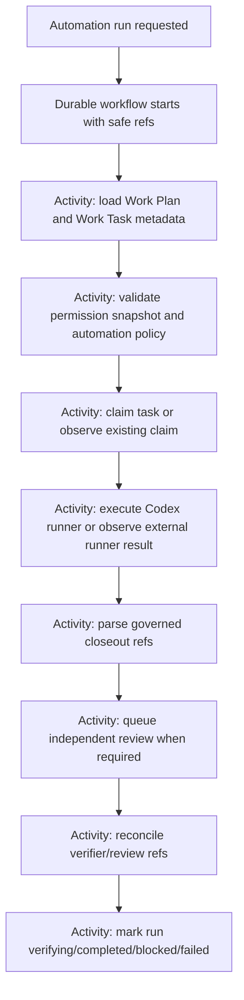

# Go Workflows Durable Automation Pilot Implementation Plan

Created: 2026-06-10
Last verified against source: 2026-06-10 at HEAD `d0d7088` (Phase 6 durable config and SQLite backend committed; required Phase 6 verifier ladder green)
Status: in progress - Phases 0, 0B, 0R, 1, 2, 3, 4, 5, and 6 are COMPLETE and green
Current phase: Phase 7 runner shadow hooks
Owner decision required before Phase 1 (dependency) work: granted 2026-06-10, contingent on Phase 0R green (satisfied; dependency added)

## Objective

Prove that `github.com/cschleiden/go-workflows` can run beside the current Mivia automation/workflow implementation as a durable execution engine for Codex-driven automation runs and multi-workflow chains.

The current implementation remains authoritative until parity is proven. Do not remove, bypass, or replace the existing `projectworkflow`, `projectautomation`, `projectworkflowchain`, `projectworkplan`, runner, GitOps, review, verifier, Evidence Graph, confidence, or knowledge-promotion paths during this plan.

## Recommendation

Use `go-workflows` in shadow mode first.

Rationale:

- It is Go-native and embeddable.
- Official docs show workflows and activities are plain Go, activities can have side effects, and workflows can resume after interruption.
- The project exposes memory and persistent backends, including SQLite, MySQL, PostgreSQL, and Redis.
- Current latest stable module version observed by `go list -m -versions github.com/cschleiden/go-workflows` is `v1.4.2`; avoid nightly versions.

Sources checked:

- `go list -m -versions github.com/cschleiden/go-workflows`
- https://cschleiden.github.io/go-workflows/
- https://github.com/cschleiden/go-workflows

## Current Implementation State (verified 2026-06-10)

Verified directly against source, git history, and live test runs at HEAD `bffe1ca` (`test(workflows): add durable pilot baseline contracts`, +3199/-122 across 25 files, working tree clean). Any future agent must re-verify the volatile rows (dependency, package existence, test green-ness) before relying on this table.

| Item | State | Evidence |
|---|---|---|
| Phase 0 baseline regression tests | DONE | `baseline_contract_test.go` in `internal/projectautomation` (482 lines), `internal/projectworkflow` (227), `internal/projectworkflowchain` (364), `internal/projectworkplan` (570), `internal/projectgitops` (244), `internal/projectevidence` + `baseline_behavior_test.go`, `internal/projectconfidence` + behavior, `internal/projectknowledge` + behavior, `cmd/mivia-automation-runner` (210) |
| Phase 0B V2 intake acceptance design | DONE | `PHASE_0B_V2_INTAKE_ACCEPTANCE_MATRIX.md` (this folder); `TestPhase0B*` in `internal/projectworkflowchain/intake_contract_test.go` (409 lines), `internal/projectgitops/intake_policy_contract_test.go`, `internal/projectintegrations/local_intake_contract_test.go` |
| Phase 0 verifier ladder | GREEN | 2026-06-10 run: `go test` returned `ok` for all nine plan packages plus `./internal/projectintegrations` |
| Phase 0R gap closure | DONE 2026-06-10 | branch `mivia/go-workflows-durable-pilot`: 7 tests ADDED (TestClaimNextRunReclaimsExpiredLeaseAndRejectsStaleCompletion, TestBaselineChainRecordsCompiledStageWithPlannedPlanAndNoQueuedRuns, TestBaselineChainStartFailsClosedForDisabledChainAndUnknownWorkflowRef, TestBaselineGovernedDeliveryJourneyPinsEveryBoundaryJira, TestBaselineChainMcpReadModelMatchesStoreAfterBlockedActivation, TestBaselineGitOpsRetryAfterCreatedPRDoesNotCreateDuplicatePR, TestBaselineWorkTaskResumeUsesOnlyPersistedMetadata); 0R.7 + 0R.8-safe_ref VERIFIED-EXISTING; free-text journey V2-PENDING(Phase 5); independent diff review passed (869 insertions, 0 deletions, tests-only) |
| `BASELINE_TEST_MATRIX.md` | DONE 2026-06-10 | 62 rows, every Test-First Gate bullet mapped to grep-verified test names; V2-PENDING rows: 17, 18, 19, 31, 61 |
| `go-workflows` dependency | ADDED 2026-06-10 | `go.mod`: `github.com/cschleiden/go-workflows v1.4.2` (latest stable confirmed via `go list -m -versions`; v1.4.3 exists only as nightly); ~19 transitive indirects, no unrelated churn |
| `internal/projectdurable` | EXISTS (Phase 1 spike) | `engine.go` (memory engine wrapper: `NewMemoryEngine` = in-memory SQLite backend + `worker.NewWorkflowOrchestrator`), `engine_test.go` (deterministic 2-activity+timer workflow; exactly-2-activity-executions replay proof; safe serializable result checks) |
| `[durable_workflows]` config | EXISTS (Phase 6 local pilot) | owner-approved update 2026-06-10: defaults must be `enabled=true`, `shadow_mode=true`, `backend="memory"`, `worker_enabled=true`; SQLite path restricted to ignored `data/*.sqlite`; durable worker startup must remain shadow-only/non-authoritative until Phase 8B/9 approval |
| Production chain input kinds | `jira_issue_key`, `safe_ref` only | `internal/projectworkflowchain/validation.go:26-30`, `model.go:33-34` |
| Phase 1 dependency spike | DONE 2026-06-10 | independent review passed; verifier green: `go build ./...`, `go test ./internal/projectdurable` + regression packages + full suite |
| Phase 2 ports and DTOs | DONE 2026-06-10 | `internal/projectdurable/{model.go,ports.go,intake.go}` + tests: metadata-only DTOs (SafeAutomationRunRef/SafeWorkTaskRef/SafeWorkflowStageRef/DurableRunSnapshot/DurableActivityResult/DurableFailureCategory) with `Validate()`; small local safety helpers `ValidateSafeRef`/`ValidateSafeSummary` (incl. unicode whitespace rejection); observe-only ports (AutomationRunObserver/WorkTaskObserver/ChainStageObserver/ShadowComparisonWriter, no internal imports); `NormalizeIntake` V2 intake: jira `PROJ-1044`/`jira:PROJ-1044` -> `jira:PROJ-1044`, deterministic `objective:<12hex>` from sha256(projectID+NUL+normalized text), ObjectiveText `json:"-"` never persisted/leaked, fail-closed cross-field checks. Independent review passed (one low finding fixed: unicode.IsSpace) |
| Phase 3 shadow run workflow | DONE 2026-06-10 | `workflows/automation_run.go` (`MiviaAutomationRunShadowWorkflow`, deterministic, ShadowOnly-enforced fail-closed, blocked-does-not-short-circuit / failed-skips, WriteShadowComparison always last), `activities/automation.go` (`AutomationRunActivities`: 8 observe-only methods over Phase 2 ports; nil-receiver method-value DI per go-workflows `samples/activity-registration`; port errors genericized; results validated), 8 scenario tests incl. missing-verifier-never-completes and trace-safety. Independent review PASS |
| Phase 4 test-only execution | DONE 2026-06-10 | execution ports (`WorkTaskClaimPort`/`AttemptCompletionPort` + `DurableAttemptOutcome`), `AutomationRunExecutionActivities` (fail-closed outcome validation BEFORE port call), `MiviaAutomationRunTestExecutionWorkflow` (test-only, documented), 6 execution tests driving the REAL projectautomation+projectworkplan services via test adapters, plus parity seed `TestParityCompletedExternalAttemptToVerifying` in `internal/projectdurable/parity/`. Independent review PASS with source-level confirmation of the duplicate-completion discovery below |
| Phase 5 multi-workflow chain shadow | DONE 2026-06-10 | chain shadow ordering/carry-forward, local-ingested Jira refs, objective intake through `NormalizeIntake`, comparison-last terminal paths, replay/idempotency, and hardened `*ForShadow` wrappers covered at HEAD `f5ba272` |
| Phase 6 SQLite local pilot | DONE 2026-06-10 | `[durable_workflows]` config added with owner-approved enabled shadow defaults; owner follow-up implemented: `worker_enabled=true` by default; backend enum memory/sqlite; safe local SQLite path validation; local SQLite constructor under `internal/projectdurable/store`; tests updated with the default-worker-on expectation |
| Phases 7-9 (durable pilot) | NOT STARTED | Phase 7 carries the remaining risk: the worker flag defaults on, but any durable runtime hook must remain shadow-only/non-authoritative, must not mutate current workflow/automation/runner state, and must not imply cutover approval |

Old-system behavior discovered and pinned during Phase 4 (constraint 22; V2 must do better, parity row 38 "duplicate complete"): a duplicate `CompleteAttempt` with the same claim token against a `verifying` run is accepted idempotently at run level (status/claim unchanged, no second review queued) BUT persists a SECOND attempt row with the same `AttemptNumber` while `run.AttemptCount` stays unchanged (`service.go` CompleteAttempt, verified independently in review). Pinned by `TestDurableExecutionDuplicateCompletionIsIdempotent`. The durable path must not duplicate attempt rows after cutover.

Pre-existing deep coverage discovered during verification. Do NOT duplicate these tests; cite them in the baseline test matrix instead:

- self-review rejection: `TestCompletedPostImplementationReviewRejectsSelfReviewHandoff` (`internal/projectautomation/service_test.go:12672`);
- duplicate correlated chain start: `TestStartWithSameCorrelationReturnsExistingActiveChainRun` (`internal/projectworkflowchain/service_test.go:800`);
- GitOps terminal retry exhaustion: `TestRetryGitOpsStopsAfterTerminalRecoveryExhaustion` (`internal/projectworkflowchain/service_test.go:2055`);
- dirty-scope recovery: `TestHandleWorkPlanStatusChangedRecordsDirtyScopeGitOpsRecoveryEvidence`, `TestRequeuePreExecutionRecoveryExpandsScopeForDirtyPathsUnderLikelyFiles`, `TestRequeuePreExecutionRecoveryBlocksDirtyPathsOutsideLikelyFiles` (`internal/projectautomation/service_test.go`, `internal/projectworkflowchain/service_test.go`);
- Codex timeout handling: `TestCompleteAttemptRequeuesTimedOutCodexCLIForClaimedTask`, `TestCompleteAttemptBlocksTimedOutCodexCLIAfterReplacementRetryLimit` (`internal/projectautomation/service_test.go`);
- claim lease and heartbeat token: `TestClaimNextRunSetsClaimLeaseAndCompleteAttemptRequiresMatchingClaimToken`, `TestHeartbeatRequiresMatchingClaimTokenAndExtendsLease` (`internal/projectautomation/service_test.go:2585,2621`);
- parallel batch conflict rules: `TestComputeParallelBatchRejectsConflictingFiles`, `TestComputeParallelBatchRejectsConflictingFilesToEditWhenLikelyFilesMissing`, `TestComputeParallelBatchSkipsNotReadyTasks`, `TestComputeParallelBatchSkipsTasksWithOpenDependencies` (`internal/projectautomation/service_test.go:6411+`);
- GitOps no-change path: `PostTaskResult{NoChanges: true}` with `git-no-changes` evidence ref (`internal/projectgitops/service.go:149,165`; asserted near `service_test.go:1413`);
- activation persistence ordering: `TestStartDoesNotActivateFirstStageBeforeChainRunPersists`, `TestStartDoesNotActivateFirstStageBeforeStageMetadataUpdatePersists`, `TestHandleWorkPlanStatusChangedDoesNotActivateNextStageBeforeChainUpdatePersists`, `TestHandleWorkPlanStatusChangedDoesNotFinalizeGitOpsBeforeCheckpointPersists` (`internal/projectworkflowchain/service_test.go`);
- whole-pipeline start-to-end journeys through draft PR: `TestJiraTicketChainPreservesEveryAutomationHandoffThroughDraftPR` (`internal/projectworkflowchain/service_test.go:991`), `TestGenericSafeRefChainPreservesCodexHandoffDataThroughDraftPR` (`:1074`), `TestGenericSafeRefChainWithRealWorkflowCompilerPreservesGeneratedTaskOutputsThroughGitOps` (`:1186`), `TestRealChainCarriesConcreteChildTaskFromCompletedDecompositionPlan` (`:1334`), `TestGenericWorkflowPipelineQueuesClaimsCompletesAndReviewsDependentHandoffs` (`internal/projectautomation/service_test.go:1020`), `TestStartCreatesFirstStageAndAdvancesAfterPlanDone` (`internal/projectworkflowchain/service_test.go:162`).

## Non-Negotiable Constraints

1. Current implementation stays live and authoritative until 100% parity is proven.
2. The durable engine stores only safe metadata refs. Never store raw prompts, completions, source dumps, raw stderr, provider payloads, secrets, roots, external URLs, skipped sensitive content, or PII in workflow history.
3. Codex CLI execution remains an activity boundary, not workflow logic.
4. Workflow functions must be deterministic. All filesystem, MCP, REST, GitOps, Codex, clock, random ID, and shell effects must be activities.
5. Work Plans and Work Tasks remain the governed source of truth.
6. Review gates, verifier refs, claim refs, evidence refs, confidence, knowledge promotion, permission snapshots, and GitOps conventions remain Mivia-owned domain logic.
7. No live workflow chain is moved to durable execution until the parity matrix in this plan is green.
8. No Jira or Confluence live connector usage for this repo unless explicitly requested.
9. New branches for implementation must use `mivia/`.
10. `.ai/tasks/*` stays local-only unless the user explicitly asks to publish it elsewhere.
11. Regression and contract tests for the current implementation must be written and green before any durable implementation code is added.
12. No `go-workflows` dependency, `internal/projectdurable` package, durable config field, runner hook, or workflow engine code may be introduced until the baseline regression gate is green (done, `bffe1ca`), the V2 governed-intake acceptance design is complete (done), Phase 0R gap closure is recorded in `BASELINE_TEST_MATRIX.md`, and the owner has explicitly approved the four pre-implementation decisions in Required Human Decisions.
13. The new side-by-side governed pipeline must support both a Jira-style ticket key resolved from local-ingested Jira content and a free-text user objective with no Jira ticket. Both routes must compile into the same governed Work Plan, Work Task, automation, review, verifier, GitOps, and workflow-chain contracts.
14. Jira ticket intake may read only already-ingested local integration content. It must not call live Jira, resolve credentials, poll providers, write remote artifacts, or treat a local miss as proof that the upstream ticket does not exist.
15. Existing workflow-chain, workflow, automation, runner, GitOps, and pipeline production behavior is frozen during the pilot. Baseline tests may be added around existing behavior, but the new implementation must be built beside it and must not modify current production paths until explicit cutover approval after parity.
16. Plan text, new code, new tests, examples, configs, docs, and prompts must use neutral project placeholders only. Do not add real client names, real project ids, real repository names, or client-specific ticket prefixes. Owner-approved carve-out (2026-06-10): real project ids and ticket keys may appear ONLY in local-ignored operator artifacts under `.ai/tasks/go-workflows-durable-automation-pilot/` (this plan, `E2E_EVIDENCE.md`) and in the operator's local server config, because Phase 8B drives a real run. They must never appear in committed code, tests, fixtures, docs, generated examples, or this repo's commits.
17. V2 must not persist or expose generic blocked states when a failed substep can be known or derived. Every blocked/failed chain, stage, plan, task, automation, runner, verifier, review, GitOps, PR, and handoff transition must expose safe failure category, failed substep, related safe refs, recovery status, retryability, and next action.
18. V2 must never leave a compiled-but-not-activated stage, plan, task set, automation set, or PR handoff without a durable checkpoint and a recovery decision: completed, retryable, repairable, terminal, or explicitly operator-blocked.
19. V2 must be restart-safe. After process crash, runner loss, timeout, duplicate claim, partial persistence, or network interruption, the orchestrator must either continue from the last checkpoint idempotently or block with exact recovery metadata.
20. V2 must not require runtime logs to diagnose workflow state. Logs may help debugging, but MCP/REST/read-model state must contain enough safe metadata for an operator or low-intelligence recovery agent to know what failed and what can be retried.
21. V2 cannot create commits, push, open draft PRs, or mark handoffs complete until review refs, verifier refs, evidence refs, generated-artifact checks, GitOps recovery checks, and metadata-only safety checks have passed.
22. Flawless means no known unhandled transition class. If implementation discovers a new state transition, handoff, recovery point, or failure mode, tests and parity rows must be updated before code for that behavior can proceed.
23. Parity cannot be declared from in-process tests alone. The complete-system local E2E protocol (Phase 8B) must pass with the real `codex` CLI, real GitOps to GitHub (signed commit, push, draft PR), and Jira context read exclusively from local Mivia ingestion storage - for the baseline path and the durable shadow path - before any cutover or runtime opt-in approval. Live Jira/Confluence connector calls remain forbidden throughout; "Jira" in E2E always means already-ingested local content.
24. Network rules by tier: automated `go test` suites stay network-free and credential-free forever. Real network use (GitHub push/PR, real Codex execution) is allowed only inside the operator-supervised Phase 8B protocol, through the existing runner and GitOps boundaries, against the operator-approved target repository.

## Flawless Reliability Definition

The side-by-side implementation is not accepted because it works on the happy path. It is accepted only when it can survive and explain the failure modes that currently break workflow chains.

Required properties:

- every multi-step transition is modeled as a checkpointed saga with explicit preconditions, action, postconditions, idempotency key, retry policy, compensation or repair path, and terminal failure category;
- stage activation is split into named checkpoints: compile stage, carry forward output refs, release compiled tasks, activate Work Plan, trigger/observe automation queueing, verify queued/running counts, and persist the activation read model;
- if any activation checkpoint fails, the chain read model must show the exact failed checkpoint, stage ref, Work Plan ref, task refs, automation refs, queue counts, retryability, recovery command/ref, and safe next action;
- orphan detection must find compiled stages where the plan remains planned, tasks/automations exist, and no run is queued or running; V2 must repair, retry, or block with exact metadata instead of a generic reason;
- run stats, MCP reads, and REST reads must agree on chain status, stage status, Work Plan status, task status, automation/run counts, GitOps/PR status, handoff refs, recovery point, and next action;
- no success status may be written until postconditions are re-read from storage and proven true;
- duplicate retries must be idempotent and must not create duplicate tasks, duplicate automation runs, duplicate commits, duplicate PRs, duplicate evidence refs, or duplicate knowledge candidates;
- recovery must cover process restart, stale runner lease, crashed worker, partial task release, partial Work Plan activation, partial GitOps, failed verifier repair, failed review queueing, failed PR creation, and failed handoff creation;
- handoffs must be first-class artifacts with safe refs to upstream task outputs, verifier refs, review refs, evidence refs, PR refs when applicable, residual risk, and exact next action;
- if a failure cannot be safely retried automatically, V2 must fail closed and produce a bounded operator recovery packet.

## Test-First Gate

This plan exists because workflow bugs came from untested transitions, handoffs, status changes, refs, context packs, review/verifier gates, GitOps recovery, and knowledge-promotion boundaries. Therefore the first implementation work is tests only.

Hard rule:

```text
No durable implementation code starts until Phase 0 baseline regression tests are added and pass against the current implementation. New V2 behavior must be introduced test-first in the side-by-side implementation, not by changing current production workflow or pipeline behavior.
```

Status note (2026-06-10): the baseline floor below is implemented and green (see Current Implementation State). The list remains the binding contract: Phase 0R closes the residual verify-or-add deltas, and any newly discovered transition must still be added to this list and tested before durable code for that behavior proceeds.

Baseline regression tests must cover current behavior before any durable wrapper exists. These tests become the contract that the durable pilot must match.

Minimum required coverage:

- every `Automation` lifecycle status: `draft`, `enabled`, `disabled`, `running`, `paused`, `failed`, `cancelled`, `superseded`;
- every `AutomationRun` status transition: `queued`, `claiming`, `starting`, `running`, `verifying`, `completed`, `failed`, `blocked`, `cancelled`, `policy_denied`, `runner_unavailable`, `timeout`;
- every `AutomationParallelBatch` status: `planned`, `running`, `completed`, `failed`, `blocked`, `cancelled`;
- every `WorkPlan` lifecycle status: `planned`, `active`, `blocked`, `needs_review`, `done`, `failed`, `cancelled`, `superseded`;
- every relevant `WorkTask` lifecycle transition used by automation: `planned`, `ready`, `claimed`, `in_progress`, `needs_review`, `verifying`, `done`, `blocked`, `failed`, `cancelled`, `superseded`;
- Work Plan isolation metadata: `shared`, `dedicated_worktree`, `unavailable`, `parallel_group_ref`, `workspace_ref`, `git_base_ref`, `git_branch_ref`, `git_worktree_ref`;
- Work Task decomposition quality values: `draft`, `ready`, `too_broad`, `missing_evidence`, `missing_context`, `missing_verification`, `missing_resume`;
- Work Task contract fields: `acceptance_criteria`, `stop_conditions`, `verifier_ladder`, `regression_test_applicability`, `downstream_impact_refs`, `output_contract`, `artifact_refs`, `agent_run_ids`;
- Work Task operational APIs: `resume`, `get_next`, `claim`, `release`, `start`, `complete`, `fail`, `block`, `update_status`, `expand_scope`, and all attachment paths;
- attachment kind aggregation for evidence, context pack, claim, verifier result, review result, and knowledge candidate refs;
- Work Plan status trigger handoff into automatic automation queueing;
- task-triggered automatic automation order: create task as `planned`, create/enable automation, then transition task to `ready`;
- automation trigger/source/schedule behavior: `manual`, `automatic`, `workflow`, `on-ready-task`, required review task gating, disabled/paused/draft automations do not queue runs;
- runner kinds and execution modes: `codex_cli`, `manual`, `in_process`, `external`, `managed`, `AllowManualRunner`, `RequireCodexWhenAvailable`, missing Codex binary, disabled runner, and no silent fallback;
- existing governed Jira intake regression coverage: validate current `input_kind = "jira_issue_key"` behavior, normalize `PROJ-123` and `jira:PROJ-123` to the same `jira:PROJ-123` input ref, read only local-ingested Jira context, attach `jira-context:<key>:*` refs, and block safely when local context is missing or incomplete;
- existing chain `safe_ref`/indexed repo intake, smoke pipeline behavior, dry-run chain start, duplicate correlated start, disabled chain, invalid workflow ref, input pattern rejection, and no-persistence dry run behavior;
- new V2 governed intake from a Jira ticket key: prove the side-by-side pipeline preserves the same local-ingested Jira semantics without changing the current production workflow-chain path;
- new V2 governed intake from free text: accept bounded user objective text, create a deterministic safe input ref without storing the raw objective in Work Plan, Work Task, automation, chain, durable, GitOps, logs, traces, or test fixtures, attach safe context refs, and run the same decomposition -> implementation -> post-validation pipeline shape;
- Jira and free-text V2 intake parity: both routes create isolated-worker-ready Work Tasks, context pack refs, permission snapshots, review gates, verifier gates, automations, stage handoffs, and GitOps metadata without hidden chat context;
- local integration boundary: tests prove governed Jira intake does not call live Jira/Confluence connectors, does not trigger provider polling, and reports local misses as local-ingestion misses only;
- dependency completion and dependent task release;
- workflow compile output shape: Work Plan ID, implementation task IDs, reviewer task IDs, automation IDs, permission snapshot IDs;
- workflow status lifecycle: `draft`, `enabled`, `disabled`, `superseded`;
- workflow step kinds: `work_plan`, `work_task`, `automation`, `automation_batch`, `review_gate`;
- workflow review gate decisions: `approved`, `rejected`, `needs_changes`, `blocked`, required artifacts, allowed actions, and independent reviewer enforcement;
- workflow permission snapshot fields: instructions, allowed/denied skills/tools/commands, workspace mode, network policy, secret policy, log policy, max runtime, max retries, content hash, run/trace refs;
- chain stage handoff: stage ordering, stage completion, next-stage activation, source-ref to concrete Work Task ID carry-forward;
- chain stage activation checkpoints: compile, carry-forward, release compiled tasks, activate Work Plan, queue/observe automations, re-read postconditions, persist read model;
- activation fault injection at every checkpoint before and after persistence; after restart/retry the chain must either complete activation idempotently or block with exact checkpoint, safe refs, retryability, and recovery next action;
- orphan-state detection and recovery for compiled next stage with Work Plan still planned, tasks/automations created, and no queued/running automation runs;
- no generic chain/stage blocked reason is allowed when the failed checkpoint can be named;
- chain terminal states: completed, post-validation-passed, blocked, failed, cancelled, superseded;
- GitOps readiness and post-validation draft PR handoff;
- whole-pipeline journey coverage: for each intake route (Jira local-ingested, `safe_ref`/indexed smoke, and V2 free-text objective once V2 exists), at least one test drives the full governed delivery pipeline start to end - chain start -> decomposition compile/activate -> implementation task claim/execute/closeout -> review + verifier refs -> stage carry-forward -> post-validation -> GitOps finalization -> persisted draft PR ref -> final handoff packet - asserting every persisted status and ref at each boundary;
- whole-pipeline failure/resume coverage: the same journey interrupted at each stage boundary (after persistence, before the next action) must resume idempotently to the same terminal state without duplicate plans, tasks, automations, commits, or PRs;
- GitOps pre-task and post-task behavior: clean worktree checks, allowed pathspec scope, dirty-scope recovery, no-change handling, clean-ahead branch finalization, commit creation, signed commit evidence, push, draft PR, post-PR checks, branch/ticket/change-type templates, generated artifact verification, bootstrap/autofix/always-before-PR commands, credential boundaries, and cleanup-worktree-after-plan-done;
- GitOps failure recovery: repairable, terminal, completed, retry exhaustion, partial GitOps success recovery;
- PR creation gates: no draft PR before implementation evidence, review refs, verifier refs, generated-artifact checks, GitOps policy, branch metadata, and safe PR body rendering are all proven;
- PR recovery: failed commit, failed push, failed PR creation, duplicate PR attempt, missing credential, and post-PR check failure produce exact safe recovery metadata and never mark chain complete;
- Codex runner handoff: claim-next, claim lease, heartbeat, timeout, complete-attempt, duplicate complete, stale claim, wrong runner ID, missing runner ID;
- worker/orchestrator handoffs: every worker closeout, reviewer closeout, verifier result, recovery packet, and final phase handoff must preserve safe refs and must be sufficient for a low-intelligence agent to resume without chat history;
- governed closeout parser: valid needs-review, block, fail, malformed JSON, multiple JSON values, unsafe ref, unsafe path, unsafe raw material, child task creation, readback failure;
- review gates: required review task, independent reviewer, self-review rejection, review exemption only for explicitly allowed tiny tasks, missing review refs block completion;
- verifier gates: missing verifier refs block completion, verifier refs attach, failed verifier produces safe terminal or repair path;
- remediation-from-finding flow: confirmed finding only, creates governed Work Plan, implementation task, optional review task, automation, optional activation, permission snapshot refs, GitOps refs, evidence refs, and regression-test requirement;
- Evidence Graph flow: claim create/read/list, evidence append, decision create, action create, outcome record, artifact link, promotion candidate with verifier/decision/action/outcome requirements;
- Confidence flow: evidence diversity, context health, stale claim checks, impact analysis, score bands, and confidence refs only when reusable knowledge exists;
- Knowledge Promotion flow: candidate, validated, project promoted, org review, org promoted, rejected, superseded, and no auto-promotion from automation or confidence alone;
- evidence refs, claim refs, review refs, verifier refs, knowledge candidate refs, and generated-artifact refs are preserved across state transitions;
- context pack refs are preserved from workflow compile through Work Plan/Task activation and stage carry-forward;
- permission snapshot refs are created, attached, immutable, and used for automation permission checks;
- `allowed_task_refs`, `allowed_work_task_ids`, task IDs, and task refs all resolve without widening scope;
- parallel batch rules reject overlapping files, overlapping artifacts, failed dependencies, missing verifier ladders, missing downstream refs, and non-disjoint promotion scope;
- no-diff implementation output blocks safely;
- dirty worktree handling blocks or recovers according to GitOps config;
- branch naming and Conventional Commit/PR metadata rendering fail closed on invalid refs;
- generated artifact requirements block PR creation when required artifacts are missing or drifted;
- Evidence Graph, Confidence Engine, and Knowledge Promotion decisions do not auto-promote from automation output alone;
- "no reusable knowledge" is recorded where applicable and does not create promotion candidates;
- all failure summaries, blocker reasons, refs, and durable/shadow comparison fields are metadata-only and contain no raw prompts, completions, raw stderr, source dumps, roots, secrets, external URLs, skipped sensitive content, or PII.

If a worker finds a transition or handoff not listed here, they must add it to the baseline test matrix before implementing durable code. The list above is a floor, not the complete system.

## Existing System Anchors

Ground truth files:

- `internal/projectworkflow/model.go`: workflow metadata, agents, steps, review gates, permission snapshots, compile result.
- `internal/projectautomation/model.go`: automations, runs, attempts, statuses, runner execution modes, claim/complete inputs.
- `internal/projectautomation/service.go`: current automation state transitions, claim-next, complete-attempt, verification reconciliation, post-implementation review queueing, remediation creation, GitOps recovery.
- `internal/projectautomation/codexcli.go`: Codex command build/run boundary and safe failure categories.
- `cmd/mivia-automation-runner/main.go`: external runner loop, preflight, claim, execute, heartbeat, report.
- `cmd/mivia-automation-runner/governed_closeout.go`: governed Codex closeout schema parsing, sanitization, child task creation rules.
- `internal/projectworkflowchain/model.go`: chain/stage model, post-validation status, GitOps readiness.
- `internal/projectworkflowchain/service.go`: multi-workflow pipeline orchestration, input normalization, local-ingested Jira context refs, stage compile/activate/release, stage output carry-forward, post-validation GitOps finalization.
- `internal/projectworkflowchain/validation.go`: current `jira_issue_key` and `safe_ref` input validation. Use this as the old-system contract. Do not change current production validation to add free-text intake during the pilot.
- `internal/projectintegrations/*`: local Jira/Confluence integration store, rich-content read path, redacted metadata, and local-only search/read boundaries.
- `configs/workflows/*.toml` and `configs/workflows/generic/*.toml`: checked-in workflow definitions.
- `configs/mivia-server.local.toml`: governed ticket-delivery chain examples may use project-specific values locally, but new plan/code examples must use neutral placeholders with `input_kind = "jira_issue_key"`, `context_provider = "jira"`, and `context_mode = "local_ingested"`.
- `.ai/skills/jira-governed-ticket-delivery/SKILL.md`: governed ticket-delivery operating workflow for local-ingested Jira ticket runs.

## Target Architecture

Add a new package beside the current implementation:

```text
internal/projectdurable/
  model.go
  engine.go
  engine_test.go
  workflows/
    automation_run.go
    workflow_chain.go
  activities/
    automation.go
    workplan.go
    codex.go
    gitops.go
  store/
    memory.go
    sqlite.go
```

Current production packages are read-only for behavior during the pilot. Allowed current-package edits are limited to baseline regression tests, test fakes, or test-only helpers that do not change runtime behavior. New Jira/text intake behavior belongs in the new side-by-side implementation.

Initial config is enabled for shadow construction and worker startup by owner approval (2026-06-10). Durable workers must remain shadow-only/non-authoritative by default:

```toml
[durable_workflows]
enabled = true
shadow_mode = true
backend = "memory" # memory for tests, sqlite for local pilot
sqlite_path = "data/durable-workflows.sqlite"
worker_enabled = true
max_parallel_runs = 1
```

Do not put raw workflow payloads in config, logs, metrics, or docs.
Do not let durable workers mutate authoritative state, replace current execution, or gate current success before Phase 8B evidence and Phase 9 approval.

## Boundary Design

Durable workflow code may coordinate these steps:



Durable workflow code must not:

- call `codex` directly;
- call shell commands;
- read or write repo files directly;
- generate IDs using non-deterministic functions inside workflow code;
- read current time directly inside workflow code;
- store raw output in workflow history.

Activities may:

- call current services;
- call Codex runner boundaries;
- call GitOps service boundaries;
- read current time;
- produce safe refs and safe status metadata only.

## Governed Intake Contract

The durable pilot cannot be considered usable unless the new side-by-side V2 path preserves the current governed delivery workflow contract and adds the missing non-Jira objective route without changing the old production pipeline.

Supported intake modes:

1. Jira ticket key intake.
   - Input example: `PROJ-1044` or `jira:PROJ-1044`.
   - Current config example: `<PROJECT>-governed-ticket-delivery` with `input_kind = "jira_issue_key"`, `context_provider = "jira"`, and `context_mode = "local_ingested"`.
   - Normalized input ref: `jira:PROJ-1044`.
   - Context source: local Mivia integration storage only.
   - Required context refs: `jira-context:<ticket>:summary`, `jira-context:<ticket>:scope`, `jira-context:<ticket>:implementation-evidence`, `jira-context:<ticket>:source-anchors`, `jira-context:<ticket>:verifier-scope`.
   - If local Jira content is missing, stale, incomplete, or not configured, the chain blocks with safe metadata. It must not call live Jira, poll Atlassian, resolve credentials, or infer that the upstream ticket does not exist.
   - GitOps ticket metadata uses the configured project ticket policy and PR templates.

2. Free-text objective intake.
   - Input example: a user-provided implementation objective with no Jira ticket.
   - Required implementation: add a governed V2 input kind such as `objective_text` or equivalent in the new side-by-side implementation. Current code only exposes `jira_issue_key` and `safe_ref`; do not modify the current production workflow-chain path to close this gap during the pilot.
   - Normalized input ref: deterministic safe ref derived from bounded input metadata, for example `objective:<short-id>`. The raw objective must not be persisted in chain runs, Work Plans, Work Tasks, automations, durable history, GitOps templates, logs, traces, or test fixtures.
   - Context source: indexed repo context and generated context pack refs, plus user-provided safe summary metadata if the current schema supports it. Store refs and bounded safe summaries only.
   - Required output shape: same decomposition -> implementation -> post-validation chain, same Work Plan/Task isolation, same review/verifier gates, same automation lifecycle, same knowledge/no-knowledge decision, same metadata-only safety.
   - GitOps ticket-required projects must either use a configured non-ticket branch/PR policy for objective work or block before GitOps. Workers must not invent fake Jira ticket refs.

Both intake modes must be accepted by V2 dry-run chain start and V2 real chain start, and both must be represented in the parity harness. The orchestrator must test Jira-backed and free-text-backed V2 runs separately; passing one route does not prove the other.

## Orchestrator And Subagent Execution Model

One orchestrator agent owns the full implementation. Subagents execute bounded task packets only; they do not choose architecture, relax gates, start duplicate chain runs, bypass review, or mark parity.

Orchestrator responsibilities:

1. Re-read `.ai/INDEX.md`, `.ai/rules/*`, `.ai/skills/mivia-mcp/SKILL.md`, and this plan before assigning work.
2. Keep current production workflows and pipelines behavior-frozen. Do not assign current-package production edits except explicit test-only changes.
3. Keep Phase 0 test-first gate closed until current-system regression tests pass.
4. Split work into isolated-worker-ready tasks with files to read, files to edit, expected refs, verification requirements, stop conditions, and review gates.
5. Assign only non-overlapping work to subagents.
6. Run or delegate independent review after each subagent result; subagent output is untrusted until verified against source and tests.
7. Own final integration, verifier execution, parity matrix updates, and go/no-go decisions.
8. Own recovery drills. Subagents may add tests and implementation, but the orchestrator must prove restart, retry, orphan detection, PR recovery, and handoff-resume scenarios before a phase can close.
9. Own PR production gates. No subagent may claim commit, push, draft PR, post-PR checks, or final handoff success unless the orchestrator re-reads persisted refs and verifies postconditions.
10. Own the operator read model. Every blocked or failed state must be explainable from persisted safe metadata without chat history or runtime logs.

Parallelization rules:

- Phase 0 regression tests can be parallelized by package when files do not overlap:
  - lane A: `internal/projectworkflowchain` intake, chain stage, activation checkpoint, orphan recovery, GitOps-ready, and context-ref tests;
  - lane B: `internal/projectautomation` run status, claim/lease/heartbeat, closeout, review/verifier, PR queueing, and GitOps recovery tests;
  - lane C: `internal/projectworkflow` compile output, permission snapshots, review gates, and context pack refs;
  - lane D: `internal/projectworkplan`, Evidence Graph, confidence, knowledge/no-knowledge, and safe metadata tests;
  - lane E: `cmd/mivia-automation-runner` runner lifecycle and governed closeout integration tests;
  - lane F: `internal/projectintegrations` local Jira read/miss/redaction tests if existing coverage is insufficient for intake parity.
- Phase 0R gap-closure items parallelize by owner package with no file overlap: lane 0R-A: items 0R.1 and 0R.7 (`internal/projectautomation`); lane 0R-B: items 0R.2, 0R.5, 0R.6, 0R.8 (`internal/projectworkflowchain` and its `mcpapi`); lane 0R-C: item 0R.3 (`internal/projectgitops`; coordinate with lane 0R-B if the dedup lives in the chain retry path — orchestrator assigns the file); lane 0R-D: item 0R.4 (`internal/projectworkplan` + `cmd/mivia-automation-runner`). Item 0R.9 is serial after all lanes because it records their results.
- V2 governed-intake work can split after the Phase 0 matrix is green and the V2 package boundary exists. One subagent can cover Jira-local V2 intake tests, another can cover free-text V2 intake tests, and another can cover V2 GitOps policy tests. None may edit current production workflow-chain behavior.
- Phase 1 dependency spike is serial after Phase 0 is green.
- Phase 2 durable ports can split into model/engine ports and activity interfaces, but no runner or config hook may be added in parallel with the dependency spike.
- Phase 3 single-run shadow and Phase 4 test-only execution are serial because they define durable trace semantics.
- Phase 5 multi-workflow chain shadow can split by intake mode after shared chain durable interfaces exist: one subagent for Jira-backed chain shadow tests, one for free-text chain shadow tests, one for activation/recovery tests, and one for parity comparison harness.
- Phase 6 SQLite backend can run in parallel with additional parity tests only if it touches only storage/backend files and does not alter chain or automation contracts.
- Phase 7 runner integration is serial with any automation-runner changes.
- Phase 8 parity harness can be parallelized by scenario family, but one orchestrator must merge results and decide parity.

Serialization rules:

- Do not run two subagents against the same Go package test file unless the orchestrator pre-splits exact files.
- Do not edit shared model/config validation files in parallel with tests that depend on those constants.
- Do not modify GitOps templates in parallel with chain intake work.
- Do not let subagents execute live chain runs, provider polling, GitOps push/PR creation, or broad `go test ./...` unless explicitly assigned by the orchestrator.
- Do not mark a phase complete until orchestrator-run verification passes and independent review refs are attached.

## Parity Definition

100% parity means all rows below are implemented, tested, and verified against the current implementation.

| Capability | Current owner | Durable pilot requirement | Parity gate |
|---|---|---|---|
| Workflow TOML validation/import | `internal/projectworkflow` | no replacement; durable consumes compiled refs only | existing tests unchanged |
| Workflow compile to Work Plan/Tasks/automations | `internal/projectworkflow` | no replacement; durable starts after compile | compile tests unchanged and durable smoke uses compile result |
| Workflow lifecycle/status updates | `internal/projectworkflow` | V2 observes current workflow metadata and status contracts | tests cover draft/enabled/disabled/superseded and invalid transitions |
| Workflow step kinds | `internal/projectworkflow` | V2 supports compiled output from all current step kinds | parity tests cover work_plan, work_task, automation, automation_batch, review_gate |
| Workflow review gates | `internal/projectworkflow` + `projectworkplan` | V2 preserves required/independent review, required artifacts, allowed actions, and decisions | tests cover approved/rejected/needs_changes/blocked and self-review rejection |
| Permission snapshots | `internal/projectworkflow` + `projectautomation.PermissionResolver` | V2 stores and compares permission snapshot refs/content hashes only | tests cover allowed/denied commands, policies, max runtime/retries, content hash, run/trace refs |
| Jira ticket governed intake | current `projectworkflowchain` + local integrations as old-system contract | V2 preserves local-ingested Jira input refs/context refs beside the current path and never calls live Jira | old regression tests plus V2 dry-run/real-run tests for ticket key, missing local issue, incomplete context, and no live connector calls |
| Free-text governed intake | new V2 capability only; current production path is not changed | V2 supports objective-only pipeline beside Jira route before replacement | V2 tests prove bounded objective input creates safe refs and same pipeline shape without fake ticket refs |
| Existing safe-ref/indexed chain intake | `projectworkflowchain` | V2 preserves current safe_ref and indexed repo chain behavior | smoke pipeline dry-run/real-run parity tests |
| Chain dry-run/idempotency | `projectworkflowchain` | V2 dry-run must not persist and duplicate correlated start must return current run | dry-run no-persistence and duplicate trace/run tests |
| Work Plan status trigger queues automation | `internal/projectautomation` | durable observes same queued runs in shadow mode | old and durable trace agree on run ids/status |
| Work Plan lifecycle and isolation | `projectworkplan` | V2 preserves plan statuses and isolation/worktree metadata | tests cover planned/active/blocked/needs_review/done/failed/cancelled/superseded plus shared/dedicated_worktree/unavailable refs |
| Work Task lifecycle and metadata | `projectworkplan` | V2 preserves every task status, decomposition quality, contract fields, and aggregation fields | tests cover lifecycle, decomposition quality, acceptance/stop/verifier/regression/downstream/output/artifact/agent-run refs |
| Work Task operational APIs | `projectworkplan` | V2 calls current APIs through ports and preserves behavior | tests cover get_next, claim, release, start, complete, fail, block, update_status, expand_scope, resume |
| Work Task attachments | `projectworkplan` | V2 attaches refs only and preserves aggregate fields | tests cover evidence/context/claim/verifier/review/knowledge attachment refs and duplicate/unsafe ref rejection |
| Automatic task scheduling | `projectautomation.Service` | durable can schedule equivalent execution for same allowed task refs | contract test covers ready and not-ready tasks |
| Automation lifecycle | `projectautomation.Service` | V2 preserves automation statuses, trigger/source/schedule policy, and review gating | tests cover draft/enabled/disabled/running/paused/failed/cancelled/superseded, manual/automatic, workflow source, on-ready-task |
| Runner kinds and execution modes | `projectautomation` + runner | V2 preserves codex/manual and in_process/external/managed behavior without fallback | tests cover disabled runner, missing Codex, manual denied/allowed, external claim, managed mode |
| External runner claim-next | `ClaimNextRun` | durable activity can claim or observe claim without duplicate execution | duplicate-claim negative test |
| Codex CLI execution | `codexcli.go`, runner | durable activity wraps existing runner boundary only | timeout/auth/schema failures mapped identically |
| Governed closeout parsing | `governed_closeout.go` | durable activity calls existing parser; no duplicate parser | malformed JSON/unsafe refs tests pass |
| Complete attempt | `CompleteAttempt` | durable activity moves to same verifying/blocked/failed statuses | status parity table test |
| Post-implementation review queueing | `service.go` | durable path queues same review task/automation refs | review queue test |
| Verifier-required state | `RunStatusVerifying` reconciliation | durable path preserves verifier-required contract | verifying reconciliation test |
| Review refs | Work Task attach review | durable path does not self-review and requires refs | self-review negative test |
| Verifier refs | Work Task attach verifier | durable path cannot complete without refs | missing verifier negative test |
| GitOps commit/push/PR | `internal/projectgitops`, runner | durable calls existing GitOps service after same gates | GitOps dry-run and failure recovery tests |
| GitOps verification and generated artifacts | `internal/projectgitops` | V2 preserves bootstrap, always-before-PR, autofix, generated artifact, post-PR check, and no-change behavior | tests cover no-change, dirty scope, generated drift, post-PR checks, command refs, evidence refs |
| GitOps conventions and credentials | `internal/projectgitops` | V2 preserves ticket/change-type templates, branch rules, signing evidence, SSH/GitHub credential boundaries | tests cover invalid refs, signed commit evidence, missing credential safe failure, branch/PR rendering |
| GitOps recovery | automation service + runner | durable records same terminal/retry categories | retry exhaustion and recovery tests |
| Multi-workflow chains | `projectworkflowchain` | durable chain coordinates stages using current compile/activate/release APIs | chain stage carry-forward and post-validation tests |
| Stage activation reliability and read model | `projectworkflowchain` + `projectworkplan` + `projectautomation` | V2 uses checkpointed activation with exact failure metadata, orphan detection, idempotent retry, and postcondition readback | fault-injection tests cover compile, carry-forward, release, activate, queue, read-model persistence, restart recovery, and no generic blocked reason |
| Handoff completeness | workflow-chain + runner + Work Task closeout | V2 produces safe handoff refs for every worker, review, verifier, recovery, GitOps, PR, and final stage transition | tests prove a low-intelligence agent can resume from handoff metadata without chat history |
| Whole-pipeline governed delivery journey | `projectworkflowchain` + `projectworkplan` + `projectautomation` + `projectgitops` | V2 completes intake -> decomposition -> implementation -> review/verifier -> post-validation -> draft PR -> final handoff identically, per intake route, including crash/restart resume | baseline journey anchors (0R.8) plus parity scenarios 44-46; no parity sign-off while any journey row is red |
| Complete-system E2E (real Codex + real GitHub + local-ingested Jira) | runner + GitOps + integrations + full pipeline | the live system, not fakes, completes both routes and the recovery drill with the durable shadow agreeing on every persisted status/ref | Phase 8B checkpoints E2E-A and E2E-B green with recorded evidence; constraint 23 blocks parity sign-off without it |
| PR production gate | GitOps + runner + chain post-validation | V2 opens draft PRs only after evidence, review, verifier, generated-artifact, branch, commit, push, and safe PR body gates pass | tests cover success, no diff, failed commit, failed push, failed PR create, duplicate PR attempt, missing credential, and post-PR check failure |
| Remediation from confirmed finding | `projectautomation.CreateRemediationFromFinding` | V2 preserves confirmed-only remediation planning and regression-test requirement | tests cover confirmed finding, rejected unconfirmed finding, review automation, activation, GitOps refs |
| Parallel batch rules | `AutomationParallelBatch` | durable respects disjoint task/file/artifact constraints | overlapping-scope negative test |
| Evidence Graph | `projectevidence` | V2 records and links claim/evidence/decision/action/outcome/artifact refs only | tests cover evidence-before-decision, verifier/decision/action/outcome promotion requirements |
| Confidence scoring | `projectconfidence` | V2 uses confidence as metadata only and does not promote by score alone | tests cover evidence diversity, context health, stale claims, impact inputs, confidence bands |
| Knowledge promotion | Work Task promotion gates + `projectknowledge` | durable does not auto-promote; only records safe refs through existing gates | tests cover candidate/validated/project_promoted/org_review/org_promoted/rejected/superseded and no auto-promotion |
| MCP/REST metadata surfaces | MCP/REST adapters for workflow, chain, automation, Work Plan/Task | V2 does not change public current surfaces before cutover and exposes V2 only behind explicit disabled/opt-in config | claims check or route/tool tests cover no production behavior change |
| Metadata-only safety | repo rules | durable history contains safe refs only | history inspection test |

## Feature Parity Audit Result

Current status: not parity-complete.

The first draft covered the main automation-run and chain happy/failure paths, but missed source-backed surfaces that can break real workflows:

- automation lifecycle statuses, batch statuses, trigger/source/schedule policy, and runner execution modes;
- Work Plan lifecycle, dedicated worktree/isolation refs, task decomposition quality, task contract fields, task attachments, and task operational APIs;
- workflow step kinds, review gate decisions, required artifacts, allowed actions, and permission snapshot content hashes;
- chain dry-run, duplicate correlated start, disabled chain, invalid workflow ref, `safe_ref`/indexed smoke-chain behavior;
- stage activation failure visibility, orphan compiled-stage recovery, activation postconditions, and no-log-required operator diagnosis;
- PR production gates, duplicate PR recovery, and final handoff completeness;
- remediation-from-confirmed-finding pipeline;
- GitOps no-change, signing, post-PR checks, generated artifact verification, bootstrap/autofix commands, credential boundaries, branch/ticket/change-type templates;
- Evidence Graph, Confidence, and Knowledge Promotion state machines;
- MCP/REST surface compatibility before V2 opt-in.

Update 2026-06-10: Phase 0 and Phase 0B now cover these surfaces with green tests (see Current Implementation State). "Not parity-complete" remains true by definition until the durable pilot exists and every Phase 8 parity row is green against it. The remaining current-system baseline deltas are tracked in Phase 0R; nothing else blocks the Phase 1 gate except the required owner decisions.

## Implementation Strategy

Do this in small phases. Each phase must be mergeable independently and must not require turning durable execution on.

### Phase 0 - Baseline Regression Contract Tests [COMPLETE 2026-06-10]

Status: COMPLETE. Delivered in commit `bffe1ca` (`test(workflows): add durable pilot baseline contracts`). All nine verifier packages plus `./internal/projectintegrations` pass. Do not redo this phase. Residual verify-or-add deltas are enumerated in Phase 0R and do not reopen this phase. The task list below is retained as the binding record of what this phase pinned.

Goal: add tests only. Pin the current implementation's workflow, Work Plan, Work Task, automation, runner, chain, GitOps, remediation, Evidence Graph, confidence, knowledge-promotion, transition, handoff, ref, context-pack, review, and verifier contracts before any durable implementation exists.

Tasks:

1. Add a baseline test matrix file that enumerates every transition and handoff in the Test-First Gate.
2. Add or update tests in existing packages only. Do not create `internal/projectdurable`.
3. Cover all required status transitions and negative cases listed in the Test-First Gate.
4. Add regression tests for context pack refs, evidence refs, claim refs, review refs, verifier refs, permission snapshot refs, generated-artifact refs, and knowledge refs.
5. Add regression tests proving unsafe raw material is rejected or never persisted.
6. Add chain tests proving multiple workflows can be connected in one automated pipeline with exact stage handoff contracts.
7. Add activation reliability tests that reproduce the known bad class: next stage compiled, Work Plan/tasks/automations created, Work Plan remains planned, no implementation runs queued/running, and the chain blocks generically. Current behavior may be recorded as an old-system gap, but V2 must not copy it.
8. Add fault-injection tests for every activation checkpoint and prove retry/recovery is idempotent after restart.
9. Add GitOps recovery tests for repairable, terminal, retry exhaustion, dirty worktree, invalid branch/PR metadata, duplicate PR attempt, failed PR creation, missing credentials, and generated-artifact drift.
10. Add runner tests for claim lease, heartbeat, stale claim, wrong runner, timeout, duplicate completion, and safe failure categories.
11. Add tests for handoff packets proving a low-intelligence agent can resume implementation, review, verification, recovery, PR production, or final closeout from safe refs only.
12. Add tests for workflow step kinds, automation lifecycle/schedule policy, Work Plan isolation/worktree metadata, Work Task contract fields, remediation-from-finding, Evidence Graph, Confidence, and Knowledge Promotion state machines.
13. Run the narrow package tests and record results in the test matrix.

Verifier:

```bash
go test ./internal/projectautomation
go test ./internal/projectworkflow
go test ./internal/projectworkflowchain
go test ./internal/projectworkplan
go test ./internal/projectgitops
go test ./internal/projectevidence
go test ./internal/projectconfidence
go test ./internal/projectknowledge
go test ./cmd/mivia-automation-runner
```

Stop conditions:

- any required contract is untestable without first changing production code;
- a test would need live Codex, Jira, Confluence, GitHub, network, or real credentials;
- current code cannot expose enough safe metadata to assert a transition;
- the worker cannot name the exact existing package that owns the behavior.

Done when:

- all baseline tests pass against current implementation;
- every uncovered transition has a written blocked reason and owner decision;
- no durable engine dependency or implementation code has been added.

### Phase 0B - V2 Governed Intake Acceptance Design [COMPLETE 2026-06-10]

Status: COMPLETE. Delivered in commit `bffe1ca`. Acceptance matrix: `PHASE_0B_V2_INTAKE_ACCEPTANCE_MATRIX.md` in this folder. Executable anchors, all green: `TestPhase0BGovernedJiraIntakeNormalizesTicketAndAttachesLocalContextRefs`, `TestPhase0BGovernedJiraIntakeCreatesRealRunWithLocalContextRefs`, `TestPhase0BGovernedJiraIntakeFailsClosedForMissingIncompleteAndFakeRefs`, `TestPhase0BV2GovernedIntakeAcceptanceHarness` (`internal/projectworkflowchain/intake_contract_test.go`); `TestPhase0BGitOpsTicketRequiredPolicyBlocksObjectiveWork`, `TestPhase0BGitOpsExplicitNonTicketPolicyCanRenderObjectiveRefs` (`internal/projectgitops/intake_policy_contract_test.go`); `TestPhase0BReadLocalJiraContentDoesNotPollProvider` (`internal/projectintegrations/local_intake_contract_test.go`). Production validation still supports only `jira_issue_key` and `safe_ref` — unchanged, as required. Do not redo this phase.

Goal: define the side-by-side V2 intake contract before implementation. This phase does not change existing workflow-chain, workflow, automation, runner, GitOps, or pipeline production behavior.

Rules:

1. Existing production workflow and pipeline code remains behavior-frozen.
2. Existing-package edits are limited to tests that describe current behavior for parity comparison.
3. Free-text objective support is a V2 feature only.
4. Do not add `go-workflows`, durable config, durable runner hooks, or production V2 execution in this phase.

Required acceptance scenarios for V2:

1. Jira ticket dry-run accepts `PROJ-1044` and `jira:PROJ-1044`, normalizes to `jira:PROJ-1044`, attaches local `jira-context:*` refs, creates no persisted run, and never calls live Jira.
2. Jira ticket real run persists only safe metadata: input ref, context refs, chain run id, stage refs, Work Plan ids, Work Task ids, automation ids, trace id, review/verifier refs, and GitOps metadata.
3. Local Jira missing/incomplete context blocks safely with a local-ingestion error category and no provider polling.
4. Free-text objective dry-run accepts bounded text, creates a deterministic safe objective ref, does not persist raw objective text, and produces the same stage plan shape as Jira-backed delivery.
5. Free-text objective real run creates isolated-worker-ready decomposition tasks from safe refs and bounded safe summaries only.
6. GitOps for free-text objective work either uses an explicit configured non-ticket policy or blocks before branch/PR creation when the project requires a ticket ref.
7. Duplicate starts with the same trace/run metadata return the existing non-terminal V2 run for both Jira and free-text modes.
8. Invalid ticket refs, unsafe objective text, oversized objective text, sensitive strings, malformed context refs, and fake ticket refs fail closed.

Output:

- a V2 intake acceptance matrix in this plan or a local ignored task note;
- exact package boundaries for new V2 code;
- a list of old-system tests used as parity anchors;
- stop conditions for any V2 behavior that would require changing current production pipeline behavior.

Verifier:

```bash
go test ./internal/projectworkflowchain
go test ./internal/projectautomation
go test ./internal/projectgitops
```

Stop conditions:

- a worker proposes changing current production workflow-chain behavior to add V2 intake;
- free-text support would require storing raw user objectives in persisted workflow state;
- GitOps cannot represent non-ticket work without fake Jira refs or unsafe branch/PR metadata;
- local Jira tests require live Jira, network, credentials, or provider polling;
- objective-text V2 behavior cannot be designed without weakening Work Plan/Task review or verifier gates.

Done when:

- V2 Jira ticket and free-text objective acceptance scenarios are explicit;
- existing current-system parity-anchor tests pass;
- no current production workflow or pipeline behavior changed.

### Phase 0R - Baseline Gap Closure And Test Matrix [COMPLETE 2026-06-10]

Status: COMPLETE on branch `mivia/go-workflows-durable-pilot`. Items: 0R.1 ADDED, 0R.2 ADDED, 0R.3 ADDED, 0R.4 ADDED, 0R.5 ADDED, 0R.6 ADDED, 0R.7 VERIFIED-EXISTING (child creation lives in the runner; 7 covering tests), 0R.8 ADDED (Jira local-ingested journey) / VERIFIED-EXISTING (safe_ref journey) / V2-PENDING (free-text), 0R.9 DONE (`BASELINE_TEST_MATRIX.md`, 62 rows, all names grep-verified). Independent diff review passed: tests-only, 869 insertions, 0 deletions, neutral placeholders, no unsafe content. Full ladder plus `go test ./...` green fresh (-count=1) on 2026-06-10. Key pinned discoveries: expired lease produces timeout-abandoned run + replacement queued run (not in-place re-claim); orphan compiled stage persists only generic `activate_next_stage_failed` (old-system gap for V2); GitOps PR dedup = `gh pr view`/`gh pr edit` reuse; Work Task `done` unreachable from `in_progress` (verifier re-attach flips to `verifying`). Do not redo this phase.

Goal: close the verified residual deltas between the Test-First Gate floor and the tests that exist after commit `bffe1ca`, and produce a durable baseline test matrix document. Tests and one local-ignored doc only. Production behavior stays frozen. No `go-workflows`, no `internal/projectdurable`, no durable config, no runner hooks.

Method for every item (verify-then-add). A worker must follow these four steps literally, in order:

1. Run the item's "Verify first" command. Read the matching tests it finds.
2. If an existing test already pins the exact behavior, do NOT write a new test. Record the existing test name(s) for that item in `BASELINE_TEST_MATRIX.md` (item 0R.9) with status `VERIFIED-EXISTING`.
3. If no existing test pins the behavior, add the named test in the named file, make it pass against unchanged production code, and record it with status `ADDED`.
4. If the behavior cannot be tested without changing production code, stop work on that item and record status `BLOCKED` with the exact owner file and reason. Never change production code to make an item testable.

Items:

#### 0R.1 Stale/expired claim lease reclamation

- Owner: `internal/projectautomation`. Lease logic: `service.go` lease-expiry helpers near lines 3277-3302; lease TTL set near lines 1839 and 2294 (`defaultExternalRunLeaseTTL`).
- Verify first: `grep -n -i "expiredlease\|expired lease\|leaseexpire\|reclaim" internal/projectautomation/*_test.go`
- Behavior to pin: a run claimed by runner A whose lease has expired (advance the injected service clock past `LeaseExpiresAt`) can be claimed by runner B exactly once; runner A's late `CompleteAttempt` with the stale claim token is rejected with a safe error; runner A's heartbeat with the stale claim fails; no duplicate attempt records exist afterwards.
- If missing add: `TestClaimNextRunReclaimsExpiredLeaseAndRejectsStaleCompletion` in `internal/projectautomation/baseline_contract_test.go`.
- Verifier: `go test ./internal/projectautomation`

#### 0R.2 Orphan compiled-stage state is pinned exactly

- Owner: `internal/projectworkflowchain` (read models also touch `projectworkplan` and `projectautomation` fakes).
- Verify first: `grep -rn -i "orphan" internal/projectworkflowchain/` and re-read `TestBaselineWorkflowChainActivationCheckpointBehavior` plus the activation persistence tests listed in Current Implementation State.
- Behavior to pin: reproduce the known bad class: next stage compiled, Work Plan plus tasks plus automations created, Work Plan still `planned`, zero queued/running automation runs. Assert exactly what the current system persists in that state (chain status, stage status, `blocked_reason`, `next_action`, GitOps fields). If current metadata is generic, the test must still pin it precisely and carry a comment: `// Old-system gap: V2 must persist exact checkpoint metadata instead. See parity row "Stage activation reliability".`
- If missing add: `TestBaselineChainRecordsCompiledStageWithPlannedPlanAndNoQueuedRuns` in `internal/projectworkflowchain/baseline_contract_test.go`.
- Verifier: `go test ./internal/projectworkflowchain`

#### 0R.3 Duplicate PR attempt recovery

- Owner: `internal/projectgitops` and the chain retry path in `internal/projectworkflowchain` (`retryBlockedGitOps` near `service.go:483`, `finalizeGitOps` near `service.go:498`).
- Verify first: `grep -rn -i "duplicate" internal/projectgitops/*_test.go internal/projectworkflowchain/*_test.go`
- Behavior to pin: a retried GitOps finalization after a draft PR was already created must not create a second PR. Pin whichever behavior the current code has (reuse persisted PR ref, or fail closed with a safe failure category) — exactly, with assertions on the persisted PR ref and attempt count.
- If missing add: `TestBaselineGitOpsRetryAfterCreatedPRDoesNotCreateDuplicatePR` in `internal/projectgitops/baseline_contract_test.go`, or in `internal/projectworkflowchain/baseline_contract_test.go` if the dedup lives in the chain retry path. Name the file you chose in the matrix.
- Verifier: `go test ./internal/projectgitops ./internal/projectworkflowchain`

#### 0R.4 Handoff re-hydration from persisted metadata only

- Owner: `internal/projectworkplan` (and `cmd/mivia-automation-runner` for the closeout contract side).
- Verify first: `grep -n "Resume" internal/projectworkplan/*_test.go cmd/mivia-automation-runner/*_test.go`
- Behavior to pin: build a Work Task that is blocked mid-flight with `resume_instructions`, `context_pack_refs`, `verifier_ladder`, `acceptance_criteria`, and attachment refs set. Then drop every in-memory handle, re-read the task purely from the store, and drive resume -> claim -> start -> complete using only the re-read fields. Assert all upstream refs survive into the completed task. The point: a low-intelligence agent can resume from persisted metadata with zero chat history.
- If missing add: `TestBaselineWorkTaskResumeUsesOnlyPersistedMetadata` in `internal/projectworkplan/baseline_contract_test.go`.
- Verifier: `go test ./internal/projectworkplan ./cmd/mivia-automation-runner`

#### 0R.5 MCP read model agrees with store after failure

- Owner: `internal/projectworkflowchain/mcpapi` (compare with the service/store state).
- Verify first: `grep -n "func Test" internal/projectworkflowchain/mcpapi/mcpapi_test.go`
- Behavior to pin: after a chain run reaches a blocked state (reuse the 0R.2 scenario or a GitOps-blocked scenario), the MCP adapter read returns the same chain status, stage status, `blocked_reason`, GitOps recovery fields, and `next_action` as the store read. Pin field agreement, not prose.
- If missing add: `TestBaselineChainMcpReadModelMatchesStoreAfterBlockedActivation` in `internal/projectworkflowchain/mcpapi/mcpapi_test.go`.
- Verifier: `go test ./internal/projectworkflowchain/...`

#### 0R.6 Disabled chain and unknown workflow ref fail closed at service level

- Owner: `internal/projectworkflowchain`.
- Verify first: `grep -rn -i "disabled\|unknown workflow\|invalid workflow" internal/projectworkflowchain/*_test.go`
- Behavior to pin: `Start` (real and dry-run) on a disabled chain config, and on a chain whose stage references an unknown workflow ref, fails closed before any chain run row is persisted.
- If missing add: `TestBaselineChainStartFailsClosedForDisabledChainAndUnknownWorkflowRef` in `internal/projectworkflowchain/baseline_contract_test.go`.
- Verifier: `go test ./internal/projectworkflowchain`

#### 0R.7 Governed closeout child-task success path end-to-end

- Owner: `internal/projectautomation` (parser contract already pinned in `cmd/mivia-automation-runner/baseline_contract_test.go`).
- Verify first: re-read `TestCompletedPlanningReviewStampsGeneratedDecompositionChildren` (`internal/projectautomation/service_test.go:12541`) and `TestCompletedPlanningReviewReturnsErrorWhenGeneratedChildReviewStampFails` (`service_test.go:12618`).
- Behavior to pin: a successful governed closeout containing `child_tasks` creates child Work Tasks with the expected status, `decomposition_quality`, review stamps, and dependency wiring, and the parent task/run statuses move as current code dictates. If the two existing tests already pin all of this, record them as `VERIFIED-EXISTING` and stop.
- If missing add: `TestBaselineGovernedCloseoutCreatesChildTasksWithReviewedDecomposition` in `internal/projectautomation/baseline_contract_test.go`.
- Verifier: `go test ./internal/projectautomation ./cmd/mivia-automation-runner`

#### 0R.8 Whole-pipeline journey anchors

- Owner: `internal/projectworkflowchain` (verify-first reading also touches `internal/projectautomation`; any new test goes in the chain baseline file only).
- Verify first: re-read `TestJiraTicketChainPreservesEveryAutomationHandoffThroughDraftPR` (`internal/projectworkflowchain/service_test.go:991`), `TestGenericSafeRefChainPreservesCodexHandoffDataThroughDraftPR` (`:1074`), `TestGenericSafeRefChainWithRealWorkflowCompilerPreservesGeneratedTaskOutputsThroughGitOps` (`:1186`), `TestRealChainCarriesConcreteChildTaskFromCompletedDecompositionPlan` (`:1334`), `TestGenericWorkflowPipelineQueuesClaimsCompletesAndReviewsDependentHandoffs` (`internal/projectautomation/service_test.go:1020`).
- Behavior to pin: for the Jira local-ingested route AND the `safe_ref` route, one test per route must drive the whole pipeline start to end: chain start -> decomposition compile/activate -> implementation task claim/execute/closeout -> review + verifier refs -> stage carry-forward -> post-validation -> GitOps finalization -> persisted draft PR ref, asserting the persisted chain, stage, Work Plan, Work Task, and automation statuses plus refs at every boundary.
- If the existing tests above already assert each boundary for a route, record them `VERIFIED-EXISTING` against the two whole-pipeline Test-First Gate bullets in the matrix. If any boundary assertion is missing for a route (a status or ref not read back between stages), add `TestBaselineGovernedDeliveryJourneyPinsEveryBoundaryJira` and/or `TestBaselineGovernedDeliveryJourneyPinsEveryBoundarySafeRef` in `internal/projectworkflowchain/baseline_contract_test.go`; do not edit the existing journey tests.
- The free-text objective journey has no current production path; record its whole-pipeline rows as `V2-PENDING` in the matrix, owned by Phase 5 and parity scenarios 44-46.
- Verifier: `go test ./internal/projectworkflowchain ./internal/projectautomation`

#### 0R.9 Baseline test matrix document (serial, last)

- Create `.ai/tasks/go-workflows-durable-automation-pilot/BASELINE_TEST_MATRIX.md` (local ignored; `.ai/tasks/` is excluded from git — keep it that way).
- Format: one row per Test-First Gate bullet:

```text
| Contract | Owner package | Covering tests (exact func names) | Status |
```

- Allowed statuses: `VERIFIED-EXISTING`, `ADDED`, `BLOCKED:<reason>`, `V2-PENDING` (only for behavior that has no current production path, such as the free-text whole-pipeline journey; each `V2-PENDING` row must name the future phase that owns it).
- Fill rows using the baseline files from commit `bffe1ca`, the pre-existing deep tests listed in Current Implementation State, and the 0R.1-0R.8 outcomes. Every Test-First Gate bullet must have at least one named test, a `BLOCKED` entry with owner file and reason, or a `V2-PENDING` entry with owning phase.
- This file is the parity-anchor list consumed by Phase 8. No production code changes.

Verifier for the whole phase:

```bash
go test ./internal/projectautomation
go test ./internal/projectworkflow
go test ./internal/projectworkflowchain/...
go test ./internal/projectworkplan
go test ./internal/projectgitops
go test ./internal/projectevidence
go test ./internal/projectconfidence
go test ./internal/projectknowledge
go test ./internal/projectintegrations
go test ./cmd/mivia-automation-runner
go test ./...
```

Stop conditions: same as Phase 0, plus:

- do not refactor, rename, or delete existing tests while adding gap tests;
- do not "improve" production metadata to make 0R.2 less generic — pin current behavior as-is;
- a test would need live Codex, Jira, Confluence, GitHub, network, or credentials.

Done when:

- every 0R item is `VERIFIED-EXISTING`, `ADDED`, `V2-PENDING` (current-system-impossible rows only), or `BLOCKED` with owner decision requested;
- `BASELINE_TEST_MATRIX.md` exists and maps every Test-First Gate bullet to named tests, a blocked entry, or a `V2-PENDING` entry with owning phase;
- the full verifier list above passes including `go test ./...`.

### Phase 1 - Dependency and Risk Proof [COMPLETE 2026-06-10]

Status: COMPLETE. `github.com/cschleiden/go-workflows v1.4.2` pinned (latest stable re-verified). `internal/projectdurable/engine.go` + `engine_test.go` added: memory engine wrapper, deterministic workflow with two activity yields and one timer yield, replay proof (exactly 2 activity executions across suspensions), safe-serializable-result checks (JSON round-trip, forbidden markers, 256-byte bound). Independent review passed, no violations. Verifier green: `go build ./...`, `go test -count=1 ./internal/projectdurable ./internal/projectautomation ./internal/projectworkflow ./internal/projectworkflowchain/...`, full `go test ./...`. Do not redo.

Goal: add no runtime behavior. Prove dependency compiles and tests can run with memory backend after the baseline regression gate is green.

Tasks:

1. Confirm Phase 0 tests are green, Phase 0B acceptance scenarios are explicit, Phase 0R is closed (`BASELINE_TEST_MATRIX.md` complete), and the owner has approved the four pre-implementation decisions in Required Human Decisions.
2. Re-run `go list -m -versions github.com/cschleiden/go-workflows` and pin the latest stable version (plan default `v1.4.2`; update this plan if a newer stable exists; never pin a pre-release).
3. Add the pinned `github.com/cschleiden/go-workflows` version to `go.mod`.
4. Create `internal/projectdurable` with a minimal in-memory engine wrapper.
5. Add one deterministic workflow and one side-effect activity in tests only.
6. Prove workflow replay/resume semantics using go-workflows test support or memory backend.
7. Document storage-risk decision in code comments only where necessary: workflow history must contain safe refs only.

Verifier:

```bash
go test ./internal/projectdurable
go test ./internal/projectautomation ./internal/projectworkflow ./internal/projectworkflowchain
```

Stop conditions:

- Phase 0 baseline regression tests are missing or failing;
- Phase 0B V2 intake acceptance scenarios are missing;
- any Phase 0R item is unresolved (not `VERIFIED-EXISTING`, `ADDED`, or owner-accepted `BLOCKED`);
- owner approval for the dependency is not recorded;
- dependency requires cloud service;
- dependency forces raw payload storage;
- tests need network;
- import causes broad module churn unrelated to go-workflows.

### Phase 2 - Ports and Metadata DTOs [COMPLETE 2026-06-10]

Status: COMPLETE. See Current Implementation State row "Phase 2 ports and DTOs" for the delivered surface. Verifier green: gofmt/vet clean, `go test -count=1 ./internal/projectdurable ./internal/projectautomation`, `go build ./...`, full suite. Independent review passed; its single low-severity finding (ASCII-only whitespace check in ValidateSafeRef) was fixed with `unicode.IsSpace` plus NBSP/en-space rejection test cases. Do not redo.

Goal: define stable ports so durable workflows call current services instead of duplicating logic.

Add:

```text
internal/projectdurable/model.go
internal/projectdurable/ports.go
internal/projectdurable/activities/automation.go
```

Required DTOs:

- `SafeAutomationRunRef`
- `SafeWorkTaskRef`
- `SafeWorkflowStageRef`
- `DurableRunSnapshot`
- `DurableActivityResult`
- `DurableFailureCategory`

Rules:

- DTO fields may contain ids, refs, statuses, booleans, timestamps, bounded safe summaries, and failure categories.
- DTO fields must not contain source text, raw prompts, raw Codex output, raw stderr, roots, absolute paths, secrets, or PII.

Verifier:

```bash
go test ./internal/projectdurable ./internal/projectautomation
```

Stop conditions:

- a required activity needs raw Codex output instead of safe refs;
- a port duplicates existing service business logic instead of calling it;
- DTOs cannot be serialized without unsafe data.

### Phase 3 - Shadow Automation Run Workflow [COMPLETE 2026-06-10]

Status: COMPLETE. See Current Implementation State row "Phase 3 shadow run workflow". Notes: ObserveOrClaimWorkTask was implemented observe-only as `ObserveWorkTask` (claiming starts in Phase 4 per the no-mutation rule); `ShadowRunTrace`/input types live in the `activities` package with aliases in `workflows` to avoid an import cycle; review-required convention = snapshot status `verifying` satisfied by non-empty ReviewResultRefs. Verifier green; independent review PASS. Do not redo.

Goal: implement one durable workflow that mirrors a single automation run lifecycle without changing current behavior.

Workflow name:

```text
MiviaAutomationRunShadowWorkflow
```

Input:

```go
type AutomationRunWorkflowInput struct {
    ProjectID    string
    AutomationID string
    RunID        string
    TaskID       string
    TraceID      string
    ShadowOnly   bool
}
```

Required activities:

1. `LoadAutomationRunSnapshot`
2. `ValidateAutomationRunExecutable`
3. `ObserveOrClaimWorkTask`
4. `ObserveCodexAttempt`
5. `ObserveGovernedCloseout`
6. `ObserveReviewQueue`
7. `ObserveVerifierState`
8. `WriteShadowComparison`

No activity may mutate authoritative run state in Phase 2.

Verifier:

```bash
go test ./internal/projectdurable ./internal/projectautomation
```

Required tests:

- queued run shadow trace matches current queued -> running/verifying path;
- manual run shadow trace matches verifying-required path;
- Codex auth unavailable is classified safely;
- timeout is classified safely;
- missing verifier remains incomplete;
- shadow history contains no raw prompt/source/stderr.

### Phase 4 - Controlled Durable Execution for Test-Only Runs [COMPLETE 2026-06-10]

Status: COMPLETE. See Current Implementation State row "Phase 4 test-only execution" and the duplicate-attempt-row discovery note. Verifier green (durable tree + projectautomation + runner + full suite); independent review PASS. Do not redo.

Goal: allow durable workflow to execute test-only runs against in-memory stores and fake Codex activities.

Rules:

- No production config path enables this.
- No real Codex process is required.
- Use current service APIs for state transitions.

Required tests:

- durable workflow creates the same `AutomationAttempt` shape as current service;
- durable workflow moves completed external attempt to `RunStatusVerifying`;
- durable workflow queues post-implementation review when current code would queue it;
- durable workflow blocks missing review/verifier refs;
- durable workflow fails closed on unsafe refs;
- durable workflow handles duplicate completion idempotently.

Verifier:

```bash
go test ./internal/projectdurable ./internal/projectautomation ./cmd/mivia-automation-runner
```

### Phase 5 - Multi-Workflow Chain Shadow

Goal: prove the durable engine can coordinate a pipeline connecting multiple workflows.

Workflow name:

```text
MiviaWorkflowChainShadowWorkflow
```

Required behavior:

1. Start with a safe input ref.
2. Resolve `projectworkflowchain.Config`.
3. Compile stage 1 using existing `projectworkflow.Service`.
4. Activate stage 1 using existing chain service rules.
5. Observe stage completion.
6. Carry forward output task refs to stage 2.
7. Compile and activate stage 2.
8. Reach `post_validation_passed` when all stages complete and GitOps mode requires final PR.
9. Record a shadow comparison against the current `ChainRun`.

Required tests:

- chain with two stages compiles both stages in order;
- stage 2 does not start before required stage 1 status;
- carried dependency refs are concrete Work Task IDs, not stale source refs;
- failed stage blocks chain with safe `blocked_reason`;
- post-validation status and `GitOpsReady` match current chain service;
- repeated resume does not duplicate Work Plans, Work Tasks, or automations;
- whole-pipeline journey shadow (Jira-backed): intake ref through decomposition, implementation, review/verifier refs, carry-forward, post-validation, GitOps-ready, and persisted draft PR ref, with the shadow comparison agreeing with the current path at every boundary;
- whole-pipeline journey shadow (free-text V2): same boundaries through the V2 route with non-ticket GitOps policy or an explicit pre-GitOps block;
- whole-pipeline interruption: stopping and resuming the shadow journey at each stage boundary reaches the same terminal state without duplicates.

Verifier:

```bash
go test ./internal/projectdurable ./internal/projectworkflowchain ./internal/projectworkflow ./internal/projectautomation
```

### Phase 6 - SQLite Local Pilot With Shadow Worker Default [COMPLETE 2026-06-10]

Goal: run durable workflow locally with SQLite backend while authoritative current implementation still runs.

Status: COMPLETE. Owner-approved deviation from the earlier disabled-default plan: `[durable_workflows].enabled` and `worker_enabled` both default to `true`. This permits durable shadow workers by default, but it is still not cutover approval: workers must be non-authoritative and must not replace or mutate current execution before Phase 8B/9.

Config:

```toml
[durable_workflows]
enabled = true
shadow_mode = true
backend = "memory"
sqlite_path = "data/durable-workflows.sqlite"
worker_enabled = true
max_parallel_runs = 1
```

Requirements:

- config validation rejects unknown backends;
- config validation rejects unsafe traversal, absolute paths, Windows-drive paths, and any durable SQLite path outside the ignored local `data/*.sqlite` pattern;
- SQLite file is local-only and excluded from git;
- no sensitive data enters workflow history;
- startup may start durable shadow workers by default;
- Phase 7 and later runner/runtime work must treat `enabled=true` plus `worker_enabled=true` as shadow-only startup permission, not authoritative execution or cutover approval.

Verifier:

```bash
go test ./internal/platform/config ./internal/projectdurable
```

### Phase 7 - Runner Integration in Shadow Mode

Goal: external runner can optionally emit durable shadow events around its current claim/execute/report loop.

Files likely touched:

- `cmd/mivia-automation-runner/main.go`
- `cmd/mivia-automation-runner/main_test.go`
- `cmd/mivia-automation-runner/governed_closeout.go`
- `internal/projectdurable/*`

Rules:

- Runner still calls current claim-next and complete-attempt endpoints.
- Durable path only records/compares safe refs.
- `[durable_workflows].enabled=true` and `worker_enabled=true` are the default; durable runner workers may start in shadow mode only and must not mutate authoritative execution state.
- Shadow failure must not fail the authoritative run unless explicit config says `shadow_required=true`; initial config must not expose that.

Required tests:

- default config and existing compose/default startup may start durable shadow workers, but must keep authoritative claim/execute/report behavior unchanged;
- runner succeeds when shadow recording succeeds;
- runner succeeds with warning when optional shadow recording fails;
- runner never stores raw Codex output in durable event history;
- runner heartbeat/report behavior remains unchanged.

Verifier:

```bash
go test ./cmd/mivia-automation-runner ./internal/projectdurable ./internal/projectautomation
```

### Phase 8 - Parity Harness

Goal: create a reusable test harness that compares current and durable paths scenario-by-scenario.

Add:

```text
internal/projectdurable/parity/
  harness.go
  automation_run_parity_test.go
  workflow_chain_parity_test.go
  workplan_parity_test.go
  gitops_parity_test.go
  governance_parity_test.go
```

Required scenarios:

1. workflow compile creates same Work Plan/Task/automation refs;
2. workflow statuses and workflow step kinds compile or reject exactly like current code;
3. workflow review gates create review tasks and review automations with required artifacts and allowed actions preserved;
4. permission snapshots preserve content hash, allowed/denied commands, workspace/network/secret/log policies, max runtime, max retries;
5. automatic run queues only after ready transition;
6. disabled, paused, draft, failed, cancelled, and superseded automations do not queue executable runs;
7. manual, automatic, workflow-source, and schedule policy behavior matches current service;
8. in-process, external, managed, codex_cli, and manual runner policies match current service;
9. external claim locks run once;
10. heartbeat, stale lease, wrong runner, missing runner, duplicate complete, timeout, and runner unavailable map to same statuses;
11. Codex success moves run to verifying, not done;
12. Codex timeout/auth/schema failures map to same safe failure categories;
13. governed closeout malformed JSON blocks safely;
14. governed closeout child task creation, unsafe refs, unsafe paths, and readback failure match current parser behavior;
15. implementation task requiring review queues review automation;
16. review result attaches to target task and self-review is rejected;
17. verifier result completes task only after required review/verifier refs;
18. Work Plan status/isolation/worktree refs and Work Task contract fields preserve old values;
19. get_next, claim, release, start, complete, fail, block, update_status, expand_scope, and resume behave like current Work Task service;
20. attachment refs aggregate for evidence, context, claim, verifier, review, and knowledge;
21. remediation-from-confirmed-finding creates the same plan/task/review automation shape and rejects unconfirmed findings;
22. GitOps no-change, dirty worktree, allowed support pathspecs, and dirty-scope recovery match current behavior;
23. GitOps commit, signed commit evidence, push, draft PR, post-PR checks, branch/ticket/change-type templates, and credential failures match current behavior;
24. GitOps generated artifact verification, bootstrap, autofix, and always-before-PR commands are represented by safe refs;
25. GitOps recoverable failure queues bounded repair;
26. retry exhaustion ends terminal;
27. two-stage workflow chain carries output refs;
28. chain dry-run does not persist, duplicate correlated start returns existing run, disabled/invalid chain fails closed;
29. post-validation chain sets GitOps-ready state;
30. Jira local-ingested V2 intake and free-text V2 intake produce equivalent governed stage shape;
31. safe_ref/indexed smoke chain remains covered;
32. parallel batch rejects overlapping files, artifacts, dependencies, verifier gaps, and promotion overlap;
33. Evidence Graph requires evidence before decisions and verifier/decision/action/outcome refs before promotion;
34. Confidence scoring uses evidence/context/claim/impact inputs but does not promote by score alone;
35. Knowledge states and no reusable knowledge do not auto-promote anything;
36. MCP/REST current surfaces remain unchanged before V2 opt-in.
37. stage activation fails at carry-forward and persists exact checkpoint, refs, retryability, and recovery next action;
38. stage activation fails at task release and retry does not duplicate tasks, automations, or evidence refs;
39. stage activation fails at Work Plan activation and orphan detection finds planned plan plus created tasks/automations plus zero queued/running runs;
40. stage activation fails after queueing and postcondition readback reconciles queued/running counts without duplicate runs;
41. run stats, MCP read model, REST read model, and durable shadow state agree after activation failure, retry, recovery, and success;
42. draft PR creation is blocked until review, verifier, generated-artifact, branch, commit, push, safe PR body, and post-PR gates are satisfied;
43. final handoff packet includes safe refs, PR ref when applicable, residual risk, verifier/review/evidence refs, recovery status, and next action;
44. whole-pipeline journey parity (Jira local-ingested route): every persisted status and ref from chain start through decomposition, implementation, review/verifier, carry-forward, post-validation, GitOps finalization, draft PR ref, and final handoff packet matches the current implementation;
45. whole-pipeline journey parity (free-text objective route): same boundaries through the V2 path, ending in a non-ticket-policy draft PR or an explicit pre-GitOps block, never a fake ticket ref;
46. whole-pipeline crash/restart parity: interrupting the journey at each stage boundary and resuming reaches the same terminal state without duplicate plans, tasks, automations, commits, evidence refs, or PRs.

Verifier:

```bash
go test ./internal/projectdurable/parity ./internal/projectdurable ./internal/projectautomation ./internal/projectworkflow ./internal/projectworkflowchain ./internal/projectworkplan ./internal/projectgitops ./internal/projectevidence ./internal/projectconfidence ./internal/projectknowledge
```

### Phase 8B - Complete-System Local E2E Validation (real Codex, real GitHub, local-ingested Jira)

Goal: prove the complete system works start to end with real components, not fakes. This phase is mandatory before parity sign-off (constraint 23). It is an operator-supervised runbook, not a `go test` suite; results are recorded as evidence, and every pass criterion is read back from persisted MCP/REST state, never from terminal output alone.

Real components used:

- real `codex` CLI binary executed by `cmd/mivia-automation-runner` (record `codex --version` and auth status in evidence);
- real GitOps through `internal/projectgitops`: signed commit, push, draft PR on the operator-approved target repository (draft PRs only; never auto-merge);
- Jira context read exclusively from local Mivia ingestion storage (`internal/projectintegrations` local read path). If the ticket content is not already ingested locally, STOP and ask the operator to ingest through their normal process. Never call live Jira/Confluence, never poll providers, never resolve Atlassian credentials.

Owner-recorded E2E targets (2026-06-10; local-only values per constraint 16 carve-out):

- Target project: `operator-approved-project`, resolved from the project configuration in the operator's local server TOML (`configs/mivia-server.local.toml`). The GitOps repository, branch policy, and PR templates come from that project config - never hardcode them in this repo.
- Jira ticket for the full-pipeline journey: `PROJ-1044`, read exclusively from local ingestion storage.
- Small-task fixture for smoke and free-text scenarios: a minimal bounded objective - create one new markdown file at an agreed repo path and add given short text. Nothing else. This is deliberately the smallest possible real implementation task.

Preconditions (verify each; stop if any fails):

1. Target project config for `operator-approved-project` exists in the local server TOML and resolves a GitOps repository (owner approval recorded above).
2. `mivia-server` runs locally with the operator's real local config. Real project values stay in local config only; evidence docs use safe refs, never secrets.
3. For the ticket journey only: local Jira integration storage contains `PROJ-1044` with all required blocks (summary, scope, implementation evidence, source anchors, verifier scope) - verify via local integration read tools before starting the chain. If missing, the operator ingests through their normal process; the pilot never calls live Jira.
4. GitOps credentials per existing config: SSH signing key, GitHub token or `gh` CLI; branch prefix policy configured.
5. Automation runner built and started in real Codex execution mode; record `codex --version` and auth status.

Checkpoints and scenarios. Order is mandatory: cheap small-task scenarios first; the full Jira ticket journey runs LAST and only behind the confidence gate below.

Checkpoint E2E-A (baseline - current implementation only; runnable any time after Phase 0R, before any durable code exists; establishes the live baseline the durable path must match):

1. `E2E-A0` small-task smoke journey (`safe_ref` route): run the generic smoke GitOps pipeline (`configs/workflows/generic/governed-smoke-gitops.toml` / `governed-smoke-pipeline.toml` family) with the small md-file fixture against `operator-approved-project`. Pass when persisted state shows the complete journey: chain terminal-successful; Work Plan/Task statuses terminal-successful; review refs, verifier refs, evidence refs attached; signed commit evidence; push evidence; draft PR ref persisted; the draft PR exists on GitHub on a correctly named branch and contains exactly the one md file; final handoff packet complete and resumable from metadata alone.
2. `E2E-A1` recovery drill on the small task: kill the runner mid-implementation. Pass when the run blocks/times out with exact safe metadata (failure category, failed substep, retryability, next action - no generic reason), and after runner restart the pipeline resumes to the same terminal state as E2E-A0 with zero duplicate tasks, automation runs, commits, or PRs.
3. `E2E-A2` local-miss guard: start the ticket chain with a ticket key absent from local storage. Pass when the chain fails closed with a local-ingestion miss category before run creation and no live provider call is observed.
4. `E2E-A3` full Jira ticket journey with `PROJ-1044` - GATED. Owner instruction: do not attempt this scenario unless the operator has effectively certain expectation that the PR will be produced and the automation run will not block or fail. That is operationalized as the confidence gate: every item below must be green, and any doubt means do not start:
   - E2E-A0 green at least twice consecutively (two clean end-to-end smoke runs with PRs produced, no manual intervention);
   - E2E-A1 and E2E-A2 green;
   - local ingestion content for `PROJ-1044` verified complete (all five required blocks present and non-empty);
   - ticket-chain dry-run green (normalized input ref, context refs attached, no persistence);
   - runner preflight green (Codex binary, auth, version) and GitOps preflight green (credentials, signing, clean worktree, branch policy);
   - no blocked or failed runs open in the target project;
   - all Phase 0/0B/0R automated suites green at the current commit.
   Pass criteria once run: same boundary assertions as E2E-A0 plus ticket metadata - chain `post_validation_passed`, every stage completed, ticket-ref branch/PR templates rendered correctly, and the draft PR content matching the `PROJ-1044` scope. If the gate cannot be satisfied, record the blocking items in evidence and stop; do not "try anyway".

Checkpoint E2E-B (durable + V2; requires Phases 1-8 complete; same mandatory ordering):

5. `E2E-B0` repeat the small-task smoke journey (E2E-A0) with `[durable_workflows]` shadow enabled (SQLite backend). Pass when the durable shadow trace agrees with the authoritative path on every status and ref, and direct inspection of the SQLite history shows safe refs only - no prompts, completions, stderr, source, secrets, URLs, or PII.
6. `E2E-B1` free-text objective route through the V2 path using the same small md-file fixture as bounded objective text. Pass with the same boundary assertions as E2E-A0, ending in a non-ticket-policy draft PR or an explicit pre-GitOps block; no fake ticket refs anywhere; raw objective prose never persisted.
7. `E2E-B2` recovery drill (repeat E2E-A1) with shadow enabled. Pass when authoritative behavior is unchanged and the shadow comparison still agrees after restart.
8. `E2E-B3` full `PROJ-1044` ticket journey with shadow enabled - gated by the same confidence gate as E2E-A3 (re-verified at the time of the run) plus E2E-B0/B1/B2 green.

Evidence and cleanup:

- Record per scenario in `.ai/tasks/go-workflows-durable-automation-pilot/E2E_EVIDENCE.md` (local ignored): date, versions, chain run id, stage refs, plan/task/automation ids, GitOps evidence refs, PR ref, pass/fail per criterion, anomalies. Safe refs and bounded metadata only.
- Close or delete validation draft PRs and branches per operator decision after evidence capture.
- Any failed criterion: file the failure as a parity/baseline gap, fix test-first, re-run the scenario. The phase is not done with a known red criterion.

Stop conditions:

- required local Jira content missing (operator must ingest; do not work around);
- any step would require a live Jira/Confluence call or storing raw material;
- GitOps targets a repository other than the one resolved from the owner-approved `operator-approved-project` project config;
- the E2E-A3/E2E-B3 confidence gate is not fully green - the `PROJ-1044` ticket journey must never be attempted on partial confidence;
- a scenario cannot be observed from persisted MCP/REST state (that is itself a finding: fix the read model first).

Done when: E2E-A green in order A0 -> A1 -> A2 -> gated A3, E2E-B green in order B0 -> B1 -> B2 -> gated B3, all evidence recorded, all validation PRs and branches cleaned up.

### Phase 9 - Human Review Gate

Goal: decide whether the durable engine is allowed beyond shadow mode.

Required evidence:

- all parity tests green;
- all activation fault-injection, orphan recovery, PR-production, and handoff-resume tests green;
- Phase 8B complete-system E2E green: E2E-A (baseline with real Codex, real GitHub draft PR, local-ingested Jira) and E2E-B (durable shadow + V2 free-text route + recovery drill), with `E2E_EVIDENCE.md` complete;
- no raw prompt/source/stderr/secrets/PII in durable history inspection;
- documented storage decision: keep SQLite, build Ladybug backend, or reject durable engine;
- documented rollback path;
- independent review of deterministic workflow code;
- independent review of activity boundaries;
- config defaults remain disabled.

Output:

- If accepted: create a new implementation plan for controlled opt-in runtime execution.
- If rejected: keep current implementation; remove dependency and pilot code in a cleanup PR.

## Low-Intelligence Worker Task Packets

Each task below is isolated. Workers must execute only the assigned task. Workers must not run broad repo verifiers unless the task explicitly says so.

### Task 1 - Baseline Regression Contract Tests [COMPLETE 2026-06-10]

Status: COMPLETE in commit `bffe1ca`. Do not redo. Evidence: `baseline_contract_test.go` in `internal/projectautomation`, `internal/projectworkflow`, `internal/projectworkflowchain`, `internal/projectworkplan`, `internal/projectgitops`, `internal/projectevidence`, `internal/projectconfidence`, `internal/projectknowledge`, `cmd/mivia-automation-runner`, plus `baseline_behavior_test.go` in evidence/confidence/knowledge. Verifier ladder green 2026-06-10. Residual deltas moved to Task 2R.

Objective: add regression tests for the current implementation before any durable implementation code starts.

Files to read:

- `.ai/rules/00-operating-doctrine.md`
- `.ai/rules/10-security-privacy.md`
- `.ai/rules/30-docker-data.md`
- `internal/projectautomation/model.go`
- `internal/projectautomation/service.go`
- `internal/projectautomation/service_test.go`
- `internal/projectautomation/executor_test.go`
- `internal/projectautomation/httpapi/httpapi_test.go`
- `internal/projectworkflow/model.go`
- `internal/projectworkflow/compiler.go`
- `internal/projectworkflow/validation.go`
- `internal/projectworkflow/config_workflows_compile_test.go`
- `internal/projectworkflowchain/model.go`
- `internal/projectworkflowchain/service.go`
- `internal/projectworkflowchain/service_test.go`
- `internal/projectworkplan/model.go`
- `internal/projectworkplan/service.go`
- `internal/projectworkplan/service_test.go`
- `internal/projectgitops/service.go`
- `internal/projectgitops/service_test.go`
- `internal/projectevidence/service.go`
- `internal/projectevidence/service_test.go`
- `internal/projectconfidence/service.go`
- `internal/projectconfidence/service_test.go`
- `internal/projectknowledge/service.go`
- `internal/projectknowledge/service_test.go`
- `internal/projectautomation/codexcli.go`
- `cmd/mivia-automation-runner/main.go`
- `cmd/mivia-automation-runner/main_test.go`
- `cmd/mivia-automation-runner/governed_closeout.go`

Files to edit:

- `internal/projectautomation/service_test.go`
- `internal/projectautomation/executor_test.go`
- `internal/projectautomation/httpapi/httpapi_test.go`
- `internal/projectworkflow/config_workflows_compile_test.go`
- `internal/projectworkflowchain/service_test.go`
- `internal/projectworkplan/service_test.go`
- `internal/projectgitops/service_test.go`
- `internal/projectevidence/service_test.go`
- `internal/projectconfidence/service_test.go`
- `internal/projectknowledge/service_test.go`
- `cmd/mivia-automation-runner/main_test.go`
- optional: `internal/projectautomation/automation_contract_test.go`
- optional: `internal/projectworkflowchain/chain_contract_test.go`

Steps:

1. Create a local test matrix in test names and table rows, not prose-only docs.
2. Add tests for every status transition named in the Test-First Gate.
3. Add tests for every handoff: compile -> Work Plan, Work Plan status -> automation queue, automation run -> Work Task, runner claim -> Codex attempt, closeout -> review/verifier state, chain stage -> next stage, post-validation -> GitOps.
4. Add tests proving refs survive handoffs: evidence refs, claim refs, context pack refs, review refs, verifier refs, permission snapshot refs, generated-artifact refs, knowledge candidate refs, branch refs, worktree refs, automation ids, run ids, task ids.
5. Add tests proving unsafe raw material is rejected or not persisted.
6. Add tests proving no-diff, dirty worktree, missing verifier, missing review, self-review, stale claim, duplicate completion, wrong runner, failed dependency, out-of-order completion, retry exhaustion, and generated-artifact drift fail closed.
7. Add tests for workflow step kinds, review gate decisions, permission snapshot content hashes, automation status/trigger/source/schedule policy, runner execution modes, batch statuses, Work Plan isolation, Work Task decomposition quality and contract fields, remediation-from-finding, Evidence Graph, confidence scoring, and knowledge-promotion gates.
8. Do not add `go-workflows`, `internal/projectdurable`, durable config, or durable runner hooks in this task.

Tests:

```bash
go test ./internal/projectautomation
go test ./internal/projectworkflow
go test ./internal/projectworkflowchain
go test ./internal/projectworkplan
go test ./internal/projectgitops
go test ./internal/projectevidence
go test ./internal/projectconfidence
go test ./internal/projectknowledge
go test ./cmd/mivia-automation-runner
```

Stop if:

- any transition cannot be tested without production code changes;
- a test needs live Codex, Jira, Confluence, GitHub, network, or credentials;
- a worker cannot identify the package that owns the behavior;
- adding tests would require creating `internal/projectdurable`.

Done when:

- baseline regression tests pass against current implementation;
- untestable gaps are listed with exact owner files and blocker reason;
- no durable implementation code exists.

### Task 2 - V2 Governed Intake Acceptance Design [COMPLETE 2026-06-10]

Status: COMPLETE in commit `bffe1ca`. Do not redo. Evidence: `PHASE_0B_V2_INTAKE_ACCEPTANCE_MATRIX.md`, `TestPhase0B*` tests in `internal/projectworkflowchain/intake_contract_test.go`, `internal/projectgitops/intake_policy_contract_test.go`, `internal/projectintegrations/local_intake_contract_test.go` — all green. Current production validation unchanged (`jira_issue_key` and `safe_ref` only).

Objective: define and test the side-by-side V2 intake contract for local-ingested Jira tickets and free-text objectives without changing existing production workflow or pipeline behavior.

Parallelizable lanes:

- Lane A: old-system Jira ticket regression anchors in `internal/projectworkflowchain` using local integration reader fakes.
- Lane B: V2 Jira intake acceptance scenarios and safe-ref expectations.
- Lane C: V2 free-text objective acceptance scenarios and raw-text non-persistence expectations.
- Lane D: V2 GitOps policy expectations for no-ticket work.

Files to read:

- `.ai/rules/05-external-systems.md`
- `.ai/skills/jira-governed-ticket-delivery/SKILL.md`
- `configs/mivia-server.local.toml`
- `internal/projectworkflowchain/model.go`
- `internal/projectworkflowchain/validation.go`
- `internal/projectworkflowchain/service.go`
- `internal/projectworkflowchain/service_test.go`
- `internal/projectworkflowchain/mcpapi/mcpapi.go`
- `internal/projectworkflowchain/mcpapi/mcpapi_test.go`
- `internal/projectintegrations/mcpapi/mcpapi.go`
- `internal/projectintegrations/rich_content.go`
- `internal/projectintegrations/sqlite_store_test.go`
- `internal/projectgitops/service.go`
- `internal/projectgitops/service_test.go`

Files to edit:

- `internal/projectworkflowchain/service_test.go`
- `internal/projectworkflowchain/mcpapi/mcpapi_test.go`
- optional: `internal/projectworkflowchain/intake_contract_test.go`
- optional: `internal/projectgitops/service_test.go`
- optional: ignored local V2 acceptance matrix under `.ai/tasks/go-workflows-durable-automation-pilot/`

Steps:

1. Add old-system regression tests only where needed to anchor current Jira ticket behavior: `PROJ-1044` and `jira:PROJ-1044` normalize to `jira:PROJ-1044`, local Jira context refs attach, and missing/incomplete local context blocks safely.
2. Add tests proving current local Jira intake does not call live Jira, poll providers, resolve credentials, or treat a local miss as upstream absence.
3. Define V2 acceptance scenarios for Jira ticket intake, free-text objective intake, duplicate starts, invalid refs, unsafe text, missing local Jira context, GitOps ticket-required blocking, and metadata-only persistence.
4. If executable tests are added before the V2 package exists, mark them with an explicit build tag or local-only harness so the main test suite stays green until the V2 implementation task owns them.
5. Do not edit current production workflow-chain, workflow, automation, runner, GitOps, config, or pipeline behavior.
6. Do not add `go-workflows`, `internal/projectdurable`, durable config, or durable runner hooks.

Tests:

```bash
go test ./internal/projectworkflowchain
go test ./internal/projectworkflowchain/mcpapi
go test ./internal/projectintegrations
go test ./internal/projectgitops
```

Stop if:

- a required acceptance scenario appears to require changing current production workflow or pipeline behavior;
- free-text objective support appears to require persisting raw user input;
- objective GitOps requires fake Jira refs;
- tests require live Jira, Confluence, network, credentials, or provider polling;
- the design would weaken review, verifier, Work Plan/Task, or safe-ref contracts.

Done when:

- old-system Jira regression anchors pass;
- V2 Jira and free-text acceptance scenarios are explicit and assigned to future V2 package tests;
- local integration boundary is explicitly tested or listed as a V2 acceptance test;
- no durable implementation code exists.

### Task 2R - Phase 0R Baseline Gap Closure And Test Matrix [COMPLETE 2026-06-10]

Status: COMPLETE. See the Phase 0R status block for outcomes and `BASELINE_TEST_MATRIX.md` for the full row mapping. Do not redo.

Objective: execute Phase 0R exactly as written. Verify-then-add tests for items 0R.1-0R.8, then write `BASELINE_TEST_MATRIX.md` (0R.9). Tests and one local-ignored doc only.

Parallelizable lanes (no file overlap; orchestrator pre-assigns 0R.3's target file):

- Lane 0R-A: items 0R.1, 0R.7 — edits only `internal/projectautomation/baseline_contract_test.go`.
- Lane 0R-B: items 0R.2, 0R.5, 0R.6, 0R.8 — edits only `internal/projectworkflowchain/baseline_contract_test.go` and `internal/projectworkflowchain/mcpapi/mcpapi_test.go`.
- Lane 0R-C: item 0R.3 — edits only `internal/projectgitops/baseline_contract_test.go` (or the chain baseline file if the orchestrator assigns it there; never both).
- Lane 0R-D: item 0R.4 — edits only `internal/projectworkplan/baseline_contract_test.go`.
- Serial closer: item 0R.9 — creates `.ai/tasks/go-workflows-durable-automation-pilot/BASELINE_TEST_MATRIX.md` from all lane results plus the Current Implementation State anchor list.

Files to read (all lanes):

- `.ai/rules/00-operating-doctrine.md`
- `.ai/rules/10-security-privacy.md`
- `.ai/rules/20-go-service-standards.md`
- the Phase 0R section of this plan (the item definitions are the task spec)
- the Current Implementation State section (existing tests that must NOT be duplicated)
- the owner files named per item in Phase 0R

Steps: follow the four-step verify-then-add method in Phase 0R literally, per item. Use existing test fakes/helpers from the same package; do not invent new infrastructure. Neutral placeholders only (`PROJ-1044`, `objective:<short-id>`); no real client/project names; no raw prompts, completions, stderr, secrets, or PII in fixtures.

Tests:

```bash
go test ./internal/projectautomation
go test ./internal/projectworkflowchain/...
go test ./internal/projectgitops
go test ./internal/projectworkplan
go test ./cmd/mivia-automation-runner
go test ./...
```

Stop if:

- a behavior cannot be pinned without changing production code (record `BLOCKED`, move on);
- a test would need live Codex, Jira, Confluence, GitHub, network, or credentials;
- an existing test must be renamed, refactored, or deleted to proceed;
- the worker is tempted to add `go-workflows`, `internal/projectdurable`, durable config, or runner hooks.

Done when:

- every 0R item has status `VERIFIED-EXISTING`, `ADDED`, or `BLOCKED:<reason>` recorded in `BASELINE_TEST_MATRIX.md`;
- every Test-First Gate bullet has at least one named covering test or a `BLOCKED` row;
- the full test ladder above is green, including `go test ./...`;
- no production file changed (verify with `git status --short` + `git diff --stat`: only `*_test.go` files and `.ai/tasks/.../BASELINE_TEST_MATRIX.md`).

### Task 3 - Add Dependency Spike [COMPLETE 2026-06-10]

Status: COMPLETE. See the Phase 1 status block. Do not redo.

Objective: add `go-workflows` dependency and a minimal test-only workflow after Tasks 1, 2, and 2R are complete AND the owner has approved the four pre-implementation decisions in Required Human Decisions. Do not start this task on test evidence alone; the owner approval is a separate, explicit gate.

Files to read:

- `go.mod`
- `go.sum`
- `.ai/rules/00-operating-doctrine.md`
- `.ai/rules/10-security-privacy.md`
- `internal/projectautomation/codexcli.go`
- Task 1 test files and results
- Task 2 V2 intake acceptance matrix and old-system regression-anchor results

Files to edit:

- `go.mod`
- `go.sum`
- `internal/projectdurable/engine.go`
- `internal/projectdurable/engine_test.go`

Steps:

1. Confirm Tasks 1, 2, and 2R are complete, `BASELINE_TEST_MATRIX.md` exists with no unresolved rows, and owner approval is recorded.
2. Re-run `go list -m -versions github.com/cschleiden/go-workflows`; pin the latest stable (plan default `v1.4.2`; update this plan if newer stable exists).
3. Add the pinned `github.com/cschleiden/go-workflows` version to `go.mod`.
4. Create package `internal/projectdurable`.
5. Implement a no-production-use memory backend wrapper.
6. Add one workflow that calls one activity with safe string refs only.
7. Add tests proving workflow completes and activity output is serialized.

Tests:

```bash
go test ./internal/projectdurable
go test ./internal/projectautomation ./internal/projectworkflow ./internal/projectworkflowchain
```

Stop if:

- Task 1 baseline tests are absent or failing;
- Task 2 V2 intake acceptance scenarios are missing;
- Task 2R has unresolved items or `BASELINE_TEST_MATRIX.md` is missing;
- owner approval for the dependency is not recorded;
- dependency install pulls in an unexpected service runtime;
- test needs network;
- workflow history stores raw output.

Done when:

- package compiles;
- test passes;
- no current automation behavior changed.

### Task 4 - Define Safe Durable Ports [COMPLETE 2026-06-10]

Status: COMPLETE. See the Phase 2 status block. Note: intake/DTO tests live in model_test.go + intake_test.go (no separate ports test file was needed; ports are pure interfaces). Do not redo.

Objective: add metadata-only interfaces and DTOs for durable activities and V2 governed intake.

Files to read:

- `internal/projectautomation/model.go`
- `internal/projectworkflow/model.go`
- `internal/projectworkflowchain/model.go`
- `internal/projectworkplan/model.go`
- `internal/projectintegrations/rich_content.go`
- Task 2 V2 intake acceptance matrix

Files to edit:

- `internal/projectdurable/model.go`
- `internal/projectdurable/ports.go`
- `internal/projectdurable/intake.go`
- `internal/projectdurable/model_test.go`
- `internal/projectdurable/intake_test.go`

Steps:

1. Define safe DTOs for automation run refs, task refs, chain stage refs, governed intake refs, and activity results.
2. Define V2 intake request/result types for `jira_issue_key` and `objective_text` or equivalent. These types must not reuse current production workflow-chain code by mutation; they may call current services through ports.
3. Add validation helpers rejecting raw prompts, source dumps, absolute roots, secrets, emails, phone-like values, and raw stderr markers.
4. Add tests for accepted refs, rejected unsafe values, deterministic objective refs, and no raw objective persistence.

Tests:

```bash
go test ./internal/projectdurable
```

Stop if:

- DTO requires raw prompt/source/log content;
- V2 intake design requires changing current production workflow-chain behavior;
- validation duplicates large existing sanitizer logic instead of using small local checks.

Done when:

- all DTOs are metadata-only;
- unsafe-value tests pass.

### Task 5 - Shadow Single Automation Run [COMPLETE 2026-06-10]

Status: COMPLETE. See the Phase 3 status block. Do not redo.

Objective: implement `MiviaAutomationRunShadowWorkflow` with observe-only activities.

Files to read:

- `internal/projectautomation/service.go`
- `internal/projectautomation/model.go`
- `internal/projectautomation/service_test.go`
- `internal/projectautomation/httpapi/httpapi_test.go`

Files to edit:

- `internal/projectdurable/workflows/automation_run.go`
- `internal/projectdurable/activities/automation.go`
- `internal/projectdurable/workflows/automation_run_test.go`

Steps:

1. Implement workflow input with safe refs.
2. Implement observe-only activities backed by fake service interfaces.
3. Produce a shadow trace containing statuses and refs only.
4. Compare shadow trace to expected current status path.

Tests:

```bash
go test ./internal/projectdurable ./internal/projectautomation
```

Stop if:

- workflow mutates current run state;
- workflow code calls time, shell, filesystem, Codex, REST, or MCP directly.

Done when:

- queued, manual, timeout, and missing-verifier scenarios are covered.

### Task 6 - Test-Only Durable Execution [COMPLETE 2026-06-10]

Status: COMPLETE. See the Phase 4 status block. Do not redo.

Objective: allow durable workflow to execute against in-memory fake services for contract testing.

Files to read:

- `internal/projectautomation/executor_test.go`
- `internal/projectautomation/httpapi/httpapi_test.go`
- `cmd/mivia-automation-runner/main_test.go`

Files to edit:

- `internal/projectdurable/activities/automation.go`
- `internal/projectdurable/workflows/automation_run_test.go`
- `internal/projectdurable/parity/automation_run_parity_test.go`

Steps:

1. Add fake activities for claim, attempt completion, review queue, verifier reconciliation.
2. Assert durable workflow produces the same terminal run status as current service.
3. Assert idempotent duplicate completion.
4. Assert missing review/verifier blocks.

Tests:

```bash
go test ./internal/projectdurable ./internal/projectautomation
```

Stop if:

- test-only execution starts real Codex;
- test-only execution writes actual git state.

Done when:

- durable test path matches current service status transitions.

### Task 7 - Shadow Multi-Workflow Chain

Objective: prove durable workflows can coordinate chained workflows/pipelines.

Files to read:

- `internal/projectworkflowchain/model.go`
- `internal/projectworkflowchain/service.go`
- `internal/projectworkflowchain/service_test.go`
- `internal/projectworkflow/compiler.go`
- `internal/projectworkflow/compiler_test.go`

Files to edit:

- `internal/projectdurable/workflows/workflow_chain.go`
- `internal/projectdurable/activities/workflow_chain.go`
- `internal/projectdurable/workflows/workflow_chain_test.go`

Steps:

1. Implement a chain shadow workflow with two stages.
2. Use activities for compile, activate, release, carry-forward, and status observation.
3. Add tests for stage ordering, dependency carry-forward, block on failed stage, and post-validation status.

Tests:

```bash
go test ./internal/projectdurable ./internal/projectworkflowchain ./internal/projectworkflow
```

Stop if:

- stage 2 can start before stage 1 completion;
- source refs are carried instead of concrete task IDs;
- durable code duplicates compiler logic.

Done when:

- two-stage chain parity tests pass.

### Task 8 - Shadow Worker Default Config and SQLite Pilot [COMPLETE 2026-06-10]

Status: COMPLETE. Do not redo Phase 6. Owner approved `enabled=true` and then `worker_enabled=true` defaults; code/tests now match. Phase 7 must keep any worker hook shadow-only/non-authoritative and must not mutate current workflow, automation, or runner state before Phase 8B/9 approval.

Objective: add durable shadow config and local SQLite backend construction with default durable shadow worker startup, without authoritative cutover.

Files to read:

- `configs/mivia-server.example.toml`
- `configs/mivia-server.compose.toml`
- `internal/platform/config/*`
- `.ai/rules/30-docker-data.md`

Files to edit:

- `internal/platform/config/*`
- `configs/mivia-server.example.toml`
- `internal/projectdurable/store/sqlite.go`
- `internal/projectdurable/store/sqlite_test.go`

Steps:

1. Add `[durable_workflows]` config with shadow defaults: `enabled=true`, `shadow_mode=true`, `backend="memory"`, `worker_enabled=true`.
2. Add validation for backend enum: `memory`, `sqlite`.
3. Add SQLite backend constructor for local pilot.
4. Ensure default startup may start only durable shadow workers, never authoritative durable execution.
5. Reject unsafe SQLite paths outside ignored local `data/*.sqlite`.

Tests:

```bash
go test ./internal/platform/config ./internal/projectdurable
```

Stop if:

- config starts durable workers with authoritative execution privileges;
- SQLite path allows unsafe traversal;
- durable worker startup changes current authoritative claim/execute/report behavior.

Done when:

- omitted config parses with durable shadow enabled and `worker_enabled=true`;
- disabled SQLite config parses for local fallback/operator use;
- invalid config fails closed.

### Task 9 - Runner Shadow Hooks

Objective: allow the external runner to record durable shadow events without affecting authoritative run completion.

Files to read:

- `cmd/mivia-automation-runner/main.go`
- `cmd/mivia-automation-runner/main_test.go`
- `cmd/mivia-automation-runner/governed_closeout.go`
- `internal/projectautomation/codexcli.go`

Files to edit:

- `cmd/mivia-automation-runner/main.go`
- `cmd/mivia-automation-runner/main_test.go`
- `internal/projectdurable/activities/codex.go`

Steps:

1. Add optional disabled shadow event recorder interface.
2. Record safe refs before claim, after claim, after Codex exit, after closeout, after attempt report.
3. Keep authoritative claim/execute/report order unchanged.
4. Treat shadow recorder failure as non-fatal while `shadow_mode=true`.
5. Preserve the Phase 6 shadow-only gate: `enabled=true` plus `worker_enabled=true` may start durable shadow workers by default, but they must not replace or mutate authoritative execution.

Tests:

```bash
go test ./cmd/mivia-automation-runner ./internal/projectdurable ./internal/projectautomation
```

Stop if:

- any default or compose durable worker startup changes authoritative execution state;
- runner stores raw Codex output in durable history;
- shadow failure changes authoritative run result;
- heartbeat behavior changes.

Done when:

- runner tests pass with shadow success and shadow failure.

### Task 10 - Parity Harness

Objective: add a reusable parity test suite.

Files to read:

- `internal/projectautomation/service_test.go`
- `internal/projectworkflowchain/service_test.go`
- `internal/projectgitops/service_test.go`
- `internal/projectworkflow/config_workflows_compile_test.go`
- `internal/projectworkplan/service_test.go`
- `internal/projectevidence/service_test.go`
- `internal/projectconfidence/service_test.go`
- `internal/projectknowledge/service_test.go`

Files to edit:

- `internal/projectdurable/parity/harness.go`
- `internal/projectdurable/parity/automation_run_parity_test.go`
- `internal/projectdurable/parity/workflow_chain_parity_test.go`
- `internal/projectdurable/parity/workplan_parity_test.go`
- `internal/projectdurable/parity/gitops_parity_test.go`
- `internal/projectdurable/parity/governance_parity_test.go`

Steps:

1. Build current-path scenario runner.
2. Build durable-path scenario runner.
3. Compare run status, automation status, batch status, plan status, task status, chain status, stage status, review refs, verifier refs, automation refs, Work Plan/Task refs, GitOps refs, Evidence Graph refs, confidence refs, knowledge refs, failure category, safe summary, and next action.
4. Add all scenarios from the parity definition.

Tests:

```bash
go test ./internal/projectdurable/parity ./internal/projectdurable ./internal/projectautomation ./internal/projectworkflow ./internal/projectworkflowchain ./internal/projectworkplan ./internal/projectgitops ./internal/projectevidence ./internal/projectconfidence ./internal/projectknowledge
```

Stop if:

- parity harness compares only prompt text or helper output;
- parity harness ignores negative/failure paths;
- durable path cannot represent a current feature.

Done when:

- all parity scenarios are executable and green.

### Task 10B - Complete-System Local E2E Validation

Objective: execute Phase 8B exactly as written. Operator-supervised; the orchestrator agent drives it, the operator watches. Real `codex` CLI, real GitHub draft PRs on the approved repo, Jira from local ingestion storage only.

Prerequisites:

- Checkpoint E2E-A: Task 2R complete. Owner targets recorded (2026-06-10): project `operator-approved-project` from the local server TOML; ticket `PROJ-1044`; small md-file fixture for smoke/free-text scenarios. For A3 only: `PROJ-1044` already in local ingestion storage with all required blocks.
- Checkpoint E2E-B: Tasks 3-10 complete and green.

Files to read:

- the Phase 8B section of this plan (the scenario definitions are the task spec)
- `.ai/skills/jira-governed-ticket-delivery/SKILL.md`
- `docs/automation-runner.md`
- `configs/mivia-server.local.toml` (operator's local values; never copy real values into committed files or evidence)
- `internal/projectworkflowchain/mcpapi/mcpapi.go` (read-model surface used for pass criteria)

Files to edit:

- `.ai/tasks/go-workflows-durable-automation-pilot/E2E_EVIDENCE.md` (create; local ignored)
- nothing else; any code change discovered as necessary is a finding that goes back to the owning phase test-first

Steps:

1. Verify all Phase 8B preconditions; stop on any failure.
2. Run scenarios in the mandatory order (E2E-A0, A1, A2, then gated A3; later E2E-B0, B1, B2, then gated B3). For each: start from persisted state, assert every pass criterion by reading MCP/REST state, record evidence rows. Never start A3/B3 unless every confidence-gate item is green at that moment; any doubt means stop and report.
3. On any red criterion: stop the scenario, record the failure with safe refs, convert it into a baseline/parity gap (test-first) in the owning package, and only re-run after the fix merges.
4. Clean up validation draft PRs and branches after evidence capture.

Stop if:

- local Jira content is missing (ask the operator to ingest; never call live Jira);
- any credential, secret, raw Codex output, or prose would have to enter the evidence file;
- the target repo is not the one resolved from the owner-approved `operator-approved-project` project config;
- the A3/B3 confidence gate has any non-green item (partial confidence = do not run the ticket journey);
- a pass criterion is not observable from persisted state.

Done when: the checkpoint's scenarios are green, `E2E_EVIDENCE.md` is complete for that checkpoint, and cleanup is done.

### Task 11 - Documentation and Human Review Packet

Objective: produce the final decision packet after implementation.

Files to read:

- this plan
- `docs/automation-runner.md`
- `README.md`
- relevant changed code and tests

Files to edit:

- `docs/automation-runner.md` only if human approves publishing durable workflow pilot docs
- `.ai/handoffs/go-workflows-durable-automation-pilot.md`

Steps:

1. Summarize what was implemented.
2. Include exact tests run and results.
3. Include parity matrix status.
4. Include the Phase 8B complete-system E2E evidence summary (checkpoints E2E-A and E2E-B from `E2E_EVIDENCE.md`).
5. Include storage decision options.
6. Include explicit recommendation: continue shadow, proceed to opt-in runtime, or remove pilot.

Tests:

```bash
go test ./internal/projectdurable/... ./internal/projectautomation ./internal/projectworkflow ./internal/projectworkflowchain ./cmd/mivia-automation-runner
```

Stop if:

- parity is incomplete;
- docs imply replacement before parity;
- handoff omits remaining risk.

Done when:

- human can decide from the packet without rereading chat.

## Required Security Review

Perform explicit security/privacy review before any runtime enablement:

- workflow history storage contents;
- activity input/output serialization;
- Codex output handling;
- closeout parser sanitation;
- logs and metrics;
- SQLite file location and permissions;
- config defaults;
- runner failure handling;
- GitOps SSH/GitHub token boundaries;
- review/verifier refs;
- knowledge promotion refs.

Required result:

```text
No raw prompts, completions, source dumps, raw stderr, provider payloads, secrets, roots, external URLs, skipped sensitive content, or PII are stored in durable workflow history, logs, metrics, fixtures, or committed files.
```

## Required Human Decisions

Before durable implementation - APPROVED by owner 2026-06-10 ("implement whole plan"), with conditions:

1. Phase 0 baseline regression tests sufficient and green: APPROVED, contingent on Phase 0R closing green with `BASELINE_TEST_MATRIX.md` complete. If any 0R item ends `BLOCKED`, pause and ask the owner before Phase 1.
2. Adding `github.com/cschleiden/go-workflows`: APPROVED at the latest stable version re-verified via `go list -m -versions` (default `v1.4.2`; never a pre-release).
3. Local SQLite as pilot backend: APPROVED (memory backend for tests, SQLite for the local pilot, exactly as the phases define).
4. Committing durable pilot code before runtime cutover: APPROVED (owner-updated 2026-06-10: config defaults are `enabled=true` and `worker_enabled=true`; this permits shadow worker startup only, not authoritative execution or cutover; commits on a `mivia/` branch). Pushing the branch and opening PRs are also APPROVED (owner instruction 2026-06-10): one draft PR on the pilot branch, kept updated per phase, marked ready only after Phase 8; the agent never merges it and never pushes the default branch directly.

Before runtime opt-in:

1. Decide storage backend for real use: SQLite, PostgreSQL, Redis, or custom Ladybug backend.
2. Decide retention policy for workflow history.
3. Decide operator UX for replay/retry/inspection.
4. Approve the target project repository for Phase 8B real draft PRs. DECIDED 2026-06-10: complete-system E2E is mandatory (constraint 23); target project and ticket key are resolved from operator-approved local config/local ingestion at run time; small md-file fixture for smoke/free-text; smoke-first ordering with the E2E-A3 confidence gate - the ticket journey must not be attempted unless the gate is fully green.

Before replacement:

1. Parity matrix green.
2. Independent code review passed.
3. Security/privacy review passed.
4. Rollback tested.
5. Current implementation kept until old and durable paths agree on real local runs.

## Verification Ladder

Phase 0 must run only current-implementation packages:

```bash
go test ./internal/projectautomation
go test ./internal/projectworkflow
go test ./internal/projectworkflowchain
go test ./internal/projectworkplan
go test ./internal/projectgitops
go test ./internal/projectevidence
go test ./internal/projectconfidence
go test ./internal/projectknowledge
go test ./cmd/mivia-automation-runner
```

Ladder evidence: last run 2026-06-10 at `bffe1ca` — all listed packages plus `./internal/projectintegrations` returned `ok`.

After Phase 1 creates `internal/projectdurable`, add durable package tests:

```bash
go test ./internal/projectdurable
go test ./internal/projectdurable/parity
go test ./internal/projectevidence ./internal/projectconfidence ./internal/projectknowledge
go test ./...
```

Only run `go test ./...` after narrow packages pass.

Final rung, after all automated tiers: the Phase 8B complete-system E2E protocol (real `codex` CLI, real GitHub signed commit/push/draft PR, Jira from local ingestion storage only). E2E-A baseline may run any time after Phase 0R with owner repo approval; E2E-B requires Phases 1-8. No parity sign-off without both checkpoints green (constraint 23).

## Open Questions

1. CLOSED 2026-06-10: memory remains the default backend for tests/shadow construction; SQLite local pilot backend exists behind safe `data/*.sqlite` path validation.
2. Should durable workflow state be exposed through MCP/REST during shadow mode, or only through tests and logs?
3. Should Mivia eventually implement a Ladybug backend for go-workflows to avoid a second local database?
4. What retention limit should apply to durable workflow history?
5. Which workflow chain should be the first live shadow candidate after parity tests: smoke pipeline, decomposition planning, workplan implementation, or code-review bug planning?

## Do Not Do

- Do not replace current automation execution.
- Do not change existing workflow, workflow-chain, automation, runner, GitOps, or pipeline production behavior during the pilot.
- Do not add `go-workflows`, `internal/projectdurable`, durable config, or runner hooks before Phase 0R is closed and the owner has approved the pre-implementation decisions (Phase 0/0B test evidence alone is not approval).
- Do not call durable workflows from normal production paths until opt-in approval.
- Do not migrate existing Work Plans, Work Tasks, automations, or chain runs.
- Do not change public MCP/REST behavior in the dependency spike.
- Do not add provider-specific AI behavior.
- Do not store raw Codex input/output in durable history.
- Do not make live Jira/Confluence connector calls.
- Do not let a worker self-review.
- Do not mark parity from happy-path tests only.
- Do not use a generic blocked reason when a failed checkpoint, owner package, or recovery category can be known or derived.
- Do not require runtime logs to diagnose a persisted workflow, chain, automation, GitOps, PR, or handoff failure.
- Do not mark a chain, stage, Work Plan, task, automation, PR, or handoff successful before re-reading and proving its postconditions.
- Do not open or claim a draft PR exists until GitOps created it and the PR ref is persisted.
- Do not leave compiled stages, created tasks, created automations, partial GitOps, or partial handoffs without recovery metadata.
- Do not mark parity while any row in the source-derived parity table is missing, untested, shadow-only without comparison, or blocked by an unresolved acceptance gap.

## Next Agent Prompt (full-plan orchestration, Phases 0R through 8)

Owner approvals for the four pre-implementation decisions are recorded in Required Human Decisions (2026-06-10). The orchestrator below implements Phase 0R through Phase 8 and STOPS before Phase 8B live runs and Phase 9. Phase 8B stays operator-supervised; Phase 9 stays a human gate.

```text
Implement the go-workflows durable automation pilot end to end from
.ai/tasks/go-workflows-durable-automation-pilot/IMPLEMENTATION_PLAN.md
in /home/mac/mivialabs/mivialabs-agents-monorepo.
Use workflows (multi-agent orchestration) for parallel lanes inside each phase.
Phases run strictly in order: 0R -> 1 -> 2 -> 3 -> 4 -> 5 -> 6 -> 7 -> 8.
You are the single orchestrator defined in "Orchestrator And Subagent Execution Model";
subagents execute bounded task packets only and never mark a phase done.

Before anything:
1. Read .ai/INDEX.md and all of .ai/rules/. Read IMPLEMENTATION_PLAN.md fully; binding
   sections: Current Implementation State, Non-Negotiable Constraints, Flawless Reliability
   Definition, Test-First Gate, every Phase section, every Task packet, Parity Definition,
   Do Not Do, Required Human Decisions.
2. Re-verify the state ledger: internal/projectdurable absent, go.mod has no
   cschleiden/go-workflows, [durable_workflows] config absent, Phase 0 verifier ladder green
   (nine packages + ./internal/projectintegrations). Any mismatch: stop and report.
3. Create branch mivia/go-workflows-durable-pilot from the current default branch.
   All work commits there. Pushing and PRs are allowed (owner instruction 2026-06-10):
   push the branch after each phase commit; after the first phase lands, open ONE draft PR
   for the pilot branch and keep its description updated per phase (phase checklist with
   test/verifier evidence). Mark it ready for review only after Phase 8 completes.
   Never merge it yourself; never push the default branch directly.

Per-phase protocol (apply to every phase, no exceptions):
1. Re-read the phase section AND its task packet. Revalidate the phase's prerequisites
   against the working tree, not against memory or this prompt.
2. Split work into the plan's parallel lanes via the Workflow tool where the plan allows;
   keep serial work serial (Phase 1 spike, Phase 3/4 trace semantics, Phase 7 runner).
   Lanes get exact files-to-read/files-to-edit from the task packet; no file overlap.
3. Test-first inside the phase: write or port the phase's required tests before or with
   the implementation; a behavior without a test does not exist.
4. Run the phase verifier commands exactly as listed. Then run go test ./... once narrow
   packages pass.
5. Independent review: spawn a reviewer subagent over the phase diff to verify scope
   (only allowed files), metadata-only safety (no raw prompts/completions/stderr/source
   dumps/secrets/roots/URLs/PII anywhere, including fixtures and workflow history),
   neutral placeholders in committed content, and no production-behavior changes outside
   what the phase explicitly allows.
6. Recovery drills you must run yourself where the phase defines them (restart, retry,
   duplicate, orphan, fault injection at every checkpoint): a phase with a defined drill
   is not done until you executed it.
7. Update IMPLEMENTATION_PLAN.md: mark the phase complete with evidence (files, test
   names, verifier output) and refresh the Current Implementation State table.
8. Commit the phase with a conventional message (e.g. feat(durable): phase 2 ports and
   DTOs - tests green). One commit per phase minimum; never amend earlier phase commits.
   Push the branch and refresh the draft PR description (phase checklist + evidence).
9. If a stop condition fires, or a new transition/handoff/failure mode is discovered:
   add it to the Test-First Gate list and parity rows first (constraint 22), or stop and
   report if it needs an owner decision. Never work around a gate.

Phase-specific notes:
- Phase 0R: lanes 0R-A (0R.1, 0R.7), 0R-B (0R.2, 0R.5, 0R.6, 0R.8), 0R-C (0R.3),
  0R-D (0R.4); you pre-assign 0R.3's file so lanes B and C never collide; then write
  BASELINE_TEST_MATRIX.md (0R.9) yourself - one row per Test-First Gate bullet with
  statuses VERIFIED-EXISTING / ADDED / BLOCKED:<reason> / V2-PENDING(owning phase) and
  exact func names. If any item ends BLOCKED, pause and ask the owner before Phase 1
  (their approval of decision 1 is contingent on 0R closing green).
- Phase 1: owner approvals are already recorded in Required Human Decisions. Re-run
  go list -m -versions github.com/cschleiden/go-workflows, pin the latest stable
  (default v1.4.2, never a pre-release), update the plan if it differs, then proceed.
- Phases 2-5: durable code calls current services through ports only; workflow code is
  deterministic (no time/random/fs/shell/network in workflow functions); activities own
  all effects; nothing mutates authoritative state in shadow phases; V2 intake follows
  the Governed Intake Contract; production packages stay behavior-frozen.
- Phase 6: [durable_workflows] config defaults enabled with worker startup in shadow mode;
  sqlite file git-ignored; invalid config fails closed; default workers must not become authoritative execution.
- Phase 7: runner keeps current claim/execute/heartbeat/report order; shadow failure is
  non-fatal; serial with any runner changes.
- Phase 8: implement the parity harness with ALL scenarios 1-46; parity rows flip green
  only from executed comparisons, never from happy-path-only evidence. Update the Parity
  Definition table status as rows prove out.

Hard constraints (violations = stop and report):
- Automated tests stay network-free and credential-free; no live Jira/Confluence calls
  ever; module fetches for go.mod are the only allowed network use.
- Never store raw prompts, completions, stderr, source dumps, provider payloads, secrets,
  roots, external URLs, or PII in code, tests, fixtures, configs, docs, durable history,
  or the plan.
- Never weaken, skip, rename, refactor, or delete an existing test to make something pass.
- Do NOT run any Phase 8B scenario (no real chain starts, no real Codex runs, no GitHub
  push/PR from the pipeline). Phase 8B is operator-supervised with a mandatory smoke-first
  order and the E2E-A3/B3 confidence gate (project operator-approved-project, ticket PROJ-1044,
  small md-file fixture - already recorded in the plan).
- Do NOT touch Phase 9 outputs or claim parity sign-off; constraint 23 requires Phase 8B
  evidence which only the operator can produce.

If the session is interrupted at any point: re-read the Current Implementation State table
and the git log of mivia/go-workflows-durable-pilot, find the first incomplete phase, and
resume the per-phase protocol there. Never redo a completed phase; never trust memory over
the plan ledger and the working tree.

On completion (after Phase 8):
1. Final plan update: all phase statuses, parity table row statuses, refreshed ledger.
2. Push the final state and mark the pilot draft PR ready for review with a full
   per-phase evidence summary in the PR description. Do not merge it.
3. Final response: per-phase summary (files, tests, verifier results), parity matrix
   status with any red/blocked rows, remaining risk, and the Phase 8B readiness report
   (read-only checks only): does the local server TOML resolve a operator-approved-project project
   with GitOps repository config; does local ingestion storage contain PROJ-1044 with all
   five required blocks; do the generic smoke workflow configs exist; is the runner
   buildable. Then STOP - Phase 8B execution and the Phase 9 decision belong to the
   owner/operator.
```
