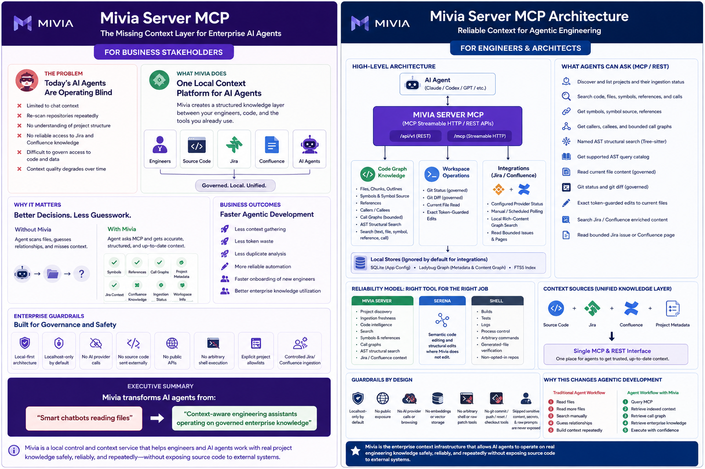
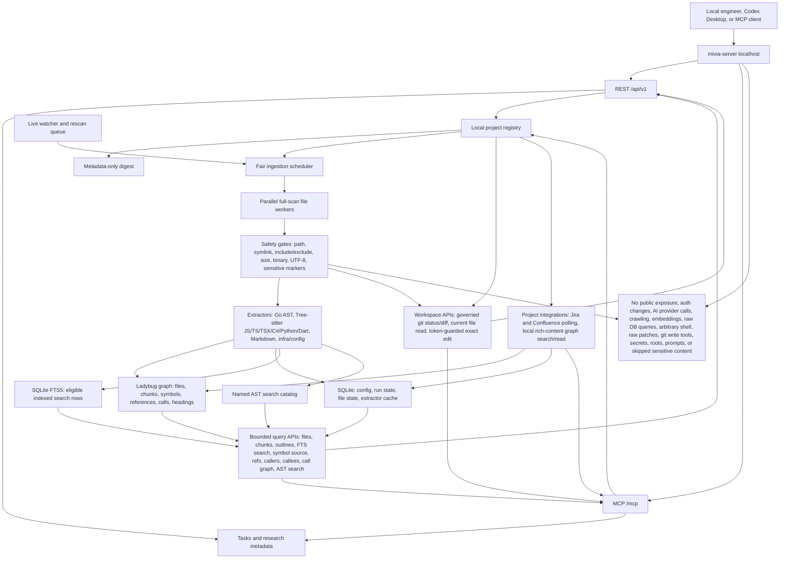
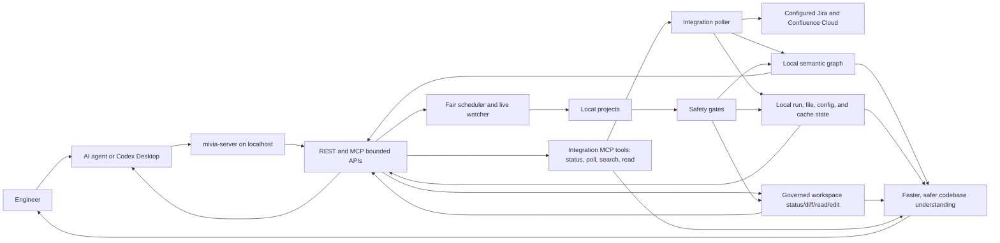
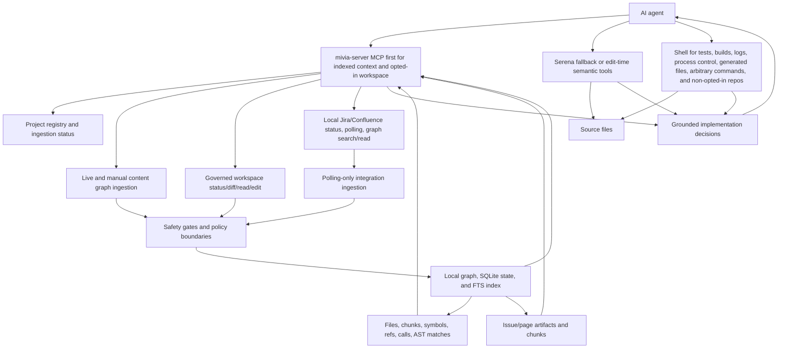
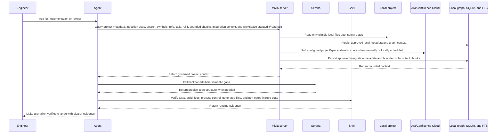

# Mivia

Generic Go microservices monorepo for AI-agent work.



## Overview

This repository contains the local Mivia service platform. The current service is `mivia-server`, a Go HTTP server that exposes REST APIs under `/api/v1` and MCP Streamable HTTP under `/mcp` for local agent-control, research metadata, project registry, project ingestion, and semantic code-context workflows.

The platform is local-first and localhost-only by default. It stores local metadata through the Ladybug graph abstraction and SQLite app-configuration store, supports optional local project configuration, and can run manual metadata-only project digests plus explicitly opted-in local content graph ingestion with governed FTS, named AST search, git status/diff, and exact token-guarded file edits. It also supports approved local Jira/Confluence project integrations with polling-only ingestion and bounded local graph search/read. It does not call live AI or browsing providers, expose public APIs, run embeddings/vector storage, crawl arbitrary roots, expose arbitrary shell, or use production database infrastructure.

Canonical workflow rules live in `.ai/`. Root agent files are thin adapters only.

## Feature Map



| Area | What exists now | Guardrails |
| --- | --- | --- |
| Local control surface | Health checks, REST `/api/v1`, MCP Streamable HTTP `/mcp` | Localhost-only default; no public/auth production posture |
| Tasks and research metadata | Local task records, research-run/source metadata, redaction boundary | No raw prompts, provider payloads, raw fetched content, or PII |
| Project registry | Optional local TOML projects with metadata-only digest or content graph mode | Root paths and local config values stay out of REST/MCP responses |
| Ingestion scheduler | Async manual ingestion, live watcher rescan, configurable global/per-project limits, live path priority | Global limits cap full-scan file workers; operators can cap workers per project when fairness matters |
| Full-scan ingestion | Parallel bounded file workers, periodic running counters, stale cleanup after workers drain | Source is stored only for eligible chunks after safety gates |
| Semantic graph | Files, chunks, headings, symbols, references, direct calls, callers/callees, bounded call graph, named AST structural search, AST query catalog discovery | No embeddings, vectors, crawling, provider calls, or raw DB query endpoint |
| Search index | SQLite FTS5 rows for eligible chunks, files, symbols, references, and calls; async rebuild repair through ingestion scheduler | Raw FTS syntax and raw SQLite errors are never exposed |
| Query APIs | Files, chunks, outlines, text/file/symbol/reference/call search, AST query catalog, named AST search, symbols, symbol source, references, callers, callees, call graph | Explicit pagination and source caps; skipped sensitive content is not returned; raw FTS and raw Tree-sitter syntax are not exposed |
| Workspace APIs | Governed git status/diff, current eligible file read, token-guarded exact byte-span edits | Disabled by default; requires global workspace gate plus per-project `workspace_mode`; no arbitrary shell, raw patch, or git commit/push/reset/checkout tools |
| Project integrations | Jira/Confluence configured provider status, manual/scheduled polling, local rich-content graph search/read | Atlassian Cloud only; polling-only; env/file credential refs; explicit project/space allowlists; rich content stays in ignored local stores |

## Start Here

Use this repo as a local context server for engineers and AI agents:

| Need | Use |
| --- | --- |
| Business overview | Read `Business View` below. |
| Engineer setup and smoke tests | [Local development runbook](docs/runbooks/local-dev.md). |
| How Serena, MCP, REST, and shell work together | [Agent context server guide](docs/agent-context-guide.md). |
| REST contract | [OpenAPI contract](api/openapi/agent-control.v1.yaml). |
| MCP contract | [MCP capability contract](api/mcp/agent-control.v1.md). |

## Business View

`mivia-server` is a local control and context service for engineers and AI agents. It gives agents a safe, structured way to understand a developer's local projects, remember approved local metadata, run bounded project and integration ingestion, and expose that context through REST and MCP without sending source code to AI providers.



What this enables:

- Engineers can opt local projects into metadata-only digest or content graph ingestion.
- Engineers can opt project-specific Jira/Confluence allowlists into polling-only ingestion so issue/page context lands in the same local graph as source context.
- Agents can ask for bounded project files, chunks, outlines, search results, symbols, symbol source, references, direct call edges, call graphs, the supported AST query catalog, named AST structural matches, and ingestion status through MCP instead of guessing from stale chat context.
- Agents can ask local MCP tools for configured integration status, trigger a one-shot provider poll, search locally ingested Jira/Confluence chunks, and read bounded Jira issue or Confluence page content without calling Atlassian during search/read.
- Agents can use MCP/REST for governed git status/diff and exact current-file edits on opted-in workspaces; shell remains required for tests, builds, logs, process control, arbitrary commands, generated-file verification, and non-opted-in repositories.
- Full scans run asynchronously through a fair scheduler, use bounded per-project file workers, and persist running progress counters during long scans.
- Local state can persist per project when `graph_storage = "persistent"`, or stay process-local with `graph_storage = "in_memory"`.
- The server keeps the boundary localhost-only and blocks raw DB queries, public exposure, AI provider calls, embeddings, vectors, arbitrary shell, raw patches, git commit/push/reset/checkout tools, skipped sensitive content, secrets, raw prompts, and raw provider payload blobs. Approved Jira/Confluence rich content and possible PII are limited to ignored local stores and bounded local MCP responses.

## Agent Reliability Model

`mivia-server`, Serena, and shell solve different parts of reliable agent work:

- `mivia-server` is first choice for indexed project discovery, ingestion freshness, files, chunks, symbols, references, calls, FTS search, symbol source, call graph, named AST search, and locally ingested Jira/Confluence context.
- Serena remains useful when MCP is unavailable, stale, missing the project, or lacks the edit-time semantic operation needed for a precise code change.
- MCP can handle governed git status/diff and exact edits for opted-in workspaces; shell remains the source of truth for tests, builds, logs, process control, generated files, arbitrary commands, and non-opted-in repositories.
- This routing reduces blind file scanning, stale assumptions, and unsafe over-broad context collection.



High-level flow:



## Baseline

- Module: `github.com/MiviaLabs/go-mivia`
- Go: `1.26`
- Toolchain: `go1.26.3`
- Module strategy: one root `go.mod`; add `go.work` only if independent module release boundaries become real.
- Server: `cmd/mivia-server`
- Local project config: optional, local-only TOML loaded from `configs/mivia-server.local.toml` or explicit `MIVIA_CONFIG_PATH`; committed example is `configs/mivia-server.example.toml`.
- Persistence: LadybugDB graph abstraction for graph data; SQLite via `modernc.org/sqlite` for local app configuration. Project graph storage is selectable per project with `graph_storage = "persistent"` or `graph_storage = "in_memory"`.
- Interfaces: REST under `/api/v1`; MCP Streamable HTTP under `/mcp`.

## Layout

- `.ai/`: canonical agent workflow rules, skills, and handoffs. Local task and research plans are ignored working artifacts, not technical docs.
- `api/openapi/`: REST OpenAPI contracts.
- `api/mcp/`: MCP capability docs.
- `cmd/mivia-server/`: Mivia server entrypoint.
- `configs/`: committed local config examples only; developer-local configs stay ignored.
- `internal/agentcontrol/`: task and research-run domain, stores, REST adapter, MCP adapter.
- `internal/projectregistry/`: local project config registry, validation, REST/MCP metadata APIs, and manual metadata-only digest.
- `internal/projectworkspace/`: governed local workspace git status/diff, file read, and exact edit domain.
- `internal/research/`: fixture-only research boundaries, redaction, metadata storage, REST/MCP hooks.
- `internal/platform/`: config, logging, health, HTTP, Ladybug, SQLite platform packages.
- `docs/`: stable technical documentation index.
- `docs/architecture/`: system architecture and data-flow docs.
- `docs/adr/`: architecture decision records.
- `docs/configuration/`: local configuration guides.
- `docs/research/`: source-grounded baseline notes only; do not store or link research plans.
- `docs/runbooks/`: local development and incident runbooks.
- `docs/security/`: privacy and research-data handling baselines.
- `db/migrations/`: unused during the LadybugDB bootstrap; schema bootstrap belongs behind internal store code until an ADR changes this.
- `tools/`: build-tagged dependency anchors; not application code.

## Documentation

- [Documentation index](docs/README.md)
- [Agent context server guide](docs/agent-context-guide.md)
- [System architecture](docs/architecture/system-architecture.md)
- [REST OpenAPI contract](api/openapi/agent-control.v1.yaml)
- [MCP capability contract](api/mcp/agent-control.v1.md)
- [Local project configuration](docs/configuration/local-projects.md)
- [Local development runbook](docs/runbooks/local-dev.md)
- [Privacy baseline](docs/security/privacy-baseline.md)
- [Research data handling](docs/security/research-data-handling.md)

Do not link `.ai/tasks/*` files or research-plan files from technical docs. They are local, stale-prone working artifacts.

## Local Checks

```sh
go version
go mod tidy
go test ./...
make check
```

If `go` is missing, install Go 1.26.x before treating verification as complete.

## Run Locally

Foreground server:

```sh
MIVIA_HTTP_ADDR=127.0.0.1:8080 \
MIVIA_SQLITE_PATH=:memory: \
go run ./cmd/mivia-server
```

Optional local project config:

```sh
cp configs/mivia-server.example.toml configs/mivia-server.local.toml
MIVIA_CONFIG_PATH=configs/mivia-server.local.toml go run ./cmd/mivia-server
```

Use placeholder paths only in committed docs and examples. Local configs are ignored and must not contain secrets, tokens, PII, raw prompts, raw source content, or provider payloads.

Smoke:

```sh
curl -fsS http://127.0.0.1:8080/healthz
curl -fsS http://127.0.0.1:8080/readyz
curl -fsS -H 'Content-Type: application/json' \
  -d '{"title":"local smoke"}' \
  http://127.0.0.1:8080/api/v1/tasks
curl -fsS http://127.0.0.1:8080/api/v1/projects
curl -fsS \
  -H 'Content-Type: application/json' \
  -H 'Accept: application/json, text/event-stream' \
  -H 'MCP-Protocol-Version: 2025-06-18' \
  -d '{"jsonrpc":"2.0","id":1,"method":"tools/list"}' \
  http://127.0.0.1:8080/mcp
```

Docker Compose, without requiring Go on the host:

```sh
docker compose up
```

The Compose service publishes to `${MIVIA_HOST_BIND:-127.0.0.1}:${MIVIA_HOST_PORT:-8080}`. Keep `MIVIA_HOST_BIND=127.0.0.1` unless an approved local-only network exposure requires otherwise. Inside the container, `mivia-server` still binds to `127.0.0.1:18080`; a local TCP forwarder exposes container port `8080` so Docker port publishing works without relaxing the server's localhost-only bind rule.

Default container data paths are:

```sh
MIVIA_LADYBUG_PATH=/var/lib/mivia/mivialabs.lbug
MIVIA_SQLITE_PATH=/var/lib/mivia/mivialabs-config.sqlite
```

Override `MIVIA_HOST_BIND`, `MIVIA_HOST_PORT`, `MIVIA_LADYBUG_PATH`, `MIVIA_SQLITE_PATH`, and feature flags from the host environment when needed. Compose enables content graph ingestion and the global workspace gate by default with `MIVIA_INGESTION_CONTENT_GRAPH_ENABLED=true` and `MIVIA_WORKSPACE_ENABLED=true`; live updates remain disabled unless explicitly enabled. Per-project `workspace_mode` still controls whether a configured project exposes workspace tools. The default Compose file mounts `./configs` read-only at `/app/configs`. Mount `./secrets` only in a local override when an approved local config references credential files; keep real local config and secret files ignored.

## Codex Desktop MCP

Codex Desktop can register the server directly as a Streamable HTTP MCP server:

```powershell
codex mcp add mivia-server --url http://127.0.0.1:8080/mcp
codex mcp get mivia-server
```

For a long-running WSL process from Windows, build once and run the binary:

```powershell
wsl -d Ubuntu --cd <repo-root> env PATH=<go-bin-path>:$PATH go build -o <ignored-runtime-dir>/mivia-server ./cmd/mivia-server
wsl -d Ubuntu --cd <repo-root> env MIVIA_HTTP_ADDR=127.0.0.1:8080 MIVIA_SQLITE_PATH=:memory: <ignored-runtime-dir>/mivia-server
```

The currently exposed MCP tools are `tasks.create`, `tasks.get`, `research_runs.create`, `research_runs.get`, `research_sources.create`, `research_sources.get`, `projects.list`, `projects.get`, `projects.digest`, `projects.ingest`, `projects.search_index.rebuild`, `projects.ingestion_status`, `projects.ingestion_status_latest`, `projects.files.list`, `projects.files.get`, `projects.file.chunks`, `projects.symbols.list`, `projects.search.text`, `projects.search.files`, `projects.search.symbols`, `projects.search.references`, `projects.search.calls`, `projects.search.ast.queries`, `projects.search.ast`, `projects.symbol.source`, `projects.symbol.references`, `projects.symbol.callers`, `projects.symbol.callees`, `projects.symbol.call_graph`, `projects.headings.list`, `projects.file.outline`, `projects.workspace.git_status`, `projects.workspace.git_diff`, `projects.workspace.file_read`, `projects.workspace.file_edit`, `projects.integrations.list`, `projects.integrations.status`, `projects.integrations.poll`, `projects.integrations.poll_status`, `projects.integrations.search`, `projects.jira.issue.get`, and `projects.confluence.page.get`. Codex Desktop may show underscore-normalized callable names such as `tasks_create`, `projects_search_text`, or `projects_workspace_file_read`; the server accepts both forms.

## Local Project APIs

Project APIs are for engineer local computers only. REST exposes project list/get, manual digest, manual ingestion, ingestion status, file, chunk, and symbol metadata endpoints under `/api/v1`; MCP exposes matching project tools and resources.

Use REST for scripts, smoke tests, and direct local checks. Use MCP first when an agent client needs indexed project context or opted-in workspace status/diff/read/edit. Use Serena only for edit-time semantic gaps that MCP cannot answer, and use shell for tests, builds, logs, process control, generated-file verification, arbitrary commands, and non-opted-in repos.

| Capability | REST | MCP |
| --- | --- | --- |
| Projects | `GET /api/v1/projects`, `GET /api/v1/projects/{id}` | `projects.list`, `projects.get` |
| Metadata digest | `POST /api/v1/projects/{id}/digest-runs` | `projects.digest` |
| Content graph ingestion | `POST /api/v1/projects/{id}/ingestion-runs` | `projects.ingest` |
| Search index repair | `POST /api/v1/projects/{id}/search-index/rebuild` | `projects.search_index.rebuild` |
| Ingestion run status | `GET /api/v1/projects/{id}/ingestion-runs/{run_id}` | `projects.ingestion_status` |
| Latest ingestion status | `GET /api/v1/projects/{id}/ingestion-runs/latest` | `projects.ingestion_status_latest` |
| Indexed files | `GET /api/v1/projects/{id}/files?status=eligible&extension=.go` | `projects.files.list` |
| Bounded chunks | `GET /api/v1/projects/{id}/files/{file_id}/chunks` | `projects.file.chunks` |
| Symbols | `GET /api/v1/projects/{id}/symbols` | `projects.symbols.list` |
| Text search | `GET /api/v1/projects/{id}/search/text?query=helper` | `projects.search.text` |
| File search | `GET /api/v1/projects/{id}/search/files?path_contains=cmd` | `projects.search.files` |
| Symbol search | `GET /api/v1/projects/{id}/search/symbols?name_contains=Run` | `projects.search.symbols` |
| Reference search | `GET /api/v1/projects/{id}/search/references?target_name_contains=Run` | `projects.search.references` |
| Call search | `GET /api/v1/projects/{id}/search/calls?callee_name_contains=Run` | `projects.search.calls` |
| AST query catalog | `GET /api/v1/projects/{id}/search/ast/queries` | `projects.search.ast.queries` |
| Named AST search | `GET /api/v1/projects/{id}/search/ast?language=typescript&query=call_expressions` | `projects.search.ast` |
| Symbol source | `GET /api/v1/projects/{id}/symbols/{symbol_id}/source` | `projects.symbol.source` |
| Symbol references | `GET /api/v1/projects/{id}/symbols/{symbol_id}/references` | `projects.symbol.references` |
| Symbol callers | `GET /api/v1/projects/{id}/symbols/{symbol_id}/callers` | `projects.symbol.callers` |
| Symbol callees | `GET /api/v1/projects/{id}/symbols/{symbol_id}/callees` | `projects.symbol.callees` |
| Symbol call graph | `GET /api/v1/projects/{id}/symbols/{symbol_id}/call-graph` | `projects.symbol.call_graph` |
| Governed git status | `GET /api/v1/projects/{id}/workspace/git/status` | `projects.workspace.git_status` |
| Governed git diff | `GET /api/v1/projects/{id}/workspace/git/diff` | `projects.workspace.git_diff` |
| Current eligible file read | `GET /api/v1/projects/{id}/workspace/files/read` | `projects.workspace.file_read` |
| Exact token-guarded file edit | `POST /api/v1/projects/{id}/workspace/files/edit` | `projects.workspace.file_edit` |
| Integration providers | Not exposed over REST | `projects.integrations.list` |
| Integration status | Not exposed over REST | `projects.integrations.status` |
| Manual integration poll | Not exposed over REST | `projects.integrations.poll`, then `projects.integrations.poll_status` |
| Integration rich-content search | Not exposed over REST | `projects.integrations.search` |
| Jira issue local read | Not exposed over REST | `projects.jira.issue.get` |
| Confluence page local read | Not exposed over REST | `projects.confluence.page.get` |

Manual content graph ingestion and search index repair are asynchronous. `POST /ingestion-runs`, `POST /search-index/rebuild`, `projects.ingest`, and `projects.search_index.rebuild` submit work through the fair scheduler and return queued run metadata quickly; clients poll by `run_id` or check latest status before relying on indexed data. Agents should use indexed search tools first for routine text, path, symbol, reference, and call discovery, and workspace tools first for opted-in git status/diff/current eligible file reads/exact edits. Live ingestion is the normal freshness path after workspace edits. Use Serena only for edit-time semantic gaps that MCP cannot answer, and `ast-grep` only for structural search or rewrite work not covered by indexed search. Full task, research, project, REST, and MCP method mapping is in the [agent context server guide](docs/agent-context-guide.md).

Project config is local-only and loaded through `MIVIA_CONFIG_PATH` or the ignored default `configs/mivia-server.local.toml`. The committed schema example is [configs/mivia-server.example.toml](configs/mivia-server.example.toml).

Project digest is manual and metadata-only. Content graph ingestion is opt-in with `digest_mode = "content_graph"` and uses the same local path, denylist, binary, UTF-8, size, and sensitive-marker gates before storing eligible source chunks. Promoted AST extraction uses Go stdlib AST for Go, Tree-sitter for JS/TS/TSX/JSX/C#/Python/Dart, Markdown headings, and lightweight infrastructure metadata. Dart extraction includes generated `.g.dart`, `.freezed.dart`, `.mocks.dart`, and similar files by default unless project include/exclude config filters them. Flutter widget recognition is exposed through symbol/reference/call metadata for widget classes, state classes, build methods, `setState`, `Navigator`, route calls, and widget constructor call candidates. TS/JS/TSX/JSX, C#, Python, and Dart have no regex fallback after startup validation.

### Dart And Flutter

Dart projects participate in the same local content graph surfaces as Go, Python, JS/TS, C#, Markdown, and infrastructure files. `.dart` files are chunked, indexed, parsed with Tree-sitter, and exposed through files, symbols, references, calls, outlines, named AST search, and bounded source tools after the normal safety gates pass.

Generated Dart files are indexed by default. Do not exclude `.g.dart`, `.freezed.dart`, `.mocks.dart`, `.generated.dart`, or similar files unless a local project explicitly wants less generated-code noise. Flutter support promotes widget classes, state classes, `Widget build(...)` methods, `setState`, `Navigator`, route calls, and widget constructor call candidates as symbol/reference/call metadata. AST catalog entries include Dart `function_declarations`, `class_declarations`, `type_declarations`, `call_expressions`, `imports`, `test_functions`, `assignments`, `error_handling`, `flutter_widgets`, and `flutter_build_methods`.

For Flutter navigation, start with `projects.search.ast.queries`, then use `projects.search.ast` with `language=dart&query=flutter_widgets` or `query=flutter_build_methods`. Use `projects.search.symbols` with `kind=flutter_widget`, `kind=flutter_state`, or `kind=flutter_build_method`, and use `projects.search.calls` with `callee_name_contains=Navigator` or `callee_name_contains=setState` when call edges are the useful surface.

`projects.search.ast.queries` returns supported named AST query IDs, languages, captures, query versions, matching extensions, and safe per-language `file_too_large` coverage counts so agents can discover the safe structural-search surface before calling `projects.search.ast`. Raw Tree-sitter query syntax remains blocked. Sensitive, denied, absent, parse-error, and other skipped files are not searched. Oversized files are reported as safe coverage gaps through ingestion/file metadata such as `skipped_reason=file_too_large`, size, and reason counts; their source text, chunks, snippets, content hashes, raw parser/SQLite/FTS/Tree-sitter errors, roots, secrets, PII, raw prompts, and provider payloads are not exposed.

Extractor cache rows live in the local SQLite app DB and store only serialized symbol, heading, reference, and call metadata keyed by project, relative-path hash, content hash, extractor name, and extractor version. Skipped files do not get cache rows or content hashes. REST/MCP responses omit local root paths, datastore paths, skipped sensitive content, matched sensitive text, secrets, raw prompts, provider payloads, and PII. Symbol source is returned only for eligible indexed chunks and is capped by request and project limits.

Live project updates require both global live enablement and per-project `update_policy = "live"`. The watcher is directory-based, non-recursive at the OS API level, and registers each eligible directory; overflow or full queues trigger a scheduled bounded project rescan. Manual and live full scans run through the fair scheduler. Live path events have priority over full-scan continuations, and operators can cap per-project worker use below the global worker count when fairness across projects matters. File outlines support symbol `kind`, `name_prefix`, symbol pagination, and opt-in bounded chunk text for eligible files.

Project integrations are configured per project under `[projects.integrations.jira]` and `[projects.integrations.confluence]`. They require Atlassian Cloud hosts, explicit Jira `project_keys` or Confluence `space_keys`, and env/file credential refs. Jira ticket titles are `summary`, so include that field when customizing Jira fields. Rich fields, comments, and Confluence page bodies are ingested only when configured; `projects.integrations.poll` queues async polling, `projects.integrations.poll_status` tracks it, and search/read tools use local graph data only without calling Atlassian. Setup details are in [Local project configuration](docs/configuration/local-projects.md).

LadybugDB native imports remain gated behind `scripts/ladybug-libs.sh` and the `ladybug_native system_ladybug` tags. SQLite configuration and persistent graph files must stay local, non-secret, and ignored under `data/` by default.

## Security And Privacy

Do not commit real `.env` files, secrets, credentials, raw prompts, raw fetched content, provider payloads, or personal data. General PII ingestion remains prohibited. The only approved exception is local Jira/Confluence rich-content handling under [Project integrations security policy](docs/security/project-integrations.md).
