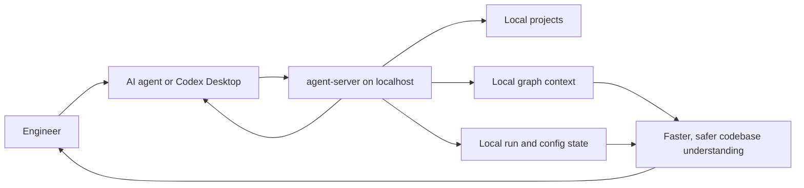
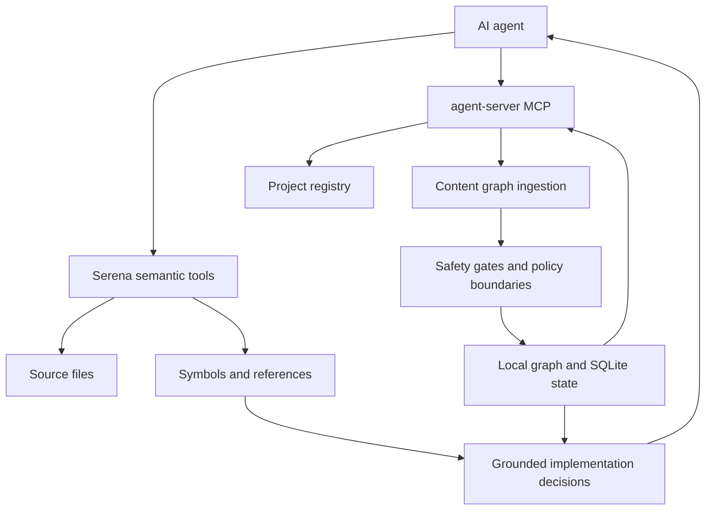
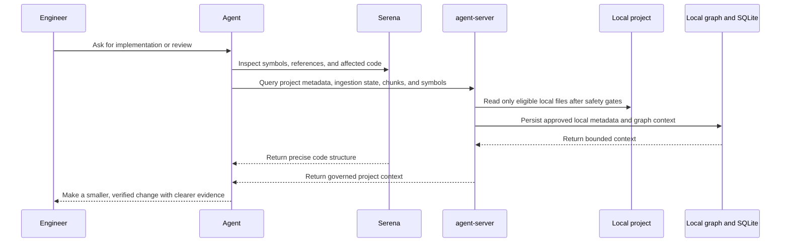

# MiviaLabs Agents Monorepo

Generic Go microservices monorepo for AI-agent work.

## Overview

This repository contains the local MiviaLabs agent service platform. The current service is `agent-server`, a Go HTTP server that exposes REST APIs under `/api/v1` and MCP Streamable HTTP under `/mcp` for local agent-control, research metadata, and project metadata workflows.

The platform is local-first and localhost-only by default. It stores local metadata through the Ladybug graph abstraction and SQLite app-configuration store, supports optional local project configuration, and can run manual metadata-only project digests plus explicitly opted-in local content graph ingestion. It does not ingest PII, call live AI or browsing providers, expose public APIs, run embeddings/vector storage, or use production database infrastructure.

Canonical workflow rules live in `.ai/`. Root agent files are thin adapters only.

## Start Here

Use this repo as a local context server for engineers and AI agents:

| Need | Use |
| --- | --- |
| Business overview | Read `Business View` below. |
| Engineer setup and smoke tests | [Local development runbook](docs/runbooks/local-dev.md). |
| How Serena, MCP, REST, and shell work together | [Agent context server guide](docs/agent-context-guide.md). |
| REST contract | [OpenAPI contract](api/openapi/agent-control.v1.yaml). |
| MCP contract | [MCP capability contract](api/mcp/agent-control.v1.md). |

## Business View

`agent-server` is a local control and context service for engineers and AI agents. It gives agents a safe, structured way to understand a developer's local projects, remember approved local metadata, run bounded project ingestion, and expose that context through REST and MCP without sending source code to external providers.



What this enables:

- Engineers can opt local projects into metadata-only digest or content graph ingestion.
- Agents can ask for bounded project files, chunks, symbols, and ingestion status through MCP instead of guessing from stale chat context.
- Local state can persist per project when `graph_storage = "persistent"`, or stay process-local with `graph_storage = "in_memory"`.
- The server keeps the boundary localhost-only and blocks raw DB queries, public exposure, provider calls, embeddings, vectors, skipped sensitive content, secrets, raw prompts, provider payloads, and PII.

## Agent Reliability Model

`agent-server` and Serena solve different parts of reliable agent work:

- Serena helps the agent inspect and edit code precisely using semantic code navigation, symbols, and references.
- `agent-server` gives the agent a governed local API for project registry, ingestion state, graph-backed project context, and MCP-compatible workflows.
- Together, they reduce blind file scanning, stale assumptions, and unsafe over-broad context collection.



High-level flow:



## Baseline

- Module: `github.com/MiviaLabs/mivialabs-agents-monorepo`
- Go: `1.26`
- Toolchain: `go1.26.3`
- Module strategy: one root `go.mod`; add `go.work` only if independent module release boundaries become real.
- Server: `cmd/agent-server`
- Local project config: optional, local-only TOML loaded from `configs/agent-server.local.toml` or explicit `MIVIA_CONFIG_PATH`; committed example is `configs/agent-server.example.toml`.
- Persistence: LadybugDB graph abstraction for graph data; SQLite via `modernc.org/sqlite` for local app configuration. Project graph storage is selectable per project with `graph_storage = "persistent"` or `graph_storage = "in_memory"`.
- Interfaces: REST under `/api/v1`; MCP Streamable HTTP under `/mcp`.

## Layout

- `.ai/`: canonical agent workflow rules, skills, and handoffs. Local task and research plans are ignored working artifacts, not technical docs.
- `api/openapi/`: REST OpenAPI contracts.
- `api/mcp/`: MCP capability docs.
- `cmd/agent-server/`: local agent server entrypoint.
- `configs/`: committed local config examples only; developer-local configs stay ignored.
- `internal/agentcontrol/`: task and research-run domain, stores, REST adapter, MCP adapter.
- `internal/projectregistry/`: local project config registry, validation, REST/MCP metadata APIs, and manual metadata-only digest.
- `internal/research/`: fixture-only research boundaries, redaction, metadata storage, REST/MCP hooks.
- `internal/platform/`: config, logging, health, HTTP, Ladybug, SQLite platform packages.
- `docs/`: stable technical documentation index.
- `docs/architecture/`: system architecture and data-flow docs.
- `docs/adr/`: architecture decision records.
- `docs/configuration/`: local configuration guides.
- `docs/research/`: source-grounded baseline notes only; do not store or link research plans.
- `docs/runbooks/`: local development and incident runbooks.
- `docs/security/`: privacy and research-data handling baselines.
- `db/migrations/`: unused during the LadybugDB bootstrap; schema bootstrap belongs behind internal store code until an ADR changes this.
- `tools/`: build-tagged dependency anchors; not application code.

## Documentation

- [Documentation index](docs/README.md)
- [Agent context server guide](docs/agent-context-guide.md)
- [System architecture](docs/architecture/system-architecture.md)
- [REST OpenAPI contract](api/openapi/agent-control.v1.yaml)
- [MCP capability contract](api/mcp/agent-control.v1.md)
- [Local project configuration](docs/configuration/local-projects.md)
- [Local development runbook](docs/runbooks/local-dev.md)
- [Privacy baseline](docs/security/privacy-baseline.md)
- [Research data handling](docs/security/research-data-handling.md)

Do not link `.ai/tasks/*` files or research-plan files from technical docs. They are local, stale-prone working artifacts.

## Local Checks

```sh
go version
go mod tidy
go test ./...
make check
```

If `go` is missing, install Go 1.26.x before treating verification as complete.

## Run Locally

Foreground server:

```sh
MIVIA_HTTP_ADDR=127.0.0.1:8080 \
MIVIA_SQLITE_PATH=:memory: \
go run ./cmd/agent-server
```

Optional local project config:

```sh
cp configs/agent-server.example.toml configs/agent-server.local.toml
MIVIA_CONFIG_PATH=configs/agent-server.local.toml go run ./cmd/agent-server
```

Use placeholder paths only in committed docs and examples. Local configs are ignored and must not contain secrets, tokens, PII, raw prompts, raw source content, or provider payloads.

Smoke:

```sh
curl -fsS http://127.0.0.1:8080/healthz
curl -fsS http://127.0.0.1:8080/readyz
curl -fsS -H 'Content-Type: application/json' \
  -d '{"title":"local smoke"}' \
  http://127.0.0.1:8080/api/v1/tasks
curl -fsS http://127.0.0.1:8080/api/v1/projects
curl -fsS \
  -H 'Content-Type: application/json' \
  -H 'Accept: application/json, text/event-stream' \
  -H 'MCP-Protocol-Version: 2025-06-18' \
  -d '{"jsonrpc":"2.0","id":1,"method":"tools/list"}' \
  http://127.0.0.1:8080/mcp
```

## Codex Desktop MCP

Codex Desktop can register the server directly as a Streamable HTTP MCP server:

```powershell
codex mcp add mivialabs-agent-server --url http://127.0.0.1:8080/mcp
codex mcp get mivialabs-agent-server
```

For a long-running WSL process from Windows, build once and run the binary:

```powershell
wsl -d Ubuntu --cd <repo-root> env PATH=<go-bin-path>:$PATH go build -o <ignored-runtime-dir>/mivialabs-agent-server ./cmd/agent-server
wsl -d Ubuntu --cd <repo-root> env MIVIA_HTTP_ADDR=127.0.0.1:8080 MIVIA_SQLITE_PATH=:memory: <ignored-runtime-dir>/mivialabs-agent-server
```

The currently exposed MCP tools are `tasks.create`, `tasks.get`, `research_runs.create`, `research_runs.get`, `research_sources.create`, `research_sources.get`, `projects.list`, `projects.get`, `projects.digest`, `projects.ingest`, `projects.ingestion_status`, `projects.ingestion_status_latest`, `projects.files.list`, `projects.files.get`, `projects.file.chunks`, `projects.symbols.list`, `projects.symbol.source`, `projects.symbol.references`, `projects.symbol.callers`, `projects.symbol.callees`, `projects.symbol.call_graph`, `projects.headings.list`, and `projects.file.outline`. Codex Desktop may show underscore-normalized callable names such as `tasks_create` or `projects_digest`; the server accepts both forms.

## Local Project APIs

Project APIs are for engineer local computers only. REST exposes project list/get, manual digest, manual ingestion, ingestion status, file, chunk, and symbol metadata endpoints under `/api/v1`; MCP exposes matching project tools and resources.

Use REST for scripts, smoke tests, and direct local checks. Use MCP when an agent client needs the same capabilities. Use Serena for code navigation and shell for git/tests/logs/current disk state.

| Capability | REST | MCP |
| --- | --- | --- |
| Projects | `GET /api/v1/projects`, `GET /api/v1/projects/{id}` | `projects.list`, `projects.get` |
| Metadata digest | `POST /api/v1/projects/{id}/digest-runs` | `projects.digest` |
| Content graph ingestion | `POST /api/v1/projects/{id}/ingestion-runs` | `projects.ingest` |
| Ingestion run status | `GET /api/v1/projects/{id}/ingestion-runs/{run_id}` | `projects.ingestion_status` |
| Latest ingestion status | `GET /api/v1/projects/{id}/ingestion-runs/latest` | `projects.ingestion_status_latest` |
| Indexed files | `GET /api/v1/projects/{id}/files?status=eligible&extension=.go` | `projects.files.list` |
| Bounded chunks | `GET /api/v1/projects/{id}/files/{file_id}/chunks` | `projects.file.chunks` |
| Symbols | `GET /api/v1/projects/{id}/symbols` | `projects.symbols.list` |
| Symbol source | `GET /api/v1/projects/{id}/symbols/{symbol_id}/source` | `projects.symbol.source` |
| Symbol references | `GET /api/v1/projects/{id}/symbols/{symbol_id}/references` | `projects.symbol.references` |
| Symbol callers | `GET /api/v1/projects/{id}/symbols/{symbol_id}/callers` | `projects.symbol.callers` |
| Symbol callees | `GET /api/v1/projects/{id}/symbols/{symbol_id}/callees` | `projects.symbol.callees` |
| Symbol call graph | `GET /api/v1/projects/{id}/symbols/{symbol_id}/call-graph` | `projects.symbol.call_graph` |

Manual content graph ingestion is asynchronous. `POST /ingestion-runs` and `projects.ingest` submit work through the fair scheduler and return queued run metadata quickly; clients poll by `run_id` or check latest status before relying on indexed data. Full task, research, project, REST, and MCP method mapping is in the [agent context server guide](docs/agent-context-guide.md).

Project config is local-only and loaded through `MIVIA_CONFIG_PATH` or the ignored default `configs/agent-server.local.toml`. The committed schema example is [configs/agent-server.example.toml](configs/agent-server.example.toml).

Project digest is manual and metadata-only. Content graph ingestion is opt-in with `digest_mode = "content_graph"` and uses the same local path, denylist, binary, UTF-8, size, and sensitive-marker gates before storing eligible source chunks. Promoted AST extraction uses Go stdlib AST for Go, Tree-sitter for JS/TS/TSX/JSX/C#/Python, Markdown headings, and lightweight infrastructure metadata. TS/JS/TSX/JSX, C#, and Python have no regex fallback after startup validation.

Extractor cache rows live in the local SQLite app DB and store only serialized symbol, heading, reference, and call metadata keyed by project, relative-path hash, content hash, extractor name, and extractor version. Skipped files do not get cache rows or content hashes. REST/MCP responses omit local root paths, datastore paths, skipped sensitive content, matched sensitive text, secrets, raw prompts, provider payloads, and PII. Symbol source is returned only for eligible indexed chunks and is capped by request and project limits.

Live project updates require both global live enablement and per-project `update_policy = "live"`. The watcher is directory-based, non-recursive at the OS API level, and registers each eligible directory; overflow or full queues trigger a scheduled bounded project rescan. Manual and live full scans run through the fair scheduler. Live path events have priority over full-scan continuations, and per-project limits prevent one project from monopolizing workers. File outlines support symbol `kind`, `name_prefix`, symbol pagination, and opt-in bounded chunk text for eligible files.

LadybugDB native imports remain gated behind `scripts/ladybug-libs.sh` and the `ladybug_native system_ladybug` tags. SQLite configuration and persistent graph files must stay local, non-secret, and ignored under `data/` by default.

## Security And Privacy

Do not commit real `.env` files, secrets, credentials, raw prompts, raw fetched content, provider payloads, or personal data. PII ingestion remains prohibited until the Security/DPO owner approves purpose, legal basis, access model, retention, deletion path, and audit trail.
