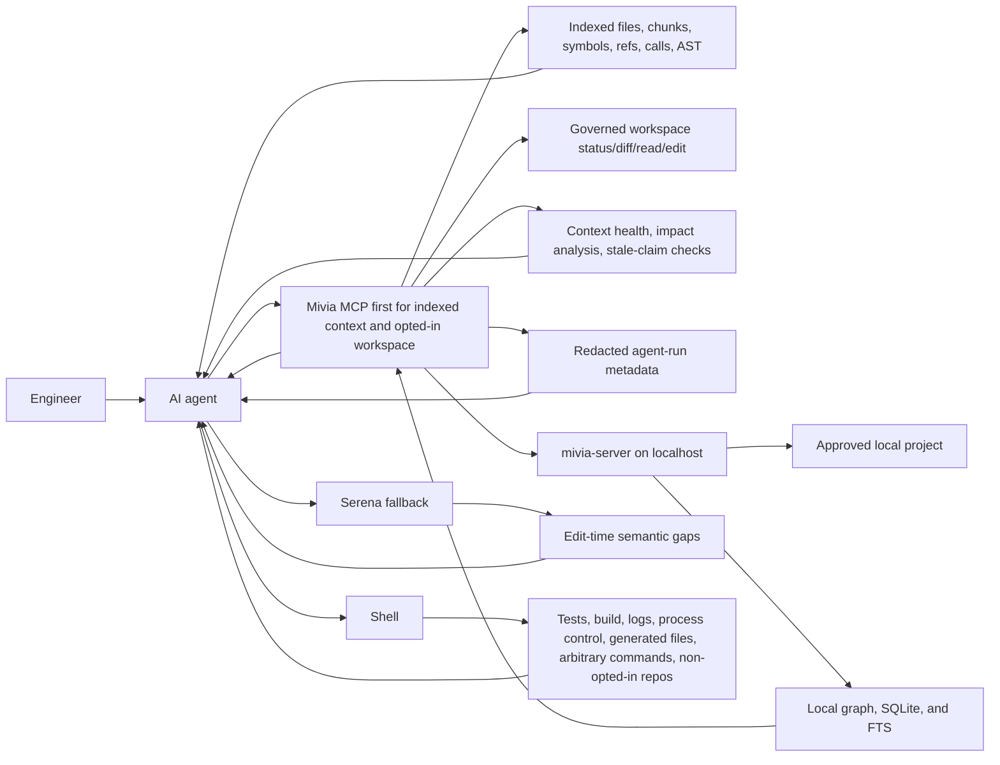

# Agent Context Server Guide

Status: Current local guide
Date: 2026-05-31
Classification: Internal; PII-prohibited

`mivia-server` is a localhost service that gives engineers and AI agents safe project context. It indexes approved local projects, exposes bounded metadata, chunks, FTS-backed search, symbol navigation, call graph views, named AST structural search, governed workspace git/read/edit operations, redacted agent-run metadata, and deterministic reliability checks, and keeps source understanding inside the developer machine.

## Who It Helps

| Audience | Value |
| --- | --- |
| Business stakeholders | Less agent guesswork, faster engineering work, and a clear local-only data boundary. |
| Local users | A simple way to ask what projects are configured, indexed, and safe for agents to inspect. |
| Engineers | One local service for project config, ingestion, run status, REST checks, and MCP tools. |
| AI agents | Token-efficient project discovery, file IDs, symbols, chunks, references, calls, FTS search, AST catalog search, ingestion state, and governed workspace status/diff/read/edit without broad scans. |

## How It Works



Mivia MCP, Serena, and shell are complementary:

- Use Mivia MCP first for indexed project context: project metadata, ingestion state, file IDs, outlines, headings, chunks, search, symbols, references, calls, symbol source, call graph, named AST structural search, and governed workspace git status/diff/read/edit when opted in.
- Use Serena only when MCP is unavailable, stale, missing the project, or lacks the edit-time semantic operation needed for a precise code change.
- Use shell for tests, builds, logs, process control, generated files, arbitrary commands, and non-opted-in repositories.

## When To Use What

| Need | First tool |
| --- | --- |
| Understand indexed code structure, symbols, references, calls, or source | MCP |
| Find indexed files or symbols without scanning the repo in chat | MCP |
| Run routine text, path, symbol, reference, call, or named AST discovery | MCP `projects.search.*` |
| Read a bounded chunk by opaque file ID | MCP |
| Check governed git status/diff for an opted-in workspace | MCP workspace tools |
| Read or exact-edit an eligible current file in an opted-in workspace | MCP workspace tools |
| Check whether indexed data is fresh enough for the task | MCP or REST |
| Check configured Jira/Confluence provider status | MCP `projects.integrations.status` |
| Poll Jira/Confluence for an opted-in project | MCP `projects.integrations.poll`, then `projects.integrations.poll_status` |
| Search or read ingested Jira/Confluence context | MCP `projects.integrations.search`, `projects.jira.issue.get`, `projects.confluence.page.get` |
| Verify tests, builds, logs, process control, generated files, or non-opted-in repo state | Shell |
| Inspect a file just created or changed in an opted-in workspace | MCP `projects.workspace.file_read` by safe relative path |
| Inspect a file outside MCP eligibility or project opt-in | Shell |

## Surfaces

REST is for direct local checks, scripts, and smoke tests. MCP is for agent clients such as Codex Desktop.

| Capability | REST under `/api/v1` | MCP tool |
| --- | --- | --- |
| Create task | `POST /tasks` | `tasks.create` |
| Get task | `GET /tasks/{id}` | `tasks.get` |
| Create research run metadata | `POST /research-runs` | `research_runs.create` |
| Get research run metadata | `GET /research-runs/{id}` | `research_runs.get` |
| Create research source metadata | `POST /research-runs/{id}/sources` | `research_sources.create` |
| Get research source metadata | `GET /research-runs/{id}/sources/{source_id}` | `research_sources.get` |
| Create redacted agent run metadata | `POST /agent-runs` | `agent_runs.create` |
| Append redacted agent run step | `POST /agent-runs/{id}/steps` | `agent_runs.step_append` |
| Complete redacted agent run metadata | `POST /agent-runs/{id}/complete` | `agent_runs.complete` |
| Get redacted agent run metadata | `GET /agent-runs/{id}` | `agent_runs.get` |
| List projects | `GET /projects` | `projects.list` |
| Get project | `GET /projects/{id}` | `projects.get` |
| Run metadata-only digest | `POST /projects/{id}/digest-runs` | `projects.digest` |
| Get project context health | `GET /projects/{id}/context-health` | `projects.context_health` |
| Analyze changed-path impact | `POST /projects/{id}/impact/analyze` | `projects.impact.analyze` |
| Check stale documentation claims | `POST /projects/{id}/claims/check` | `projects.claims.check` |
| Run content graph ingestion | `POST /projects/{id}/ingestion-runs` | `projects.ingest` |
| Rebuild local search index | `POST /projects/{id}/search-index/rebuild` | `projects.search_index.rebuild` |
| Get ingestion run | `GET /projects/{id}/ingestion-runs/{run_id}` | `projects.ingestion_status` |
| Get latest ingestion run | `GET /projects/{id}/ingestion-runs/latest` | `projects.ingestion_status_latest` |
| List indexed files | `GET /projects/{id}/files?status=eligible&extension=.go&path_prefix=cmd/` | `projects.files.list` |
| Get indexed file metadata | `GET /projects/{id}/files/{file_id}` | `projects.files.get` |
| Read bounded chunks | `GET /projects/{id}/files/{file_id}/chunks` | `projects.file.chunks` |
| List symbols | `GET /projects/{id}/symbols?kind=function&name_prefix=Run` | `projects.symbols.list` |
| Search indexed text | `GET /projects/{id}/search/text?query=helper` | `projects.search.text` |
| Search indexed files | `GET /projects/{id}/search/files?path_contains=cmd` | `projects.search.files` |
| Search indexed symbols | `GET /projects/{id}/search/symbols?name_contains=Run` | `projects.search.symbols` |
| Search indexed references | `GET /projects/{id}/search/references?target_name_contains=Run` | `projects.search.references` |
| Search indexed calls | `GET /projects/{id}/search/calls?callee_name_contains=Run` | `projects.search.calls` |
| Discover AST query catalog | `GET /projects/{id}/search/ast/queries` | `projects.search.ast.queries` |
| Search indexed AST structure | `GET /projects/{id}/search/ast?language=typescript&query=call_expressions` | `projects.search.ast` |
| Get bounded symbol source | `GET /projects/{id}/symbols/{symbol_id}/source` | `projects.symbol.source` |
| List symbol references | `GET /projects/{id}/symbols/{symbol_id}/references` | `projects.symbol.references` |
| List symbol callers | `GET /projects/{id}/symbols/{symbol_id}/callers` | `projects.symbol.callers` |
| List symbol callees | `GET /projects/{id}/symbols/{symbol_id}/callees` | `projects.symbol.callees` |
| Traverse symbol call graph | `GET /projects/{id}/symbols/{symbol_id}/call-graph` | `projects.symbol.call_graph` |
| List document headings | `GET /projects/{id}/headings?file_id={file_id}` | `projects.headings.list` |
| Get file outline, optionally with bounded eligible chunk text | `GET /projects/{id}/files/{file_id}/outline` | `projects.file.outline` |
| Get governed git status | `GET /projects/{id}/workspace/git/status` | `projects.workspace.git_status` |
| Get capped governed git diff | `GET /projects/{id}/workspace/git/diff` | `projects.workspace.git_diff` |
| Read current eligible file with edit token | `GET /projects/{id}/workspace/files/read` | `projects.workspace.file_read` |
| Apply exact token-guarded file edit | `POST /projects/{id}/workspace/files/edit` | `projects.workspace.file_edit` |
| List configured integration providers | Not exposed | `projects.integrations.list` |
| Get redacted integration status | Not exposed | `projects.integrations.status` |
| Get local integration counts | Not exposed | `projects.integrations.counts` |
| Queue one integration poll | Not exposed | `projects.integrations.poll` |
| Get integration poll status | Not exposed | `projects.integrations.poll_status` |
| Search local integration graph content | Not exposed | `projects.integrations.search` |
| Read one local Jira issue | Not exposed | `projects.jira.issue.get` |
| Read one local Confluence page | Not exposed | `projects.confluence.page.get` |

`projects.ingest`, `projects.search_index.rebuild`, `POST /ingestion-runs`, and `POST /search-index/rebuild` are asynchronous submissions. They return queued run metadata with a `run_id`; poll `projects.ingestion_status` or use latest status before trusting indexed content.

Project integration polling is also asynchronous. Configure Jira and Confluence under the target project in local TOML, restart the server, check `projects.integrations.status`, queue a provider run with `projects.integrations.poll`, then wait on `projects.integrations.poll_status` before relying on `projects.integrations.search` or provider-specific read tools. Integration search/read uses only the local graph; it does not call Atlassian.

`projects.digest` is only for `metadata_only` projects. For `content_graph` projects, use ingestion status and bounded file/search tools; the MCP error is `project digest unsupported`, not an active-ingestion block.

`projects.context_health` summarizes whether a project is ready, warming up, running, degraded, stale, empty, disabled, or unavailable using only safe config, ingestion, search-index, and workspace-git metadata. `projects.impact.analyze` maps changed paths or governed workspace diff file metadata to affected domains, routes, tools, security flags, and residual unknowns without returning raw diff content. `projects.claims.check` checks selected stable docs/contracts for registered REST/MCP names and forbidden `.ai/tasks/` links; it does not use LLM judgment, broad crawling, or document-content echoing.

`agent_runs.*` tools store redacted execution metadata only: project/task IDs, statuses, timestamps, changed project-relative paths, verifier command metadata, artifact refs, and short summaries/notes. They reject raw prompts, completions, source dumps, raw stderr, secrets, credentials, provider payloads, absolute roots, and PII.

Search tools are backed by governed indexed state. Text search is literal-only and returns capped snippets from eligible chunks. File, symbol, reference, and call search use indexed metadata and pagination. Raw FTS syntax and raw SQLite errors are not exposed.

`projects.search.ast.queries` returns supported named query IDs, languages, capture names, query versions, matching extensions, and safe per-language `file_too_large` coverage counts. It does not expose raw Tree-sitter query text. `projects.search.ast` accepts named query IDs only, such as `function_declarations`, `class_declarations`, `type_declarations`, `call_expressions`, `imports`, `test_functions`, `assignments`, `error_handling`, `flutter_widgets`, and `flutter_build_methods`. It does not accept raw Tree-sitter query syntax and only runs over eligible indexed chunks.

Workspace tools require `[workspace].enabled = true` plus per-project `workspace_mode = "read_only"` or `"edit"` and `digest_mode = "content_graph"`. `read_only` allows governed git status/diff and current eligible file reads. `edit` additionally allows exact byte-span edits with an opaque token returned by `projects.workspace.file_read`; successful non-dry-run edits queue path ingestion. There is no arbitrary shell endpoint, raw patch upload, public exposure, provider call, embedding/vector/crawling path, raw DB query endpoint, or git commit/push/checkout/reset/branch/merge/rebase/stash/clean/restore tool.

MCP resources also expose stable IDs:

- `mivialabs://projects/{id}`
- `mivialabs://projects/{id}/digest-runs/{run_id}`
- `mivialabs://projects/{id}/files/{file_id}`
- `mivialabs://projects/{id}/files/{file_id}/chunks/{chunk_id}`
- `mivialabs://projects/{id}/files/{file_id}/outline`
- `mivialabs://projects/{id}/symbols/{symbol_id}`

## Common Workflows

Check the server:

```sh
curl -fsS http://127.0.0.1:8080/healthz
curl -fsS http://127.0.0.1:8080/readyz
```

Check project context:

```sh
curl -fsS http://127.0.0.1:8080/api/v1/projects
curl -fsS http://127.0.0.1:8080/api/v1/projects/go-mivia
curl -fsS 'http://127.0.0.1:8080/api/v1/projects/go-mivia/files?page_size=5'
curl -fsS 'http://127.0.0.1:8080/api/v1/projects/go-mivia/ingestion-runs/latest'
curl -fsS 'http://127.0.0.1:8080/api/v1/projects/go-mivia/files/<file_id>'
curl -fsS 'http://127.0.0.1:8080/api/v1/projects/go-mivia/symbols?page_size=10'
```

Call MCP over raw HTTP only when no native MCP client is available:

```sh
curl -fsS \
  -H 'Content-Type: application/json' \
  -H 'Accept: application/json, text/event-stream' \
  -H 'MCP-Protocol-Version: 2025-06-18' \
  -d '{"jsonrpc":"2.0","id":1,"method":"tools/list","params":{}}' \
  http://127.0.0.1:8080/mcp
```

Flutter project navigation:

```sh
curl -fsS 'http://127.0.0.1:8080/api/v1/projects/<project_id>/search/ast/queries'
curl -fsS 'http://127.0.0.1:8080/api/v1/projects/<project_id>/search/ast?language=dart&query=flutter_widgets'
curl -fsS 'http://127.0.0.1:8080/api/v1/projects/<project_id>/search/ast?language=dart&query=flutter_build_methods'
curl -fsS 'http://127.0.0.1:8080/api/v1/projects/<project_id>/search/symbols?kind=flutter_widget'
curl -fsS 'http://127.0.0.1:8080/api/v1/projects/<project_id>/search/calls?callee_name_contains=Navigator'
```

Generated Dart files such as `.g.dart`, `.freezed.dart`, `.mocks.dart`, and `.generated.dart` are indexed by default. Flutter extraction is static metadata only: it identifies widget/state/build symbols and common Flutter calls, but it does not run Flutter, compile Dart, or provide LSP-grade type inference.

## Safety Boundary

The server is local-only. It must not expose:

- Absolute roots or datastore paths.
- Raw database queries.
- Raw command lines, raw stderr, raw patches, and git commit/push/checkout/reset/branch/merge/rebase/stash/clean/restore operations.
- Secrets, credentials, tokens, PII, raw prompts, or provider payloads.
- Skipped sensitive content or matched sensitive text.
- Public network access, provider calls, embeddings, vectors, crawling, production deployment, symlink traversal, or auth-model changes.

Use stable opaque IDs from REST or MCP responses. Discovery order for agents is project metadata, latest ingestion status, indexed `projects.search.*` for routine text/path/symbol/reference/call discovery, `projects.search.ast.queries` before named AST search, small `projects.files.list` or `projects.symbols.list`/`projects.headings.list`, `projects.file.outline`, then semantic symbol tools or bounded chunks as needed. For opted-in workspaces, use `projects.workspace.git_status`, `projects.workspace.git_diff`, `projects.workspace.file_read`, and `projects.workspace.file_edit` before shell for status, diff, eligible current file reads, and exact edits. Live ingestion is the normal freshness path after workspace edits; poll latest ingestion status when search results look unexpected. Use Serena only for edit-time semantic gaps that MCP cannot answer, and `ast-grep` only for structural search or rewrite/codemod tasks not yet covered by indexed search. For common navigation, use `projects.symbol.references`, `projects.symbol.callers`, `projects.symbol.callees`, and `projects.symbol.call_graph`; use `resolution_status` and confidence metadata instead of assuming unresolved dynamic-language edges are precise. For large files, call `projects.file.outline` with `kind`, `name_prefix`, `name_contains`, `symbol_page_size`, and `symbol_page_token`. If source context is needed in the same response, set `include_chunk_text=true` with a small `max_chunk_bytes`, use `projects.search.text` for capped snippets, or call `projects.symbol.source` with `max_source_bytes` for one eligible symbol. Do not infer or expose local root paths.

Promoted AST metadata covers Go stdlib AST, Tree-sitter JS/JSX/TS/TSX, Tree-sitter C#, Tree-sitter Python, Tree-sitter Dart/Flutter, Markdown headings, and lightweight infrastructure/config metadata. Dart generated files such as `.g.dart`, `.freezed.dart`, `.mocks.dart`, and similar files are indexed by default unless project config excludes them. Flutter widget classes, state classes, build methods, `setState`, `Navigator`, route calls, and widget constructor call candidates are exposed as symbol/reference/call metadata where the parser can detect them. Unsupported or ambiguous edges remain unresolved rather than guessed. TS/JS/TSX/JSX, C#, Python, and Dart have no regex fallback; parse failures are file-local `parse_error` skips and full scans continue. Sensitive, denied, absent, parse-error, and other skipped files stay unreachable from chunk/source/search responses. Oversized files are reported only as safe coverage gaps through metadata such as `skipped_reason=file_too_large`, size, and ingestion reason counts; source text, chunks, snippets, content hashes, skipped sensitive text, raw parser/SQLite/FTS/Tree-sitter errors, roots, secrets, PII, raw prompts, and provider payloads are not returned. Extractor cache entries store symbols/headings/references/calls only and are removed for skipped or absent files.
