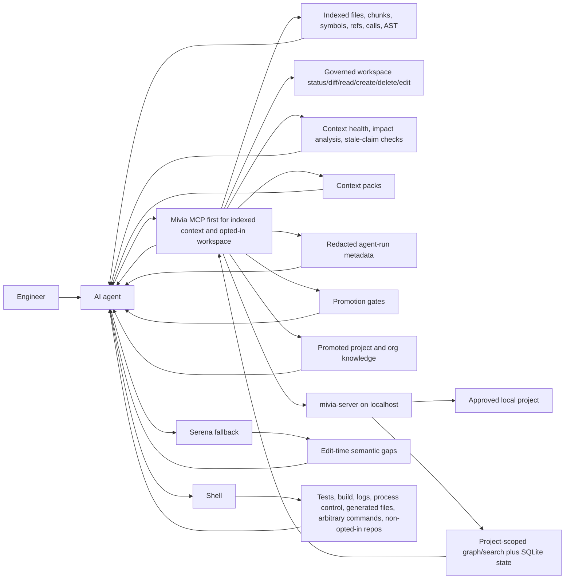

# Agent Context Server Guide

Status: Current local guide
Date: 2026-06-01
Classification: Internal; PII-prohibited

`mivia-server` is a localhost service that gives engineers and AI agents safe project context. It indexes approved local projects, exposes bounded metadata, chunks, FTS-backed search, context packs, symbol navigation, call graph views, named AST structural search, governed workspace git/read/create/delete/edit operations, redacted agent-run metadata, promotion-gate decisions, Knowledge Promotion metadata, and deterministic reliability checks, and keeps source understanding inside the developer machine.

## Who It Helps

| Audience | Value |
| --- | --- |
| Business stakeholders | Less agent guesswork, faster engineering work, and a clear local-only data boundary. |
| Local users | A simple way to ask what projects are configured, indexed, and safe for agents to inspect. |
| Engineers | One local service for project config, ingestion, run status, REST checks, and MCP tools. |
| AI agents | Token-efficient project discovery, file IDs, symbols, chunks, references, calls, FTS search, AST catalog search, ingestion state, and governed workspace status/diff/read/edit without broad scans. |

## How It Works



Mivia MCP, Serena, and shell are complementary:

- Use Mivia MCP first for indexed project context: project metadata, ingestion state, file IDs, outlines, headings, chunks, search, symbols, references, calls, symbol source, call graph, named AST structural search, and governed workspace git status/diff/read/create/delete/edit when opted in.
- Use Serena only when MCP is unavailable, stale, missing the project, or lacks the edit-time semantic operation needed for a precise code change.
- Use MCP workspace file read before shell reads when a project is opted into `read_only` or `edit`; in `edit` mode, use MCP workspace `file_read` then `file_edit`/`file_delete` for existing eligible files, and `file_create` for new eligible text files before shell, `apply_patch`, or manual file operations. Omit `max_bytes` for full eligible file text; use a positive cap only for intentional partial reads. These tools do not provide recursive delete, arbitrary patch upload, arbitrary shell, or a shell replacement. Use shell for tests, builds, logs, process control, generated files, arbitrary commands, and non-opted-in repositories.
- Direct MCP workspace tools do not commit or push. Git commit, push, and draft PR creation are limited to configured automation runner GitOps after a successful task attempt. The runner uses fixed git and `gh` command templates, safe refs, and env/file credential references only.
- Final automation PR smoke note: the final automatic automation PR smoke path was exercised.
- Workflow TOML is compile-only metadata. Use `projects.workflows.validate_toml` and `projects.workflows.import_toml` to validate and store workflow definitions, agent definitions, review gates, dependencies, and permission snapshots; then use `projects.workflows.compile_to_work_plan` to create Work Plan, Work Task, reviewer task, automation, and permission snapshot refs. TOML import does not execute anything, automation cannot bypass Work Plans/Tasks, and permission snapshots are policy metadata, not OS sandbox proof.
- Work Plans and Work Tasks are the governed workflow for multi-step implementation when the running tool surface exposes `projects.work_plans.*` and `projects.work_tasks.*`. Agents must create or resume a plan, decompose work into isolated-worker-ready tasks, inspect known tasks with `projects.work_tasks.get`, claim and start one task, attach context pack refs, attach Evidence Graph and claim refs, attach independent review result refs for non-trivial or write-capable tasks, attach orchestrator verifier result refs before completion, use Agent Activity and AgentRun refs for execution traceability, score confidence for reusable claims, and create/link Knowledge Promotion candidates only through the gated flow. Verifier and review refs must be short safe identifiers, not command strings, raw logs, raw stderr, paths, or source text. Each task must be executable by a low-intelligence worker from task metadata and attached refs alone, without prior chat memory or hidden orchestrator context. Verification must be written for orchestrator-run verification; scoped workers may write tests or artifacts but must not run verifier commands unless explicitly allowed. Implementing runs cannot self-review when run IDs are known. Completion requires verifier refs plus independent review refs or a bounded tiny-task `review_exempt_reason`. Verify `tools/list` or the live OpenAPI surface before calling those routes/tools.
- Independent review capacity is governed by Mivia reviewer Work Tasks and automation runs, not by a client UI's ability to spawn a new Codex Desktop subagent thread. If a client cannot spawn a fresh reviewer thread, the orchestrator should queue or claim the reviewer Work Task through Mivia automation, reuse an existing independent reviewer run, or block with `reviewer_capacity_unavailable`; it must not self-review or skip required review. Runner concurrency is configured with automation worker limits (`global_worker_count`, `per_project_worker_limit`, and `per_agent_worker_limit`).

## When To Use What

| Need | First tool |
| --- | --- |
| Understand indexed code structure, symbols, references, calls, or source | MCP |
| Find indexed files or symbols without scanning the repo in chat | MCP |
| Run routine text, path, symbol, reference, call, or named AST discovery | MCP `projects.search.*` |
| Build one bounded package of relevant search/file/symbol/impact context plus manifest-only reproducibility metadata | MCP `projects.context_pack.build` |
| Read a bounded chunk by opaque file ID | MCP |
| Check governed git status/diff for an opted-in workspace | MCP workspace tools |
| Read an eligible current file in `read_only` or `edit`, exact-edit/delete an existing eligible file in `edit`, or create a new eligible text file in `edit` | MCP workspace tools before shell, `apply_patch`, or manual file operations |
| Check whether indexed data is fresh enough for the task | MCP or REST |
| Query promoted knowledge before current-project planning | MCP `projects.knowledge.list` |
| Query promoted org knowledge before cross-project claims | MCP `orgs.knowledge.list` |
| Record promoted knowledge reuse, stale, or contradiction event | MCP `projects.knowledge.reuse_events.record` |
| Validate/import workflow TOML metadata and compile it into governed Work Plan refs | MCP `projects.workflows.validate_toml`, `projects.workflows.import_toml`, and `projects.workflows.compile_to_work_plan` |
| Govern multi-step implementation with Work Plans, Work Tasks, independent review, and verifier gates | MCP `projects.work_plans.*` and `projects.work_tasks.*`, especially `projects.work_tasks.attach_review_result` and `projects.work_tasks.attach_verifier_result`, after confirming they are exposed by `tools/list` |
| Check configured Jira/Confluence provider status | MCP `projects.integrations.status` |
| Poll Jira/Confluence for an opted-in project | MCP `projects.integrations.poll`, then `projects.integrations.poll_status` |
| Search or read ingested Jira/Confluence context | MCP `projects.integrations.search`, `projects.jira.issue.get`, `projects.confluence.page.get` |
| Verify tests, builds, logs, process control, generated files, or non-opted-in repo state | Shell |
| Inspect a file just created or changed in an opted-in workspace | MCP `projects.workspace.file_read` by safe relative path |
| Edit an eligible current file exactly in an opted-in workspace | MCP `projects.workspace.file_read` then `projects.workspace.file_edit` |
| Create a new eligible text file in an opted-in workspace | MCP `projects.workspace.file_create` |
| Delete an eligible current file in an opted-in workspace | MCP `projects.workspace.file_read` then `projects.workspace.file_delete` |
| Inspect a file outside MCP eligibility or project opt-in | Shell |

## Surfaces

REST is for direct local checks, scripts, and smoke tests. MCP is for agent clients such as Codex Desktop.

| Capability | REST under `/api/v1` | MCP tool |
| --- | --- | --- |
| Create task | `POST /tasks` | `tasks.create` |
| Get task | `GET /tasks/{id}` | `tasks.get` |
| Create research run metadata | `POST /research-runs` | `research_runs.create` |
| Get research run metadata | `GET /research-runs/{id}` | `research_runs.get` |
| Create research source metadata | `POST /research-runs/{id}/sources` | `research_sources.create` |
| Get research source metadata | `GET /research-runs/{id}/sources/{source_id}` | `research_sources.get` |
| Create redacted agent run metadata | `POST /agent-runs` | `agent_runs.create` |
| Append redacted agent run step | `POST /agent-runs/{id}/steps` | `agent_runs.step_append` |
| Record artifact promotion-gate decision | `POST /agent-runs/{id}/promotions` | `agent_runs.promote_artifact` |
| Complete redacted agent run metadata | `POST /agent-runs/{id}/complete` | `agent_runs.complete` |
| Get redacted agent run metadata | `GET /agent-runs/{id}` | `agent_runs.get` |
| List projects | `GET /projects` | `projects.list` |
| Get project | `GET /projects/{id}` | `projects.get` |
| Run metadata-only digest | `POST /projects/{id}/digest-runs` | `projects.digest` |
| Get project context health | `GET /projects/{id}/context-health` | `projects.context_health` |
| Analyze changed-path impact | `POST /projects/{id}/impact/analyze` | `projects.impact.analyze` |
| Build context pack | `POST /projects/{id}/context-pack` | `projects.context_pack.build` |
| Check stale documentation claims | `POST /projects/{id}/claims/check` | `projects.claims.check` |
| Create Evidence Graph claim | `POST /projects/{id}/evidence-graph/claims` | `projects.evidence_graph.claims.create` |
| List Evidence Graph claims | `GET /projects/{id}/evidence-graph/claims` | `projects.evidence_graph.claims.list` |
| Get Evidence Graph claim record | `GET /projects/{id}/evidence-graph/claims/{claim_id}` | `projects.evidence_graph.claims.get` |
| Append Evidence Graph evidence | `POST /projects/{id}/evidence-graph/claims/{claim_id}/evidence` | `projects.evidence_graph.evidence.append` |
| Create Evidence Graph decision | `POST /projects/{id}/evidence-graph/claims/{claim_id}/decisions` | `projects.evidence_graph.decisions.create` |
| Create Evidence Graph action | `POST /projects/{id}/evidence-graph/claims/{claim_id}/actions` | `projects.evidence_graph.actions.create` |
| Create Evidence Graph outcome | `POST /projects/{id}/evidence-graph/claims/{claim_id}/outcomes` | `projects.evidence_graph.outcomes.create` |
| Link Evidence Graph artifact | `POST /projects/{id}/evidence-graph/claims/{claim_id}/artifact-links` | `projects.evidence_graph.artifacts.link` |
| Link Evidence Graph promotion | `POST /projects/{id}/evidence-graph/claims/{claim_id}/promotion-links` | `projects.evidence_graph.promotions.link` |
| Create knowledge candidate | `POST /projects/{id}/knowledge/candidates` | `projects.knowledge.candidates.create` |
| Validate knowledge candidate | `POST /projects/{id}/knowledge/{knowledge_id}/validate` | `projects.knowledge.validate` |
| Promote project knowledge | `POST /projects/{id}/knowledge/{knowledge_id}/promote-project` | `projects.knowledge.promote_project` |
| Submit knowledge for org review | `POST /projects/{id}/knowledge/{knowledge_id}/submit-org-review` | `projects.knowledge.submit_org_review` |
| Promote org knowledge | `POST /projects/{id}/knowledge/{knowledge_id}/promote-org` | `projects.knowledge.promote_org` |
| Reject knowledge | `POST /projects/{id}/knowledge/{knowledge_id}/reject` | `projects.knowledge.reject` |
| Supersede knowledge | `POST /projects/{id}/knowledge/{knowledge_id}/supersede` | `projects.knowledge.supersede` |
| Record knowledge reuse event | `POST /projects/{id}/knowledge/{knowledge_id}/reuse-events` | `projects.knowledge.reuse_events.record` |
| Get knowledge record | `GET /projects/{id}/knowledge/{knowledge_id}` | `projects.knowledge.get` |
| List project knowledge | `GET /projects/{id}/knowledge?scope=&state=&claim_id=&knowledge_ref=&confidence_band=&min_confidence=&max_confidence=&page_size=&page_token=` | `projects.knowledge.list` |
| List org knowledge | `GET /orgs/{org_ref}/knowledge?state=org_promoted&claim_id=&knowledge_ref=&confidence_band=&min_confidence=&max_confidence=&page_size=&page_token=` | `orgs.knowledge.list` |
| Validate workflow TOML | `POST /projects/{id}/workflows/validate-toml` | `projects.workflows.validate_toml` |
| Import workflow TOML metadata | `POST /projects/{id}/workflows/import-toml` | `projects.workflows.import_toml` |
| List/get/update workflows | `GET /projects/{id}/workflows`, `GET /projects/{id}/workflows/{workflow_id}`, `POST /projects/{id}/workflows/{workflow_id}/status` | `projects.workflows.list`, `projects.workflows.get`, `projects.workflows.update_status` |
| Compile workflow to Work Plan | `POST /projects/{id}/workflows/{workflow_id}/compile` | `projects.workflows.compile_to_work_plan` |
| Workflow agent definitions | `GET /projects/{id}/workflows/{workflow_id}/agent-definitions`, `GET /projects/{id}/workflows/{workflow_id}/agent-definitions/{agent_id}` | `projects.agent_definitions.list`, `projects.agent_definitions.get` |
| Permission snapshots | `GET /projects/{id}/permission-snapshots`, `GET /projects/{id}/permission-snapshots/{snapshot_id}` | `projects.permission_snapshots.list`, `projects.permission_snapshots.get` |
| Run content graph ingestion | `POST /projects/{id}/ingestion-runs` | `projects.ingest` |
| Rebuild local search index | `POST /projects/{id}/search-index/rebuild` | `projects.search_index.rebuild` |
| Get ingestion run | `GET /projects/{id}/ingestion-runs/{run_id}` | `projects.ingestion_status` |
| Get latest ingestion run | `GET /projects/{id}/ingestion-runs/latest` | `projects.ingestion_status_latest` |
| List indexed files | `GET /projects/{id}/files?status=eligible&extension=.go&path_prefix=cmd/` | `projects.files.list` |
| Get indexed file metadata | `GET /projects/{id}/files/{file_id}` | `projects.files.get` |
| Read bounded chunks | `GET /projects/{id}/files/{file_id}/chunks` | `projects.file.chunks` |
| List symbols | `GET /projects/{id}/symbols?kind=function&name_prefix=Run` | `projects.symbols.list` |
| Search indexed text | `GET /projects/{id}/search/text?query=helper` | `projects.search.text` |
| Search indexed files | `GET /projects/{id}/search/files?path_contains=cmd` | `projects.search.files` |
| Search indexed symbols | `GET /projects/{id}/search/symbols?name_contains=Run` | `projects.search.symbols` |
| Search indexed references | `GET /projects/{id}/search/references?target_name_contains=Run` | `projects.search.references` |
| Search indexed calls | `GET /projects/{id}/search/calls?callee_name_contains=Run` | `projects.search.calls` |
| Discover AST query catalog | `GET /projects/{id}/search/ast/queries` | `projects.search.ast.queries` |
| Search indexed AST structure | `GET /projects/{id}/search/ast?language=typescript&query=call_expressions` | `projects.search.ast` |
| Get bounded symbol source | `GET /projects/{id}/symbols/{symbol_id}/source` | `projects.symbol.source` |
| List symbol references | `GET /projects/{id}/symbols/{symbol_id}/references` | `projects.symbol.references` |
| List symbol callers | `GET /projects/{id}/symbols/{symbol_id}/callers` | `projects.symbol.callers` |
| List symbol callees | `GET /projects/{id}/symbols/{symbol_id}/callees` | `projects.symbol.callees` |
| Traverse symbol call graph | `GET /projects/{id}/symbols/{symbol_id}/call-graph` | `projects.symbol.call_graph` |
| List document headings | `GET /projects/{id}/headings?file_id={file_id}` | `projects.headings.list` |
| Get file outline, optionally with bounded eligible chunk text | `GET /projects/{id}/files/{file_id}/outline` | `projects.file.outline` |
| Get governed git status | `GET /projects/{id}/workspace/git/status` | `projects.workspace.git_status` |
| Get capped governed git diff | `GET /projects/{id}/workspace/git/diff` | `projects.workspace.git_diff` |
| Read current eligible file with edit token | `GET /projects/{id}/workspace/files/read` | `projects.workspace.file_read` |
| Apply exact token-guarded file edit | `POST /projects/{id}/workspace/files/edit` | `projects.workspace.file_edit` |
| Create new eligible text file | `POST /projects/{id}/workspace/files/create` | `projects.workspace.file_create` |
| Delete eligible single file | `POST /projects/{id}/workspace/files/delete` | `projects.workspace.file_delete` |
| List configured integration providers | Not exposed | `projects.integrations.list` |
| Get redacted integration status | Not exposed | `projects.integrations.status` |
| Get local integration counts | Not exposed | `projects.integrations.counts` |
| Queue one integration poll | Not exposed | `projects.integrations.poll` |
| Get integration poll status | Not exposed | `projects.integrations.poll_status` |
| Search local integration graph content | Not exposed | `projects.integrations.search` |
| Read one local Jira issue | Not exposed | `projects.jira.issue.get` |
| Read one local Confluence page | Not exposed | `projects.confluence.page.get` |

`projects.ingest`, `projects.search_index.rebuild`, `POST /ingestion-runs`, and `POST /search-index/rebuild` are asynchronous submissions. They return queued run metadata with a `run_id`; poll `projects.ingestion_status` or use latest status before trusting indexed content.

For persistent content-graph projects, graph/search storage is project-scoped under the configured storage parent. Full-scan ingestion writes prepared files in bounded windows: `full_scan_batch_size` is the hard file-count cap, and heavy files flush earlier by graph/search write weight. Search writes are split into bounded subtransactions while preserving each file's delete/version/FTS update as one unit.

Project integration polling is also asynchronous. Configure Jira and Confluence under the target project in local TOML, restart the server, check `projects.integrations.status`, queue a provider run with `projects.integrations.poll`, then wait on `projects.integrations.poll_status` before relying on `projects.integrations.search` or provider-specific read tools. Integration search/read uses only the local graph; it does not call Atlassian. A local read miss returns `isError: true` with `reason` such as `not_indexed`; it is not proof that the upstream Jira issue or Confluence page is absent. For read tools, `id` is the Mivia project slug, not a Jira numeric issue ID. Large local reads default to 3 chunks and continue with `next_chunk_offset`.

`projects.digest` is only for `metadata_only` projects. For `content_graph` projects, use ingestion status and bounded file/search tools; the MCP error is `project digest unsupported`, not an active-ingestion block.

`projects.context_health` summarizes whether a project is ready, warming up, syncing, running, degraded, stale, empty, disabled, or unavailable using only safe config, ingestion, search-index, and workspace-git metadata. `syncing` means ingestion is active or a bounded local probe timed out under load; `degraded` means explicit failure or degraded search-index state. `projects.impact.analyze` maps changed paths or governed workspace diff file metadata to affected domains, routes, tools, security flags, and residual unknowns without returning raw diff content. During active ingestion, graph fanout is skipped and impact returns partial `index_syncing` metadata instead of waiting on busy stores. `projects.context_pack.build` combines bounded search snippets, file metadata, symbol metadata, optional impact analysis, and manifest-only reproducibility metadata without new storage, provider calls, roots, raw diffs, full chunk text, or full source by default. The manifest records normalized query/options, graph/search-index status, selected file/symbol/chunk IDs, file timestamps, warnings, limitations, and truncated redacted hashes over manifest metadata identifiers only. `projects.claims.check` checks selected stable docs/contracts for registered REST/MCP names and forbidden `.ai/tasks/` links; it does not use LLM judgment, broad crawling, or document-content echoing.

`agent_runs.*` tools store redacted execution metadata only: project/task IDs, statuses, timestamps, changed project-relative paths, verifier command metadata, artifact refs, promotion decisions, and short summaries/notes. `agent_runs.promote_artifact` records `candidate`, `validated`, `promoted`, or `rejected` decisions for existing artifact refs; validated, promoted, and rejected decisions require a verifier ref and bounded decision text. They reject raw prompts, completions, source dumps, raw stderr, secrets, credentials, provider payloads, absolute roots, and PII.

The Evidence Graph tools and the concrete REST routes listed above store project-scoped metadata only: claims, evidence refs, decisions, actions, outcomes, artifact links, promotion links, safe changed-file refs, run IDs, trace IDs, timestamps, and bounded summaries/rationales. They reject raw prompts, raw source dumps, provider payloads, secrets, roots, raw stderr, skipped sensitive content, and PII. Dotted MCP names have underscore aliases, for example `projects_evidence_graph_claims_create`.

Knowledge Promotion turns verified Evidence Graph and Confidence Engine conclusions into reusable metadata. Project-level promotion is the default and must be queried before planning in the current project. Org-level promotion is optional, stricter, explicit, never automatic, and must be queried before cross-project claims. Promoted knowledge is guidance, not proof: agents must revalidate current source, context health, and stable docs/tool/route claims with `projects.claims.check` before acting. Agents must record reuse events for used, skipped, stale, or contradicted knowledge. Stale or contradicted knowledge is superseded with `projects.knowledge.supersede`, not deleted. Workflow TOML and automation cannot auto-promote knowledge; the required order is Evidence Graph outcome, verifier refs, independent review refs, confidence score when reusable, Knowledge Promotion candidate, validation, project promotion, and optional org review/promotion.

Exact agent sequence: query project knowledge, query org knowledge if making a cross-project claim, verify current source/context, record Evidence Graph metadata for any new conclusion, score confidence, promote only after gates pass, and record a reuse event.

Knowledge records, promotion decisions, reuse events, summaries, refs, verifier refs, and rationale fields must stay metadata-only. Raw prompts, raw completions, raw source dumps, raw stderr, provider payloads, secrets, roots, external URLs, and PII are prohibited.

Search tools are backed by governed indexed state. Text search is literal-only and returns capped snippets from eligible chunks. File, symbol, reference, and call search use indexed metadata and pagination. Raw FTS syntax and raw SQLite errors are not exposed.

`projects.search.ast.queries` returns supported named query IDs, languages, capture names, query versions, matching extensions, and safe per-language `file_too_large` coverage counts. It does not expose raw Tree-sitter query text. `projects.search.ast` accepts named query IDs only, such as `function_declarations`, `class_declarations`, `type_declarations`, `call_expressions`, `imports`, `test_functions`, `assignments`, `error_handling`, `flutter_widgets`, and `flutter_build_methods`. It does not accept raw Tree-sitter query syntax and only runs over eligible indexed chunks.

Workspace tools require `[workspace].enabled = true` plus per-project `workspace_mode = "read_only"` or `"edit"` and `digest_mode = "content_graph"`. `read_only` allows governed git status/diff and current eligible file reads. `edit` additionally allows exact byte-span edits and eligible single-file deletes with an opaque token returned by `projects.workspace.file_read`, plus new eligible text-file creation through `projects.workspace.file_create`; successful non-dry-run writes queue path ingestion. Prefer this file_read/file_edit/file_delete path for existing files and file_create path for new eligible text files before shell, `apply_patch`, or manual file operations. File reads return full eligible text unless the caller passes an explicit positive `max_bytes` cap. There is no arbitrary shell endpoint, raw patch upload, recursive delete, public exposure, provider call, embedding/vector/crawling path, raw DB query endpoint, or direct MCP git commit/push/checkout/reset/branch/merge/rebase/stash/clean/restore tool. Configured automation runner GitOps is a separate post-task executor path, not an MCP workspace write tool.

MCP resources also expose stable IDs:

- `mivialabs://projects/{id}`
- `mivialabs://projects/{id}/digest-runs/{run_id}`
- `mivialabs://projects/{id}/files/{file_id}`
- `mivialabs://projects/{id}/files/{file_id}/chunks/{chunk_id}`
- `mivialabs://projects/{id}/files/{file_id}/outline`
- `mivialabs://projects/{id}/symbols/{symbol_id}`

## Common Workflows

Check the server:

```sh
curl -fsS http://127.0.0.1:8080/healthz
curl -fsS http://127.0.0.1:8080/readyz
```

Check project context:

```sh
curl -fsS http://127.0.0.1:8080/api/v1/projects
curl -fsS http://127.0.0.1:8080/api/v1/projects/go-mivia
curl -fsS 'http://127.0.0.1:8080/api/v1/projects/go-mivia/files?page_size=5'
curl -fsS 'http://127.0.0.1:8080/api/v1/projects/go-mivia/ingestion-runs/latest'
curl -fsS 'http://127.0.0.1:8080/api/v1/projects/go-mivia/files/<file_id>'
curl -fsS 'http://127.0.0.1:8080/api/v1/projects/go-mivia/symbols?page_size=10'
```

Call MCP over raw HTTP only when no native MCP client is available:

```sh
curl -fsS \
  -H 'Content-Type: application/json' \
  -H 'Accept: application/json, text/event-stream' \
  -H 'MCP-Protocol-Version: 2025-06-18' \
  -d '{"jsonrpc":"2.0","id":1,"method":"tools/list","params":{}}' \
  http://127.0.0.1:8080/mcp
```

Flutter project navigation:

```sh
curl -fsS 'http://127.0.0.1:8080/api/v1/projects/<project_id>/search/ast/queries'
curl -fsS 'http://127.0.0.1:8080/api/v1/projects/<project_id>/search/ast?language=dart&query=flutter_widgets'
curl -fsS 'http://127.0.0.1:8080/api/v1/projects/<project_id>/search/ast?language=dart&query=flutter_build_methods'
curl -fsS 'http://127.0.0.1:8080/api/v1/projects/<project_id>/search/symbols?kind=flutter_widget'
curl -fsS 'http://127.0.0.1:8080/api/v1/projects/<project_id>/search/calls?callee_name_contains=Navigator'
```

Generated Dart files such as `.g.dart`, `.freezed.dart`, `.mocks.dart`, and `.generated.dart` are indexed by default. Flutter extraction is static metadata only: it identifies widget/state/build symbols and common Flutter calls, but it does not run Flutter, compile Dart, or provide LSP-grade type inference.

## Safety Boundary

The server is local-only. It must not expose:

- Absolute roots or datastore paths.
- Raw database queries.
- Raw command lines, raw stderr, raw patches, direct MCP git write operations, and unconfigured git commit/push/checkout/reset/branch/merge/rebase/stash/clean/restore operations.
- Secrets, credentials, tokens, PII, raw prompts, or provider payloads.
- Skipped sensitive content or matched sensitive text.
- Public network access, provider calls, embeddings, vectors, crawling, production deployment, symlink traversal, or auth-model changes.

Use stable opaque IDs from REST or MCP responses. Discovery order for agents is project metadata, latest ingestion status, indexed `projects.search.*` for routine text/path/symbol/reference/call discovery, `projects.search.ast.queries` before named AST search, small `projects.files.list` or `projects.symbols.list`/`projects.headings.list`, `projects.file.outline`, then semantic symbol tools or bounded chunks as needed. For opted-in workspaces, use `projects.workspace.git_status`, `projects.workspace.git_diff`, and `projects.workspace.file_read` before shell for status, diff, and eligible current file reads in `read_only` or `edit` mode. In `edit` mode, use `projects.workspace.file_read` then `projects.workspace.file_edit`/`projects.workspace.file_delete` before shell, `apply_patch`, or manual file operations for existing eligible files, and use `projects.workspace.file_create` for new eligible text files. Omit `max_bytes` for full eligible file text; pass a positive cap only when an intentional partial read is needed. Live ingestion is the normal freshness path after workspace writes; poll latest ingestion status when search results look unexpected. These tools are not recursive delete, arbitrary patch upload, arbitrary shell, or shell-replacement surfaces. Use Serena only for edit-time semantic gaps that MCP cannot answer, and `ast-grep` only for structural search or rewrite/codemod tasks not yet covered by indexed search. For common navigation, use `projects.symbol.references`, `projects.symbol.callers`, `projects.symbol.callees`, and `projects.symbol.call_graph`; use `resolution_status` and confidence metadata instead of assuming unresolved dynamic-language edges are precise. For indexed graph context in large files, call `projects.file.outline` with `kind`, `name_prefix`, `name_contains`, `symbol_page_size`, and `symbol_page_token`. If source context is needed from indexed chunks, set `include_chunk_text=true` with a small `max_chunk_bytes`, use `projects.search.text` for capped snippets, or call `projects.symbol.source` with `max_source_bytes` for one eligible symbol. Do not infer or expose local root paths.

Promoted AST metadata covers Go stdlib AST, Tree-sitter JS/JSX/TS/TSX, Tree-sitter C#, Tree-sitter Python, Tree-sitter Dart/Flutter, Markdown headings, and lightweight infrastructure/config metadata. Dart generated files such as `.g.dart`, `.freezed.dart`, `.mocks.dart`, and similar files are indexed by default unless project config excludes them. Flutter widget classes, state classes, build methods, `setState`, `Navigator`, route calls, and widget constructor call candidates are exposed as symbol/reference/call metadata where the parser can detect them. Unsupported or ambiguous edges remain unresolved rather than guessed. TS/JS/TSX/JSX, C#, Python, and Dart have no regex fallback; parse failures are file-local `parse_error` skips and full scans continue. Sensitive, denied, absent, parse-error, and other skipped files stay unreachable from chunk/source/search responses. Oversized files are reported only as safe coverage gaps through metadata such as `skipped_reason=file_too_large`, size, and ingestion reason counts; source text, chunks, snippets, content hashes, skipped sensitive text, raw parser/SQLite/FTS/Tree-sitter errors, roots, secrets, PII, raw prompts, and provider payloads are not returned. Extractor cache entries store symbols/headings/references/calls only and are removed for skipped or absent files.
