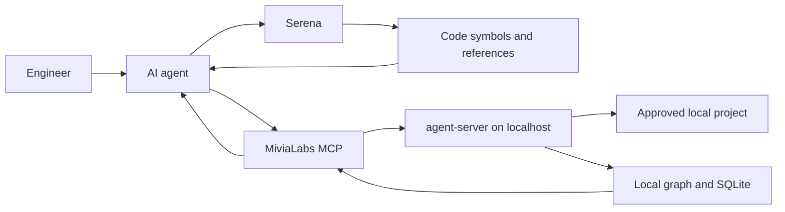

# Agent Context Server Guide

Status: Current local guide
Date: 2026-05-30
Classification: Internal; PII-prohibited

`agent-server` is a localhost service that gives engineers and AI agents safe project context. It indexes approved local projects, exposes bounded metadata and chunks, and keeps source understanding inside the developer machine.

## Who It Helps

| Audience | Value |
| --- | --- |
| Business stakeholders | Less agent guesswork, faster engineering work, and a clear local-only data boundary. |
| Local users | A simple way to ask what projects are configured, indexed, and safe for agents to inspect. |
| Engineers | One local service for project config, ingestion, run status, REST checks, and MCP tools. |
| AI agents | Token-efficient project discovery, file IDs, symbols, chunks, and ingestion state without broad scans. |

## How It Works



Serena and `agent-server` are complementary:

- Use Serena for precise code navigation: symbols, references, call sites, and edit targets.
- Use MiviaLabs MCP for indexed project context: project metadata, ingestion state, file IDs, outlines, headings, chunks, and symbol lists.
- Use shell for current disk and git truth: diffs, tests, builds, logs, and newly changed files.

## When To Use What

| Need | First tool |
| --- | --- |
| Understand a Go type, function, caller, or edit location | Serena |
| Find indexed files or symbols without scanning the repo in chat | MCP |
| Read a bounded chunk by opaque file ID | MCP |
| Check whether indexed data is fresh enough for the task | MCP or REST |
| Verify a code change, test, build, log, or git state | Shell |
| Inspect a file just created in the working tree | Shell, then Serena if code navigation is needed |

## Surfaces

REST is for direct local checks, scripts, and smoke tests. MCP is for agent clients such as Codex Desktop.

| Capability | REST under `/api/v1` | MCP tool |
| --- | --- | --- |
| Create task | `POST /tasks` | `tasks.create` |
| Get task | `GET /tasks/{id}` | `tasks.get` |
| Create research run metadata | `POST /research-runs` | `research_runs.create` |
| Get research run metadata | `GET /research-runs/{id}` | `research_runs.get` |
| Create research source metadata | `POST /research-runs/{id}/sources` | `research_sources.create` |
| Get research source metadata | `GET /research-runs/{id}/sources/{source_id}` | `research_sources.get` |
| List projects | `GET /projects` | `projects.list` |
| Get project | `GET /projects/{id}` | `projects.get` |
| Run metadata-only digest | `POST /projects/{id}/digest-runs` | `projects.digest` |
| Run content graph ingestion | `POST /projects/{id}/ingestion-runs` | `projects.ingest` |
| Get ingestion run | `GET /projects/{id}/ingestion-runs/{run_id}` | `projects.ingestion_status` |
| Get latest ingestion run | `GET /projects/{id}/ingestion-runs/latest` | `projects.ingestion_status_latest` |
| List indexed files | `GET /projects/{id}/files?status=eligible&extension=.go&path_prefix=cmd/` | `projects.files.list` |
| Get indexed file metadata | `GET /projects/{id}/files/{file_id}` | `projects.files.get` |
| Read bounded chunks | `GET /projects/{id}/files/{file_id}/chunks` | `projects.file.chunks` |
| List symbols | `GET /projects/{id}/symbols?kind=function&name_prefix=Run` | `projects.symbols.list` |
| Get bounded symbol source | `GET /projects/{id}/symbols/{symbol_id}/source` | `projects.symbol.source` |
| List symbol references | `GET /projects/{id}/symbols/{symbol_id}/references` | `projects.symbol.references` |
| List symbol callers | `GET /projects/{id}/symbols/{symbol_id}/callers` | `projects.symbol.callers` |
| List symbol callees | `GET /projects/{id}/symbols/{symbol_id}/callees` | `projects.symbol.callees` |
| Traverse symbol call graph | `GET /projects/{id}/symbols/{symbol_id}/call-graph` | `projects.symbol.call_graph` |
| List document headings | `GET /projects/{id}/headings?file_id={file_id}` | `projects.headings.list` |
| Get file outline, optionally with bounded eligible chunk text | `GET /projects/{id}/files/{file_id}/outline` | `projects.file.outline` |

`projects.ingest` and `POST /ingestion-runs` are asynchronous submissions. They return queued run metadata with a `run_id`; poll `projects.ingestion_status` or use latest status before trusting indexed content.

MCP resources also expose stable IDs:

- `mivialabs://projects/{id}`
- `mivialabs://projects/{id}/digest-runs/{run_id}`
- `mivialabs://projects/{id}/files/{file_id}`
- `mivialabs://projects/{id}/files/{file_id}/chunks/{chunk_id}`
- `mivialabs://projects/{id}/files/{file_id}/outline`
- `mivialabs://projects/{id}/symbols/{symbol_id}`

## Common Workflows

Check the server:

```sh
curl -fsS http://127.0.0.1:8080/healthz
curl -fsS http://127.0.0.1:8080/readyz
```

Check project context:

```sh
curl -fsS http://127.0.0.1:8080/api/v1/projects
curl -fsS http://127.0.0.1:8080/api/v1/projects/mivialabs-agents-monorepo
curl -fsS 'http://127.0.0.1:8080/api/v1/projects/mivialabs-agents-monorepo/files?page_size=5'
curl -fsS 'http://127.0.0.1:8080/api/v1/projects/mivialabs-agents-monorepo/ingestion-runs/latest'
curl -fsS 'http://127.0.0.1:8080/api/v1/projects/mivialabs-agents-monorepo/files/<file_id>'
curl -fsS 'http://127.0.0.1:8080/api/v1/projects/mivialabs-agents-monorepo/symbols?page_size=10'
```

Call MCP over raw HTTP only when no native MCP client is available:

```sh
curl -fsS \
  -H 'Content-Type: application/json' \
  -H 'Accept: application/json, text/event-stream' \
  -H 'MCP-Protocol-Version: 2025-06-18' \
  -d '{"jsonrpc":"2.0","id":1,"method":"tools/list","params":{}}' \
  http://127.0.0.1:8080/mcp
```

## Safety Boundary

The server is local-only. It must not expose:

- Absolute roots or datastore paths.
- Raw database queries.
- Secrets, credentials, tokens, PII, raw prompts, or provider payloads.
- Skipped sensitive content or matched sensitive text.
- Public network access, provider calls, embeddings, vectors, crawling, production deployment, symlink traversal, or auth-model changes.

Use stable opaque IDs from REST or MCP responses. Discovery order for agents is project metadata, latest ingestion status, small `projects.files.list` or `projects.symbols.list`/`projects.headings.list`, `projects.file.outline`, then semantic symbol tools or bounded chunks as needed. For common navigation, use `projects.symbol.references`, `projects.symbol.callers`, `projects.symbol.callees`, and `projects.symbol.call_graph`; use `resolution_status` and confidence metadata instead of assuming unresolved dynamic-language edges are precise. For large files, call `projects.file.outline` with `kind`, `name_prefix`, `symbol_page_size`, and `symbol_page_token`. If source context is needed in the same response, set `include_chunk_text=true` with a small `max_chunk_bytes`, or call `projects.symbol.source` with `max_source_bytes` for one eligible symbol. Do not infer or expose local root paths.

Promoted AST metadata covers Go stdlib AST, Tree-sitter JS/JSX/TS/TSX, Tree-sitter C#, Tree-sitter Python, Markdown headings, and lightweight infrastructure/config metadata. Go and Python also store indexed reference/call metadata; unsupported or ambiguous edges remain unresolved rather than guessed. TS/JS/TSX/JSX, C#, and Python have no regex fallback; parse failures are file-local `parse_error` skips and full scans continue. Extractor cache entries store symbols/headings/references/calls only and are removed for skipped or absent files.
