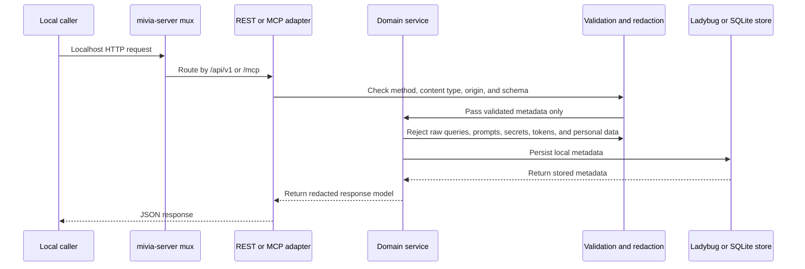
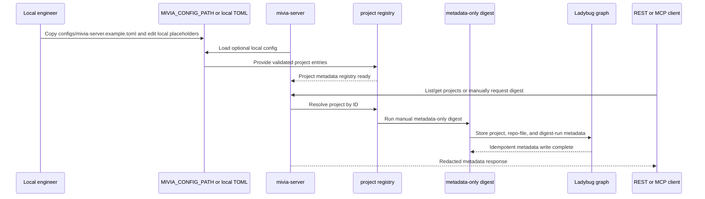
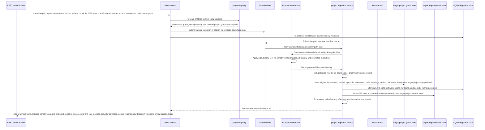
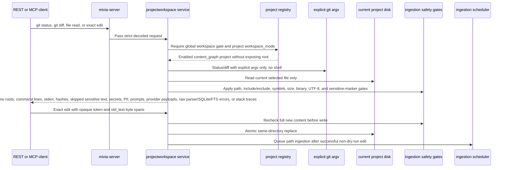
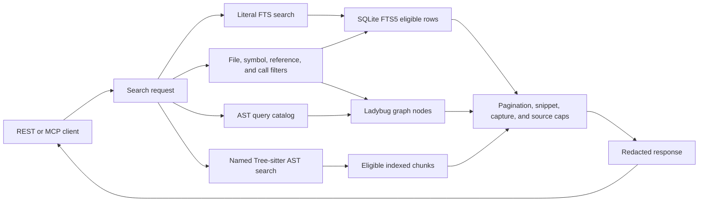
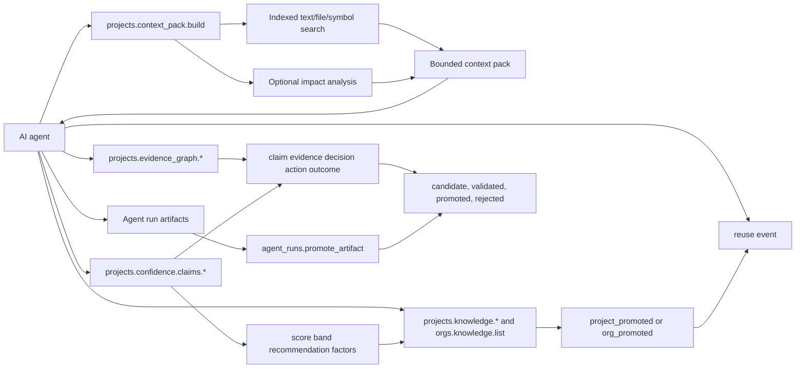
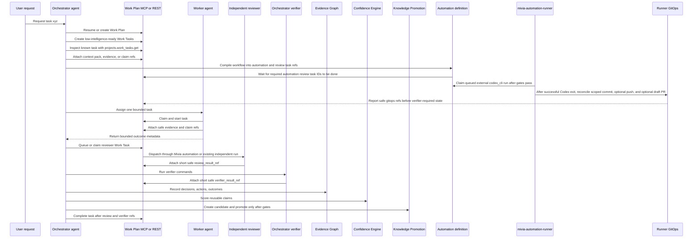
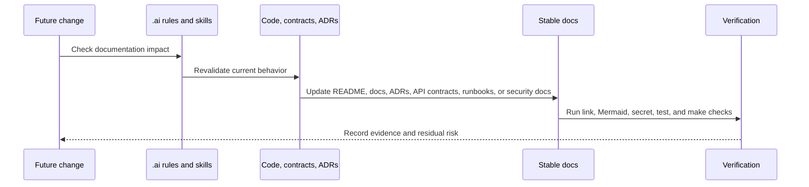

# System Architecture

Status: Bootstrap current-state
Date: 2026-06-04
Classification: Internal; PII-prohibited
Owners: Engineering owner TBD; Security/DPO required before PII, public exposure, provider, retention, or production decisions.

## Scope

This document describes the current local-only `mivia-server` architecture. It is grounded in `cmd/mivia-server`, `internal/agentcontrol`, `internal/projectregistry`, `internal/research`, `internal/platform`, `api/openapi`, `api/mcp`, and the ADR/security docs.

Local task plans and research plans are not stable technical documentation. Do not link them here; promote durable decisions to README, ADRs, API contracts, runbooks, security docs, or this architecture doc.

## Current Shape

- One Go module with one local service entrypoint: `cmd/mivia-server`.
- HTTP surfaces: `/healthz`, `/readyz`, REST under `/api/v1`, and MCP Streamable HTTP under `/mcp`.
- Domain services: `internal/agentcontrol` for tasks, research runs, redacted agent-run metadata, and promotion-gate decisions; `internal/research` for redacted research source metadata.
- Local project services: `internal/projectregistry` loads optional local project config from `configs/mivia-server.local.toml` or explicit `MIVIA_CONFIG_PATH`, validates local roots and patterns, exposes bounded project metadata, runs manual metadata-only digest, and routes content graph data to per-project `persistent` or `in_memory` graph storage.
- Reliability services: `internal/projectreliability` exposes context health, changed-path impact analysis, and stale-claim checking through REST and MCP without raw diff or document-content echoing.
- Context-pack services: `internal/projectcontext` composes bounded text search hits, file metadata, symbol metadata, and optional impact analysis without new storage, roots, raw diffs, provider calls, or full chunk text.
- Project ingestion services: `internal/projectingestion` handles eligible local source safety gates, chunking, promoted AST extraction, extractor cache, per-project SQLite FTS5 search indexing, bounded project-targeted graph writes, SQLite run/file state, bounded REST/MCP query views, fair scheduling, live watcher orchestration, parallel full-scan file workers, search-index repair, startup recovery for interrupted runs, and periodic running-progress persistence.
- Project workspace services: `internal/projectworkspace` handles governed git status/diff, current eligible file reads with opaque edit tokens, and token-guarded exact byte-span edits for explicitly opted-in workspaces. File reads return the full eligible text by default; caller-supplied `max_bytes` is an explicit partial-read cap and sets `text_truncated` only when applied.
- Project evidence services: `internal/projectevidence` stores project-scoped Evidence Graph metadata for claims, evidence refs, decisions, actions, outcomes, artifact links, and promotion links through REST and MCP without raw prompts, raw source dumps, provider payloads, secrets, roots, raw stderr, or PII.
- Project confidence services: `internal/projectconfidence` calculates and stores deterministic metadata-only confidence assessments for Evidence Graph claims through REST and MCP. The implemented confidence routes are `POST /api/v1/projects/{id}/confidence/claims/{claim_id}/score`, `GET /api/v1/projects/{id}/confidence/claims/{claim_id}`, and `GET /api/v1/projects/{id}/confidence/claims?band=&min_score=&max_score=&recommendation=&run_id=&trace_id=&page_size=&page_token=`. The implemented MCP tools are `projects.confidence.claims.score`, `projects.confidence.claims.get`, and `projects.confidence.claims.list` with underscore aliases. They expose score, band, recommendation, bounded factors, and safe input counters only; no raw prompts, raw completions, raw source dumps, raw stderr, provider payloads, secrets, roots, external URLs, PII, raw graph traversal, raw request payloads, raw scoring internals, AI/provider scoring, embedding scoring, or vector scoring are stored or returned.
- Project workflow services: `internal/projectworkflow` validates and imports Workflow TOML as metadata only, exposes workflow lifecycle records, agent definitions, immutable permission snapshots, and compile-to-Work-Plan refs through REST and MCP. Workflow TOML is compile-only; it does not execute directly, does not run raw prompts or automation, and cannot bypass Work Plans, Work Tasks, required review gates, independent review refs, orchestrator verifier refs, Evidence Graph outcomes, confidence scoring, or Knowledge Promotion gates.
- Project work plan services: `internal/projectworkplan` stores metadata-only Work Plans and Work Tasks for governed multi-step execution. MCP exposes `projects.work_tasks.get` for single-task inspection before lifecycle changes. Work Tasks must be decomposed for isolated low-intelligence workers, claimed before execution, and completed only after verifier refs plus independent review refs or a bounded tiny-task review exemption. Verifier and review refs are short safe identifiers, not commands, raw logs, raw stderr, paths, or source text. Implementer self-review is rejected when both run IDs are known. Review capacity is represented by reviewer Work Tasks and automation runs; client-side Codex subagent threads are optional helpers, not required infrastructure. Work Task records link context pack refs, Evidence Graph refs, confidence refs, verifier refs, review refs, AgentRun refs, and Knowledge Promotion candidate refs without storing raw prompts, completions, source dumps, raw stderr, provider payloads, secrets, roots, external URLs, or PII.
- Project automation services: `internal/projectautomation` stores metadata-only automation definitions and runs over existing Work Plans and ready Work Tasks. Automation is an executor layer, not a planning substitute. When `automation.work_plan_status_trigger` is enabled, `internal/projectworkplan` status transitions such as `planned -> active` synchronously queue each enabled automatic automation for that Work Plan once. Codex CLI execution is required when available and enabled, external execution is claimed by `mivia-automation-runner` in the user's logged-in local Codex environment, and automatic workflow execution is blocked until generated automation review tasks are done. Automation output remains untrusted until independent review refs, verifier refs, Evidence Graph outcomes, confidence scoring where reusable, and Knowledge Promotion gates are complete.
- Project GitOps services: `internal/projectgitops` reconciles configured post-task git operations for supervised external automation runs after Codex CLI exits successfully and before the run reports verifier-required state. It can commit scoped task changes, optionally push, and optionally create or update a draft GitHub PR through fixed `git`/`gh` command shapes plus configurable safe metadata templates. GitOps is disabled by default, fails closed without safe scoped affected paths, uses env/file credential references only, and stores safe refs rather than raw command output, roots, stderr, key material, token literals, prompts, source dumps, provider payloads, or PII.
- Project knowledge services: `internal/projectknowledge` turns verified Evidence Graph and Confidence Engine conclusions into metadata-only reusable knowledge. Project-level promotion is the default. Org-level promotion is optional, stricter, explicit, never automatic, and limited to `org_ref=default` in v1. Implemented REST routes are `POST /api/v1/projects/{id}/knowledge/candidates`, `POST /api/v1/projects/{id}/knowledge/{knowledge_id}/validate`, `POST /api/v1/projects/{id}/knowledge/{knowledge_id}/promote-project`, `POST /api/v1/projects/{id}/knowledge/{knowledge_id}/submit-org-review`, `POST /api/v1/projects/{id}/knowledge/{knowledge_id}/promote-org`, `POST /api/v1/projects/{id}/knowledge/{knowledge_id}/reject`, `POST /api/v1/projects/{id}/knowledge/{knowledge_id}/supersede`, `POST /api/v1/projects/{id}/knowledge/{knowledge_id}/reuse-events`, `GET /api/v1/projects/{id}/knowledge/{knowledge_id}`, `GET /api/v1/projects/{id}/knowledge?scope=&state=&claim_id=&knowledge_ref=&confidence_band=&min_confidence=&max_confidence=&page_size=&page_token=`, and `GET /api/v1/orgs/{org_ref}/knowledge?state=org_promoted&claim_id=&knowledge_ref=&confidence_band=&min_confidence=&max_confidence=&page_size=&page_token=`. Implemented MCP tools are `projects.knowledge.candidates.create`, `projects.knowledge.validate`, `projects.knowledge.promote_project`, `projects.knowledge.submit_org_review`, `projects.knowledge.promote_org`, `projects.knowledge.reject`, `projects.knowledge.supersede`, `projects.knowledge.reuse_events.record`, `projects.knowledge.get`, `projects.knowledge.list`, and `orgs.knowledge.list` with underscore aliases. Knowledge records must not store raw prompts, raw completions, raw source dumps, raw stderr, provider payloads, secrets, roots, external URLs, or PII.
- Stores: Ladybug graph abstraction for graph data; lazy-opened Pebble-backed Ladybug graphs for durable content-graph persistence; SQLite for local app configuration, ingestion state, extractor cache, and FTS-backed governed search. Content-graph projects can use persistent project-scoped graph/search stores or process-local memory; persistent stores derive from the configured Ladybug path parent under `projects/<project-id>/`, with project search filenames tied to the Pebble graph storage epoch.
- Boundary: localhost-only by default; no approved production deployment, public API exposure, auth model, live provider, external crawling, embedding provider, vector dimension, arbitrary shell endpoint, raw patch upload, git commit/push/checkout/reset/branch/merge/rebase/stash/clean/restore tool, or PII processing.

## Component And Data Flow

```mermaid
flowchart TB
  LocalClient["Local caller or Codex Desktop"]
  Server["cmd/mivia-server"]
  Health["healthz and readyz"]
  REST["REST adapter /api/v1"]
  MCP["MCP adapter /mcp"]
  AgentService["internal/agentcontrol service"]
  AgentRuns["redacted agent-run metadata"]
  Promotions["promotion-gate decisions"]
  ProjectRegistry["internal/projectregistry registry"]
  Reliability["internal/projectreliability"]
  ContextPacks["internal/projectcontext"]
  ProjectDigest["metadata-only project digest"]
  ProjectIngestion["content graph ingestion"]
  ProjectWorkspace["governed workspace status/diff/read/edit"]
  ProjectEvidence["project Evidence Graph metadata"]
  ProjectConfidence["project confidence metadata"]
  ProjectWorkflow["project workflow TOML metadata"]
  PermissionSnapshots["workflow permission snapshots"]
  WorkPlans["project Work Plans"]
  WorkTasks["project Work Tasks"]
  ReviewGate["independent review gate"]
  VerifierGate["orchestrator verifier gate"]
  ProjectAutomation["project automation and Codex runner metadata"]
  ProjectGitOps["project GitOps reconciler"]
  ProjectKnowledge["project and org knowledge metadata"]
  Scheduler["fair ingestion scheduler"]
  Watcher["live watcher orchestrator"]
  FullScanWorkers["bounded full-scan file workers"]
  FlushWindows["weighted prepared-file flush windows"]
  GraphRouter["project graph router"]
  SemanticGraph["symbols, references, calls, headings"]
  SearchIndex["project-scoped SQLite FTS5 search index"]
  ASTSearch["named AST structural search"]
  ResearchService["internal/research service"]
  Redaction["research redaction boundary"]
  Ladybug["Ladybug graph abstraction"]
  SQLite["SQLite app-config store"]
  ConfigFile["MIVIA_CONFIG_PATH or ignored local TOML"]
  Contracts["api/openapi and api/mcp contracts"]
  SecurityDocs["docs/security policy docs"]

  LocalClient --> Server
  Server --> Health
  Server --> REST
  Server --> MCP
  REST --> AgentService
  MCP --> AgentService
  AgentService --> AgentRuns
  AgentRuns --> Promotions
  REST --> ProjectRegistry
  MCP --> ProjectRegistry
  REST --> Reliability
  MCP --> Reliability
  REST --> ContextPacks
  MCP --> ContextPacks
  ContextPacks --> Reliability
  Reliability --> ProjectRegistry
  Reliability --> ProjectWorkspace
  Reliability --> SearchIndex
  ProjectRegistry --> ProjectDigest
  ProjectRegistry --> ProjectWorkspace
  ProjectDigest --> Ladybug
  ProjectRegistry --> Scheduler
  Watcher --> Scheduler
  Scheduler --> ProjectIngestion
  ProjectIngestion --> FullScanWorkers
  FullScanWorkers --> FlushWindows
  FlushWindows --> SemanticGraph
  SemanticGraph --> GraphRouter
  GraphRouter --> Ladybug
  FlushWindows --> SearchIndex
  SearchIndex --> SQLite
  SearchIndex --> ContextPacks
  SemanticGraph --> ASTSearch
  SemanticGraph --> ContextPacks
  ASTSearch --> REST
  ASTSearch --> MCP
  ProjectIngestion --> Ladybug
  ProjectIngestion --> SQLite
  ProjectWorkspace --> ProjectIngestion
  ProjectWorkspace --> REST
  ProjectWorkspace --> MCP
  REST --> ProjectEvidence
  MCP --> ProjectEvidence
  ProjectEvidence --> GraphRouter
  REST --> ProjectConfidence
  MCP --> ProjectConfidence
  ProjectConfidence --> ProjectEvidence
  ProjectConfidence --> Reliability
  ProjectConfidence --> ContextPacks
  ProjectConfidence --> GraphRouter
  REST --> ProjectWorkflow
  MCP --> ProjectWorkflow
  ProjectWorkflow --> WorkPlans
  ProjectWorkflow --> WorkTasks
  ProjectWorkflow --> ProjectAutomation
  ProjectWorkflow --> PermissionSnapshots
  PermissionSnapshots --> ProjectAutomation
  REST --> WorkPlans
  MCP --> WorkPlans
  WorkPlans --> WorkTasks
  WorkTasks --> ContextPacks
  WorkTasks --> ProjectEvidence
  WorkTasks --> ProjectConfidence
  WorkTasks --> ReviewGate
  WorkTasks --> VerifierGate
  ReviewGate --> WorkTasks
  VerifierGate --> WorkTasks
  WorkTasks --> ProjectKnowledge
  WorkTasks --> AgentRuns
  REST --> ProjectAutomation
  MCP --> ProjectAutomation
  ProjectAutomation --> WorkPlans
  ProjectAutomation --> WorkTasks
  ProjectAutomation --> ProjectGitOps
  ProjectAutomation --> ReviewGate
  ProjectAutomation --> VerifierGate
  ProjectGitOps --> VerifierGate
  REST --> ProjectKnowledge
  MCP --> ProjectKnowledge
  ProjectKnowledge --> ProjectEvidence
  ProjectKnowledge --> ProjectConfidence
  ProjectKnowledge --> GraphRouter
  ConfigFile --> ProjectRegistry
  REST --> ResearchService
  MCP --> ResearchService
  ResearchService --> Redaction
  AgentService --> Ladybug
  WorkPlans --> Ladybug
  WorkTasks --> Ladybug
  ProjectAutomation --> Ladybug
  ProjectGitOps --> Ladybug
  ResearchService --> Ladybug
  AgentRuns --> Ladybug
  AgentService --> SQLite
  AgentRuns --> SQLite
  ProjectRegistry --> SQLite
  Contracts --> REST
  Contracts --> MCP
  SecurityDocs --> AgentService
  SecurityDocs --> ProjectRegistry
  SecurityDocs --> ResearchService
```

## REST And MCP Request Sequence

## Local Project Config And Digest Sequence

## Content Graph And Live Update Sequence

## Governed Workspace Sequence

## Governed Search Flow

## Context Pack And Promotion Flow

## Knowledge Promotion And Collective Learning

Knowledge Promotion has two levels. Project-level promotion is the default for reusable knowledge inside one project. Org-level promotion is optional, stricter, explicit, and never automatic; v1 supports only `org_ref=default` and requires project promotion first.

Future agents should query `projects.knowledge.list` before planning in the current project and `orgs.knowledge.list` before making cross-project claims. Promoted knowledge is not proof. Agents must revalidate current source, context health, relevant runtime evidence, and stable docs/tool/route claims with `projects.claims.check` before acting.

Exact agent sequence: query project knowledge; query org knowledge if making a cross-project claim; verify current source/context; record Evidence Graph metadata for any new conclusion; score confidence; promote only after gates pass; record a reuse event.

Reuse events are mandatory when an agent uses, skips, finds stale, or finds contradicted knowledge. Stale or contradicted knowledge is superseded, not deleted.

## Governed Work Plan Lifecycle

Work Plans and Work Tasks are the persistent execution structure between a user request and knowledge reuse. They are mandatory for governed multi-step work when exposed by the running MCP server.

Completion rules:

- Workflow TOML must be validated/imported as metadata and compiled into Work Plan/Work Task/reviewer task/automation/permission snapshot refs before any execution. It must not execute directly.
- `projects.work_tasks.get` returns one bounded Work Task metadata record for lifecycle inspection and must not expose raw prompts, source dumps, raw stderr, provider payloads, secrets, roots, external URLs, skipped sensitive content, or PII.
- `projects.work_tasks.complete` requires verifier result refs plus either independent review result refs or a bounded `review_exempt_reason`.
- Verifier and review result refs must be short safe identifiers. They are not command strings, raw command output, raw logs, raw stderr, paths, source text, provider payloads, secrets, or PII.
- `projects.work_tasks.attach_review_result` rejects self-review when `attached_by_run_id` matches the task `claimed_by_run_id`.
- `review_exempt_reason` is only for tiny mechanical tasks with no code, config, data, auth, tenancy, privacy, API, migration, automation, or promotion risk.
- Reviewer capacity comes from reviewer Work Tasks and Mivia automation worker limits, not a client's ability to spawn a new Codex Desktop subagent thread. If no independent reviewer run is available, the task must wait or block with `reviewer_capacity_unavailable`; it must not self-review.
- Automatic automation cannot queue, submit, claim, or execute until its required automation review task IDs are done.
- Configured runner GitOps can only run after a successful external Codex attempt and before verifier-required reporting. It does not replace independent review, verifier refs, Evidence Graph outcomes, confidence scoring, Knowledge Promotion gates, or task completion.
- Automation output is untrusted until independent review refs, verifier refs, Evidence Graph outcomes, confidence scoring where reusable, and Knowledge Promotion gates are complete.
- Worker prompts and task metadata remain refs and bounded summaries only; no raw prompts, completions, source dumps, raw stderr, provider payloads, secrets, roots, external URLs, or PII.

## Documentation Update Sequence

## Data Classification

- Internal by default.
- PII ingestion is prohibited until Security/DPO approval covers purpose, legal basis, access model, retention, deletion path, and audit trail.
- REST, MCP, stores, logs, fixtures, docs, traces, and metrics must not contain raw prompts, raw fetched content, provider payloads, credentials, tokens, secrets, or personal data.
- Research source handling stores redacted metadata only; live provider execution and broad crawling remain out of scope.
- Local project configuration is for engineer local computers only. SQLite may store configured local root paths as ignored local app-configuration state, but REST/MCP project metadata responses omit root paths, include/exclude patterns, datastore paths, and raw database query surfaces.
- Project digest stores metadata only: relative path, extension/language hint, size, mtime, and `metadata_sha256` derived from those metadata fields. It must not store raw source content or file-content hashes.
- Content graph ingestion is approved only for explicitly opted-in `content_graph` projects. It may store eligible local source chunks after all gates pass. Skipped sensitive content, matched sensitive-marker text, secrets, PII, raw prompts, provider payloads, and absolute roots must not be stored or returned.
- Promoted AST extraction runs after safety gates. Go uses the Go stdlib parser; JS, JSX, TS, TSX, C#, Python, and Dart use mandatory Tree-sitter extractors with embedded queries and startup validation; Markdown and infrastructure/config files use metadata-only extractors. Dart generated files are indexed by default unless project config excludes them, and Flutter widget/state/build metadata is promoted through symbols, references, and calls. No regex fallback is allowed for promoted Tree-sitter languages.
- The SQLite extractor cache stores only serialized symbols, headings, references, and calls keyed by project, relative-path hash, content hash, extractor name, and extractor version. It does not store raw source, AST node text, chunks, absolute roots, skipped sensitive content, matched sensitive text, secrets, prompts, provider payloads, or PII. Skipped or absent files do not keep extractor cache rows or content hashes.
- SQLite FTS5 stores governed search rows for eligible chunks, files, symbols, references, and calls. Persistent content-graph projects use one project-scoped search database under the configured storage parent, while shared metadata remains separate. Search APIs are literal/metadata search over already-indexed content, not crawling, provider calls, embeddings, vectors, raw DB queries, or raw FTS query execution. Symbol source, text search, and AST search return text only from eligible indexed chunks and only under explicit caps.
- Context packs compose existing indexed search and reliability metadata only. They return capped snippets and metadata, not full chunk text, raw diffs, roots, provider payloads, secrets, prompts, or PII.
- Promotion gates store metadata-only decisions for existing agent-run artifact refs. They do not copy runtime payloads into the knowledge graph, and validated/promoted/rejected decisions require verifier refs and bounded decision text.
- Evidence Graph records project-scoped metadata only: claim refs, evidence refs, decisions, action refs, outcome refs, artifact refs, promotion refs, safe changed-file refs, run IDs, trace IDs, timestamps, and bounded summaries/rationales. It must not store raw prompts, raw source dumps, provider payloads, secrets, roots, raw stderr, skipped sensitive content, or PII.
- Confidence assessments record project-scoped metadata only: Evidence Graph claim refs, score, band, recommendation, bounded factors, safe source refs, safe input counters, run IDs, trace IDs, and timestamps. They must not store or return raw prompts, raw completions, raw source dumps, raw stderr, provider payloads, secrets, roots, external URLs, PII, raw graph traversal, raw request payloads, raw scoring internals, AI/provider scoring, embedding scoring, or vector scoring.
- Work Plans, Work Tasks, review results, verifier results, and automation records store metadata only: plan/task refs, status, owner/run refs, trace refs, dependency refs, context pack refs, evidence refs, claim refs, review refs, verifier refs, confidence refs, knowledge candidate refs, safe likely affected files, expected output, failure/block criteria, resume instructions, and bounded outcomes. Single-task reads through `projects.work_tasks.get` return the same bounded metadata. They must not store or return raw prompts, raw completions, raw source dumps, raw stderr, provider payloads, secrets, roots, external URLs, skipped sensitive content, or PII. Work Task completion requires verifier refs plus independent review refs or a bounded tiny-task review exemption.
- Workflow records, agent definitions, review gates, compile results, and permission snapshots store metadata only: workflow refs, step refs, dependency refs, safe affected-file refs, evidence needs, context pack refs, verification requirements, expected outputs, failure criteria, resume instructions, allowed skills/tools/commands, denied commands, workspace mode, network policy, secret policy, log policy, runtime, retry policy, content hash, run IDs, trace IDs, validation issues, and generated Work Plan/Work Task/reviewer/automation/snapshot refs. They must not store or return raw prompts, raw completions, source dumps, raw stderr, provider payloads, secrets, roots, external URLs, skipped sensitive content, or PII.
- Knowledge Promotion records metadata only: knowledge refs, claim refs, confidence refs, evidence refs, verifier refs, outcome refs, promotion refs, reuse refs, decisions, summaries, and reuse guidance. They must not store or return raw prompts, raw completions, raw source dumps, raw stderr, provider payloads, secrets, roots, external URLs, or PII.
- Named AST search runs against eligible indexed chunks using the server-owned query catalog for Go, Python, JavaScript, JSX, TypeScript, TSX, C#, and Dart. Raw Tree-sitter query syntax is not exposed. Coverage gaps such as oversized files are represented only as safe metadata counts.
- Full scans run through a fair scheduler, dispatch configurable file workers under a shared global cap, flush prepared graph/search writes by file-count cap and internal write weight, persist running progress counters, and tombstone stale files only after enumeration and workers drain. REST and MCP manual ingestion and search-index repair calls enqueue work and return run metadata without waiting for scan completion. Live path events have priority over full-scan continuation, and operators can cap per-project worker use below the global worker count when fairness across projects matters.
- On startup, persisted `pending` or `running` ingestion runs from a previous server process are marked failed with `error_category=server_restarted`; live startup scans or fresh manual ingestion are the repair path.

## Operational Boundaries

- Default bind must remain localhost or loopback until authn/authz, origin policy, rate limits, audit logging, monitoring, incident response, and on-call coverage are approved.
- Handlers must not expose raw LadybugDB or SQLite query execution.
- Unit tests must remain fixture-only and must not perform live internet calls.
- Provider, embedding, vector, retention, production deployment, and public API decisions require ADR and owner review.
