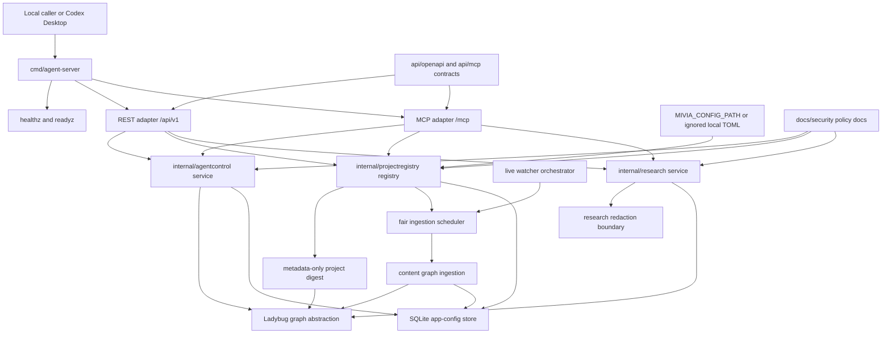
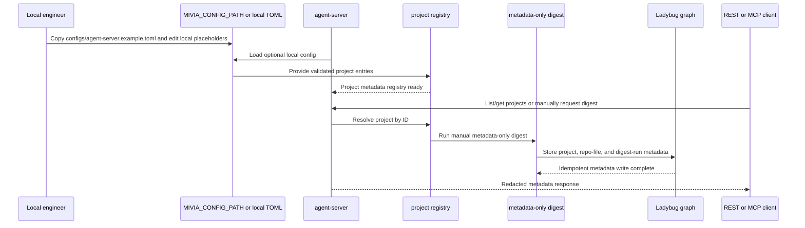
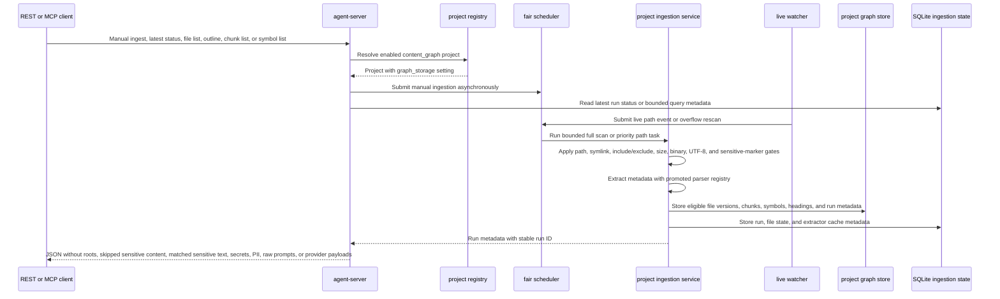
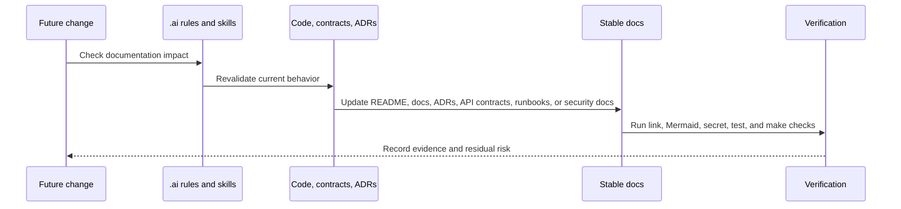

# System Architecture

Status: Bootstrap current-state
Date: 2026-05-30
Classification: Internal; PII-prohibited
Owners: Engineering owner TBD; Security/DPO required before PII, public exposure, provider, retention, or production decisions.

## Scope

This document describes the current local-only `agent-server` architecture. It is grounded in `cmd/agent-server`, `internal/agentcontrol`, `internal/projectregistry`, `internal/research`, `internal/platform`, `api/openapi`, `api/mcp`, and the ADR/security docs.

Local task plans and research plans are not stable technical documentation. Do not link them here; promote durable decisions to README, ADRs, API contracts, runbooks, security docs, or this architecture doc.

## Current Shape

- One Go module with one local service entrypoint: `cmd/agent-server`.
- HTTP surfaces: `/healthz`, `/readyz`, REST under `/api/v1`, and MCP Streamable HTTP under `/mcp`.
- Domain services: `internal/agentcontrol` for tasks and research runs; `internal/research` for redacted research source metadata.
- Local project services: `internal/projectregistry` loads optional local project config from `configs/agent-server.local.toml` or explicit `MIVIA_CONFIG_PATH`, validates local roots and patterns, exposes bounded project metadata, runs manual metadata-only digest, and routes content graph data to per-project `persistent` or `in_memory` graph storage.
- Project ingestion services: `internal/projectingestion` handles eligible local source safety gates, chunking, promoted AST extraction, extractor cache, bounded graph writes, SQLite run/file state, bounded REST/MCP query views, fair scheduling, and live watcher orchestration.
- Stores: Ladybug graph abstraction for graph data; SQLite for local app configuration and ingestion state. Project graph storage can be persistent or process-local per project.
- Boundary: localhost-only by default; no approved production deployment, public API exposure, auth model, live provider, external crawling, embedding provider, vector dimension, or PII processing.

## Component And Data Flow

## REST And MCP Request Sequence

## Local Project Config And Digest Sequence

## Content Graph And Live Update Sequence

## Documentation Update Sequence

## Data Classification

- Internal by default.
- PII ingestion is prohibited until Security/DPO approval covers purpose, legal basis, access model, retention, deletion path, and audit trail.
- REST, MCP, stores, logs, fixtures, docs, traces, and metrics must not contain raw prompts, raw fetched content, provider payloads, credentials, tokens, secrets, or personal data.
- Research source handling stores redacted metadata only; live provider execution and broad crawling remain out of scope.
- Local project configuration is for engineer local computers only. SQLite may store configured local root paths as ignored local app-configuration state, but REST/MCP project metadata responses omit root paths, include/exclude patterns, datastore paths, and raw database query surfaces.
- Project digest stores metadata only: relative path, extension/language hint, size, mtime, and `metadata_sha256` derived from those metadata fields. It must not store raw source content or file-content hashes.
- Content graph ingestion is approved only for explicitly opted-in `content_graph` projects. It may store eligible local source chunks after all gates pass. Skipped sensitive content, matched sensitive-marker text, secrets, PII, raw prompts, provider payloads, and absolute roots must not be stored or returned.
- Promoted AST extraction runs after safety gates. Go uses the Go stdlib parser; JS, JSX, TS, TSX, and C# use mandatory Tree-sitter extractors with embedded queries and startup validation; Markdown and infrastructure/config files use metadata-only extractors. No regex fallback is allowed for promoted Tree-sitter languages.
- The SQLite extractor cache stores only serialized symbols and headings keyed by project, relative-path hash, content hash, extractor name, and extractor version. It does not store raw source, AST node text, chunks, absolute roots, skipped sensitive content, matched sensitive text, secrets, prompts, provider payloads, or PII.
- Full scans commit graph writes in bounded windows and run through a fair scheduler. REST and MCP manual ingestion calls enqueue work and return run metadata without waiting for scan completion. Live path events have priority over full-scan continuation, and global plus per-project limits prevent one project from monopolizing ingestion workers.

## Operational Boundaries

- Default bind must remain localhost or loopback until authn/authz, origin policy, rate limits, audit logging, monitoring, incident response, and on-call coverage are approved.
- Handlers must not expose raw LadybugDB or SQLite query execution.
- Unit tests must remain fixture-only and must not perform live internet calls.
- Provider, embedding, vector, retention, production deployment, and public API decisions require ADR and owner review.
