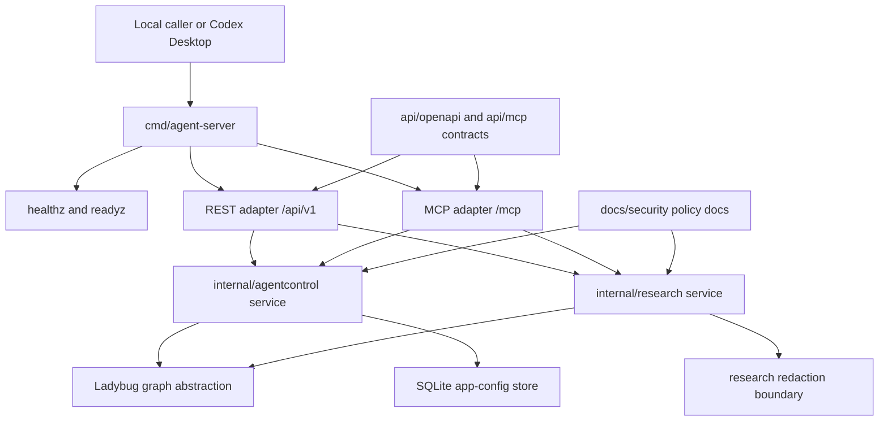
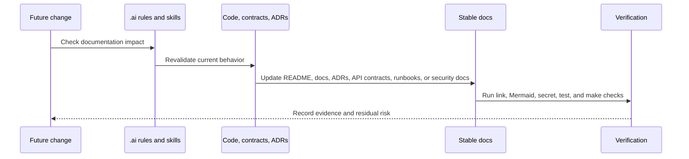

# System Architecture

Status: Bootstrap current-state
Date: 2026-05-30
Classification: Internal; PII-prohibited
Owners: Engineering owner TBD; Security/DPO required before PII, public exposure, provider, retention, or production decisions.

## Scope

This document describes the current local-only `agent-server` architecture. It is grounded in `cmd/agent-server`, `internal/agentcontrol`, `internal/research`, `internal/platform`, `api/openapi`, `api/mcp`, and the ADR/security docs.

Local task plans and research plans are not stable technical documentation. Do not link them here; promote durable decisions to README, ADRs, API contracts, runbooks, security docs, or this architecture doc.

## Current Shape

- One Go module with one local service entrypoint: `cmd/agent-server`.
- HTTP surfaces: `/healthz`, `/readyz`, REST under `/api/v1`, and MCP Streamable HTTP under `/mcp`.
- Domain services: `internal/agentcontrol` for tasks and research runs; `internal/research` for redacted research source metadata.
- Stores: Ladybug graph abstraction for graph data; SQLite for local app configuration. Normal builds use the in-memory Ladybug graph unless native tags are enabled.
- Boundary: localhost-only by default; no approved production deployment, public API exposure, auth model, live provider, external crawling, embedding provider, vector dimension, or PII processing.

## Component And Data Flow

## REST And MCP Request Sequence

## Documentation Update Sequence

## Data Classification

- Internal by default.
- PII ingestion is prohibited until Security/DPO approval covers purpose, legal basis, access model, retention, deletion path, and audit trail.
- REST, MCP, stores, logs, fixtures, docs, traces, and metrics must not contain raw prompts, raw fetched content, provider payloads, credentials, tokens, secrets, or personal data.
- Research source handling stores redacted metadata only; live provider execution and broad crawling remain out of scope.

## Operational Boundaries

- Default bind must remain localhost or loopback until authn/authz, origin policy, rate limits, audit logging, monitoring, incident response, and on-call coverage are approved.
- Handlers must not expose raw LadybugDB or SQLite query execution.
- Unit tests must remain fixture-only and must not perform live internet calls.
- Provider, embedding, vector, retention, production deployment, and public API decisions require ADR and owner review.
