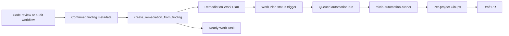

# Automation Runner Operations

Status: Current
Date: 2026-06-05
Classification: Internal; PII-prohibited

## Runner User

Containerized automation that writes to a bind-mounted repository must run as the same host user that owns the checkout. In shared examples this is configured with:

```yaml
user: "${MIVIA_AUTOMATION_CONTAINER_USER:-10001:10001}"
```

The devcontainer example uses:

```yaml
user: "${MIVIA_CONTAINER_USER:-1000:1000}"
```

Set `MIVIA_AUTOMATION_CONTAINER_USER="$(id -u):$(id -g)"` when the host checkout is not owned by that default UID and GID. Do this before enabling GitOps commit, push, or draft PR automation. Configure `MIVIA_CONTAINER_USER` separately when the server needs different permissions for its data volume or local workspace mounts.

For local Docker Compose runs, prefer the helper script so the automation sidecar user is inferred before Compose starts:

```bash
scripts/mivia-compose-up -d
```

The helper exports `MIVIA_AUTOMATION_CONTAINER_USER="$(id -u):$(id -g)"` unless you already set it, includes `.docker-compose.local.yml` when present, and then runs `docker compose up` with the repository compose files. It does not override `MIVIA_CONTAINER_USER`; the server may need a different user for its data volume or local workspace mounts. Pass normal `docker compose up` flags after the script name.

When the runner mounts a host Codex home, the mounted `config.toml` must be readable by that same UID/GID. If a run reports `codex_config_unreadable`, fix host ownership or permissions for the mounted Codex config, then restart the runner. Do not run the runner as root to work around this; root-owned worktree metadata and commits can break later local automation.

For ignored local overrides, use a runner-specific variable if the server still needs different permissions:

```yaml
user: "${MIVIA_AUTOMATION_CONTAINER_USER:-1000:1000}"
healthcheck:
  disable: true
```

Set `MIVIA_AUTOMATION_CONTAINER_USER="$(id -u):$(id -g)"` for the automation sidecar. Avoid `0:0`; root-run sidecars create root-owned commits, refs, and worktree metadata on Linux and macOS bind mounts.

Disable the image healthcheck on every runner service, including per-project runner services in `.docker-compose.local.yml`. The image healthcheck targets the server's internal `/readyz` endpoint; a runner container does not expose that endpoint and will be marked unhealthy even while it is correctly polling and executing queued runs.

## GitOps Conventions

Runner GitOps is controlled by global `[git_operations]` defaults and optional per-project `[projects.git_operations]` overrides in the server config. Repository-specific branch, commit, PR title, and PR body rules belong under the project that owns them, not in global defaults. The convention fields are generic and project-safe: they use fixed placeholders, not arbitrary shell or template evaluation. Commit subjects and PR titles must render as Conventional Commits.

`branch_prefix` is checked before push/PR when set. `branch_name_pattern` is an optional RE2 regular expression checked against the current branch before push/PR. A project override may set `branch_prefix = ""` and use `branch_name_pattern` when the repository uses a non-prefix branch convention.

Supported placeholders:

- `{{project_id}}`
- `{{work_plan_id}}`
- `{{work_task_id}}`
- `{{work_task_ref}}`
- `{{work_task_title}}`
- `{{automation_id}}`
- `{{automation_run_id}}`
- `{{operator_id}}`
- `{{review_refs}}`
- `{{verifier_refs}}`
- `{{test_results}}`
- `{{commit_subject}}`

Draft PR bodies always render exactly these sections: `What changed`, `How verified`, and `Tests`. The default `How verified` text includes project ID, Work Plan ID, Work Task ID, automation ID, automation run ID, operator ID, review refs, and verifier refs. Test results are included when a caller supplies safe summaries; otherwise the runner states that tests were not reported and orchestrator verification is pending.

## Project Verification Profiles

Runner GitOps also supports global `[verification]` defaults and per-project `[projects.verification]` overrides. Verification commands run inside the automation worktree after Codex finishes and before GitOps commits, pushes, or creates a draft PR. A failed verifier stops the post-task flow with `gitops_verification_failed`; the runner must not commit or open a PR from an unverified worktree.

Use `bootstrap_commands` for deterministic setup, `always_before_pr` for required lint/typecheck/test gates, and `generated_artifacts` for checked-in generated outputs. When a generated-artifact verifier is `required_before_pr = true`, its `paths` are automatically added to the safe staging pathspecs so regenerated files can be committed with the task.

The container image includes Node.js, `pnpm`, Python 3, `pip`, `venv`, and Semgrep so project profiles can enforce common repository gates without relying on prompt text. Keep heavyweight or repository-specific commands in config, not in the image; the image should provide the tool runtime, while `[projects.verification]` decides which gates run for that project.

Automated Work Plans use dedicated worktrees by default, including read-only audits. This keeps scanner/reviewer agents on fresh default-branch code instead of a dirty live checkout. When `cleanup_worktree_after_plan_done = true`, the runner removes the dedicated `.mivia-worktrees/<project>/...` checkout after the owning Work Plan reaches a terminal status (`done`, `failed`, `cancelled`, or `superseded`). Blocked Work Plans are resumable, so their dedicated worktrees are preserved for recovery.

Example:

```toml
[projects.verification]
bootstrap_commands = ["pnpm install --frozen-lockfile --prefer-offline --ignore-scripts"]
always_before_pr = [
  "pnpm -s nx affected -t lint --base=origin/main --head=HEAD --parallel=4",
  "pnpm -s nx affected -t typecheck --base=origin/main --head=HEAD --parallel=4",
  "test ! -d policies/semgrep/rules || semgrep scan --config policies/semgrep/rules/ --error apps/ libs/ packages/",
]

[[projects.verification.generated_artifacts]]
paths = [
  "packages/contracts/dist/openapi.json",
  "packages/contracts/dist/openapi.yaml",
]
command = "pnpm -s nx run contracts:verify-openapi"
required_before_pr = true
```

Agents should still mention likely verifier impact in the Work Task, but the runner enforces the configured profile. Do not rely on prompt instructions alone for repository-specific CI gates or generated artifacts.

Example:

```toml
[projects.git_operations]
branch_prefix = ""
branch_name_pattern = "^(feat|fix|docs)-ABC-[0-9]+(-[a-z0-9-]+)*$"

[projects.git_operations.conventions]
commit_type = "feat"
commit_scope = "gitops"
commit_summary_template = "complete {{work_task_id}}"
pull_request_title_template = "{{commit_subject}}"
what_changed_template = "Completed {{work_task_title}} for {{project_id}}."
how_verified_template = "Project ID: {{project_id}}\nWork Plan ID: {{work_plan_id}}\nWork Task ID: {{work_task_id}}\nAutomation ID: {{automation_id}}\nAutomation Run ID: {{automation_run_id}}\nOperator ID: {{operator_id}}\nReview refs: {{review_refs}}\nVerifier refs: {{verifier_refs}}"
tests_template = "{{test_results}}"
```

## Confirmed Finding Remediation

The automatic review-to-fix path is intentionally gated. A review or audit workflow may create remediation automation only after a finding is independently confirmed and represented by safe metadata refs.



`projects.automations.create_remediation_from_finding` creates the remediation Work Plan, a ready implementation Work Task, and an enabled automatic implementation automation. Generated remediation tasks require a focused regression test when feasible, or a concrete not-feasible reason in the task outcome. When `activate_plan=true` and `automation.work_plan_status_trigger.enabled=true`, moving the generated Work Plan to an active trigger status queues execution automatically. Normal operation should not call `projects.automations.run` manually.

The tool accepts only confirmed findings. It rejects speculative review notes, raw prompts, raw source dumps, raw stderr, secrets, roots, provider payloads, external URLs, and PII. The generated implementation still remains untrusted until independent review refs and orchestrator verifier refs are attached through the Work Task lifecycle.

## Ownership Cleanup

If an older root-run container already wrote Git metadata, repair only the affected repository metadata before creating more worktrees or commits:

```bash
docker run --rm -u 0 -v "$PWD:/repo" --entrypoint sh mivia-server:local -c 'chown -R "$(stat -c %u /repo):$(stat -c %g /repo)" /repo/.git/refs/heads/mivia /repo/.git/logs/refs/heads/mivia /repo/.git/worktrees 2>/dev/null || true'
```

Then verify:

```bash
git status --short --branch
find .git/refs/heads/mivia -maxdepth 1 -printf '%u:%g %p\n'
find .git/logs/refs/heads/mivia -maxdepth 1 -printf '%u:%g %p\n'
find .git/worktrees -maxdepth 1 -printf '%u:%g %p\n'
```

Do not run normal automation as root to work around this. Root-owned refs can block later local commits and branch updates.
