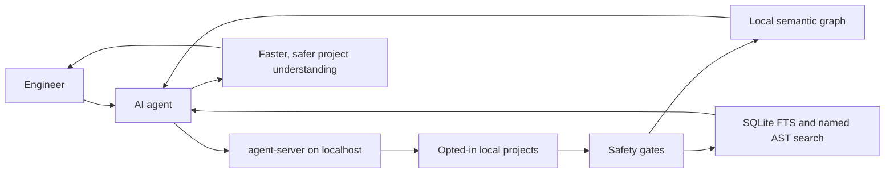

# Business Overview

Status: Current local capability summary
Date: 2026-05-30
Classification: Internal; PII-prohibited

`agent-server` is a local context and control service for engineers using AI agents. It gives agents a governed way to discover, search, navigate, inspect git state, and apply exact edits in approved local codebases without sending source code to external providers and without broad ad hoc filesystem scans.

## Value

What exists now:

- Local project registry with ignored TOML config and root-path redaction.
- Metadata-only digest mode for projects that should not store source chunks.
- Opt-in content graph ingestion for eligible local source after path, symlink, include/exclude, size, binary, UTF-8, and sensitive-marker gates.
- Live ingestion as the freshness path, with startup recovery for interrupted local runs.
- Governed SQLite FTS-backed text, file, symbol, reference, and call search.
- Bounded file chunks, outlines, symbol source, references, callers, callees, and call graph traversal.
- Named AST structural search for supported languages through a safe query catalog.
- Governed workspace status/diff/read/edit tools for opted-in `content_graph` projects, with opaque edit tokens and path ingestion after successful edits.
- REST and MCP contracts for local scripts and agent clients.

## Business Boundary

This is not a public SaaS service, production data plane, provider-backed research crawler, embedding/vector store, or raw database browser. It is an engineer-local service running on loopback.

The current boundary blocks public exposure, auth model changes, provider calls, crawling, embeddings, vectors, arbitrary shell endpoints, raw patch uploads, git commit/push/checkout/reset/branch/merge/rebase/stash/clean/restore tools, raw database queries, raw FTS syntax, raw Tree-sitter query syntax, skipped sensitive content, secrets, PII, raw prompts, provider payloads, local roots, content hashes in public responses, and raw parser/SQLite/FTS/Tree-sitter errors.

## Operating Model

Agents should use MiviaLabs MCP first for indexed project context and opted-in workspace operations: project discovery, ingestion state, file discovery, chunks, search, symbols, references, calls, source, call graph, named AST search, governed git status/diff, current file read, and exact edits. Shell remains required for tests, builds, logs, process control, arbitrary commands, generated-file verification, and non-opted-in repositories. Serena remains a fallback for edit-time semantic gaps when MCP is unavailable, stale, missing the project, or lacks the needed operation.
