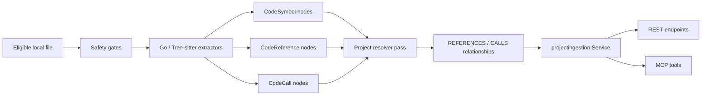
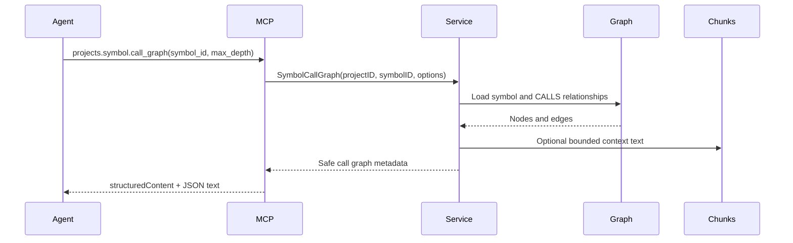

# Add Semantic References, Call Graph, And Symbol Source

| Field | Value |
| --- | --- |
| Ticket | N/A - free-text plan |
| Type | Free-text |
| Status | Draft |
| Author | plan-task skill |
| Date | 2026-05-30 |
| Classification | Internal; PII-prohibited |
| Owners | Mivia local mivia-server owner |
| Linked Epic | N/A |

## 1. Context

Current MCP content graph ingestion stores eligible chunks and symbol metadata, then exposes files, chunks, symbols, headings, outlines, async ingestion status, and latest ingestion status. Source anchors: `internal/projectingestion/query.go:93`, `internal/projectingestion/query.go:127`, `internal/projectingestion/graph_store.go:107`, `internal/projectingestion/graph_store.go:427`, `internal/projectregistry/mcpapi/mcpapi.go:259`. The existing AST layer extracts declarations and line ranges, but does not model symbol references, call edges, caller/callee traversal, or symbol body source retrieval. The agent guide still routes caller/edit-location understanding to Serena first, which is correct for the current implementation but not the target capability for Mivia MCP. Source anchor: `docs/agent-context-guide.md:42`.

## 2. Problem statement

Mivia MCP is useful for orientation, but still not Principal-level semantic navigation: an agent can find symbols and chunks, but cannot ask "who calls this?", "what does this call?", "where is this referenced?", or "give me this symbol body with bounded source text" through MCP.

## 3. Goals

- Add indexed symbol source ranges and bounded symbol source retrieval for eligible files.
- Add indexed references and call edges for promoted AST languages.
- Add MCP and REST tools for references, callers, callees, and call graph traversal.
- Preserve localhost-only, content-graph opt-in, skipped-sensitive, and no-raw-root boundaries.
- Keep Serena useful for deeper edit-time semantic precision, but remove it as the only way to answer common reference/call-site questions.

## 4. Non-goals

- No provider calls.
- No embeddings, vectors, or semantic search.
- No public exposure or auth changes.
- No raw DB query endpoint.
- No full LSP replacement in this phase.
- No guaranteed whole-program type resolution across all dynamic language cases.

## 5. Acceptance criteria

Derived - confirm with reporter.

- [ ] AC-1: `projects.symbol.source` returns bounded eligible source text for a symbol by `symbol_id`.
- [ ] AC-2: `projects.symbol.references` returns bounded reference metadata for a symbol by `symbol_id`.
- [ ] AC-3: `projects.symbol.callers` and `projects.symbol.callees` return bounded direct call edges.
- [ ] AC-4: `projects.symbol.call_graph` returns bounded depth-limited graph traversal with `direction`, `max_depth`, and `max_nodes`.
- [ ] AC-5: REST equivalents exist under `/api/v1/projects/{id}/symbols/{symbol_id}/...`.
- [ ] AC-6: Go and Python have tested symbol source, references, and direct call extraction.
- [ ] AC-7: JS/TS/TSX/C# either have tested extraction or explicit `unsupported_language` / `unresolved` confidence metadata.
- [ ] AC-8: skipped sensitive files, matched sensitive text, absolute roots, raw local config, secrets, PII, raw prompts, and provider payloads are not returned.
- [ ] AC-9: stale graph edges are removed when a file is reingested, skipped, absent, or deleted.

## 6. Constraints

- Local-only: REST/MCP remain loopback/default local; no public exposure. Source: `.ai/rules/30-docker-data.md`, `docs/adr/0003-mivia-server-rest-and-mcp-boundary.md:50`.
- Privacy: no PII ingestion without separate approval. Source: `.ai/rules/10-security-privacy.md`.
- Source exception: eligible local source may be stored only for opted-in `content_graph` projects after safety gates. Source: `docs/adr/0007-content-graph-ingestion-and-live-updates.md:21`.
- Permanent prohibitions: no skipped sensitive content, matched sensitive-marker text, secrets, PII, raw prompts, provider payloads, absolute roots, crawling, vectors, or raw DB query endpoint. Source: `docs/adr/0007-content-graph-ingestion-and-live-updates.md:36`.
- Existing graph writes are Ladybug nodes/relationships, not raw DB queries. Source: `internal/platform/ladybug/ladybug.go:39`.
- Existing derived file nodes are deleted on reingest for `CodeSymbol`, `DocumentHeading`, `ContentChunk`, and `FileVersion`; new reference/call nodes must join this cleanup path. Source: `internal/projectingestion/graph_store.go:564`.
- MCP tool schemas use `additionalProperties: false`. Source: `internal/projectregistry/mcpapi/mcpapi.go:532`.

## 7. Architecture / data flow



Extraction records declarations, source spans, reference occurrences, and call occurrences. Resolution links occurrences to target symbols when confidence is high; unresolved occurrences remain queryable with `resolution_status`.

## 8. User flow

_Not applicable - backend/local agent tooling change._

## 9. Sequence



## 10. Detailed implementation plan

1. **Domain model** - edit `internal/projectingestion/model.go`:
   - Add byte/column fields to `Symbol`: `StartByte`, `EndByte`, `StartColumn`, `EndColumn`.
   - Add `Reference` with `Kind`, `Name`, `TargetName`, `PackageName`, `Receiver`, `ImportPath`, `EnclosingSymbolName`, `StartLine`, `EndLine`, `StartByte`, `EndByte`, `ResolutionStatus`.
   - Add `Call` with caller/callee candidate fields and the same source span metadata.
   - Keep raw text out of these structs; source text is retrieved from eligible chunks when explicitly requested.
2. **Extractor contract** - edit `internal/projectingestion/extractor.go`:
   - Extend `ExtractorResult` with `References []Reference` and `Calls []Call`.
   - Keep `Symbols` and `Headings` backward-compatible.
   - Validate that existing extractors returning only symbols/headings still compile.
3. **Go extractor** - edit `internal/projectingestion/parser_go.go`:
   - Replace `ParseGoFile(...) ([]Symbol, error)` with a richer result function, or add `ParseGoFileSemantic(...)`.
   - Use `go/parser` + `ast.Inspect` to extract declarations with byte offsets from `token.FileSet`, identifier references, selector references, direct calls from `*ast.CallExpr`, and enclosing function/method for caller context.
   - Preserve current symbol extraction behavior pinned by `internal/projectingestion/parser_go_test.go`.
4. **Tree-sitter extractor** - edit `internal/projectingestion/treesitter_extractor.go` and query files under `internal/projectingestion/queries/`:
   - Add language-specific captures for calls and identifier references.
   - Start with Python because it was just promoted and is high value.
   - Add JS/TS/TSX/C# direct-call captures where grammar support is clear.
   - Mark unresolved or ambiguous references with `resolution_status = "unresolved"` rather than guessing.
5. **Graph schema** - edit `internal/platform/ladybug/schema/schema.go`:
   - Add node labels `CodeReference` and `CodeCall`.
   - Add relationships:
     - `SYMBOL_HAS_REFERENCE` from `CodeSymbol` to `CodeReference`.
     - `REFERENCE_IN_CHUNK` from `CodeReference` to `ContentChunk`.
     - `SYMBOL_CALLS_SYMBOL` from `CodeSymbol` to `CodeSymbol`.
     - `SYMBOL_REFERENCES_SYMBOL` from `CodeSymbol` to `CodeSymbol`.
     - `CALL_IN_CHUNK` from `CodeCall` to `ContentChunk`.
6. **Graph interface** - edit `internal/platform/ladybug/ladybug.go` and `internal/platform/ladybug/persistent.go`:
   - Add `ListRelationships(ctx, relationshipType string, filter RelationshipFilter)` or narrower helper methods.
   - Implement for memory and persistent graph.
   - Ensure persistent journal replay handles new relationship queries without schema drift.
7. **Graph writes** - edit `internal/projectingestion/graph_store.go`:
   - Change `PutEligibleFile(...)` to accept references and calls.
   - Store `CodeReference` and `CodeCall` nodes with only safe metadata.
   - Link references/calls to containing chunks.
   - Add resolver pass to link source symbol to target symbol when confidence is high.
   - Extend `deleteDerivedFileNodes` to delete `CodeReference` and `CodeCall`.
8. **Query DTOs** - edit `internal/projectingestion/query.go`:
   - Add `SymbolSourceOptions`, `ReferenceFilter`, `CallGraphOptions`.
   - Add response types:
     - `SymbolSource`
     - `SymbolReferenceMetadata`
     - `SymbolReferenceList`
     - `SymbolCallEdge`
     - `SymbolCallGraph`
   - Include optional bounded `context_text` only when requested and capped.
9. **Service API** - edit `internal/projectingestion/service.go`:
   - Add methods:
     - `GetSymbolSource`
     - `ListSymbolReferences`
     - `ListSymbolCallers`
     - `ListSymbolCallees`
     - `GetSymbolCallGraph`
   - Validate `symbol_id` as opaque.
   - Validate `max_depth`, `max_nodes`, `page_size`, and text caps.
   - Enforce project namespace prefix as `GetFileOutline` already does for file IDs.
10. **REST API** - edit `internal/projectregistry/httpapi/httpapi.go`:
    - Add routes:
      - `GET /api/v1/projects/{id}/symbols/{symbol_id}/source`
      - `GET /api/v1/projects/{id}/symbols/{symbol_id}/references`
      - `GET /api/v1/projects/{id}/symbols/{symbol_id}/callers`
      - `GET /api/v1/projects/{id}/symbols/{symbol_id}/callees`
      - `GET /api/v1/projects/{id}/symbols/{symbol_id}/call-graph`
    - Reuse existing error mapping and pagination helpers.
11. **MCP tools** - edit `internal/projectregistry/mcpapi/mcpapi.go`:
    - Add:
      - `projects.symbol.source`
      - `projects.symbol.references`
      - `projects.symbol.callers`
      - `projects.symbol.callees`
      - `projects.symbol.call_graph`
    - Support underscore aliases.
    - Keep input schemas closed.
12. **Top-level MCP routing** - edit `internal/agentcontrol/mcpapi/mcpapi.go`:
    - Route the new project MCP tool names through the project MCP dispatcher.
    - Add regression tests like the latest-status routing test.
13. **Contracts** - edit `api/openapi/agent-control.v1.yaml` and `api/mcp/agent-control.v1.md`:
    - Document REST paths, query params, MCP schemas, response shapes, caps, and privacy guarantees.
14. **Docs and skill** - update:
    - `.ai/skills/mivia-mcp/SKILL.md`
    - `README.md`
    - `docs/agent-context-guide.md`
    - `docs/configuration/local-projects.md`
    - `docs/runbooks/local-dev.md`
    - `docs/architecture/system-architecture.md`
    - Explain that MCP can now answer common references/call graph questions, while Serena remains better for live edit-time semantic work.
15. **Tests** - see section 13.

## 11. Data model changes

Add Ladybug labels and relationships only. No SQLite schema migration is required unless extractor cache entries need version invalidation; if so, bump extractor versions, do not mutate existing rows destructively.

Pseudo-schema:

```text
Node CodeReference:
  id, project_id, repo_file_id, file_version_id,
  kind, name, target_name, package, receiver, import_path,
  enclosing_symbol_id, enclosing_symbol_name,
  start_line, end_line, start_byte, end_byte,
  resolution_status, confidence

Node CodeCall:
  id, project_id, repo_file_id, file_version_id,
  caller_symbol_id, caller_name, callee_name,
  receiver, import_path,
  start_line, end_line, start_byte, end_byte,
  resolution_status, confidence

Relationship SYMBOL_REFERENCES_SYMBOL:
  from CodeSymbol to CodeSymbol

Relationship SYMBOL_CALLS_SYMBOL:
  from CodeSymbol to CodeSymbol
```

## 12. Contract / API changes

Additive only.

- OpenAPI: add five symbol semantic endpoints.
- MCP: add five project tools.
- Query DTOs: add new response structs; do not break existing `SymbolMetadata`, `FileOutline`, or chunk APIs.
- Error behavior: unresolved references are valid data, not API errors.

## 13. Testing strategy

- **Unit:** `internal/projectingestion/parser_go_test.go` for Go refs/calls/source spans.
- **Unit:** `internal/projectingestion/treesitter_javascript_test.go` for Python and JS/TS direct-call captures.
- **Service:** `internal/projectingestion/service_test.go` for references, callers, callees, graph traversal, stale edge deletion, and bounded source.
- **REST:** `internal/projectregistry/httpapi/httpapi_test.go` for new endpoints and privacy assertions.
- **MCP:** `internal/projectregistry/mcpapi/mcpapi_test.go` for new tools.
- **Top-level MCP:** `internal/agentcontrol/mcpapi/mcpapi_test.go` for routing.
- **Privacy:** skipped sensitive fixture must not return references, calls, source text, matched sensitive text, raw roots, raw errors, or content hashes.
- **Full:** run the existing requested package bundle and `go test ./...`.

## 14. Observability

- **Logs:** no raw source, no references text, no symbol body text.
- **Metrics:** not required unless existing metrics framework appears before implementation.
- **Traces:** none.
- **Status:** ingestion counts may add `references_stored` and `calls_stored` if run metadata is extended; do not expose paths or text in status.

## 15. Documentation updates

- `.ai/skills/mivia-mcp/SKILL.md`
- `README.md`
- `api/mcp/agent-control.v1.md`
- `api/openapi/agent-control.v1.yaml`
- `docs/agent-context-guide.md`
- `docs/architecture/system-architecture.md`
- `docs/configuration/local-projects.md`
- `docs/runbooks/local-dev.md`

## 16. Rollout / migration

- Additive code path only.
- Bump extractor versions so projects rebuild semantic metadata on next ingestion.
- Existing indexed projects keep working; new reference/call data appears after reingestion.
- Rollback is forward fix: disable new tools or ignore new nodes; no destructive graph reset.
- Local users can force reset by deleting ignored local datastore files, consistent with ADR-0007.

## 17. Security, privacy, compliance

- **PII surfaces touched:** eligible local source text only; PII remains prohibited.
- **Vault interactions:** none.
- **PDPL / NCA-ECC / SAMA / ZATCA / TGA touchpoints:** none beyond existing PII-prohibited local boundary.
- **AuthN / AuthZ changes:** none.
- **Data residency:** local workstation only.
- **Hard privacy floor:** no skipped sensitive content, matched sensitive text, roots, raw local config, secrets, PII, raw prompts, provider payloads, or raw DB query endpoint.

## 18. Risks and mitigations

| Risk | Likelihood | Impact | Mitigation |
| --- | --- | --- | --- |
| Dynamic-language resolution is incomplete | High | Medium | Return `resolution_status` and confidence; do not fake precision |
| Graph traversal gets too large | Medium | High | Require `max_depth`, `max_nodes`, pagination, and defaults |
| Source text leakage from skipped/sensitive files | Low | High | Only derive text from existing eligible chunks; add privacy tests |
| Stale edges after reingest | Medium | High | Extend derived-node cleanup and add reingest regression tests |
| Relationship querying grows graph API too broadly | Medium | Medium | Add constrained relationship listing, not raw query endpoint |
| Tool output too large for agents | Medium | Medium | Default no context text; bounded optional context only |

## 19. Out of scope

- Public remote MCP.
- Auth changes.
- Provider calls.
- Embeddings/vectors.
- External crawling.
- Production deployment.
- Raw AST dumps.
- Raw LadybugDB/SQLite query access.
- Whole-program compiler-grade type checking.

## 20. Open questions

- Owner: Mac - Should Phase 1 cover Go + Python only, or all promoted Tree-sitter languages in one pass?
- Owner: Mac - Should call graph default direction be `callees`, `callers`, or require explicit direction?
- Owner: Mac - Should symbol source return complete symbol bodies by default when under cap, or require `include_text=true`?
- Owner: Mac - Should unresolved references be exposed in the same tool as resolved references or behind `include_unresolved=true`?

## 21. References

- **Jira:** not checked by repo constraint.
- **Confluence:** not checked by repo constraint.
- **In-repo docs:**
  - `.ai/INDEX.md` - tool routing and source-of-truth rules.
  - `.ai/rules/00-operating-doctrine.md` - phase and verification discipline.
  - `.ai/rules/05-external-systems.md` - no Jira/Confluence.
  - `.ai/rules/10-security-privacy.md` - privacy boundary.
  - `.ai/rules/20-go-service-standards.md` - REST/MCP and Go service standards.
  - `.ai/rules/30-docker-data.md` - local database and HTTP constraints.
  - `docs/agent-context-guide.md:42` - current Serena vs MCP routing.
  - `docs/agent-context-guide.md:120` - prohibited exposures.
  - `docs/architecture/system-architecture.md:172` - security architecture boundary.
  - `docs/configuration/local-projects.md:149` - current MCP tool list.
- **ADRs:**
  - `docs/adr/0003-mivia-server-rest-and-mcp-boundary.md:50`
  - `docs/adr/0007-content-graph-ingestion-and-live-updates.md:21`
- **Policies:** `.ai/rules/10-security-privacy.md`, `.ai/rules/30-docker-data.md`.
- **Catalog entries:** none present/relevant in this repo scan.
- **Source anchors:**
  - `internal/projectingestion/model.go:79`
  - `internal/projectingestion/model.go:92`
  - `internal/projectingestion/model.go:109`
  - `internal/projectingestion/query.go:93`
  - `internal/projectingestion/query.go:127`
  - `internal/projectingestion/extractor.go:20`
  - `internal/projectingestion/extractor.go:43`
  - `internal/projectingestion/parser_go.go:14`
  - `internal/projectingestion/treesitter_extractor.go:152`
  - `internal/projectingestion/graph_store.go:34`
  - `internal/projectingestion/graph_store.go:81`
  - `internal/projectingestion/graph_store.go:107`
  - `internal/projectingestion/graph_store.go:427`
  - `internal/projectingestion/graph_store.go:564`
  - `internal/platform/ladybug/ladybug.go:39`
  - `internal/platform/ladybug/schema/schema.go:15`
  - `internal/projectingestion/service.go:44`
  - `internal/projectregistry/httpapi/httpapi.go:20`
  - `internal/projectregistry/mcpapi/mcpapi.go:259`
  - `internal/agentcontrol/mcpapi/mcpapi.go:157`

## 22. Confidence notes

High confidence on the current gap: source shows symbols/chunks/outlines exist, while no reference/call graph DTOs, graph labels, REST routes, or MCP tools exist. Medium confidence on Tree-sitter coverage breadth because each grammar needs language-specific call/reference captures and tests. Serena semantic discovery failed with `SolidLSPException ... no views (0)`, so source grounding used WSL shell reads instead of Serena symbol tools.
