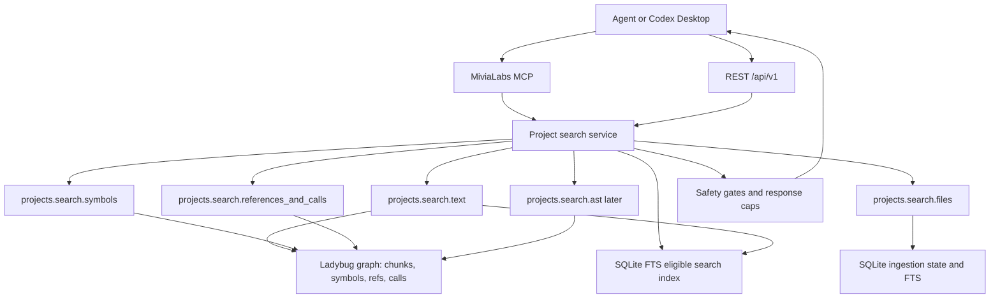

# Project Search And Embedded AST Search Plan

Status: Phase 1 implemented; Phase 2/3 implementation-ready
Date: 2026-05-30
Classification: Internal; PII-prohibited
Mode: Free-text plan; no Jira or Confluence used by repository constraint.

## 1. Intent

Agents should not need Serena `search_for_pattern` for routine project discovery. Add governed MiviaLabs MCP/REST search tools over indexed project content first, then add a SQLite FTS-backed search index for scale, then add embedded AST structural search for supported languages so `ast-grep` is no longer required for read-only structural discovery.

Priority order:

1. Project search quick wins: text search, symbol search, file search, reference/call search, bounded snippets, REST/MCP docs, privacy tests.
2. Agent workflow updates: README, MCP skill guidance, OpenAPI/MCP docs, examples that route pattern-search use cases to MiviaLabs MCP first.
3. SQLite FTS search backend: maintain a full eligible search index from ingestion and route text, file, symbol, reference, and call discovery through it under the same governance caps.
4. Embedded AST structural search: Tree-sitter query powered search for supported parser languages; Go support requires an embedded Go grammar or a separate Go AST query layer.
5. `ast-grep` replacement boundary: read-only structural search only at first; codemods/rewrites remain out of scope until explicitly designed.

## 2. Current State Evidence

Code-grounded facts:

- `internal/projectingestion.Service` exposes project files, chunks, symbols, symbol source, references, callers, callees, call graph, and Phase 1 search methods: `SearchText`, `SearchFiles`, `SearchSymbols`, `SearchReferences`, and `SearchCalls`.
- `internal/projectingestion.GraphStore.ListSymbols` supports exact kind, file ID, package, extension, name prefix, name contains, receiver, and case-sensitive contains matching while preserving existing `name_prefix` behavior.
- `ContentChunk` graph nodes store bounded eligible chunk text; Phase 1 cross-file text search scans those eligible chunks and returns capped snippets.
- `CodeReference` and `CodeCall` nodes are searchable by name/target/caller/callee metadata when the agent does not yet know a symbol ID.
- REST routes exist under `internal/projectregistry/httpapi` for files, chunks, symbols, symbol source, references, callers, callees, call graph, and `/api/v1/projects/{id}/search/...`.
- MCP tool routing exists under `internal/projectregistry/mcpapi` for matching project tools, including dotted and underscore-normalized search tools.
- OpenAPI and MCP contracts document project file/chunk/symbol/call graph and Phase 1 search capabilities.
- Existing extractor support: Go stdlib AST for Go; Tree-sitter for JavaScript, TypeScript, TSX/JSX, C#, and Python; Markdown heading extraction; lightweight infrastructure/config extraction.
- `go.mod` already includes `github.com/tree-sitter/go-tree-sitter`, `tree-sitter-c-sharp`, `tree-sitter-javascript`, `tree-sitter-python`, and `tree-sitter-typescript`. It does not currently include a Go Tree-sitter grammar.

Library-grounded facts:

- Tree-sitter queries support capture-based matching, predicates such as `#eq?`, `#match?`, `#any-of?`, and match/capture structures with node spans. This is enough for an embedded read-only structural search API with safe span/snippet output.

## 3. Non-Goals

- No public exposure.
- No auth changes.
- No provider calls.
- No embeddings or vectors.
- No crawling.
- No raw DB query endpoint.
- No broad arbitrary filesystem search outside opted-in indexed projects.
- No source text for skipped, denied, sensitive, absent, or unindexed files.
- No matched sensitive text, secrets, PII, raw prompts, provider payloads, absolute roots, raw local config, or raw datastore errors in responses.
- No codemod/rewrite engine in the first AST phase.
- No claim that `ast-grep` is fully replaced until structural queries cover the needed supported-language cases and tests prove parity for read-only discovery.

## 4. Proposed Capability Map



## 5. Phase 1: Governed Project Search Quick Wins

### 5.1 Add Search DTOs

Add project search models in `internal/projectingestion`:

- `TextSearchOptions`
  - `Query string`
  - `Mode string`: initially `literal`; optional `regexp` only if RE2 validation and caps are implemented.
  - `CaseSensitive bool`
  - `Extension string`
  - `PathPrefix string`
  - `PageSize int`
  - `PageToken string`
  - `MaxSnippetBytes int`
  - `MaxMatches int`
- `TextSearchResult`
  - `File FileMetadata`
  - `Chunk ChunkMetadata` without full unbounded text
  - `LineStart`, `LineEnd`, `ByteStart`, `ByteEnd`
  - `Snippet string`
  - `SnippetTruncated bool`
- `SymbolSearchOptions`
  - existing `SymbolFilter` fields plus `NameContains`, `Receiver`, `CaseSensitive`
- `ReferenceSearchOptions`
  - `NameContains`, `TargetNameContains`, `CallerNameContains`, `CalleeNameContains`, `Extension`, `PathPrefix`, `ResolutionStatus`, `Confidence`, pagination
- `FileSearchOptions`
  - existing `FileStateFilter` fields plus `PathContains`, `CaseSensitive`

Use existing `Pagination`, `NormalizeFileExtension`, `NormalizePathPrefix`, opaque ID validation, and max page-size limits.

### 5.2 Add Service Methods

Add to `projectingestion.API` and implementations:

- `SearchText(ctx, projectID string, options TextSearchOptions) (TextSearchResultList, error)`
- `SearchSymbols(ctx, projectID string, options SymbolSearchOptions) (SymbolList, error)`
- `SearchReferences(ctx, projectID string, options ReferenceSearchOptions) (SymbolReferenceList, error)`
- `SearchCalls(ctx, projectID string, options ReferenceSearchOptions) (SymbolCallEdgeList, error)`
- `SearchFiles(ctx, projectID string, options FileSearchOptions) (FileList, error)`

Implementation constraints:

- Search only `ContentChunk` nodes for text and only chunks belonging to eligible indexed file versions.
- Return snippets, not entire chunks, unless existing chunk caps explicitly permit the bounded text.
- For literal search, use safe substring matching with case-folding only when requested.
- For regexp search, if included, use Go RE2 only; reject invalid patterns with sanitized `ErrInvalidInput`, cap pattern length, cap matches, and cap snippet bytes.
- Do not scan skipped sensitive content because it is not stored in chunks.
- Do not expose graph internals, root paths, raw DB errors, or local config values.
- Keep pagination stable by deterministic sort: relative path, chunk index, byte offset, opaque ID.

### 5.3 Add REST Endpoints

Add under `/api/v1/projects/{id}/search/...`:

- `GET /api/v1/projects/{id}/search/text`
- `GET /api/v1/projects/{id}/search/files`
- `GET /api/v1/projects/{id}/search/symbols`
- `GET /api/v1/projects/{id}/search/references`
- `GET /api/v1/projects/{id}/search/calls`

Use query parameters only. Do not add a raw query body endpoint.

### 5.4 Add MCP Tools

Add tools:

- `projects.search.text`
- `projects.search.files`
- `projects.search.symbols`
- `projects.search.references`
- `projects.search.calls`

Codex will expose underscore variants such as `projects_search_text`.

Tool descriptions must state:

- Results are from eligible indexed content only.
- Search is bounded and may be stale until ingestion catches up.
- Source snippets are capped.
- Skipped sensitive files and matched sensitive text are never returned.

### 5.5 Add OpenAPI, MCP, README, Skill Guidance

Update:

- `api/openapi/agent-control.v1.yaml`
- `api/mcp/agent-control.v1.md`
- `README.md`
- `docs/agent-context-guide.md`
- `docs/architecture/system-architecture.md`
- `.ai/skills/mivialabs-agent-mcp/SKILL.md`

Guidance should say:

1. Use MiviaLabs MCP search first for indexed project text/symbol/reference/call discovery.
2. Treat live ingestion as the freshness path for edited files and check ingestion status when results look unexpected.
3. Use Serena for LSP/editor-aware symbol navigation and edits.
4. Use `ast-grep` only for structural search not yet covered by embedded AST search or for rewrite/codemod tasks.

## 6. Phase 2: Search Freshness And Diagnostics

Add search response metadata:

- `ingestion_run_id`
- `indexed_at` or latest completed/running run timestamps when available
- `index_status`: `completed`, `running`, `stale`, or `unknown`
- `result_truncated`
- `scanned_count` only as a count, never raw paths/content

Add MCP guidance:

- If results are empty and latest ingestion is running, check `projects.ingestion_status_latest` before assuming no matches.
- If current working-tree edits matter, trust live ingestion as the normal update path and poll latest ingestion status before assuming no matches.

Keep this phase narrow if Phase 3 starts immediately:

- Add `result_truncated` and `scanned_count` to graph-backed search responses.
- Preserve the existing `index` metadata shape so the FTS phase can reuse it.
- Do not add broad alternate search tools or raw diagnostics endpoints.

## 7. Phase 3: SQLite FTS Search Backend

### 7.1 FTS Intent

Replace graph-backed search scans with a bounded SQLite FTS-backed search index over eligible indexed content and metadata so large projects can use all `projects.search.*` tools without full graph node scans.

Do not change the public REST/MCP contract unless a new metadata field is needed. Existing tools should keep the same privacy and pagination behavior:

- `projects.search.text`
- `projects.search.files`
- `projects.search.symbols`
- `projects.search.references`
- `projects.search.calls`

### 7.2 FTS Storage Contract

Add local SQLite tables for eligible search documents only:

- `project_search_chunks_fts`: FTS5 virtual table over eligible chunk text.
- `project_search_files_fts`: FTS5 virtual table over safe eligible relative paths, extensions, and file-level searchable metadata.
- `project_search_symbols_fts`: FTS5 virtual table over symbol names, kind, package, receiver, import path, extension, and safe relative path.
- `project_search_references_fts`: FTS5 virtual table over reference name, target name, enclosing symbol name, resolution status, confidence, extension, and safe relative path.
- `project_search_calls_fts`: FTS5 virtual table over caller name, callee name, receiver, import path, resolution status, confidence, extension, and safe relative path.
- Metadata side tables keyed by stable opaque IDs and file/version identity as needed for deterministic ordering, invalidation, joins, snippets, and public response reconstruction.

Constraints:

- Store only content and metadata already allowed in existing Phase 1 responses.
- Store chunk text only for eligible chunks that already pass content graph safety gates.
- Never store skipped, denied, sensitive, absent, or unindexed file content.
- Never store absolute roots, local config values, raw prompts, provider payloads, PII, credentials, tokens, or raw parser/query errors.
- Use idempotent bootstrap SQL.
- Delete all FTS rows for a file when it becomes skipped, denied, sensitive, absent, deleted, or re-ingested with a new version.

### 7.3 Ingestion Integration

Update ingestion writes so eligible file, chunk, symbol, reference, and call storage updates both graph and FTS in the same logical file ingestion path:

- On eligible file ingest: upsert file metadata, chunk metadata/text, symbol metadata, reference metadata, and call metadata into FTS after safety gates pass and extractor output is available.
- On skipped/absent/tombstoned files: remove FTS rows for that `project_id` and `file_id`.
- On full-scan stale tombstones: remove FTS rows with the file state cleanup path.
- Keep extractor cache behavior unchanged.

If graph writes and SQLite FTS writes cannot be in one transaction, make the operation idempotent and safe to repair by re-ingestion. Do not introduce destructive reset flows.

### 7.4 Query Contract

Use SQLite FTS5 only behind the existing service methods:

- `SearchText`
- `SearchFiles`
- `SearchSymbols`
- `SearchReferences`
- `SearchCalls`
- Literal text search remains the first supported mode.
- Metadata contains/prefix search should use FTS-backed indexed columns where useful, with exact filters still applied deterministically after candidate selection when needed.
- Prefer phrase/term escaping over exposing raw FTS query syntax.
- Sanitize invalid FTS input as `ErrInvalidInput` without raw SQLite query details.
- Preserve deterministic order: relative path, chunk index, byte offset, opaque ID.
- Preserve caps: page size, match count, snippet bytes, total response size.
- Return snippets generated from stored eligible chunk text under the existing snippet cap.
- Keep graph fallback only if FTS is unavailable in tests or during migration, and make fallback explicit in code comments/tests. The completed Phase 3 target is FTS-backed behavior for all five search tools.

### 7.5 FTS Tests

Add focused tests for:

- FTS returns the same response shape as Phase 1 graph-backed text, file, symbol, reference, and call search.
- Large-ish fixtures prove search does not iterate all graph chunks/symbols/references/calls for normal search.
- Re-ingestion updates changed chunk text and metadata and removes stale FTS rows.
- Eligible-to-skipped, skipped-to-eligible, absent/deleted, denied path, and sensitive content transitions update FTS correctly.
- Literal escaping prevents raw FTS query injection and returns sanitized validation errors.
- Snippet, match, pagination, exact filters, contains filters, and result caps still hold.
- Responses do not leak roots, content hashes, secrets, PII, raw prompts, provider payloads, skipped sensitive text, raw SQLite errors, or raw FTS query strings.

## 8. Phase 4: Embedded AST Structural Search

### 8.1 Pre-Hardening Checkpoint

Before adding `projects.search.ast`, verify Phase 3 behavior against a real large TypeScript/C# project after deploy/restart and re-ingestion:

- Confirm `projects.symbol.source` returns bounded source for representative Go, Python, JavaScript, TypeScript, TSX/JSX, C#, and line-only infra/config symbols.
- Confirm `projects.search.calls`, `projects.symbol.callers`, and `projects.symbol.callees` return expected call edges for TypeScript and C# fixtures from the real project.
- Confirm `projects.file.chunks` still returns bounded eligible chunk text for the same files.
- Confirm `projects.digest` accepts the documented project identifier shape and is not blocked by active ingestion unless the request itself is invalid.
- Confirm search metadata reports current ingestion/index status without leaking roots, content hashes, skipped sensitive text, raw parser errors, raw SQLite/FTS errors, secrets, PII, raw prompts, or provider payloads.
- If any discrepancy appears, fix extractor/indexing behavior before exposing the AST search surface.

### 8.2 Structural Search Contract

Add `projects.search.ast` only after Phase 1 is stable and Phase 3 FTS does not need public contract changes.

Inputs:

- `id`
- `language`: `go`, `python`, `javascript`, `typescript`, `tsx`, `jsx`, `csharp`
- `query`: Tree-sitter query text or a constrained named-query ID
- `captures`: optional capture-name allowlist
- `extension`, `path_prefix`, pagination
- `max_matches`, `max_snippet_bytes`

Outputs:

- file metadata
- match span: lines, bytes, columns
- capture name
- optional bounded snippet from eligible indexed chunk text
- `query_language`
- `query_version`
- `result_truncated`

### 8.3 Query Safety

Validation:

- Reject empty query.
- Cap query bytes.
- Compile query before execution and return sanitized errors.
- Cap files scanned, matches returned, captures returned, snippet bytes, and total response bytes.
- Allow only language IDs backed by embedded parser registry.
- Do not support arbitrary shell commands, external `ast-grep`, or filesystem traversal.

Privacy:

- Execute only against eligible indexed files.
- Snippets must come from eligible chunks and obey source caps.
- Do not return raw parser errors that include absolute paths or source text.
- Do not query skipped/sensitive/absent files.

### 8.4 Parser Support

Supported immediately from existing dependencies:

- Python: Tree-sitter parser already present.
- JavaScript/JSX: Tree-sitter JavaScript parser already present.
- TypeScript/TSX: Tree-sitter TypeScript parser already present.
- C#: Tree-sitter C# parser already present.

Go decision:

- Current Go extraction uses the Go stdlib AST, not Tree-sitter.
- To replace `ast-grep` for Go structural search, add an embedded Go Tree-sitter grammar for structural search only, or build a separate Go AST predicate/query layer.
- Recommended: add Tree-sitter Go grammar for structural search, while keeping stdlib AST extraction as-is until there is a separate reason to migrate extractor behavior.

### 8.5 Named Query Catalog

Do not expose only raw query text. Add a curated query catalog for common agent tasks:

- function/method declarations
- class/type declarations
- call expressions
- imports/requires
- decorators/annotations
- error handling branches
- test functions/classes
- assignments to identifiers

Each query entry should define:

- language
- query text
- expected captures
- tests with fixture code
- version

Raw Tree-sitter query input can be allowed later under stricter caps, but named queries should be the default MCP path.

## 9. Phase 5: Optional AST-Grep Parity Layer

Only after `projects.search.ast` is proven useful:

- Add compatibility aliases for common ast-grep-style intentions, not full syntax compatibility.
- Keep this read-only.
- Do not implement rewrites/codemods until there is a separate design covering patch generation, review, and rollback.

## 10. File-Level Work Plan

Expected files to touch in Phase 1:

- `internal/projectingestion/types.go` or equivalent model file: add search DTOs/results.
- `internal/projectingestion/service.go`: add API methods and validation.
- `internal/projectingestion/graph_store.go`: add graph-backed search methods over `ContentChunk`, `CodeSymbol`, `CodeReference`, and `CodeCall`.
- `internal/projectingestion/service_test.go`: service tests for text/symbol/reference/call search and privacy.
- `internal/projectregistry/httpapi/httpapi.go`: add REST routes and handlers.
- `internal/projectregistry/httpapi/httpapi_test.go`: REST tests.
- `internal/projectregistry/mcpapi/mcpapi.go`: add MCP tools, routing, schemas, and tool descriptions.
- `internal/projectregistry/mcpapi/mcpapi_test.go`: MCP tests.
- `internal/agentcontrol/mcpapi`: update top-level routing/tests if required.
- `api/openapi/agent-control.v1.yaml`: document REST search endpoints.
- `api/mcp/agent-control.v1.md`: document MCP search tools.
- `README.md`, `docs/agent-context-guide.md`, `docs/architecture/system-architecture.md`, `.ai/skills/mivialabs-agent-mcp/SKILL.md`: update guidance and diagrams.

Expected files to touch in Phase 3:

- `internal/projectingestion/sqlite_store.go`: add FTS bootstrap/query/update methods or a small dedicated search store if cleaner.
- `internal/projectingestion/service.go`: route `SearchText`, `SearchFiles`, `SearchSymbols`, `SearchReferences`, and `SearchCalls` through FTS-backed query while preserving validation and caps.
- `internal/projectingestion/graph_store.go`: keep graph fallback or remove graph search scans only if tests prove FTS covers all required paths.
- `internal/projectingestion/service_test.go`: FTS search behavior, privacy, stale-row cleanup, and transition tests.
- `internal/platform/sqlite/schema` or existing schema bootstrap files: add idempotent FTS5 schema.
- `internal/projectregistry/httpapi/httpapi_test.go`, `internal/projectregistry/mcpapi/mcpapi_test.go`, `internal/agentcontrol/mcpapi/mcpapi_test.go`: verify existing REST/MCP tools still return the same bounded shape.
- `api/openapi/agent-control.v1.yaml`, `api/mcp/agent-control.v1.md`, `README.md`, `docs/agent-context-guide.md`, `.ai/skills/mivialabs-agent-mcp/SKILL.md`: update only if response metadata or guidance changes.

Expected files to touch in Phase 4:

- `internal/projectingestion/treesitter_search.go`: parser/query execution service.
- `internal/projectingestion/treesitter_search_queries.go`: named query catalog.
- `internal/projectingestion/treesitter_search_test.go`: language fixtures and privacy tests.
- `go.mod`, `go.sum`: add Go Tree-sitter grammar if Go structural search is included.
- REST/MCP/OpenAPI/MCP docs: add `projects.search.ast`.

## 11. Tests

Phase 1 tests:

- Text search returns bounded snippets for eligible chunks.
- Text search does not return skipped sensitive files, denied paths, absent files, matched sensitive text, content hashes, roots, or raw errors.
- Text search respects extension, path prefix, pagination, match caps, and snippet caps.
- Symbol search supports substring and existing exact filters without breaking prefix behavior.
- Reference search finds target names without knowing symbol ID.
- Call search finds caller/callee names without knowing symbol ID.
- REST endpoints return correct status codes and sanitized validation errors.
- MCP tools return bounded JSON payloads and support underscore-normalized tool names.
- Search reports freshness/index-status metadata without leaking roots.

Phase 3 tests:

- FTS text search returns bounded snippets for eligible chunks.
- FTS text search excludes skipped sensitive files, denied paths, absent files, matched sensitive text, content hashes, roots, raw SQLite errors, and raw FTS query strings.
- FTS file search supports path contains/prefix/extension filters and excludes skipped, denied, sensitive, absent, and unsafe paths.
- FTS symbol search supports name contains, name prefix, kind, file ID, extension, package, receiver, case sensitivity, and deterministic pagination.
- FTS reference search supports name, target, enclosing symbol, extension, path prefix, resolution status, confidence, case sensitivity, and deterministic pagination.
- FTS call search supports caller, callee, name contains, extension, path prefix, resolution status, confidence, case sensitivity, and deterministic pagination.
- FTS rows are inserted, updated, and deleted on eligible re-ingest, eligible-to-skipped, skipped-to-eligible, absent/deleted, denied path, and sensitive-content transitions.
- Literal query escaping handles punctuation and FTS operator-like input without exposing raw FTS syntax.
- Existing REST and MCP search endpoints continue to pass without contract drift.

Phase 4 tests:

- Tree-sitter AST search finds named-query captures for Python, JS, TS, TSX, C#, and Go if Go grammar is added.
- Query compile errors are sanitized.
- Query caps stop large result sets.
- Captures include stable file IDs and spans.
- Snippets are bounded and only from eligible indexed chunks.
- Sensitive/skipped/denied/absent files never participate.
- MCP/REST AST tests cover supported language validation and unsupported language rejection.

## 12. Verification

Run focused tests first:

```sh
/home/mac/.local/go1.26.3/bin/go test ./internal/projectingestion
/home/mac/.local/go1.26.3/bin/go test ./internal/projectregistry/httpapi ./internal/projectregistry/mcpapi ./internal/agentcontrol/mcpapi
```

Then run:

```sh
/home/mac/.local/go1.26.3/bin/go test ./...
git diff --check
```

Before commit:

```sh
git status --short
git diff --stat
git diff --cached --stat
git diff --cached --check
```

Review diff explicitly for leaks:

- roots
- secrets
- PII
- raw prompts
- provider payloads
- skipped sensitive content
- matched sensitive text
- content hashes in public responses
- raw DB/query/parser errors

## 13. Risks

- Live ingestion must remain the freshness path for edited files. Mitigation: preserve ingestion-status metadata and test FTS update/delete behavior across file transitions.
- FTS can drift from graph state if writes fail midway. Mitigation: idempotent per-file upserts/deletes, repair by re-ingestion, and tests for stale-row cleanup.
- Raw FTS syntax can become an injection/error-leak surface. Mitigation: literal-only escaped queries first and sanitized `ErrInvalidInput` responses.
- Regex search can become expensive or leak raw validation detail. Mitigation: start with literal search; add RE2 regexp only with caps and sanitized errors.
- AST structural search can become a raw parser-query escape hatch. Mitigation: named query catalog first; raw query mode only with strict caps.
- Adding Tree-sitter Go grammar increases dependency surface. Mitigation: use it only for structural search and keep existing Go stdlib AST extraction unchanged.
- Replacing `ast-grep` for rewrites is a separate problem. Do not claim codemod parity.

## 14. Open Questions

1. Should Phase 1 include regexp search, or literal-only plus symbol/reference/call search first?
2. Should FTS expose `result_truncated` and `scanned_count` in Phase 3, or should those stay in Phase 2?
3. For AST search, should raw Tree-sitter query input be enabled initially, or should MCP expose only named query IDs?
4. Should Go structural search add Tree-sitter Go grammar, or should Go keep a separate stdlib AST query layer?

Recommended defaults:

- Phase 1: literal-only text search, symbol substring search, file path contains, reference/call name search.
- Phase 2: minimal search metadata and diagnostics only where still missing.
- Phase 3: fully featured SQLite FTS for eligible text, files, symbols, references, and calls under the existing search contract.
- Phase 4: named Tree-sitter query catalog; add Go Tree-sitter grammar for structural search; no raw query mode until named queries are stable.

## 15. References

- `README.md`: current feature map, MCP/REST project APIs, safety boundaries.
- `docs/architecture/system-architecture.md`: current service shape, ingestion flow, data classification, operational boundaries.
- `docs/agent-context-guide.md`: current agent usage guidance for Serena plus MiviaLabs MCP.
- `docs/configuration/local-projects.md`: local project config, ingestion, scheduler, and worker settings.
- `api/mcp/agent-control.v1.md`: current MCP project tools.
- `api/openapi/agent-control.v1.yaml`: current REST project endpoints.
- `internal/projectingestion/service.go`: current project query service methods and ingestion safety boundaries.
- `internal/projectingestion/graph_store.go`: current graph nodes and query methods for chunks, symbols, references, calls.
- `internal/projectregistry/httpapi/httpapi.go`: current REST route registration.
- `internal/projectregistry/mcpapi/mcpapi.go`: current MCP tool routing and schemas.
- Context7 `/tree-sitter/tree-sitter`: Tree-sitter query captures, predicates, match/capture API concepts.
