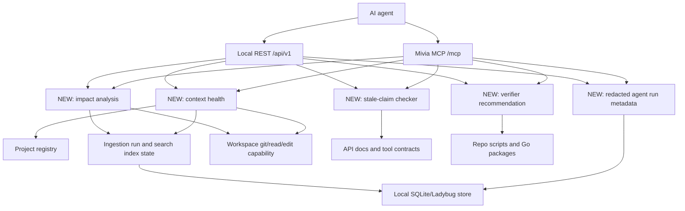
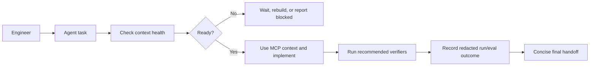
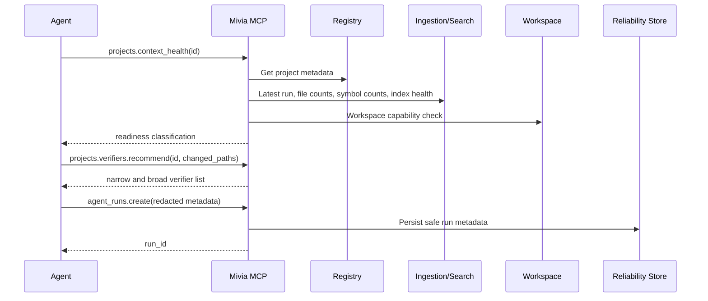

# Implement Agent Programming Reliability Roadmap

| Field | Value |
| --- | --- |
| Ticket | `N/A - free-text plan` |
| Type | Free-text |
| Status | Draft |
| Author | Maciej Lisowski |
| Date | 2026-05-31 |
| Classification | Internal; PII-prohibited |
| Owners | Mac Lisowski / Mivia engineering owner |
| Linked Epic | N/A |

## 1. Context

Mivia already gives agents a local, bounded context path through project registry metadata, content graph ingestion, indexed files, chunks, symbols, references, calls, AST search, governed workspace reads/edits, and local integration search. The current MCP router exposes project, ingestion, workspace, diagnostics, integration, task, and research tools through `tools/list` and `tools/call`. Search surfaces already attach index metadata, including running status and degraded reasons, and the search store already detects `search_index_drift`. The gap is that agents still have to infer readiness, choose verifiers manually, and rely on chat discipline instead of first-class local run/eval evidence. This plan adds reliability controls without changing the localhost-only, PII-prohibited, no-provider boundary.

## 2. Problem statement

Programming agents can still make avoidable mistakes when the local index is warming up or degraded, when a task needs the narrowest verifier, when a change has hidden blast radius, or when tool-use quality needs to be measured across runs. The current system has the low-level context primitives, but not the higher-level reliability surfaces that make agent behavior reproducible, measurable, and easier for lower-capability agents to execute correctly.

## 3. Goals

- Expose one explicit context health result so agents can distinguish ready, warming up, degraded, stale, and unavailable states.
- Add a local-only agent reliability eval harness with repeatable cases for MCP-first programming workflows.
- Add redacted local agent run metadata that records tool usage, verifiers, changed files, outcomes, and failure categories without raw prompts or source content.
- Add verifier recommendation so agents start with the narrowest meaningful test before broader checks.
- Add impact analysis that combines diff, indexed symbols, references, calls, REST/MCP route surfaces, config, and docs adjacency.
- Add stale-claim checking for docs, plans, handoffs, API docs, and tool contracts against current source.
- Add tool-use quality metrics and a curated failure-case corpus for regression testing.

## 4. Non-goals

- Do not add live AI provider calls, browser execution, embeddings, vector stores, external crawling, or provider telemetry.
- Do not expose public APIs, auth changes, remote access, arbitrary shell, raw patches, raw database queries, or git write operations.
- Do not store raw prompts, raw source content in agent-run telemetry, provider payloads, secrets, credentials, skipped sensitive content, or PII.
- Do not use Jira or Confluence connectors for this repo unless a future user request explicitly overrides the repository constraint.
- Do not implement production SLO dashboards, cloud telemetry, or external observability backends in this phase.

## 5. Acceptance criteria

Derived - confirm with owner before implementation.

- [ ] AC-1: `projects.context_health` and `GET /api/v1/projects/{id}/context-health` return a bounded readiness result with status, active run ID, latest run metadata, eligible file count, symbol count, FTS/search index state, degraded reason, workspace git capability, and skipped reason counts.
- [ ] AC-2: Context health classifies `ready`, `warming_up`, `running`, `degraded`, `stale`, `empty`, `disabled`, and `unavailable` without exposing roots, content hashes, raw errors, or sensitive paths.
- [ ] AC-3: `mivia-agentbench` or equivalent local harness runs at least eight reliability cases: file discovery, symbol discovery, caller/reference navigation, stale-index detection, token-guarded edit, post-edit ingestion visibility, sensitive/denied file refusal, and verifier recommendation.
- [ ] AC-4: Redacted agent run metadata can record run, step, verifier, artifact, eval case, and failure category data without raw prompts, raw source, provider payloads, secrets, or PII.
- [ ] AC-5: `projects.verifiers.recommend` and REST equivalent recommend narrow and broad verification commands from changed paths or planned target areas.
- [ ] AC-6: `projects.impact.analyze` and REST equivalent report affected domains and source anchors using workspace diff plus indexed source metadata when available.
- [ ] AC-7: `projects.claims.check` and REST equivalent flag stale or unverified claims in selected docs/plans/API docs using deterministic source/API/tool checks.
- [ ] AC-8: Tool-use quality metrics are computed from local run/eval metadata and include MCP-first use, freshness check, verifier execution, evidence presence, and final status.
- [ ] AC-9: A local failure-case corpus is stored as sanitized fixtures with no raw source dumps, secrets, personal data, provider payloads, or private external content.
- [ ] AC-10: REST OpenAPI, MCP contract docs, README, agent context guide, and tests are updated for every new surface.
- [ ] AC-11: `go test ./internal/agentreliability ./internal/projectregistry ./internal/projectregistry/httpapi ./internal/projectregistry/mcpapi ./internal/agentcontrol ./internal/research` passes after the relevant phases, followed by `go test ./...` before final handoff.
- [ ] AC-12: `make check` passes before final handoff, or the implementer records the exact missing tool and residual risk.

## 6. Constraints

- PII: PII ingestion remains prohibited except for already approved local project integration boundaries. Reliability telemetry must use IDs, redacted summaries, counts, commands, statuses, and artifact refs only. Sources: `docs/security/research-data-handling.md`, `docs/security/privacy-baseline.md`, `internal/research/redaction/redaction.go`.
- Classification: Internal; PII-prohibited. Do not promote any personal data, raw prompts, provider payloads, secrets, tokens, credentials, skipped sensitive content, or matched sensitive text into stores, logs, fixtures, REST responses, or MCP responses. Source: `.ai/rules/10-security-privacy.md`.
- Local-only boundary: all new tools stay under localhost REST/MCP and must not add public exposure, remote auth, arbitrary shell, raw patches, git write operations, embeddings, vectors, crawling, or provider calls. Sources: `docs/adr/0007-content-graph-ingestion-and-live-updates.md`, `docs/agent-context-guide.md`.
- API contracts: REST changes must update `api/openapi/agent-control.v1.yaml`; MCP changes must update `api/mcp/agent-control.v1.md`; README and `docs/agent-context-guide.md` must reflect new tools.
- Tool routing: add MCP definitions through `internal/projectregistry/mcpapi/mcpapi.go` and route names through `internal/agentcontrol/mcpapi/mcpapi.go`; add REST routes through `internal/projectregistry/httpapi/httpapi.go`.
- Data model: use existing local Go service/store patterns. Add SQLite-backed local metadata only if persistent reliability runs are required; do not introduce a new external datastore.
- Migrations: no destructive reset. If SQLite schema changes are needed, add forward-only schema bootstrap/migration handling through existing platform/store conventions.
- Observability: do not add external metrics/tracing until a new privacy review approves it. Local redacted run metadata is allowed as application data, not cloud telemetry.
- Tests: unit tests must not perform live internet calls. External research references belong in docs only.

## 7. Architecture / data flow



The new surfaces sit above existing registry, ingestion, search, workspace, and research primitives. They return bounded metadata and recommendations, not raw source or prompts. Agent runs and eval results are local artifacts that let the team measure whether agents used the right tools and verifiers.

## 8. User flow (if applicable)

_Not applicable - backend/local agent-control change with no user-facing product UI._



## 9. Sequence (if applicable)



This sequence is local and synchronous at the API boundary. Existing ingestion and search-index rebuild submissions remain asynchronous and are referenced by run IDs instead of blocking the health endpoint.

## 10. Detailed implementation plan

1. **Phase 0 - Source refresh and branch hygiene**
   - Read `.ai/INDEX.md`, `.ai/rules/00-operating-doctrine.md`, `.ai/rules/10-security-privacy.md`, `.ai/rules/20-go-service-standards.md`, and `.ai/skills/mivia-mcp/SKILL.md`.
   - Check current MCP health with `projects.list`, `projects.ingestion_status_latest`, and `projects.files.list`.
   - Check working tree with `git status --short` before editing. Do not revert unrelated user changes.

2. **Phase 1 - Add context health domain**
   - Create file `NEW: internal/projectreliability/context_health.go`.
   - Define:
     - `type ContextHealthStatus string` with values `ready`, `warming_up`, `running`, `degraded`, `stale`, `empty`, `disabled`, `unavailable`.
     - `type ContextHealth struct` with `project_id`, `status`, `enabled`, `digest_mode`, `update_policy`, `workspace_mode`, `graph_storage`, `validation_status`, `latest_run`, `active_run_id`, `eligible_file_count`, `indexed_symbol_count`, `indexed_chunk_count`, `search_index_status`, `search_index_degraded`, `search_index_degraded_reason`, `workspace_git_available`, `reason_counts`, `checked_at`.
   - Create file `NEW: internal/projectreliability/service.go`.
   - The service must depend on existing interfaces, not raw DB access from handlers:
     - project lookup from `internal/projectregistry`.
     - latest run from `internal/projectingestion` APIs.
     - file count/symbol count via existing list/search APIs or new count store helpers.
     - search health through existing `SearchIndexHealth` behavior in `internal/projectingestion/search_store.go`.
     - workspace capability through `internal/projectworkspace`.
   - Treat a latest run with status `pending` or `running` as `warming_up`/`running`, not as broken.
   - Treat zero eligible files with a completed run as `empty` unless validation is invalid, project disabled, or search health says degraded.

3. **Phase 1 tests**
   - Create file `NEW: internal/projectreliability/context_health_test.go`.
   - Cover:
     - running ingestion returns `warming_up` or `running`.
     - completed run with files/symbols and clean search returns `ready`.
     - completed run with zero eligible files returns `empty`.
     - degraded search health returns `degraded` with safe reason.
     - disabled/invalid project returns `disabled` or `unavailable`.
     - response omits roots, datastore paths, raw errors, source text, hashes, secrets, and PII.

4. **Phase 2 - Expose context health over MCP and REST**
   - In `internal/projectregistry/mcpapi/mcpapi.go`, add tool definition `projects.context_health` plus underscore alias support.
   - In `internal/projectregistry/mcpapi/mcpapi.go`, route `projects.context_health` to the reliability service.
   - In `internal/agentcontrol/mcpapi/mcpapi.go`, add `projects.context_health` and `projects_context_health` to project-tool routing.
   - In `internal/projectregistry/httpapi/httpapi.go`, add `GET /api/v1/projects/{id}/context-health`.
   - Update tests in:
     - `internal/projectregistry/mcpapi/mcpapi_test.go`
     - `internal/agentcontrol/mcpapi/mcpapi_test.go`
     - `internal/projectregistry/httpapi/httpapi_test.go`
   - Update `api/openapi/agent-control.v1.yaml`.
   - Update `api/mcp/agent-control.v1.md`.

5. **Phase 3 - Add verifier recommendation domain**
   - Create file `NEW: internal/projectreliability/verifiers.go`.
   - Define:
     - `VerifierRecommendationRequest` with `project_id`, `changed_paths`, `target_paths`, `domains`.
     - `VerifierCommand` with `command`, `args`, `workdir_hint`, `scope`, `reason`, `risk_level`, `requires_shell`.
     - `VerifierRecommendation` with `narrow`, `broad`, `manual_notes`.
   - Implement deterministic recommendations for this repo first:
     - `internal/projectingestion/**` -> `go test ./internal/projectingestion`, then `go test ./...`.
     - `internal/projectworkspace/**` -> `go test ./internal/projectworkspace`, then `go test ./...`.
     - `internal/projectregistry/httpapi/**` -> `go test ./internal/projectregistry/httpapi`.
     - `internal/projectregistry/mcpapi/**` or `internal/agentcontrol/mcpapi/**` -> `go test ./internal/projectregistry/mcpapi ./internal/agentcontrol/mcpapi`.
     - `internal/research/**` -> `go test ./internal/research/...`.
     - `api/openapi/**` or `api/mcp/**` -> relevant package tests plus `make check`.
     - `configs/**` or `internal/platform/config/**` -> `go test ./internal/platform/config`.
     - fallback -> `go test ./...`.
   - Do not execute commands inside this tool; return recommendations only.

6. **Phase 3 tests and API**
   - Create `NEW: internal/projectreliability/verifiers_test.go`.
   - Add MCP tool `projects.verifiers.recommend` in `internal/projectregistry/mcpapi/mcpapi.go`.
   - Add REST route `POST /api/v1/projects/{id}/verifiers/recommend` in `internal/projectregistry/httpapi/httpapi.go`.
   - Update contracts and docs in `api/openapi/agent-control.v1.yaml`, `api/mcp/agent-control.v1.md`, `README.md`, and `docs/agent-context-guide.md`.

7. **Phase 4 - Add redacted agent run metadata**
   - Prefer extending `internal/agentcontrol` rather than creating a separate service if ownership stays with task/research metadata.
   - Create or extend model file:
     - `internal/agentcontrol/model/model.go` for `AgentRun`, `AgentStep`, `AgentVerifier`, `AgentArtifact`, `AgentFailureCategory`, and `AgentQualitySummary`.
   - Create store interfaces in `internal/agentcontrol/store/store.go`:
     - `AgentRunStore`
     - `CreateAgentRun`
     - `AppendAgentStep`
     - `CompleteAgentRun`
     - `GetAgentRun`
   - Add memory and Ladybug/SQLite-backed store support following existing patterns in `internal/agentcontrol/store/memory.go` and `internal/agentcontrol/store/ladybug.go`.
   - Safe fields only:
     - IDs, timestamps, project ID, task ID, tool names, tool categories, status, verifier commands, verifier exit status, changed file paths, artifact refs, error category, and redacted notes.
   - Explicitly reject:
     - raw prompt, raw completion, raw source content, provider payload, credential, token, secret, raw command stderr, absolute roots, PII, skipped sensitive content, matched sensitive marker text.
   - Reuse `internal/research/redaction/redaction.go` for defensive redaction.

8. **Phase 4 MCP/REST for run metadata**
   - Add MCP tools:
     - `agent_runs.create`
     - `agent_runs.step_append`
     - `agent_runs.complete`
     - `agent_runs.get`
   - Add REST routes:
     - `POST /api/v1/agent-runs`
     - `POST /api/v1/agent-runs/{id}/steps`
     - `POST /api/v1/agent-runs/{id}/complete`
     - `GET /api/v1/agent-runs/{id}`
   - Update `internal/agentcontrol/httpapi/httpapi.go`, `internal/agentcontrol/mcpapi/mcpapi.go`, and tests.
   - Ensure response bodies are structured JSON plus existing MCP text-content convention.

9. **Phase 5 - Add local eval harness**
   - Create command `NEW: cmd/mivia-agentbench/main.go`.
   - Create package `NEW: internal/agentbench`.
   - Create fixture directory `NEW: internal/agentbench/testdata/`.
   - Implement local benchmark cases:
     - `context_health_ready`: starts from a ready project fixture and expects `ready`.
     - `context_health_warming`: simulates running ingestion and expects `warming_up`/`running`.
     - `find_file`: uses file search/list to find a known fixture file.
     - `find_symbol`: uses symbol search to find a known symbol.
     - `callers_refs`: uses reference/call search over a tiny fixture.
     - `stale_index`: simulates search index drift and expects `degraded`.
     - `exact_edit`: reads a fixture file, applies token-guarded edit, and verifies new edit token.
     - `sensitive_refusal`: attempts a sensitive fixture and expects safe skip/refusal metadata only.
     - `verifier_recommendation`: changed path input returns narrow verifier first.
   - The harness must not call live AI models. It exercises local services and writes JSON/Markdown reports.
   - Add `NEW: docs/reports/tests/2026-05-31-agent-programming-reliability-roadmap-report.md` only when running the harness for a real implementation handoff, not during initial scaffolding unless the command is executed.

10. **Phase 6 - Add impact analyzer**
    - Create `NEW: internal/projectreliability/impact.go`.
    - Input:
      - project ID
      - optional changed paths
      - optional diff scope `working_tree`, `staged`, `head`
      - optional max nodes/bytes caps.
    - Use existing workspace diff API from `internal/projectworkspace/service.go` when available.
    - Use path rules and indexed metadata:
      - `internal/projectingestion/**` -> ingestion/search/index domain.
      - `internal/projectworkspace/**` -> workspace read/edit/git domain.
      - `internal/projectregistry/mcpapi/**` -> MCP project tools.
      - `internal/projectregistry/httpapi/**` -> REST API.
      - `internal/agentcontrol/**` -> task/research/agent-run control plane.
      - `internal/research/**` -> research metadata/redaction.
      - `api/openapi/**` -> REST contract.
      - `api/mcp/**` -> MCP contract.
      - `configs/**` -> runtime configuration.
      - `docs/security/**` -> security/privacy policy.
    - Output:
      - affected domains
      - affected routes/tools
      - recommended verifiers
      - known security/privacy flags
      - source anchors
      - residual unknowns if MCP index is unavailable or degraded.

11. **Phase 6 tests and API**
    - Create `NEW: internal/projectreliability/impact_test.go`.
    - Add MCP tool `projects.impact.analyze`.
    - Add REST route `POST /api/v1/projects/{id}/impact/analyze`.
    - Tests must cover route/tool mapping, workspace disabled fallback, degraded index warning, and no raw diff beyond capped/safe metadata unless the existing workspace diff surface already allows it.

12. **Phase 7 - Add stale-claim checker**
    - Create `NEW: internal/projectreliability/claims.go`.
    - Scope selected files only; do not crawl arbitrary roots beyond configured project eligibility.
    - Initial deterministic checks:
      - MCP tool names in docs exist in `internal/projectregistry/mcpapi/mcpapi.go` or `internal/agentcontrol/mcpapi/mcpapi.go`.
      - REST paths in docs exist in `internal/projectregistry/httpapi/httpapi.go` or `internal/agentcontrol/httpapi/httpapi.go`.
      - API docs mention only existing schema/tool names after source scan.
      - Local plan/handoff claims that reference `projects.*` tools are checked against current tool definitions.
      - Stable docs must not link `.ai/tasks/*`.
    - Output:
      - file path
      - line
      - claim kind
      - status `verified`, `stale`, `unverified`, or `out_of_scope`
      - evidence path and line
      - safe message.
    - Do not use LLMs to judge claim truth in the first implementation.

13. **Phase 7 tests and API**
    - Create `NEW: internal/projectreliability/claims_test.go`.
    - Add MCP tool `projects.claims.check`.
    - Add REST route `POST /api/v1/projects/{id}/claims/check`.
    - Tests:
      - valid MCP tool claim passes.
      - nonexistent tool claim is stale.
      - valid REST route claim passes.
      - `.ai/tasks` stable-doc link is flagged.
      - sensitive or denied paths are refused.

14. **Phase 8 - Tool-use quality metrics**
    - Create `NEW: internal/projectreliability/quality.go`.
    - Compute quality from `AgentRun` records:
      - `mcp_first_context_checked`
      - `freshness_checked`
      - `used_workspace_diff_or_status`
      - `recommended_verifier_run`
      - `broad_verifier_run_when_required`
      - `final_status_present`
      - `failure_category_present_on_failure`
      - `evidence_anchors_present`
    - Return percentages and per-run failures.
    - Add MCP tool `agent_runs.quality_summary` or `projects.agent_quality.summary`.
    - Add REST route `GET /api/v1/projects/{id}/agent-quality/summary`.
    - Tests must ensure quality summaries do not expose raw prompts, raw source, or raw stderr.

15. **Phase 9 - Failure-case corpus**
    - Create `NEW: docs/reports/tests/agent-reliability-corpus.md`.
    - Create `NEW: internal/agentbench/testdata/cases/*.json`.
    - Each case includes:
      - ID
      - task category
      - setup fixture reference
      - expected tool sequence
      - expected verifier
      - expected failure/success label
      - prohibited behavior.
    - Seed cases:
      - `stale-index-drift`
      - `startup-warmup-zero-files`
      - `wrong-file-selected`
      - `sensitive-file-refusal`
      - `skipped-verifier`
      - `doc-claim-trusted-over-code`
      - `workspace-edit-stale-token`
      - `mcp-unavailable-shell-fallback-required`.

16. **Phase 10 - Documentation and contracts**
    - Update `README.md` feature map and Agent Reliability Model with the new surfaces.
    - Update `docs/agent-context-guide.md` with the new recommended workflow:
      - `projects.context_health`
      - indexed discovery
      - impact/verifier recommendation
      - implementation
      - run/eval recording.
    - Update `api/mcp/agent-control.v1.md` for all new MCP tools.
    - Update `api/openapi/agent-control.v1.yaml` for all new REST endpoints and schemas.
    - Update `docs/security/research-data-handling.md` only if agent-run metadata needs a policy note beyond existing research metadata boundaries.
    - Do not link local `.ai/tasks/*` files from stable docs.

17. **Phase 11 - Verification sequence for implementing agents**
    - After Phase 1-3:
      - `go test ./internal/projectreliability ./internal/projectregistry/mcpapi ./internal/projectregistry/httpapi ./internal/agentcontrol/mcpapi`
    - After Phase 4:
      - `go test ./internal/agentcontrol/... ./internal/research/...`
    - After Phase 5:
      - `go test ./internal/agentbench ./cmd/mivia-agentbench`
      - run `go run ./cmd/mivia-agentbench --fixture internal/agentbench/testdata --report docs/reports/tests/<date>-agentbench.md` if implemented.
    - After Phase 6-8:
      - `go test ./internal/projectreliability ./internal/projectworkspace ./internal/projectingestion`
    - Final:
      - `go test ./...`
      - `make check`
      - search stable docs for `.ai/tasks/` links.

## 11. Data model changes

Additive only.

- `NEW: internal/projectreliability/context_health.go`: response structs only unless count queries need persistence.
- `NEW: internal/projectreliability/verifiers.go`: no persistence.
- `NEW: internal/projectreliability/impact.go`: no persistence in first implementation.
- `NEW: internal/projectreliability/claims.go`: no persistence in first implementation.
- `NEW: internal/projectreliability/quality.go`: reads persisted agent-run metadata.
- `internal/agentcontrol/model/model.go`: add `AgentRun`, `AgentStep`, `AgentVerifier`, `AgentArtifact`, `AgentFailureCategory`, and `AgentQualitySummary`.
- `internal/agentcontrol/store/store.go`: add `AgentRunStore` interface.
- `internal/agentcontrol/store/ladybug.go` or related store files: persist redacted agent-run metadata using local graph/store conventions.

Pseudo-shape:

```go
type AgentRun struct {
    ID string
    ProjectID string
    TaskID string
    Status string
    StartedAt time.Time
    CompletedAt time.Time
    FailureCategory string
    Summary string
}
```

No destructive migration is allowed. If the existing store needs schema bootstrapping, implement forward-only table/node creation and tests that existing task/research data still reads.

## 12. Contract / API changes

- REST OpenAPI in `api/openapi/agent-control.v1.yaml`:
  - `GET /api/v1/projects/{id}/context-health`
  - `POST /api/v1/projects/{id}/verifiers/recommend`
  - `POST /api/v1/projects/{id}/impact/analyze`
  - `POST /api/v1/projects/{id}/claims/check`
  - `POST /api/v1/agent-runs`
  - `POST /api/v1/agent-runs/{id}/steps`
  - `POST /api/v1/agent-runs/{id}/complete`
  - `GET /api/v1/agent-runs/{id}`
  - `GET /api/v1/projects/{id}/agent-quality/summary`
- MCP contract in `api/mcp/agent-control.v1.md`:
  - `projects.context_health`
  - `projects.verifiers.recommend`
  - `projects.impact.analyze`
  - `projects.claims.check`
  - `agent_runs.create`
  - `agent_runs.step_append`
  - `agent_runs.complete`
  - `agent_runs.get`
  - `agent_runs.quality_summary` or `projects.agent_quality.summary`
- All changes are additive. No existing tool or REST route is removed.
- Support underscore aliases for MCP tools where the existing server pattern supports them.

## 13. Testing strategy

- **Unit:** `NEW: internal/projectreliability/*_test.go` covers context health classification, verifier matching, impact mapping, stale-claim checks, quality scoring, and privacy redaction.
- **Unit:** update `internal/agentcontrol/service/service_test.go`, `internal/agentcontrol/store/store_test.go`, and `internal/research/redaction/redaction_test.go` for agent-run validation and redaction.
- **MCP:** update `internal/projectregistry/mcpapi/mcpapi_test.go` and `internal/agentcontrol/mcpapi/mcpapi_test.go` for tool definitions, aliases, schemas, and calls.
- **REST:** update `internal/projectregistry/httpapi/httpapi_test.go` and `internal/agentcontrol/httpapi/httpapi_test.go` for new routes, validation, and safe error responses.
- **Harness:** add `internal/agentbench` tests and command smoke tests for fixture-only reliability cases.
- **Contract:** OpenAPI and MCP docs must match tests. If this repo has no OpenAPI generator check, add a targeted contract consistency test or document manual verification.
- **Policy:** verify no stable docs link `.ai/tasks/*`; run existing secret/PII checks if present through `make check`.

## 14. Observability

- **Logs:** Do not log raw request bodies, raw prompts, raw source content, provider payloads, credentials, tokens, API keys, secrets, skipped sensitive content, matched sensitive marker text, or PII. If logging reliability actions, use service, request ID, project ID, run ID, status, and error category only.
- **Metrics:** No external metrics backend in this roadmap. Local quality summaries are stored as application data derived from redacted `AgentRun` records.
- **Traces:** No external tracing backend. Redacted agent-run steps are local trace-like metadata and must not contain prompts, completions, raw source, or raw stderr.
- **Dashboards:** None in this phase. Optional future local report generation belongs in `docs/reports/tests/`.

## 15. Documentation updates

- `README.md` - update feature map, Agent Reliability Model, and tool list.
- `docs/agent-context-guide.md` - update agent workflow and surfaces.
- `api/mcp/agent-control.v1.md` - document new MCP tools, inputs, outputs, and boundaries.
- `api/openapi/agent-control.v1.yaml` - document new REST endpoints and schemas.
- `docs/security/research-data-handling.md` - update only if owner decides agent-run metadata needs an explicit policy subsection.
- `docs/reports/tests/README.md` - add report convention for reliability eval runs if missing.
- `NEW: docs/reports/tests/agent-reliability-corpus.md` - describe sanitized failure cases and expected labels.

## 16. Rollout / migration

1. Land context health first because it reduces false negatives during all later phases.
2. Land verifier recommendation second because it improves implementation verification with low data risk.
3. Land redacted agent-run metadata third, behind local-only validation and redaction tests.
4. Land agentbench after metadata or with a fixture-only mode if persistence is delayed.
5. Land impact analyzer, stale-claim checker, quality metrics, and corpus incrementally.
6. Keep every surface additive; do not remove or rename existing tools.
7. If agent-run persistence has defects, disable only the new run tools and keep context health/verifier recommendation available.
8. Rollback path is forward fix or disabling new tool registration; do not delete local stores destructively.

## 17. Security, privacy, compliance

- **PII surfaces touched:** none intended. Agent-run summaries, failure cases, and reports must be sanitized and defensively redacted.
- **Vault interactions:** none.
- **PDPL / NCA-ECC / SAMA / ZATCA / TGA touchpoints:** no regulated workflow processing intended. Legal/DPO review is required before any personal data is allowed in agent-run telemetry.
- **AuthN / AuthZ changes:** none. Localhost-only bootstrap boundary remains unchanged.
- **Data residency:** local developer workstation only; no cloud/provider telemetry.
- **Secrets/logging:** new tests must prove secret-like values are rejected or redacted before storage and responses.
- **External sources:** docs may cite external evaluation/observability guidance, but implementation must not call those providers or send local project data to them.

## 18. Risks and mitigations

| Risk | Likelihood | Impact | Mitigation |
| --- | --- | --- | --- |
| Agent-run metadata accidentally captures prompts or source | Medium | High | Whitelist fields, reject raw text fields, reuse redaction, add negative tests with prompt/source-looking inputs. |
| Context health becomes slow by counting too much | Medium | Medium | Use capped existing APIs first; add cheap count helpers only if needed; test against fixture stores. |
| Health status hides a real degraded index as "warming up" | Medium | High | Precedence: explicit degraded search health wins unless active rebuild is known; include run ID and degraded reason. |
| Verifier recommendations become stale as packages move | Medium | Medium | Keep rules table in one file with tests for known paths; stale-claim checker should cover docs/tool references. |
| Impact analyzer overclaims call-graph precision | Medium | Medium | Include confidence and unresolved edges; never infer dynamic calls as confirmed. |
| Stale-claim checker creates noise | High | Medium | Start deterministic: tools, routes, `.ai/tasks` links, paths. Mark unverified rather than stale when evidence is insufficient. |
| Eval harness becomes another untrusted narration artifact | Medium | Medium | Make it executable, fixture-backed, and report actual pass/fail plus commands run. |
| New docs accidentally link ignored `.ai/tasks/*` | Medium | Low | Add grep/check in verification and stale-claim checker. |

## 19. Out of scope

- Live LLM-based graders.
- Cloud trace or metric export.
- Model prompt optimization.
- Hosted vector search or embeddings.
- Public SaaS deployment.
- Jira/Confluence connector reads for this repo.
- Automatic code edits from impact or claim-check tools.
- Git commit, push, reset, checkout, branch, merge, rebase, stash, clean, or restore tools.

## 20. Open questions

- Owner: Mac Lisowski - Should agent-run metadata live under `internal/agentcontrol` or a new `internal/agentreliability` package? Recommendation: use `internal/agentcontrol` for persisted run records and `internal/projectreliability` for project analysis/recommendation surfaces.
- Owner: Mac Lisowski - Should context health expose exact counts or capped count classes for very large projects? Recommendation: exact safe counts from local stores if cheap; otherwise return lower-bound/capped values with `truncated=true`.
- Owner: Mac Lisowski - Should `agent_runs.quality_summary` be project-scoped only or also global across all configured projects? Recommendation: project-scoped first.
- Owner: Mac Lisowski - Should the first implementation include the command-line `mivia-agentbench` binary or only package-level tests? Recommendation: include the binary because it gives repeatable reports for future agents.
- Owner: Mac Lisowski - Should docs/security explicitly approve redacted agent-run metadata, or is it covered by current task/research metadata policy? Recommendation: add a short explicit subsection before persistence lands.

## 21. References

- **Jira:** N/A - repository constraint says do not use Jira or Confluence for this repo unless explicitly overridden.
- **Confluence:** Not searched - repository constraint says do not use Jira or Confluence for this repo unless explicitly overridden.
- **In-repo docs:** `README.md` - current feature map and Agent Reliability Model.
- **In-repo docs:** `docs/agent-context-guide.md` - MCP-first routing, surfaces, and safety boundary.
- **In-repo docs:** `docs/README.md` - stable docs map and no `.ai/tasks` stable-doc link rule.
- **ADRs:** `docs/adr/0005-observability-baseline.md` - structured logs only; metrics/tracing deferred.
- **ADRs:** `docs/adr/0007-content-graph-ingestion-and-live-updates.md` - accepted local content graph boundary and permanent prohibitions.
- **Policies:** `.ai/rules/00-operating-doctrine.md` - evidence, verification, handoff rules.
- **Policies:** `.ai/rules/10-security-privacy.md` - PII/secrets/provider payload prohibitions.
- **Policies:** `.ai/rules/20-go-service-standards.md` - Go service layout, logging, testing.
- **Policies:** `docs/security/research-data-handling.md` - metadata-only research boundary and content graph exception.
- **Catalog entries:** none present in this repo.
- **External references:** OpenAI Trace grading - https://platform.openai.com/docs/guides/trace-grading.
- **External references:** OpenAI Agent evals - https://platform.openai.com/docs/guides/agent-evals.
- **External references:** OpenAI Agent Builder safety - https://platform.openai.com/docs/guides/agent-builder-safety.
- **External references:** Anthropic Building effective agents - https://www.anthropic.com/research/building-effective-agents.
- **External references:** Anthropic Writing effective tools for agents - https://www.anthropic.com/engineering/writing-tools-for-agents.
- **External references:** Google ADK evaluation - https://google.github.io/adk-docs/evaluate/.
- **External references:** Google ADK AgentOps observability - https://google.github.io/adk-docs/observability/agentops/.
- **Source anchors:** `internal/agentcontrol/mcpapi/mcpapi.go:152` - MCP `tools/list` routing.
- **Source anchors:** `internal/agentcontrol/mcpapi/mcpapi.go:205` - research-run MCP routing.
- **Source anchors:** `internal/agentcontrol/mcpapi/mcpapi.go:232` - project ingestion/search/workspace tool routing list starts.
- **Source anchors:** `internal/agentcontrol/mcpapi/mcpapi.go:390` - top-level MCP tool definitions.
- **Source anchors:** `internal/projectregistry/mcpapi/mcpapi.go:31` - project MCP tool-definition composition with ingestion/workspace/diagnostics toggles.
- **Source anchors:** `internal/projectregistry/mcpapi/mcpapi.go:108` - project MCP call router with ingestion/workspace/diagnostics.
- **Source anchors:** `internal/projectregistry/mcpapi/mcpapi.go:191` - latest ingestion status MCP route.
- **Source anchors:** `internal/projectregistry/mcpapi/mcpapi.go:292` - text search MCP route.
- **Source anchors:** `internal/projectregistry/mcpapi/mcpapi.go:350` - symbol search MCP route.
- **Source anchors:** `internal/projectregistry/mcpapi/mcpapi.go:623` - diagnostics MCP route.
- **Source anchors:** `internal/projectregistry/mcpapi/mcpapi.go:634` - workspace git status MCP route.
- **Source anchors:** `internal/projectregistry/httpapi/httpapi.go:25` - project REST route registration starts.
- **Source anchors:** `internal/projectregistry/httpapi/httpapi.go:31` - latest ingestion REST route.
- **Source anchors:** `internal/projectregistry/httpapi/httpapi.go:38` - text search REST route.
- **Source anchors:** `internal/projectregistry/httpapi/httpapi.go:53` - workspace git status REST route.
- **Source anchors:** `internal/projectingestion/model.go:21` - ingestion run model with counts/reasons.
- **Source anchors:** `internal/projectingestion/service.go:1166` - search text attaches index metadata.
- **Source anchors:** `internal/projectingestion/service.go:1231` - search symbols attaches index metadata.
- **Source anchors:** `internal/projectingestion/service.go:1556` - search index metadata derivation.
- **Source anchors:** `internal/projectingestion/search_store.go:46` - search index health model.
- **Source anchors:** `internal/projectingestion/search_store.go:461` - search index health lookup.
- **Source anchors:** `internal/projectingestion/search_store.go:477` - search index drift reason.
- **Source anchors:** `internal/projectingestion/sqlite_store.go:126` - run reason counts persisted.
- **Source anchors:** `internal/projectworkspace/model.go:40` - workspace API interface.
- **Source anchors:** `internal/projectworkspace/service.go:68` - git status implementation.
- **Source anchors:** `internal/projectworkspace/service.go:102` - git diff implementation.
- **Source anchors:** `internal/projectworkspace/service.go:167` - workspace file read implementation.
- **Source anchors:** `internal/projectworkspace/service.go:184` - token-guarded edit implementation.
- **Source anchors:** `internal/projectworkspace/service.go:245` - successful edit queues ingestion.
- **Source anchors:** `internal/projectregistry/model.go:25` - project model fields.
- **Source anchors:** `internal/projectregistry/service.go:246` - graph storage validation.
- **Source anchors:** `internal/projectregistry/service.go:253` - content graph validation.
- **Source anchors:** `internal/projectregistry/service.go:275` - workspace mode validation.
- **Source anchors:** `internal/agentcontrol/model/model.go:14` - task model.
- **Source anchors:** `internal/agentcontrol/model/model.go:26` - research run model.
- **Source anchors:** `internal/agentcontrol/service/service.go:101` - research-run create validation.
- **Source anchors:** `internal/research/service.go:41` - research source create redaction path.
- **Source anchors:** `internal/research/redaction/redaction.go:28` - redaction function.
- **Source anchors:** `internal/research/mcpapi/mcpapi.go:19` - research source MCP tool definition.

## 22. Confidence notes

High confidence: existing MCP/REST routing, ingestion/search index metadata, workspace edit-token behavior, project config validation, and research redaction anchors are grounded in current source. Medium confidence: exact persistence shape for agent-run metadata because the plan intentionally leaves store placement as an owner decision between extending `internal/agentcontrol` and creating a new package. Medium confidence: exact context-health count implementation because current source exposes lists/search metadata and search health, but cheap count helpers may be needed to avoid expensive pagination on large projects. Low confidence: final eval-case thresholds and scoring weights because they need owner acceptance after the first fixture-backed harness run.
