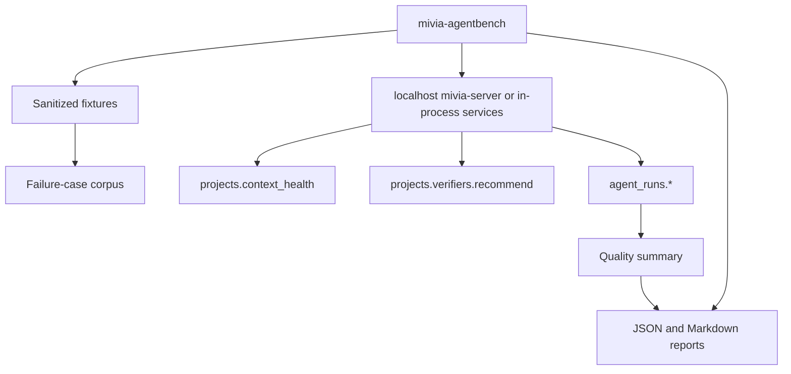
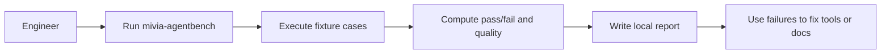
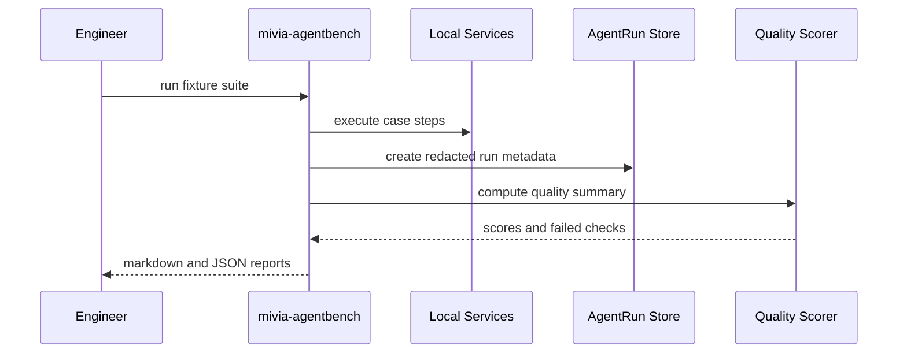

# Implement Agent Reliability Evals And Quality Layer

| Field | Value |
| --- | --- |
| Ticket | `N/A - free-text companion plan` |
| Type | Free-text |
| Status | Draft |
| Author | Maciej Lisowski |
| Date | 2026-05-31 |
| Classification | Internal; PII-prohibited |
| Owners | Mac Lisowski / Mivia engineering owner |
| Linked Epic | N/A |

## 1. Context

This companion plan contains the eval harness, quality metrics, and failure-case corpus work that was removed from `docs/plans/2026-05-31-agent-programming-reliability-roadmap.md`. It depends on the main roadmap for context health, verifier recommendation, and redacted agent-run metadata. The purpose is to measure whether agents use the Mivia context server correctly over repeatable programming tasks. This plan must stay local-only, fixture-backed, and free of raw prompts, raw source dumps, provider payloads, secrets, credentials, and PII.

## 2. Problem statement

After the main reliability surfaces exist, the project still needs a repeatable way to prove they improve agent programming behavior. Without an executable eval harness and a curated failure corpus, tool-use quality will drift and regressions will be found only through ad hoc manual review.

## 3. Goals

- Add a local `mivia-agentbench` command that runs deterministic reliability cases without calling live AI models.
- Add fixture-backed eval cases for context readiness, indexed discovery, edit safety, stale index handling, sensitive-file refusal, and verifier selection.
- Add a redacted failure-case corpus from real agent failure modes.
- Add quality summary computation over redacted `AgentRun` metadata.
- Generate local JSON and Markdown reports under `docs/reports/tests/`.

## 4. Non-goals

- Do not implement live model grading, prompt optimization, or model comparison.
- Do not call OpenAI, Anthropic, Google, Atlassian, browsers, or any external provider from tests or the harness.
- Do not store prompts, completions, raw source content, raw command stderr, secrets, credentials, provider payloads, or PII.
- Do not implement the main roadmap surfaces in this plan; treat them as dependencies.

## 5. Acceptance criteria

Derived - confirm with owner before implementation.

- [ ] AC-1: `go run ./cmd/mivia-agentbench --fixture internal/agentbench/testdata --report docs/reports/tests/<date>-agentbench.md` runs locally without live network calls.
- [ ] AC-2: The harness includes at least eight deterministic cases: context ready, context warming, file discovery, symbol discovery, caller/reference navigation, stale index detection, token-guarded edit, sensitive/denied file refusal, and verifier recommendation.
- [ ] AC-3: Each eval case records expected tool sequence, expected status, expected verifier, prohibited behavior, and pass/fail result.
- [ ] AC-4: Failure corpus fixtures are sanitized and contain no raw source dumps, secrets, credentials, provider payloads, private external content, or PII.
- [ ] AC-5: Quality summary computes MCP-first context check, freshness check, workspace status/diff use, recommended verifier execution, broad verifier execution when required, final status presence, failure category presence, and evidence-anchor presence.
- [ ] AC-6: Quality summaries expose counts, percentages, and failed checks only; they do not expose raw prompts, raw source, raw stderr, absolute roots, or sensitive paths.
- [ ] AC-7: MCP and REST expose quality summary only after redacted `AgentRun` metadata from the main roadmap exists.
- [ ] AC-8: `go test ./internal/agentbench ./cmd/mivia-agentbench ./internal/projectreliability ./internal/agentcontrol/...` passes, followed by `go test ./...` before final handoff.

## 6. Constraints

- Dependency: do not start this implementation until the main roadmap has landed `projects.context_health`, `projects.verifiers.recommend`, and redacted `AgentRun` metadata.
- Privacy: no raw prompts, completions, source dumps, provider payloads, credentials, tokens, secrets, raw stderr, absolute roots, skipped sensitive content, matched sensitive marker text, or PII in fixtures, reports, logs, REST, MCP, or stores.
- Local-only: all harness activity must run on local fixtures or localhost services. No live internet in unit tests.
- Reports: generated reports belong under `docs/reports/tests/` only when intentionally produced. Do not link ignored `.ai/tasks/*` files.
- Tool boundaries: the harness may call REST/MCP and shell test commands, but it must not add arbitrary shell capabilities to the server.

## 7. Architecture / data flow

The harness executes deterministic cases against fixtures and existing local service surfaces. It records only redacted metadata and writes local reports for review.

## 8. User flow (if applicable)

_Not applicable - local engineering harness with no product UI._

## 9. Sequence (if applicable)

## 10. Detailed implementation plan

1. **Phase 0 - Dependency gate**
   - Confirm these main-roadmap surfaces exist:
     - `projects.context_health`
     - `projects.verifiers.recommend`
     - `agent_runs.create`
     - `agent_runs.step_append`
     - `agent_runs.complete`
     - `agent_runs.get`
   - Confirm docs/contracts mention them in `api/mcp/agent-control.v1.md` and `api/openapi/agent-control.v1.yaml`.
   - If any dependency is missing, stop. Do not implement placeholders in this plan.

2. **Phase 1 - Agentbench command skeleton**
   - Create file `NEW: cmd/mivia-agentbench/main.go`.
   - Create package `NEW: internal/agentbench`.
   - Add CLI flags:
     - `--fixture <path>` required.
     - `--report <path>` optional Markdown report.
     - `--json <path>` optional JSON report.
     - `--case <id>` optional single-case filter.
     - `--localhost-url <url>` optional, default `http://127.0.0.1:8080`.
     - `--offline` optional, default true for fixture/in-process mode.
   - Command must fail if fixture path is missing, unsafe, outside repo testdata, or contains denied/sensitive fixture markers.

3. **Phase 1 tests**
   - Create `NEW: internal/agentbench/cli_test.go`.
   - Cover missing fixture path, unsafe fixture path, single-case filtering, Markdown report write, JSON report write, and no network in offline mode.

4. **Phase 2 - Case model and fixtures**
   - Create `NEW: internal/agentbench/case.go`.
   - Define:
     - `Case`
     - `Step`
     - `ExpectedToolCall`
     - `ExpectedVerifier`
     - `ProhibitedBehavior`
     - `CaseResult`
     - `SuiteResult`
   - Create fixture directory `NEW: internal/agentbench/testdata/cases/`.
   - Create sanitized JSON case files:
     - `context-health-ready.json`
     - `context-health-warming.json`
     - `find-file.json`
     - `find-symbol.json`
     - `callers-references.json`
     - `stale-index-drift.json`
     - `exact-edit-token.json`
     - `sensitive-file-refusal.json`
     - `verifier-recommendation.json`
   - Keep fixtures small and synthetic.

5. **Phase 2 tests**
   - Create `NEW: internal/agentbench/case_test.go`.
   - Validate schema loading, duplicate IDs, missing expected status, prohibited raw prompt/source fields, and fixture sanitization.

6. **Phase 3 - Fixture service runner**
   - Create `NEW: internal/agentbench/runner.go`.
   - Support two execution modes:
     - offline/in-process fake services for unit tests.
     - localhost REST/MCP smoke mode for manual validation.
   - The first implementation should prefer offline fixtures for deterministic CI-safe tests.
   - Do not require a running server for `go test`.
   - Return explicit skipped status when a case requires localhost mode and the server is not available.

7. **Phase 3 cases**
   - Implement case executors:
     - context health status match.
     - file search/list expected result.
     - symbol search expected result.
     - reference/call search expected result.
     - stale-index degraded status.
     - workspace read/edit token round trip with synthetic file.
     - sensitive file refusal.
     - verifier recommendation match.
   - Each executor records tool names and redacted artifacts into `AgentRun` metadata when the agent-run API is available.

8. **Phase 4 - Reports**
   - Create `NEW: internal/agentbench/report.go`.
   - Markdown report includes:
     - suite ID
     - timestamp
     - mode
     - cases run
     - pass/fail/skipped counts
     - failed checks
     - verifier commands expected and observed
     - privacy check status.
   - JSON report includes the same fields in stable machine-readable form.
   - Reports must not include raw source, raw prompt, completion text, raw stderr, absolute roots, secrets, or PII.

9. **Phase 5 - Tool-use quality metrics**
   - Create `NEW: internal/projectreliability/quality.go`.
   - Compute quality from redacted `AgentRun` records:
     - `mcp_first_context_checked`
     - `freshness_checked`
     - `used_workspace_diff_or_status`
     - `recommended_verifier_run`
     - `broad_verifier_run_when_required`
     - `final_status_present`
     - `failure_category_present_on_failure`
     - `evidence_anchors_present`
   - Output:
     - project ID
     - time range
     - total runs
     - passed checks
     - failed checks
     - percentages
     - run IDs with failed checks.
   - Do not expose step inputs beyond tool names, statuses, verifier command labels, and artifact refs.

10. **Phase 5 API**
    - Add MCP tool `agent_runs.quality_summary` or `projects.agent_quality.summary`. Prefer `projects.agent_quality.summary` if the summary is project-scoped.
    - Add REST route `GET /api/v1/projects/{id}/agent-quality/summary`.
    - Update:
      - `internal/agentcontrol/mcpapi/mcpapi.go`
      - `internal/projectregistry/mcpapi/mcpapi.go` if project-scoped routing is chosen.
      - `internal/agentcontrol/httpapi/httpapi.go` or `internal/projectregistry/httpapi/httpapi.go` based on ownership.
      - `api/mcp/agent-control.v1.md`
      - `api/openapi/agent-control.v1.yaml`.

11. **Phase 6 - Failure-case corpus**
    - Create `NEW: docs/reports/tests/agent-reliability-corpus.md`.
    - Document each case:
      - ID
      - failure mode
      - why it matters
      - fixture file
      - expected tool path
      - expected verifier
      - prohibited behavior.
    - Seed failure modes:
      - startup warmup zero files.
      - stale index drift.
      - wrong file selected.
      - sensitive file refusal.
      - skipped verifier.
      - doc claim trusted over source.
      - workspace edit stale token.
      - MCP unavailable shell fallback required.
      - broad shell scan before MCP.

12. **Phase 7 - Documentation**
    - Update `README.md` to mention agentbench and quality reports only after the harness is runnable.
    - Update `docs/agent-context-guide.md` with a short "Run reliability evals" workflow.
    - Update `docs/reports/tests/README.md` with report naming and required fields.
    - Do not update stable docs before the command exists and tests pass.

13. **Phase 8 - Verification**
    - Run:
      - `go test ./internal/agentbench`
      - `go test ./cmd/mivia-agentbench`
      - `go test ./internal/projectreliability ./internal/agentcontrol/...`
      - `go test ./...`
      - `make check`
    - Run one fixture suite:
      - `go run ./cmd/mivia-agentbench --fixture internal/agentbench/testdata --report docs/reports/tests/<date>-agentbench.md --json docs/reports/tests/<date>-agentbench.json`
    - If a server is required for localhost smoke mode, state that explicitly and keep unit tests offline.

## 11. Data model changes

Additive only.

- `NEW: internal/agentbench/case.go`: in-memory case/result structs.
- `NEW: internal/agentbench/report.go`: report structs.
- `NEW: internal/projectreliability/quality.go`: quality summary structs derived from `AgentRun`.
- No new persistence is required for the harness itself.
- Quality metrics read redacted `AgentRun` data from the main roadmap implementation.

## 12. Contract / API changes

- REST OpenAPI:
  - `GET /api/v1/projects/{id}/agent-quality/summary`
- MCP:
  - `projects.agent_quality.summary` or `agent_runs.quality_summary`; choose one and document the alias strategy.
- CLI:
  - `cmd/mivia-agentbench` with `--fixture`, `--report`, `--json`, `--case`, `--localhost-url`, and `--offline`.

All API changes are additive.

## 13. Testing strategy

- **Unit:** `internal/agentbench` tests for fixture loading, runner behavior, report generation, sanitization, and case pass/fail logic.
- **Unit:** `internal/projectreliability` tests for quality scoring from synthetic `AgentRun` records.
- **MCP/REST:** tests for quality summary route/tool definitions and safe responses.
- **Command:** smoke tests for `cmd/mivia-agentbench` argument validation.
- **Policy:** tests must include negative fixtures with prompt/source/secret-looking fields and assert refusal or redaction.

## 14. Observability

- **Logs:** command logs may include case ID, status, duration, and error category only.
- **Metrics:** quality summary is local application data, not an external metrics backend.
- **Traces:** no external tracing. Case step records are redacted local metadata.
- **Dashboards:** none.

## 15. Documentation updates

- `README.md` - mention agentbench only after runnable.
- `docs/agent-context-guide.md` - add reliability eval workflow.
- `docs/reports/tests/README.md` - report conventions.
- `NEW: docs/reports/tests/agent-reliability-corpus.md` - corpus index.
- `api/mcp/agent-control.v1.md` - quality summary tool.
- `api/openapi/agent-control.v1.yaml` - quality summary route.

## 16. Rollout / migration

1. Land fixture model and offline runner first.
2. Land reports second.
3. Land quality summary after redacted `AgentRun` persistence exists.
4. Land corpus docs only after fixtures exist.
5. Add README/guide references only after command runs successfully.
6. Roll back by removing the new command/tool registration; do not delete user reports.

## 17. Security, privacy, compliance

- **PII surfaces touched:** none intended.
- **Vault interactions:** none.
- **PDPL / NCA-ECC / SAMA / ZATCA / TGA touchpoints:** none intended. Legal/DPO confirmation required before personal data is included in any future eval input.
- **AuthN / AuthZ changes:** none.
- **Data residency:** local workstation only.
- **Secrets/logging:** fixture validation must reject or redact secret-looking strings before storage/reporting.

## 18. Risks and mitigations

| Risk | Likelihood | Impact | Mitigation |
| --- | --- | --- | --- |
| Harness becomes stale as tools change | Medium | Medium | Make tool names part of fixtures and fail loudly when missing. |
| Fixtures accidentally contain sensitive data | Medium | High | Add fixture sanitization and negative tests. |
| Quality scores become vanity metrics | Medium | Medium | Report failed checks and run IDs, not only percentages. |
| Localhost smoke mode makes tests flaky | Medium | Medium | Keep unit tests offline; make localhost mode opt-in. |
| Corpus docs drift from executable cases | Medium | Low | Each corpus entry must cite a fixture ID. |

## 19. Out of scope

- Live AI graders.
- Provider calls.
- Prompt optimization.
- Cross-model benchmarks.
- Public dashboards.
- Production telemetry.
- Jira/Confluence connector reads.

## 20. Open questions

- Owner: Mac Lisowski - Should quality summary be exposed as `projects.agent_quality.summary` or `agent_runs.quality_summary`? Recommendation: project-scoped `projects.agent_quality.summary`.
- Owner: Mac Lisowski - Should reports be committed by default? Recommendation: only commit curated corpus docs and deterministic fixtures; commit generated reports only when they document a release or implementation handoff.
- Owner: Mac Lisowski - What pass threshold should block future releases? Recommendation: start with all deterministic cases passing; add thresholds later after a baseline run.

## 21. References

- **Jira:** N/A - repository constraint says do not use Jira or Confluence for this repo unless explicitly overridden.
- **Confluence:** Not searched - repository constraint says do not use Jira or Confluence for this repo unless explicitly overridden.
- **In-repo docs:** `docs/plans/2026-05-31-agent-programming-reliability-roadmap.md` - dependency plan for context health, verifier recommendation, agent-run metadata, impact analysis, and claim checking.
- **In-repo docs:** `README.md` - current feature map and Agent Reliability Model.
- **In-repo docs:** `docs/agent-context-guide.md` - MCP-first routing and safety boundary.
- **Policies:** `.ai/rules/10-security-privacy.md` - PII/secrets/provider payload prohibitions.
- **Policies:** `docs/security/research-data-handling.md` - metadata and content graph boundaries.
- **External references:** OpenAI Trace grading - https://platform.openai.com/docs/guides/trace-grading.
- **External references:** OpenAI Agent evals - https://platform.openai.com/docs/guides/agent-evals.
- **External references:** Anthropic Building effective agents - https://www.anthropic.com/research/building-effective-agents.
- **External references:** Anthropic Writing effective tools for agents - https://www.anthropic.com/engineering/writing-tools-for-agents.
- **External references:** Google ADK evaluation - https://google.github.io/adk-docs/evaluate/.
- **Source anchors:** `internal/agentcontrol/model/model.go` - agent-run metadata dependency from main plan.
- **Source anchors:** `internal/agentcontrol/mcpapi/mcpapi.go` - MCP tool routing.
- **Source anchors:** `internal/projectregistry/mcpapi/mcpapi.go` - project MCP tool definitions and routing.
- **Source anchors:** `internal/projectregistry/httpapi/httpapi.go` - project REST routes.
- **Source anchors:** `internal/projectworkspace/service.go` - workspace status/diff/read/edit implementation.
- **Source anchors:** `internal/projectingestion/service.go` - indexed search and metadata behavior.
- **Source anchors:** `internal/research/redaction/redaction.go` - redaction helper.

## 22. Confidence notes

High confidence: this plan is correctly separated from the main roadmap because eval harness, quality metrics, and failure corpus are measurement layers rather than prerequisite reliability controls. Medium confidence: exact quality metric names and route ownership because they depend on the final `AgentRun` persistence shape from the main roadmap. Low confidence: final blocking thresholds because they require a first baseline run.
