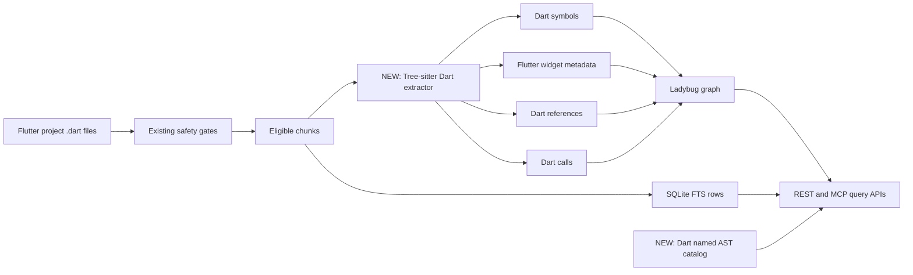
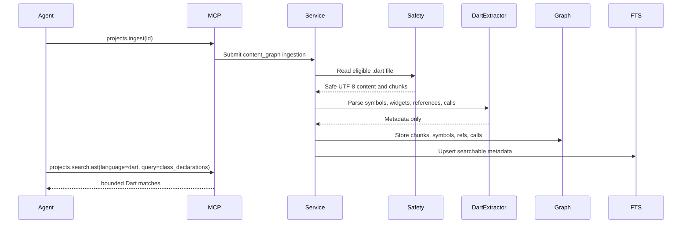

# Add Dart And Flutter Project Intelligence

| Field | Value |
| --- | --- |
| Ticket | N/A - free-text plan |
| Type | Free-text |
| Status | Draft |
| Author | plan-task skill |
| Date | 2026-05-31 |
| Classification | Internal; PII-prohibited |
| Owners | Mivia local `mivia-server` owner; dependency/security owner confirmation required |
| Linked Epic | N/A |

## 1. Context

`mivia-server` already indexes eligible local project files into chunks, symbols, references, calls, FTS rows, symbol source, call graph, and named AST search for Go, Python, JavaScript, JSX, TypeScript, TSX, and C#. Source anchors: `internal/projectingestion/service.go:48`, `internal/projectingestion/service.go:1604`, `internal/projectingestion/search_store.go:17`, `internal/projectingestion/treesitter_search_queries.go:83`. Dart is absent from the extractor registry, Tree-sitter parser imports, AST language catalog, REST/OpenAPI language enums, MCP docs, README, and agent guidance. Source anchors: `internal/projectingestion/extractor.go:46`, `internal/projectingestion/treesitter_extractor.go:11`, `internal/projectingestion/treesitter_search.go:111`, `api/openapi/agent-control.v1.yaml:738`, `api/mcp/agent-control.v1.md:514`, `README.md:392`. The goal is to support Flutter engineers by making `.dart` source participate in the same governed local content graph surfaces as existing promoted languages.

## 2. Problem statement

Flutter engineers can have `.dart` files chunked as eligible text today, but the system has no Dart parser, symbol extraction, reference/call extraction, first-class Flutter widget metadata, AST query catalog coverage, or documented REST/MCP contract support for Dart language searches.

## 3. Goals

- Add Dart `.dart` parser support for promoted AST extraction.
- Store Dart symbols, Flutter widget metadata, references, calls, chunks, FTS rows, and graph relationships through the existing content graph path.
- Add Dart to named AST search and catalog discovery.
- Index generated Dart files such as `.g.dart`, `.freezed.dart`, and `.mocks.dart` by default unless excluded by normal project config.
- Expose Dart and Flutter support consistently through REST, MCP, OpenAPI, README, and agent docs.
- Preserve localhost-only, opted-in `content_graph`, source-cap, skipped-sensitive, no-root, no-PII boundaries.

## 4. Non-goals

- No Flutter runtime analysis, build integration, device/emulator support, or `flutter analyze` integration.
- No Dart language server integration in this phase.
- No provider calls, embeddings, vectors, crawling, public exposure, or auth changes.
- No raw Tree-sitter query input.
- No compiler-grade cross-file Dart type resolution.
- No default exclusion of generated Dart files.

## 5. Acceptance criteria

Derived from requester decisions on 2026-05-31.

- [ ] AC-1: `.dart` files are handled by a Dart extractor and no longer produce empty symbol metadata solely because the language is unsupported.
- [ ] AC-2: Generated Dart files, including `.g.dart`, `.freezed.dart`, `.mocks.dart`, and similar generated outputs, are indexed by default unless the project include/exclude config explicitly filters them.
- [ ] AC-3: Dart symbols include imports, exports, classes, enums, mixins, extensions, extension types, typedef/type aliases, constructors, methods, getters, setters, top-level functions, and generated-file declarations where present.
- [ ] AC-4: Flutter widget recognition is first-class phase-one metadata: `StatelessWidget`, `StatefulWidget`, `State<T>`, widget `build` methods, `setState`, `Navigator`, route/build patterns, and widget class relationships are detectable where grammar shape makes them reliable.
- [ ] AC-5: Dart references and direct calls are stored with `resolution_status` and confidence, using unresolved metadata rather than guessed precision.
- [ ] AC-6: `projects.search.symbols`, `projects.search.references`, `projects.search.calls`, symbol source, callers, callees, call graph, file outline, file chunks, and FTS search work for eligible `.dart` files.
- [ ] AC-7: `projects.search.ast.queries` includes Dart catalog entries and coverage metadata.
- [ ] AC-8: `projects.search.ast` accepts `language=dart` and supports named query IDs for functions/methods, class/type declarations, imports, calls, assignments, error handling, and tests where grammar support is proven.
- [ ] AC-9: REST/OpenAPI and MCP schemas document `dart` and `.dart`.
- [ ] AC-10: Fixture tests cover representative Flutter code: `StatelessWidget`, `StatefulWidget`, `build`, `setState`, `Navigator`, imports, tests, async/await, extensions, mixins, and generated-file naming.
- [ ] AC-11: No skipped sensitive content, absolute roots, content hashes in public responses, raw parser errors, secrets, PII, raw prompts, or provider payloads are returned.

## 6. Constraints

- External systems: Jira and Confluence are not checked or linked for this repo. Source: `.ai/rules/05-external-systems.md`.
- Local source exception: source chunks may be stored only for opted-in `content_graph` projects after safety gates. Source: `docs/adr/0007-content-graph-ingestion-and-live-updates.md:21`.
- Privacy: PII ingestion remains prohibited without separate approval. Source: `.ai/rules/10-security-privacy.md`.
- Runtime boundary: REST/MCP remain localhost-only; no public exposure or auth change. Source: `docs/architecture/system-architecture.md:172`.
- Storage: SQLite schema changes must be idempotent and forward-only; no destructive resets. Source: `.ai/rules/30-docker-data.md`.
- Parser posture: promoted Tree-sitter languages must use mandatory parser/query validation and sanitized parse failures, not regex fallback. Source: `docs/architecture/system-architecture.md:177`.
- Dependency risk: adding `github.com/UserNobody14/tree-sitter-dart` is acceptable only if implementation review finds no better maintained Go-compatible Dart Tree-sitter grammar.
- API contract: raw Tree-sitter query syntax remains blocked; named query catalog only. Source: `api/mcp/agent-control.v1.md:510`.

## 7. Architecture / data flow

Dart enters the existing content graph path after safety gates. Chunks are already language-neutral; the new work adds Dart parser output and Flutter widget classification so graph, FTS, outline, symbol, reference, call, call graph, and AST search surfaces become useful for Flutter source.

## 8. User flow

_Not applicable - backend/local agent tooling change._

## 9. Sequence

## 10. Detailed implementation plan

1. **Dependency review and addition** - edit `go.mod` and `go.sum`:
   - Search for maintained Go-compatible Dart Tree-sitter grammars.
   - If no better maintained option exists, add `github.com/UserNobody14/tree-sitter-dart`.
   - Import planned path: `github.com/UserNobody14/tree-sitter-dart/bindings/go`.
   - Pin an explicit pseudo-version or tag available at implementation time; do not use floating `latest`.
   - Record dependency review in `docs/reports/tests/NEW: <date>-dart-parser-dependency-review.md`.

2. **Embedded Dart query file** - create `internal/projectingestion/queries/dart.scm`:
   - Include minimum startup-validation query captures for `class_definition`, `enum_declaration`, `mixin_declaration`, `extension_declaration`, `extension_type_declaration`, `type_alias`, `function_signature`, `constructor_signature`, `getter_signature`, `setter_signature`, `import_or_export`, `try_statement`, `throw_expression`, assignment expressions, and test invocations if grammar nodes are confirmed.
   - Include captures needed to classify Flutter widgets and widget build methods.
   - Keep it validation/extraction-owned; do not expose raw query text.

3. **Extractor registry** - edit `internal/projectingestion/extractor.go`:
   - Add `newTreeSitterDartExtractor()` to `NewDefaultExtractorRegistry` after existing Tree-sitter extractors.
   - Bump only the Dart extractor version when iterating Dart behavior; do not bump unrelated extractors.

4. **Tree-sitter Dart extractor** - edit `internal/projectingestion/treesitter_extractor.go`:
   - Add `ExtractorTreeSitterDart`.
   - Add `//go:embed queries/dart.scm`.
   - Import `tree_sitter_dart`.
   - Add `newTreeSitterDartExtractor()` with extension set `.dart` and `tree_sitter.NewLanguage(tree_sitter_dart.Language())`.
   - Extend `Parse` dispatch with `extractDartSymbols` and `extractDartOccurrences`.

5. **Dart symbol extraction** - edit `internal/projectingestion/treesitter_extractor.go` or create `NEW: internal/projectingestion/treesitter_dart.go`:
   - Implement `extractDartSymbols`.
   - Map:
     - `import_or_export` / import nodes to `SymbolKindImport` or `SymbolKindExport`.
     - `class_definition` to `SymbolKindClass`.
     - `mixin_declaration`, `extension_declaration`, `extension_type_declaration`, `enum_declaration`, `type_alias` to `SymbolKindType`.
     - `function_signature` to `SymbolKindFunction`.
     - `constructor_signature`, class member function signatures, getter/setter signatures, and operator signatures to `SymbolKindMethod`.
   - Preserve line, byte, and column spans like `namedSymbolFromNode`.
   - Ensure generated Dart files follow the same symbol extraction path as hand-written Dart files.

6. **Flutter widget metadata** - create `NEW: internal/projectingestion/flutter_metadata.go` or keep in `treesitter_dart.go` if small:
   - Detect classes extending `StatelessWidget`, `StatefulWidget`, and `State<T>`.
   - Detect `Widget build(BuildContext context)` methods.
   - Detect `setState(...)`, `Navigator.*(...)`, route builder calls, and common widget constructor calls as call/reference metadata.
   - Represent widget recognition using existing `Symbol`, `Reference`, and `Call` fields first; add a narrow metadata field only if existing models cannot represent the classification without ambiguity.
   - Do not store raw widget subtree source outside existing eligible chunk storage.

7. **Dart references and calls** - edit `internal/projectingestion/treesitter_extractor.go` or `NEW: internal/projectingestion/treesitter_dart.go`:
   - Implement `extractDartOccurrences`.
   - Track enclosing function/method/build method from function/member signature nodes.
   - Extract call candidates from `selector` plus `argument_part`, constructor/object expressions, and direct identifier call shapes confirmed by fixtures.
   - Extract identifier references while excluding declarations, imports, parameters, labels, and type-only nodes where grammar shape makes that reliable.
   - Set `ResolutionStatus: "unresolved"` and `Confidence: "candidate"` unless existing resolver proves a target.

8. **Named AST catalog** - edit `internal/projectingestion/treesitter_search.go` and `internal/projectingestion/treesitter_search_queries.go`:
   - Add Dart to `astSearchLanguage`.
   - Add `dart: {".dart"}` to `astSearchLanguageExtensions`.
   - Add Dart catalog entries for `function_declarations`, `class_declarations`, `type_declarations`, `call_expressions`, `imports`, `test_functions`, `assignments`, and `error_handling` where fixtures prove valid queries.
   - Add Flutter-specific named catalog entries only if they are stable and clearly named, for example `flutter_widgets` and `flutter_build_methods`.
   - Add `dart` alias normalization only if needed; keep accepted language value exactly `dart`.

9. **Generated Dart file handling** - edit docs and tests, and only code if current include/exclude logic accidentally filters generated Dart:
   - Confirm `.g.dart`, `.freezed.dart`, `.mocks.dart`, and similar generated files pass existing path and extension filters.
   - Add tests proving generated Dart files are eligible when not explicitly excluded.
   - Do not add a generated-file denylist.

10. **Contracts and schemas** - edit `api/openapi/agent-control.v1.yaml` and `api/mcp/agent-control.v1.md`:
    - Add `dart` to AST language enums.
    - Add `.dart` to language/catalog descriptions.
    - Update AST query catalog response examples and MCP tool input docs.
    - Keep raw query syntax explicitly unsupported.

11. **REST/MCP implementation docs and guidance** - edit:
    - `README.md`
    - `docs/agent-context-guide.md`
    - `docs/architecture/system-architecture.md`
    - `docs/configuration/local-projects.md`
    - Mention Dart/Flutter in promoted AST coverage, discovery workflow, generated-file indexing behavior, and examples.
    - Do not link `.ai/tasks/*`.

12. **Tests** - create/update:
    - `internal/projectingestion/treesitter_dart_test.go`
    - `internal/projectingestion/treesitter_search_test.go`
    - `internal/projectingestion/extractor_test.go`
    - `internal/projectingestion/extractor_cache_test.go`
    - `internal/projectingestion/service_test.go`
    - `internal/projectregistry/httpapi/httpapi_test.go`
    - `internal/projectregistry/mcpapi/mcpapi_test.go`
    - `internal/agentcontrol/mcpapi/mcpapi_test.go` only if top-level routing has Dart-specific assertions.
    - Use synthetic Flutter/Dart fixtures only; no real client source.

## 11. Data model changes

Expected default: none.

Existing models already support chunks, symbols, references, calls, file state, extractor cache, graph writes, and FTS rows:

- `internal/projectingestion/model.go:79`
- `internal/projectingestion/model.go:109`
- `internal/projectingestion/model.go:123`
- `internal/projectingestion/model.go:141`
- `internal/projectingestion/graph_store.go:36`
- `internal/projectingestion/search_store.go:17`

If first-class Flutter widget recognition cannot be represented clearly with existing symbol/reference/call metadata, add the smallest additive metadata field or symbol kind needed. Do not introduce a separate graph schema unless implementation proves the existing graph model cannot express widget classification.

## 12. Contract / API changes

Additive only.

- OpenAPI: `language` enum adds `dart`.
- MCP docs: `projects.search.ast` input language list adds `dart`.
- AST catalog: returns Dart query metadata and `.dart` extensions.
- Documentation states generated Dart files are indexed by default.
- Documentation states Flutter widget recognition is supported where extractor metadata can detect it reliably.
- No existing REST or MCP endpoint shape changes unless a new additive Flutter metadata field is needed.
- No raw Dart AST dumps.
- No raw parser errors.

## 13. Testing strategy

- **Unit:** `internal/projectingestion/treesitter_dart_test.go` for imports, exports, classes, Flutter widget classes, constructors, methods, getters/setters, top-level functions, enums, mixins, extensions, extension types, typedefs, calls, references, async/await, try/catch, assignments, and tests.
- **Unit:** `internal/projectingestion/treesitter_dart_test.go` for generated file names: `.g.dart`, `.freezed.dart`, `.mocks.dart`, and one arbitrary generated suffix.
- **Unit:** `internal/projectingestion/treesitter_dart_test.go` for Flutter metadata: `StatelessWidget`, `StatefulWidget`, `State<T>`, `build`, `setState`, `Navigator`, route builders, and widget constructor calls.
- **Unit:** `internal/projectingestion/extractor_test.go` proves `.dart` dispatch and startup validation failure remains sanitized.
- **Unit:** `internal/projectingestion/treesitter_search_test.go` proves Dart named AST query catalog and search results.
- **Service:** `internal/projectingestion/service_test.go` proves `.dart` ingestion stores chunks, symbols, references, calls, symbol source, outline, and FTS rows.
- **REST:** `internal/projectregistry/httpapi/httpapi_test.go` proves `language=dart` accepted and unsupported/bad query inputs sanitized.
- **MCP:** `internal/projectregistry/mcpapi/mcpapi_test.go` proves `projects.search.ast`, `projects.search.ast.queries`, `projects.search.symbols`, `projects.search.references`, and `projects.search.calls` work for Dart.
- **Privacy:** sensitive marker fixture in `.dart` must be skipped without storing or returning matched sensitive text.
- **Full:** run focused package tests, then `go test ./...`.

## 14. Observability

- **Logs:** no raw Dart source, parser node text, skipped sensitive text, roots, secrets, PII, raw prompts, or provider payloads.
- **Metrics:** none required unless existing metrics are extended later.
- **Traces:** none.
- **Status:** existing run counts cover files/chunks/symbols; do not add Dart-specific source-bearing status fields.

## 15. Documentation updates

- `README.md`
- `docs/agent-context-guide.md`
- `docs/architecture/system-architecture.md`
- `docs/configuration/local-projects.md`
- `api/openapi/agent-control.v1.yaml`
- `api/mcp/agent-control.v1.md`
- `docs/reports/tests/NEW: <date>-dart-parser-dependency-review.md`

## 16. Rollout / migration

- Additive parser and contract change.
- Existing projects need reingestion before Dart symbols/references/calls/widget metadata appear.
- Existing `.dart` chunks, if already indexed as raw eligible chunks, become richer after reingestion.
- Generated Dart files are indexed by default on the same reingestion path unless excluded by project config.
- Rollback is forward fix: remove/disable Dart extractor and catalog entries, then reingest affected local projects.
- No destructive graph or SQLite reset is part of rollout.

## 17. Security, privacy, compliance

- **PII surfaces touched:** eligible local source text only; PII remains prohibited.
- **Vault interactions:** none.
- **PDPL / NCA-ECC / SAMA / ZATCA / TGA touchpoints:** none beyond existing PII-prohibited local developer-workstation boundary.
- **AuthN / AuthZ changes:** none.
- **Data residency:** local workstation only.
- **Dependency review:** required before pinning the Dart parser; `github.com/UserNobody14/tree-sitter-dart` is acceptable only if no better maintained Go-compatible Dart grammar is found.
- **Generated source:** generated Dart files are not inherently sensitive and must follow normal content graph safety gates; no special privacy bypass.
- **Privacy floor:** no skipped sensitive content, matched sensitive text, roots, content hashes in public responses, raw parser errors, secrets, PII, raw prompts, or provider payloads.

## 18. Risks and mitigations

| Risk | Likelihood | Impact | Mitigation |
| --- | --- | --- | --- |
| Dart grammar dependency is less mature than current parser dependencies | Medium | High | Search for alternatives, pin exact version, document dependency review, add startup validation and fixture coverage |
| Dart grammar node names differ from assumptions | Medium | Medium | Build first implementation from fixture-driven syntax dumps and parser tests before broad extraction |
| Generated files add noisy symbols | High | Medium | Index by default per owner decision; document include/exclude controls and add generated-file tests |
| Flutter widget recognition becomes overfit to narrow examples | Medium | Medium | Cover common widget patterns and expose confidence/unresolved metadata instead of pretending full framework analysis |
| Dynamic/cascade calls are ambiguous | High | Medium | Store unresolved candidate metadata with confidence, never guessed resolved edges |
| Parser failures skip useful files | Medium | Medium | Sanitized `parse_error` file state plus targeted grammar fixtures for common Flutter syntax |
| Sensitive Dart fixture leaks into chunks/search | Low | High | Reuse safety gates and add `.dart` sensitive-marker regression tests |

## 19. Out of scope

- Dart LSP integration.
- Flutter build/test execution.
- Runtime widget tree analysis.
- Pub dependency graph analysis.
- Default generated-code exclusion.
- Compiler-grade cross-file resolution.
- Provider calls, embeddings, vectors, crawling, public APIs, auth changes.

## 20. Open questions

- None from Mivia engineering as of 2026-05-31.
- Implementation-time dependency check remains required: use `github.com/UserNobody14/tree-sitter-dart` only if no better maintained Go-compatible Dart Tree-sitter grammar is found.

## 21. References

- **Jira:** not checked by repo constraint.
- **Confluence:** not checked by repo constraint.
- **In-repo docs:**
  - `.ai/INDEX.md` - MCP-first routing and repo constraints.
  - `.ai/rules/05-external-systems.md` - no Jira/Confluence.
  - `.ai/rules/10-security-privacy.md` - PII and logging prohibitions.
  - `.ai/rules/20-go-service-standards.md` - Go service and REST/MCP standards.
  - `.ai/rules/30-docker-data.md` - local database and forward-only posture.
  - `docs/adr/0007-content-graph-ingestion-and-live-updates.md` - accepted local-source exception.
  - `docs/security/research-data-handling.md` - content graph privacy boundary.
  - `docs/architecture/system-architecture.md` - current service and AST support.
  - `docs/configuration/local-projects.md` - content graph and MCP/REST surface docs.
  - `docs/plans/2026-05-30-project-search-and-embedded-ast-search-plan.md` - prior AST/search rollout context.
- **ADRs:**
  - `docs/adr/0006-local-project-configuration.md`
  - `docs/adr/0007-content-graph-ingestion-and-live-updates.md`
- **Policies:** `.ai/rules/10-security-privacy.md`, `.ai/rules/30-docker-data.md`.
- **Catalog entries:** none present in repo.
- **External references:**
  - Go Tree-sitter bindings: `https://github.com/tree-sitter/go-tree-sitter`
  - Tree-sitter Dart Go package: `https://pkg.go.dev/github.com/UserNobody14/tree-sitter-dart/bindings/go`
  - Tree-sitter Dart repository: `https://github.com/UserNobody14/tree-sitter-dart`
- **Source anchors:**
  - `internal/projectingestion/chunker.go:14`
  - `internal/projectingestion/model.go:79`
  - `internal/projectingestion/model.go:109`
  - `internal/projectingestion/model.go:123`
  - `internal/projectingestion/model.go:141`
  - `internal/projectingestion/extractor.go:21`
  - `internal/projectingestion/extractor.go:46`
  - `internal/projectingestion/treesitter_extractor.go:11`
  - `internal/projectingestion/treesitter_extractor.go:18`
  - `internal/projectingestion/treesitter_extractor.go:49`
  - `internal/projectingestion/treesitter_extractor.go:152`
  - `internal/projectingestion/treesitter_search.go:111`
  - `internal/projectingestion/treesitter_search.go:222`
  - `internal/projectingestion/treesitter_search_queries.go:83`
  - `internal/projectingestion/treesitter_search_queries.go:93`
  - `internal/projectingestion/service.go:48`
  - `internal/projectingestion/service.go:1581`
  - `internal/projectingestion/service.go:1604`
  - `internal/projectingestion/search_store.go:17`
  - `internal/projectregistry/httpapi/httpapi.go:247`
  - `internal/projectregistry/mcpapi/mcpapi.go:454`
  - `api/openapi/agent-control.v1.yaml:738`
  - `api/openapi/agent-control.v1.yaml:1591`
  - `api/mcp/agent-control.v1.md:514`
  - `README.md:392`

## 22. Confidence notes

High confidence that Dart is missing from the current code and contracts because source and docs enumerate supported AST languages without `dart`. High confidence that chunks, graph writes, extractor cache, FTS rows, references, calls, symbol source, and AST search already have reusable language-neutral paths. High confidence on owner decisions: generated Dart files must be indexed and Flutter widget recognition is phase-one scope. Medium confidence on exact Dart Tree-sitter node mappings until implementation verifies them with fixture syntax dumps and parser tests. Medium confidence on dependency choice until implementation confirms no better maintained Go-compatible Dart grammar exists.
