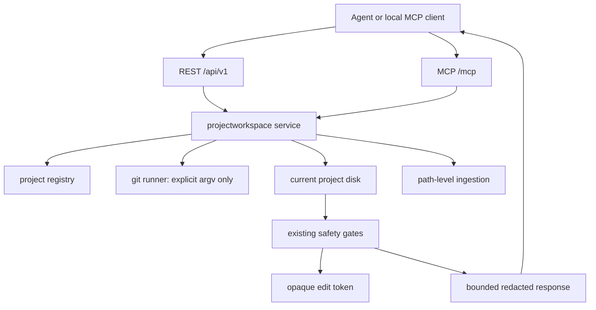

# MCP Git Diff And Exact File Edit Plan

Status: Draft, source-grounded
Date: 2026-05-31
Classification: Internal; PII-prohibited
Mode: Free-text plan; no Jira or Confluence used by repository constraint.

## 1. Intent

MiviaLabs MCP should cover two remaining high-frequency local-agent operations that currently force agents back to shell:

1. inspect git working-tree state and diffs for an opted-in local project;
2. apply exact, bounded file edits after the agent has already narrowed the target through indexed project context.

This must not become arbitrary shell execution, a raw filesystem browser, a public write API, or a way around ingestion safety gates. Shell remains authoritative for tests, builds, process logs, generated files, and commands outside this narrow contract.

## 2. Current State Evidence

Code-grounded facts:

- REST project routes are registered in `internal/projectregistry/httpapi/httpapi.go` and already expose project metadata, ingestion, search, files, chunks, symbols, references, calls, AST search, and outlines under `/api/v1/projects/{id}/...`.
- MCP project tools are registered in `internal/projectregistry/mcpapi/mcpapi.go`; schemas use `additionalProperties: false`, support dotted and underscore aliases, and return structured content plus JSON text.
- The public MCP handler in `internal/agentcontrol/mcpapi/mcpapi.go` sanitizes project errors into generic JSON-RPC messages such as `invalid tool arguments`, `resource not found`, or `internal error`.
- Project roots are loaded and validated by `internal/projectregistry/service.go`. Enabled roots must be absolute, existing directories, and must not resolve through symlinks.
- Project responses intentionally omit root paths via `projectregistry.MetadataForProject` in `internal/projectregistry/model.go`.
- Ingestion safety is centralized in `internal/projectingestion/safety.go`: project-relative path normalization, denied-path checks, binary/NUL/UTF-8 checks, max-file caps, and sensitive-content detection.
- Ingestion path handling in `internal/projectingestion/service.go` already validates project-relative paths, blocks root escape, removes extractor/search rows for skipped or absent files, and uses `IngestPath` for path-level freshness.
- Current config parsing in `internal/platform/config/file.go` rejects unknown TOML fields, so any new write-capability flag must be explicitly added and tested.
- OpenAPI and MCP contracts live in `api/openapi/agent-control.v1.yaml` and `api/mcp/agent-control.v1.md`; docs and skills must be updated when project capabilities change.

Documentation-grounded constraints:

- `.ai/INDEX.md` routes indexed context to MiviaLabs MCP first and shell only for exact working-tree facts.
- `.ai/rules/10-security-privacy.md` and `docs/security/privacy-baseline.md` prohibit secrets, PII, raw prompts, provider payloads, and sensitive data exposure.
- `docs/adr/0007-content-graph-ingestion-and-live-updates.md` approves only a narrow local-source exception for explicitly opted-in local projects.
- `docs/business-overview.md` states the server is not a raw database browser, public service, provider crawler, embedding/vector store, or arbitrary root crawler.

Skipped sources:

- Jira and Confluence were not used. The repository explicitly prohibits Jira/Confluence for this repo unless overridden in the same request.
- Internet research was not needed. The implementation can use Go stdlib process execution and filesystem APIs plus existing repo safety code; no new external protocol or dependency decision is required.

## 3. Problem Statement

Agents now use MiviaLabs MCP for indexed discovery, search, chunks, symbol source, calls, and AST search. They still need shell for:

- `git status` / `git diff` to understand current uncommitted work;
- exact disk reads after live edits but before ingestion catches up;
- exact edits to files once target spans are known.

Leaving these operations shell-only weakens the governed workflow. Agents can over-scan, expose roots in logs, read skipped sensitive files, or make broad edits without the same path and content gates the server already enforces.

## 4. Goals

- Add governed workspace tools for configured, enabled, opted-in local projects.
- Provide parsed git status and capped unified diff output without raw shell access.
- Provide current-disk file read for eligible text files with bounded output and an opaque edit token.
- Provide exact file edit application using byte spans plus expected old text, guarded by the opaque edit token.
- Reuse existing project root validation, include/exclude rules, denied path rules, size caps, UTF-8 checks, and sensitive-content detection.
- Trigger path-level ingestion after successful edits so live ingestion remains the freshness path.
- Keep REST and MCP contracts parallel unless a capability is intentionally MCP-only; for this plan, add both.
- Keep errors sanitized and responses free of roots, datastore paths, raw command lines, raw stderr, raw stack traces, content hashes, skipped sensitive text, secrets, PII, raw prompts, and provider payloads.

## 5. Non-Goals

- No arbitrary shell command endpoint.
- No raw filesystem traversal outside configured projects.
- No writes outside a project root.
- No writes to denied, skipped, sensitive, binary, oversized, invalid UTF-8, symlinked, or absent parent paths.
- No git commit, push, checkout, reset, branch, merge, rebase, stash, clean, or restore tools in this phase.
- No formatter, LSP, codemod, AST rewrite engine, or multi-file refactor engine.
- No raw patch upload as the first write API.
- No public exposure, auth changes, provider calls, embeddings, vectors, crawling, raw DB queries, or production deployment.

## 6. Proposed Capability Map



## 7. API Contract

Add a new internal package:

- `internal/projectworkspace`

Do not add these methods to `internal/projectingestion.API`; ingestion is storage/indexing, while workspace operations are current-disk and write-capable.

Service interface:

```go
type API interface {
    GitStatus(ctx context.Context, projectID string, options GitStatusOptions) (GitStatus, error)
    GitDiff(ctx context.Context, projectID string, options GitDiffOptions) (GitDiff, error)
    ReadFile(ctx context.Context, projectID string, options ReadFileOptions) (WorkspaceFile, error)
    EditFile(ctx context.Context, projectID string, options EditFileOptions) (EditResult, error)
}
```

REST endpoints:

- `GET /api/v1/projects/{id}/workspace/git/status`
- `GET /api/v1/projects/{id}/workspace/git/diff`
- `GET /api/v1/projects/{id}/workspace/files/read?file_id=...`
- `GET /api/v1/projects/{id}/workspace/files/read?relative_path=...`
- `POST /api/v1/projects/{id}/workspace/files/edit`

MCP tools:

- `projects.workspace.git_status`
- `projects.workspace.git_diff`
- `projects.workspace.file_read`
- `projects.workspace.file_edit`

Use underscore aliases in MCP:

- `projects_workspace_git_status`
- `projects_workspace_git_diff`
- `projects_workspace_file_read`
- `projects_workspace_file_edit`

### Git Status

Inputs:

- `id` required.
- `include_untracked` optional bool, default `true`.
- `path_prefix` optional safe project-relative prefix.
- `page_size`, `page_token` optional.

Output:

- `project_id`
- `branch` and `head_oid_short` only if returned by git without stderr parsing.
- `entries[]`: `relative_path`, `status`, `staged_status`, `worktree_status`, `renamed_from` when safe.
- `truncated`, `next_page_token`.

No root paths, raw porcelain output, raw stderr, or command line echo.

### Git Diff

Inputs:

- `id` required.
- `scope`: `working_tree`, `staged`, or `head`; default `working_tree`.
- one of `file_id` or `relative_path` optional.
- `path_prefix` optional.
- `context_lines` optional, bounded `0..10`, default `3`.
- `max_diff_bytes` optional, bounded by server constant, default `65536`.
- `page_token` optional for large diff continuation.

Output:

- `files[]`: safe relative path, status, additions, deletions, `diff` string.
- `diff_truncated`, `next_page_token`.
- `skipped[]`: safe reason codes such as `denied_path`, `sensitive_content`, `file_too_large`, `binary_content`, or `invalid_utf8`.

Implementation must filter paths through project include/exclude and `EvaluateSafety` before returning content. It must also scan the produced diff text with existing redaction/sensitive markers before returning it. If the diff itself trips the sensitive scanner, return only a skipped reason for that file.

### Workspace File Read

Inputs:

- `id` required.
- one of `file_id` or `relative_path` required.
- `max_bytes` optional, bounded by project max chunk/file caps.

Output:

- safe file metadata: `file_id`, `relative_path`, `extension`, `size_bytes`, `modified_at`.
- `text`, capped by `max_bytes`.
- `text_truncated`.
- `line_count`.
- `edit_token`, opaque and non-reversible.

The edit token is not a content hash. Generate it as a per-process HMAC or equivalent opaque token over project ID, normalized relative path, current content hash, size, mtime, and a random server secret. Raw content hashes must not appear in responses. Tokens may become invalid after server restart.

### Workspace File Edit

Inputs:

- `id` required.
- one of `file_id` or `relative_path` required.
- `edit_token` required.
- `dry_run` optional bool, default `false`.
- `edits[]` required, non-empty:
  - `start_byte` inclusive
  - `end_byte` exclusive
  - `old_text` required
  - `new_text` required

Validation:

- Resolve path inside canonical project root.
- Reject symlink targets and symlink parent traversal.
- Reject denied or excluded paths.
- Read current file and verify it is eligible text under `EvaluateSafety`.
- Verify `edit_token` against the current content state.
- Verify all spans are ordered, non-overlapping, valid UTF-8 boundaries, and `old_text` exactly matches the current bytes.
- Apply edits in memory.
- Re-run `EvaluateSafety` on the full new content before writing.
- Reject if new content becomes sensitive, binary, invalid UTF-8, too large, or denied.

Output:

- `applied` bool.
- safe file metadata after edit.
- `diff_preview`, capped and sensitive-scanned.
- `text_truncated` for preview if capped.
- `ingestion_run_id` when path ingestion is queued.
- `new_edit_token` only when the resulting file is still eligible.

Writes:

- For `dry_run=true`, do not write and do not trigger ingestion.
- For `dry_run=false`, write atomically to a temp file in the same directory, preserve existing file permissions, fsync best-effort, rename into place, then trigger path ingestion through the scheduler.

## 8. Config And Capability Gate

Add one global gate and one per-project mode. Defaults must disable all workspace tools.

TOML:

```toml
[workspace]
enabled = false

[[projects]]
workspace_mode = "disabled" # disabled | read_only | edit
```

Rules:

- `workspace.enabled=false`: no workspace tools are available for any project.
- `workspace_mode="disabled"`: reject all workspace operations for that project.
- `workspace_mode="read_only"`: allow git status, git diff, and workspace file read.
- `workspace_mode="edit"`: allow read-only operations plus exact file edits.
- `workspace_mode="read_only"` and `workspace_mode="edit"` require `digest_mode="content_graph"` because diff/read/edit can return or process source text. Metadata-only projects may continue to use metadata digest without workspace source exposure.
- `workspace_mode` does not change `digest_mode`, `update_policy`, or ingestion safety behavior.

Affected config files:

- `internal/platform/config/config.go`
- `internal/platform/config/file.go`
- `internal/platform/config/*_test.go`
- `internal/projectregistry/model.go`
- `internal/projectregistry/service.go`
- `configs/agent-server.example.toml`
- `docs/configuration/local-projects.md`

## 9. Implementation Steps

### Phase 1 - Workspace Domain

Add:

- `internal/projectworkspace/model.go`
- `internal/projectworkspace/service.go`
- `internal/projectworkspace/git.go`
- `internal/projectworkspace/edit_token.go`
- `internal/projectworkspace/service_test.go`

Implement:

1. `Service` with `Registry`, optional `projectingestion.API`, `GitRunner`, `now`, and per-file lock map.
2. Project/mode resolver that rejects disabled projects and modes before touching disk.
3. Safe relative path resolver shared by read, diff, and edit.
4. Git runner using `exec.CommandContext` with explicit argv only; no shell, no user-controlled flags beyond enum-mapped options.
5. Status parser for `git status --porcelain=v2 --branch -z`.
6. Diff runner for explicit safe args only:
   - `git diff --no-ext-diff --no-color --unified=<n> -- <paths...>`
   - `git diff --cached --no-ext-diff --no-color --unified=<n> -- <paths...>`
   - `git diff HEAD --no-ext-diff --no-color --unified=<n> -- <paths...>`
7. Diff filtering and sensitive scanning before response.
8. Read/edit path using current disk, not indexed chunks.
9. Exact edit apply with token verification, non-overlap checks, old-text checks, post-edit safety, atomic write, and path ingestion submission.

### Phase 2 - REST Adapter

Update `internal/projectregistry/httpapi/httpapi.go`:

- Accept a `projectworkspace.API` in `RegisterRoutesWithIngestion` or add `RegisterRoutesWithWorkspace`.
- Add four workspace route handlers.
- Reuse existing response/error style, but add workspace error mapping.
- Keep success responses direct JSON and failures sanitized.

Add tests in `internal/projectregistry/httpapi/httpapi_test.go`:

- workspace tools unavailable when global/project gates disabled;
- git status redacts root and does not echo raw command;
- diff rejects denied/sensitive paths and caps output;
- file read returns capped text plus opaque token, not content hash;
- edit applies exact span, queues ingestion, and does not leak roots or hashes;
- stale token and old-text mismatch fail without writing.

### Phase 3 - MCP Adapter

Update `internal/projectregistry/mcpapi/mcpapi.go`:

- Add tool definitions with strict schemas and `additionalProperties: false`.
- Add dotted and underscore aliases.
- Route calls to `projectworkspace.API`.
- Return structured content and JSON text like existing project tools.

Update `internal/agentcontrol/mcpapi/mcpapi.go`:

- Carry `projectworkspace.API` through handler construction.
- Add sanitized error mapping for workspace errors.
- Keep JSON-RPC errors generic.

Add tests:

- `internal/projectregistry/mcpapi/mcpapi_test.go`
- `internal/agentcontrol/mcpapi/mcpapi_test.go`

Required assertions:

- tools list includes workspace tools only when workspace API is configured;
- unknown fields rejected;
- root paths, raw stderr, command lines, content hashes, skipped sensitive content, secrets, PII, raw prompts, provider payloads are not returned;
- underscore aliases work.

### Phase 4 - Server Wiring

Update `cmd/agent-server/main.go`:

- Build `projectworkspace.Service` only when `cfg.Workspace.Enabled` is true.
- Inject it into REST and MCP adapters.
- Pass the scheduler as the path-ingestion API so successful edits can queue `IngestPath`.

Do not start extra background workers. Do not create a second scheduler.

### Phase 5 - Contracts And Docs

Update:

- `api/openapi/agent-control.v1.yaml`
- `api/mcp/agent-control.v1.md`
- `README.md`
- `docs/business-overview.md`
- `docs/agent-context-guide.md`
- `docs/architecture/system-architecture.md`
- `docs/configuration/local-projects.md`
- `docs/runbooks/local-dev.md`
- `.ai/INDEX.md`
- `.ai/skills/mivialabs-agent-mcp/SKILL.md`

Docs must state:

- MCP can now cover governed git status/diff and exact edits for opted-in projects.
- Shell remains required for tests, builds, logs, process control, arbitrary commands, generated-file verification, and non-indexed/non-opted-in repos.
- Edits require `workspace_mode="edit"` and an edit token from current disk read.
- No arbitrary shell, commit, push, reset, checkout, or raw patch endpoint exists.

## 10. Test Plan

Narrow package tests:

```sh
/home/mac/.local/go1.26.3/bin/go test ./internal/platform/config
/home/mac/.local/go1.26.3/bin/go test ./internal/projectworkspace
/home/mac/.local/go1.26.3/bin/go test ./internal/projectregistry/httpapi ./internal/projectregistry/mcpapi ./internal/agentcontrol/mcpapi
```

Full verification:

```sh
/home/mac/.local/go1.26.3/bin/go test ./internal/projectingestion
/home/mac/.local/go1.26.3/bin/go test ./...
git diff --check
```

Specific regression cases:

- Config rejects unknown workspace fields and unsupported `workspace_mode`.
- Workspace defaults disabled.
- Read-only mode rejects edits.
- Edit mode requires `content_graph`.
- Relative path traversal, absolute paths, Windows/UNC paths, and symlink paths are rejected.
- Denied paths such as `.git/**`, `data/**`, `secrets/**`, `.env*`, `node_modules/**`, `vendor/**`, and key/cert files are rejected.
- Sensitive current file cannot be read or edited.
- Edit that introduces sensitive markers is rejected and leaves disk unchanged.
- Diff containing sensitive markers is withheld with a safe reason.
- Large diff is capped and paginated/truncated.
- Stale edit token fails after disk changes.
- Overlapping spans and invalid UTF-8 boundaries fail.
- Successful edit queues path ingestion and updated search eventually reflects the edit.
- Responses do not contain roots, datastore paths, command lines, raw stderr, content hashes, skipped sensitive text, secrets, PII, raw prompts, provider payloads, raw parser errors, raw SQLite/FTS errors, or stack traces.

## 11. Security And Privacy Review

Risk level: high for write capability, medium for read-only diff.

Required controls:

- Default disabled globally and per project.
- Localhost boundary unchanged.
- No arbitrary command execution.
- Git invoked with explicit argv only, no shell.
- Path resolution must use canonical project root and reject symlinks.
- All returned content must pass existing safety checks and response caps.
- Edit tokens must be opaque and non-reversible.
- Request bodies must not be logged.
- Raw command stderr must not be returned.
- Existing sensitive marker policy remains `skip_file`; no weaker mode.

The plan intentionally does not add authentication. Therefore this feature must stay loopback-only. Any public exposure still requires a separate authn/authz, origin, rate-limit, audit, monitoring, and incident-response design.

## 12. Operational Notes

- Git must be available on the server host path for git tools; if missing, return sanitized `git_unavailable`.
- If a project root is not a git worktree, return sanitized `git_unavailable`.
- Edit tokens are per-process. After restart, clients must call `projects.workspace.file_read` again.
- The in-process per-file lock only serializes writes in one server process. This is acceptable for the current localhost single-process model; do not claim cross-process locking.
- Successful edits should queue ingestion but not block until ingestion completes. Clients can poll ingestion status or rely on live update freshness.

## 13. Risks

- Diff output can contain secrets or PII. Mitigation: path filters, safety scan current content, scan diff text, cap output, withhold suspicious diff.
- Exact edits can overwrite user changes. Mitigation: opaque edit token plus exact `old_text` span validation.
- Git rename/deletion diffs may include old content that no longer exists on disk. Mitigation: still scan diff text; withhold if sensitive. For denied paths, do not return content.
- Server restart invalidates edit tokens. Mitigation: documented behavior; clients reread before editing.
- Multi-process writes are not serialized. Mitigation: current deployment is local single process; do not overbuild distributed locks.
- Adding write tools increases blast radius if loopback boundary is weakened later. Mitigation: default disabled and keep public exposure blocked until a separate auth design exists.

## 14. Open Questions

1. Should git status alone be allowed for `metadata_only` projects? Recommendation: no in the first pass. Keep one simple `workspace_mode` rule: workspace source-adjacent tools require `content_graph`.
2. Should exact edits support create-file in the first pass? Recommendation: no. Add create-file later only if exact-edit workflow proves insufficient.
3. Should a future phase support `git apply --check` style patch previews? Recommendation: not in this phase; span edits are easier to validate and less likely to become a raw patch execution surface.

## 15. Acceptance Criteria

- [ ] `projects.workspace.git_status` and REST equivalent return parsed, paginated status for opted-in projects without roots or raw command output.
- [ ] `projects.workspace.git_diff` and REST equivalent return capped safe diffs only for allowed paths and withhold sensitive diffs.
- [ ] `projects.workspace.file_read` and REST equivalent return current eligible text plus opaque edit token without content hashes.
- [ ] `projects.workspace.file_edit` and REST equivalent apply token-guarded exact byte-span edits, reject stale/mismatched/sensitive edits, and queue path ingestion after success.
- [ ] Workspace capabilities are disabled by default and require explicit global plus per-project opt-in.
- [ ] MCP tools have strict schemas, dotted names, and underscore aliases.
- [ ] OpenAPI, MCP docs, README, architecture docs, config docs, runbook, and MCP skill are updated.
- [ ] Tests cover gating, safety, privacy leaks, diff caps, edit concurrency, stale token, exact old-text matching, denied/sensitive paths, and ingestion freshness.

## 16. References

- `internal/projectregistry/httpapi/httpapi.go` - existing REST project route registration and handler patterns.
- `internal/projectregistry/mcpapi/mcpapi.go` - existing MCP project tool definitions, aliases, and call routing.
- `internal/agentcontrol/mcpapi/mcpapi.go` - MCP transport, tool dispatch, and sanitized error mapping.
- `internal/projectregistry/model.go` - project metadata redaction and project model.
- `internal/projectregistry/service.go` - config-to-project normalization and root validation.
- `internal/projectregistry/patterns.go` - include/exclude validation and default denied local datastore paths.
- `internal/projectingestion/safety.go` - reusable file content safety gates.
- `internal/projectingestion/service.go` - path ingestion, canonical-root checks, and stale row cleanup.
- `internal/platform/config/config.go` and `internal/platform/config/file.go` - config defaults, TOML parsing, unknown field rejection.
- `api/openapi/agent-control.v1.yaml` and `api/mcp/agent-control.v1.md` - public local REST/MCP contracts.
- `.ai/INDEX.md` and `.ai/skills/mivialabs-agent-mcp/SKILL.md` - agent routing and MCP-first workflow guidance.

## 17. Validation Pass

Reread after drafting and tightened:

- REST file read/edit paths now support either `file_id` or `relative_path` without encoding one required selector into the URL shape.
- `workspace_mode="read_only"` and `workspace_mode="edit"` now require `digest_mode="content_graph"` because both read-only diff and current file read can expose source text.
- The plan keeps git status/diff/edit narrow and does not add arbitrary shell, raw patch upload, commit, push, checkout, reset, or formatting tools.
- The plan uses existing safety gates and adds token/old-text validation instead of broad file write primitives.
