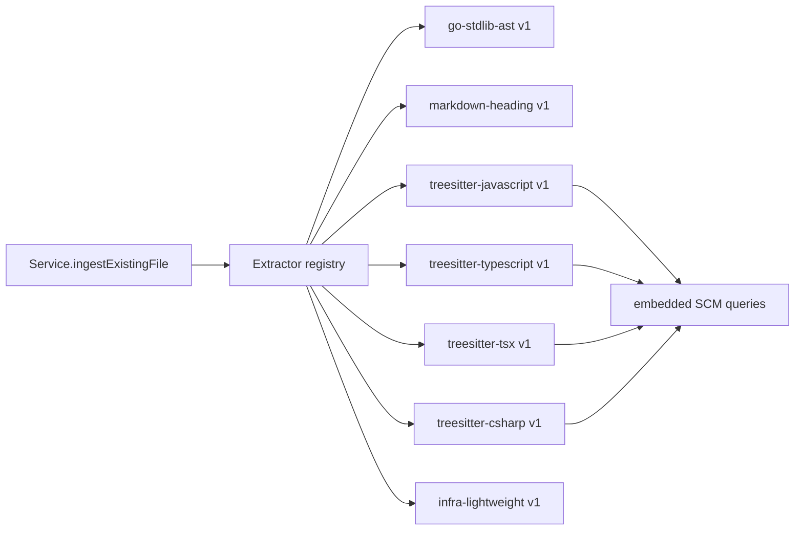
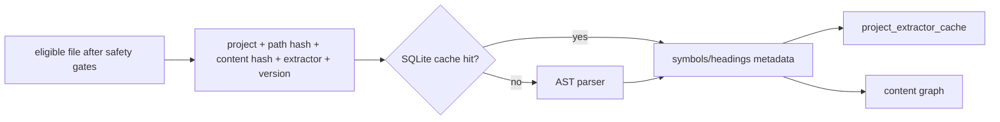
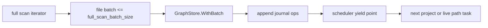
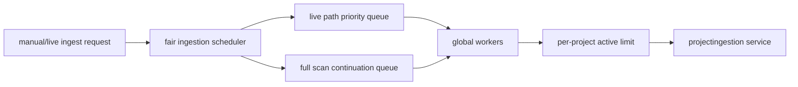

# Agent MCP Promoted AST Extraction And Live Rescan Plan

Date: 2026-05-30

## Scope

Validate and harden the promoted AST extraction, bounded full-rescan, and fair live-ingestion plan after P2. This is an implementation-ready plan for a small model. Implement one phase at a time, in order.

Jira: not checked by repo constraint.
Confluence: not checked by repo constraint.

## Validation Verdict

- The plan is valid, but too broad for one implementation pass. Split it into Phases A-G below.
- Go already uses the Go standard library AST parser and must stay on that path.
- TS/JS/TSX/JSX currently uses regex extraction and must be replaced, not supplemented.
- C# currently has no extraction path and must be added as a required Tree-sitter extractor for `.cs`.
- Live ingestion currently starts per-project watcher goroutines, but full rescans still call `IngestProject` as one task and can occupy a worker until the entire project scan completes.
- Full project ingestion currently wraps the whole scan in one graph batch; this must be replaced with bounded graph commit windows before live fairness can be trusted at monorepo scale.
- Documentation updates are mandatory in the same implementation sequence. Do not leave runtime behavior ahead of README, guides, runbook, MCP skill, and architecture docs.

## Current Source Evidence

- Full project ingestion enters one graph batch through `Service.withGraphBatch` and `Service.IngestProject` in `internal/projectingestion/service.go:58-76`.
- `parseEligible` dispatches extraction by filename/extension in `internal/projectingestion/service.go:720-747`.
- TS/JS/TSX/JSX routes to `ParseJavaScriptLikeSymbols` in `internal/projectingestion/service.go:738-740`.
- `ParseJavaScriptLikeSymbols` is regex/line based in `internal/projectingestion/parser_javascript.go:10-36`.
- Current live config fields stop at `queue_depth`, `worker_count`, and `initial_scan_on_start` in `internal/platform/config/config.go:44-53`; defaults are queue depth 128 and worker count 2 in `internal/platform/config/config.go:25-26`.
- Current orchestrator launches per-project watcher/debounce/worker goroutines in `internal/projectingestion/orchestrator.go:246-260`.
- Current live full rescan worker path calls `IngestProject` directly in `internal/projectingestion/orchestrator.go:347-350`.
- Current SQLite schema version is 6 in `internal/platform/sqlite/schema/schema.go:9-10`; no extractor cache table exists.
- Existing file/run state tables already enforce safe hash/path behavior through `project_file_ingestion_state` and reason counts in `internal/platform/sqlite/schema/schema.go:74-98`.
- Existing symbol metadata only permits metadata fields: kind, name, package/import path, receiver, and start/end line in `internal/projectingestion/query.go:91-96`.

## Dependency Feasibility

Verified by `go list -m` experiments outside the repo and primary package docs:

- Use `github.com/tree-sitter/go-tree-sitter v0.25.0`.
- Add grammar modules as root modules in `go.mod`, not `/bindings/go` module requirements:
  - `github.com/tree-sitter/tree-sitter-javascript v0.25.0`
  - `github.com/tree-sitter/tree-sitter-typescript v0.23.2`
  - `github.com/tree-sitter/tree-sitter-c-sharp v0.23.5`
- Import packages:
  - `tree_sitter "github.com/tree-sitter/go-tree-sitter"`
  - `tree_sitter_javascript "github.com/tree-sitter/tree-sitter-javascript/bindings/go"`
  - `tree_sitter_typescript "github.com/tree-sitter/tree-sitter-typescript/bindings/go"`
  - `tree_sitter_c_sharp "github.com/tree-sitter/tree-sitter-c-sharp/bindings/go"`
- Go Tree-sitter requires explicit `Close()` for C-backed objects including parser, tree, query, query cursor, tree cursor, and lookahead iterator.
- JavaScript official docs show grammar imports from `/bindings/go`, but `go get` should target the grammar module root.
- TypeScript package exposes TypeScript and TSX language functions through the same `/bindings/go` package.
- C# package docs expose `Language() unsafe.Pointer` under `github.com/tree-sitter/tree-sitter-c-sharp/bindings/go`.

References:

- <https://github.com/tree-sitter/go-tree-sitter>
- <https://pkg.go.dev/github.com/tree-sitter/tree-sitter-typescript/bindings/go>
- <https://pkg.go.dev/github.com/tree-sitter/tree-sitter-c-sharp/bindings/go>
- <https://pkg.go.dev/github.com/tree-sitter/tree-sitter-c-sharp>

## Hard Boundaries

- No public exposure.
- No auth changes.
- No provider calls.
- No embeddings or vectors.
- No crawling.
- No production deployment.
- No raw DB query endpoint.
- No exclusions of useful docs, infra, apps, libs, packages, policies, scripts, or configs to fake scale.
- Do not expose secrets, PII, raw prompts, provider payloads, skipped sensitive content, matched sensitive text, absolute roots, raw source snippets, AST node text, or raw local config values.
- No regex fallback for TS/JS/TSX/JSX or C# after Phase B/C promotion.

## Architecture

### Extractor Registry



### Parser Cache



### Bounded Graph Batching



### Fair Multi-Project Scheduler



## Config Contract

Add these TOML keys under `[ingestion]` and matching env overrides:

| TOML key | Env var | Default | Validation |
| --- | --- | --- | --- |
| `ast_extraction_enabled` | `MIVIA_INGESTION_AST_EXTRACTION_ENABLED` | `true` when `content_graph_enabled=true`; otherwise inactive | If content graph is enabled this must be `true`; `false` is invalid. |
| `extractor_cache_enabled` | `MIVIA_INGESTION_EXTRACTOR_CACHE_ENABLED` | `true` | Must be `true` when AST extraction is enabled. |
| `full_scan_batch_size` | `MIVIA_INGESTION_FULL_SCAN_BATCH_SIZE` | `500` | Positive integer, max `5000`. |
| `global_worker_count` | `MIVIA_INGESTION_GLOBAL_WORKER_COUNT` | `2` | Positive integer. |
| `per_project_worker_limit` | `MIVIA_INGESTION_PER_PROJECT_WORKER_LIMIT` | `1` | Positive integer, must be `<= global_worker_count`. |
| `live_path_priority` | `MIVIA_INGESTION_LIVE_PATH_PRIORITY` | `true` | Must remain `true` while live updates are enabled. |
| `max_watched_directory_count` | `MIVIA_INGESTION_MAX_WATCHED_DIRECTORY_COUNT` | `0` | `0` means unlimited; positive values cap watched directories per project. |
| `task_warn_after` | `MIVIA_INGESTION_TASK_WARN_AFTER` | `30s` | Positive Go duration. |

Do not remove existing keys. Preserve backward compatibility for `queue_depth`, `worker_count`, and `initial_scan_on_start`; during scheduler migration, map `worker_count` to `global_worker_count` only when the new key is absent.

## Extractor Contract

Create `internal/projectingestion/extractor.go`.

```go
type ExtractorName string

type ExtractorResult struct {
    ExtractorName    string
    ExtractorVersion string
    Symbols          []Symbol
    Headings         []Heading
}

type Extractor interface {
    Name() string
    Version() string
    Supports(relative string) bool
    Validate() error
    Parse(ctx context.Context, relative string, content []byte) (ExtractorResult, error)
}
```

Required extractor names and versions:

- `go-stdlib-ast`, version `1`
- `markdown-heading`, version `1`
- `treesitter-javascript`, version `1`
- `treesitter-typescript`, version `1`
- `treesitter-tsx`, version `1`
- `treesitter-csharp`, version `1`
- `infra-lightweight`, version `1`

Required dispatch:

- `.go` -> `go-stdlib-ast`
- `.md`, `.markdown` -> `markdown-heading`
- `.js`, `.mjs`, `.cjs` -> `treesitter-javascript`
- `.jsx` -> `treesitter-tsx` if JSX query handles JS syntax; otherwise add `treesitter-jsx`, version `1`, before implementation
- `.ts`, `.mts`, `.cts` -> `treesitter-typescript`
- `.tsx` -> `treesitter-tsx`
- `.cs` -> `treesitter-csharp`
- Dockerfile, Containerfile, `.dockerfile`, Makefile, `.mk`, OpenAPI/Swagger files, `.sql`, `.json`, `.yaml`, `.yml`, `.toml` -> `infra-lightweight`

Startup failure vs per-file failure:

- Extractor registry `Validate()` failure is a startup failure when `content_graph_enabled=true`; log/return only `extractor_initialization_failed` plus extractor name, never paths or content.
- Per-file parse/query failure becomes skipped state with `SkipReasonParseError`; the full scan continues.
- Do not add cache rows for skipped files.
- Do not fall back to regex for TS/JS/C#.

## SQLite Cache Schema

Phase D must bump SQLite schema version from `6` to `7`.

Add:

```sql
CREATE TABLE IF NOT EXISTS project_extractor_cache (
  project_id TEXT NOT NULL,
  relative_path_hash TEXT NOT NULL,
  content_sha256 TEXT NOT NULL,
  extractor_name TEXT NOT NULL,
  extractor_version TEXT NOT NULL,
  symbols_json TEXT NOT NULL DEFAULT '[]',
  headings_json TEXT NOT NULL DEFAULT '[]',
  created_at TEXT NOT NULL,
  updated_at TEXT NOT NULL,
  PRIMARY KEY(project_id, relative_path_hash, content_sha256, extractor_name, extractor_version),
  FOREIGN KEY(project_id) REFERENCES configured_projects(id),
  CHECK (content_sha256 != ''),
  CHECK (extractor_name != ''),
  CHECK (extractor_version != '')
);

CREATE INDEX IF NOT EXISTS idx_project_extractor_cache_project_file
  ON project_extractor_cache(project_id, relative_path_hash);

CREATE INDEX IF NOT EXISTS idx_project_extractor_cache_project_extractor
  ON project_extractor_cache(project_id, extractor_name, extractor_version);
```

Cache payload rules:

- Store only serialized `[]Symbol` and `[]Heading`.
- Do not store raw source, raw AST text, raw query captures, chunk text, absolute paths, or skipped-sensitive data.
- Cache key must include content hash and extractor version. Version changes must reparse.
- When a file becomes absent or skipped, delete cache rows by `(project_id, relative_path_hash)`.

## Scheduler Contract

Add `internal/projectingestion/scheduler.go`.

Behavior:

- Scheduler owns global ingestion workers.
- `SubmitFullScan(projectID, trigger)` creates or resumes a run and processes at most `full_scan_batch_size` file decisions per scheduler turn.
- `SubmitPath(projectID, relativePath, trigger)` enqueues a live/manual path task.
- Live path tasks have priority over full-scan continuation for the same project.
- Weighted fairness: process at most one full-scan batch per project before rotating to the next project with pending work.
- Enforce `global_worker_count` active tasks globally.
- Enforce `per_project_worker_limit` active tasks per project.
- A live path task queued while any project has a full scan active must start after at most one active batch window finishes, assuming a worker becomes available.
- Manual full ingestion may block its HTTP/MCP caller waiting for completion, but it must execute through the scheduler and must not monopolize all global workers for the whole scan.
- Existing manual API response shape must remain compatible: caller still receives run metadata/run ID.
- Stop/shutdown must cancel queued work through context and wait for active workers.

Safe diagnostics:

- `project_id`
- `run_id`
- `task_type`: `full_scan`, `full_scan_batch`, `path`
- `queue_depth`
- `live_queue_depth`
- `full_scan_queue_depth`
- `active_task_count`
- `active_project_task_count`
- `batch_size`
- `files_seen`
- `elapsed`
- `error_category`
- `relative_path_hash` for path tasks only

Never log or return raw relative paths for unsafe/sensitive cases, absolute roots, source snippets, matched sensitive text, provider data, prompts, secrets, or raw config values.

## Phase A - Extractor Abstraction And Startup Validation

Goal: introduce the registry without changing TS/JS behavior yet.

Files to edit/create:

- Create `internal/projectingestion/extractor.go`.
- Create `internal/projectingestion/extractor_test.go`.
- Edit `internal/projectingestion/service.go`.
- Edit `internal/projectingestion/parser_go.go` only if needed to wrap existing parser.
- Edit `internal/projectingestion/parser_markdown.go` only if needed to wrap existing parser.
- Edit `internal/projectingestion/parser_infra.go` only if needed to wrap existing parser.
- Edit `cmd/mivia-server/main.go` to validate registry during startup when content graph ingestion is enabled.

Tests:

- Registry dispatches Go, Markdown, current TS/JS placeholder, and infra files.
- Startup validation failure returns sanitized `extractor_initialization_failed`.
- Go parser fixture still extracts package/import/type/function/method.

First narrow test:

```sh
/home/mac/.local/go1.26.3/bin/go test ./internal/projectingestion -run 'TestExtractorRegistry|TestParseGo'
```

Broad verification:

```sh
/home/mac/.local/go1.26.3/bin/go test ./internal/projectingestion ./cmd/mivia-server
```

Acceptance:

- `parseEligible` delegates to the registry.
- Existing behavior remains green.
- No new dependency yet.

Rollback:

- Revert Phase A files only. No persisted schema changes in this phase.

## Phase B - Mandatory TS/JS/TSX/JSX Tree-Sitter

Goal: remove regex TS/JS extraction from the active path.

Files to edit/create:

- Edit `go.mod` and `go.sum`.
- Create `internal/projectingestion/treesitter_extractor.go`.
- Create `internal/projectingestion/treesitter_javascript_test.go`.
- Create `internal/projectingestion/queries/javascript.scm`.
- Create `internal/projectingestion/queries/typescript.scm`.
- Create `internal/projectingestion/queries/tsx.scm`.
- Edit `internal/projectingestion/parser_javascript.go`: delete it if no tests need it, or leave only unreachable legacy code with tests proving it is not registered. Preferred: delete.
- Edit `internal/projectingestion/service.go` only through registry wiring.

Dependencies:

- Require module roots:
  - `github.com/tree-sitter/go-tree-sitter v0.25.0`
  - `github.com/tree-sitter/tree-sitter-javascript v0.25.0`
  - `github.com/tree-sitter/tree-sitter-typescript v0.23.2`

Tests:

- JavaScript exports, function declarations, classes, imports.
- TypeScript interfaces, type aliases, enums, exports, imports.
- TSX/JSX component/function/class cases.
- Bad TS syntax records `parse_error` and does not fail a full scan.
- Test proves `ParseJavaScriptLikeSymbols` is absent or not registered.
- Lifecycle test closes parser/tree/query/query cursor.

First narrow test:

```sh
/home/mac/.local/go1.26.3/bin/go test ./internal/projectingestion -run 'TestTreeSitter(JavaScript|TypeScript|TSX)|TestBadTypeScriptSyntax'
```

Broad verification:

```sh
/home/mac/.local/go1.26.3/bin/go test ./internal/projectingestion ./cmd/mivia-server
```

Acceptance:

- TS/JS/TSX/JSX use Tree-sitter only.
- No regex fallback exists in registry.
- Startup fails if grammar/query initialization fails.

Rollback:

- Revert Phase B dependency and files. Do not re-enable regex fallback in a promoted build; if Phase B cannot land, stop implementation and report blocker.

## Phase C - Mandatory C# Tree-Sitter

Goal: add required `.cs` AST extraction.

Files to edit/create:

- Edit `go.mod` and `go.sum`.
- Edit `internal/projectingestion/treesitter_extractor.go`.
- Create `internal/projectingestion/treesitter_csharp_test.go`.
- Create `internal/projectingestion/queries/csharp.scm`.
- Edit `internal/projectingestion/model.go` if additional symbol kinds are required. Prefer reusing existing `type`, `class`, `method`, and `import` where possible.

Dependency:

- Require module root `github.com/tree-sitter/tree-sitter-c-sharp v0.23.5`.
- Import `github.com/tree-sitter/tree-sitter-c-sharp/bindings/go`.

Tests:

- Namespace declaration.
- Using declaration.
- Class, interface, struct, record, enum.
- Method, constructor, property.
- Bad C# syntax records `parse_error` and does not fail a full scan.
- Startup validation covers C# grammar and query.

First narrow test:

```sh
/home/mac/.local/go1.26.3/bin/go test ./internal/projectingestion -run 'TestTreeSitterCSharp|TestBadCSharpSyntax'
```

Broad verification:

```sh
/home/mac/.local/go1.26.3/bin/go test ./internal/projectingestion ./cmd/mivia-server
```

Acceptance:

- `.cs` files produce metadata-only symbols.
- No C# regex fallback exists.

Rollback:

- Revert Phase C only. If C# binding cannot build under WSL/CI, stop and document dependency blocker; do not add a regex fallback.

## Phase D - Extractor Cache

Goal: avoid reparsing unchanged eligible files.

Files to edit/create:

- Edit `internal/platform/sqlite/schema/schema.go`.
- Edit `internal/projectingestion/sqlite_store.go`.
- Create `internal/projectingestion/extractor_cache_test.go`.
- Edit `internal/projectingestion/service.go`.
- Edit `internal/projectingestion/graph_store.go` if cache invalidation must pair with graph cleanup.

Tests:

- Cache miss parses and stores metadata.
- Cache hit returns stored metadata and avoids parser invocation.
- Extractor version change reparses and refreshes metadata.
- File becoming skipped deletes cache rows.
- Sensitive skipped file never gets cache rows or content hash.

First narrow test:

```sh
/home/mac/.local/go1.26.3/bin/go test ./internal/projectingestion -run 'TestExtractorCache'
```

Broad verification:

```sh
/home/mac/.local/go1.26.3/bin/go test ./internal/projectingestion ./internal/platform/sqlite/...
```

Acceptance:

- SQLite schema version is bumped to 7.
- Cache table and indexes match this plan.
- Cache stores metadata only.

Rollback:

- Because schema bootstrap is forward-only, do not drop the table. Disable cache use only if a bug is found, then fix forward.

## Phase E - Bounded Graph Write Batches

Goal: remove whole-project graph batch holds.

Files to edit/create:

- Edit `internal/projectingestion/service.go`.
- Edit `internal/projectingestion/graph_store.go` if batch APIs need adjustment.
- Create or update `internal/projectingestion/service_test.go`.
- Create or update `internal/platform/ladybug/persistent_test.go` if journal operation expectations change.
- Edit config files/types for `full_scan_batch_size`.

Tests:

- Full scan commits graph writes in batches of at most configured size.
- Tombstone cleanup still handles eligible and skipped states.
- File-local errors remain non-fatal.
- Persistent graph journal does not rewrite the full graph per batch.

First narrow test:

```sh
/home/mac/.local/go1.26.3/bin/go test ./internal/projectingestion -run 'TestIngestProjectBatchesGraphWrites|TestTombstone'
```

Broad verification:

```sh
/home/mac/.local/go1.26.3/bin/go test ./internal/projectingestion ./internal/platform/ladybug
```

Acceptance:

- `IngestProject` no longer wraps the entire walk in one `withGraphBatch`.
- Graph batch window is bounded by `full_scan_batch_size`.
- Query behavior remains compatible.

Rollback:

- Revert Phase E only if no schema/config migration has shipped; otherwise keep config fields and restore old batching temporarily with a documented risk.

## Phase F - Fair Multi-Project Scheduler And Live Priority

Goal: one large project must not block unrelated project ingestion, and live path events must not wait behind a whole full scan.

Files to edit/create:

- Create `internal/projectingestion/scheduler.go`.
- Create `internal/projectingestion/scheduler_test.go`.
- Edit `internal/projectingestion/orchestrator.go`.
- Edit `internal/projectingestion/orchestrator_test.go`.
- Edit `internal/platform/config/config.go`.
- Edit `internal/platform/config/file.go`.
- Edit `internal/platform/config/config_test.go`.
- Edit `cmd/mivia-server/main.go`.
- Edit REST/MCP handlers only if ingestion submission/status wiring changes.

Tests:

- Two projects with full scans both make progress under `global_worker_count=2`, `per_project_worker_limit=1`.
- Project B path event starts while project A full scan is active.
- A path event queued during a full scan starts after at most one active batch window.
- Per-project and global limits are enforced.
- Scheduler shutdown cancels queued work and waits for active workers.
- Diagnostics expose safe counters only.

First narrow test:

```sh
/home/mac/.local/go1.26.3/bin/go test ./internal/projectingestion -run 'TestScheduler'
```

Broad verification:

```sh
/home/mac/.local/go1.26.3/bin/go test ./internal/projectingestion ./cmd/mivia-server ./internal/projectregistry/mcpapi ./internal/projectregistry/httpapi
```

Acceptance:

- Orchestrator does not call `IngestProject` directly for rescans.
- Manual ingestion runs through scheduler or a compatibility wrapper that yields between batches.
- Live path priority is enforced.
- No raw path/root/source leakage in scheduler logs/status.

Rollback:

- Keep bounded graph batching from Phase E. If the scheduler is unstable, disable only scheduler submission and keep old orchestrator temporarily; document that fairness remains unresolved.

## Phase G - Documentation And Architecture Updates

Goal: docs match implemented behavior.

Files to edit/create:

- `README.md`
- `docs/agent-context-guide.md`
- `docs/configuration/local-projects.md`
- `docs/runbooks/local-dev.md`
- `.ai/skills/mivia-mcp/SKILL.md`
- `docs/architecture/system-architecture.md`
- Create `docs/architecture/agent-mcp-project-context-ingestion.md` if the system architecture doc becomes too broad.
- Update implementation report docs only if stale wording would mislead future agents.

Required content:

- Supported promoted AST languages and no-fallback behavior.
- Exact config keys/defaults from this plan.
- Startup validation behavior and sanitized error categories.
- Parser cache storage and privacy limits.
- Full-scan batch behavior.
- Scheduler fairness and live path-event priority guarantees.
- MCP agent discovery order: files list, symbols/headings list, file outline, bounded chunks only when needed.
- Troubleshooting for Tree-sitter initialization/build failures under WSL.

First verification:

```sh
git diff --check
```

Acceptance:

- Docs do not include absolute local roots, raw source content, skipped sensitive content, matched sensitive text, secrets, PII, raw prompts, provider payloads, or raw local config values.
- Docs and code use the same config names/defaults.

Rollback:

- Revert doc-only mistakes directly before commit.

## Full Verification Gate

Run after each implementation phase that touches Go:

```sh
/home/mac/.local/go1.26.3/bin/go test ./internal/projectregistry ./internal/projectingestion ./internal/projectregistry/httpapi ./internal/projectregistry/mcpapi ./internal/agentcontrol/mcpapi ./cmd/mivia-server
/home/mac/.local/go1.26.3/bin/go test ./...
git diff --check
```

If `go` is available on PATH, it may be used; otherwise use `/home/mac/.local/go1.26.3/bin/go`.

## Security And Privacy Review

- AST extraction runs only after existing safety gates.
- Skipped sensitive and denied-path states remain hash-only.
- No content hashes for skipped sensitive files.
- No cache rows for skipped files.
- Logs/status expose only project ID, run ID, counters, task type, reason categories, elapsed duration, and relative path hash where allowed.
- Native Tree-sitter dependencies require security/dependency review before merge.
- Unit tests must not make live network calls.

## Human Decisions Needed

- Approve mandatory Tree-sitter native dependencies for local `mivia-server`.
- Confirm defaults: `full_scan_batch_size=500`, `global_worker_count=2`, `per_project_worker_limit=1`.
- Confirm cache location: recommended current SQLite app DB, not a new database file.
- Confirm promoted parser behavior: recommended per-file AST parse failure becomes skipped `parse_error`.
- Confirm whether `.jsx` should share `treesitter-tsx` or get a separate `treesitter-jsx` extractor name before Phase B.

## Small-Model Implementation Checklist

1. Open `internal/projectingestion/service.go` first.
2. Write `internal/projectingestion/extractor_test.go` before editing production code.
3. Implement Phase A only.
4. Run the Phase A narrow test.
5. Run the Phase A broad verification.
6. Stop if startup validation emits raw paths/content or if Go parser behavior changes.
7. Implement Phase B only after Phase A is committed or explicitly accepted.
8. Stop if Tree-sitter dependencies do not build under WSL; do not restore regex fallback.
9. Implement Phase C only after Phase B is green.
10. Implement Phase D only after all promoted extractors are stable.
11. Implement Phase E before Phase F; scheduler fairness depends on bounded batch yield points.
12. Implement Phase F with tests that prove project B can progress while project A is rescanning.
13. Implement Phase G last, but do not skip it.

No-go scope:

- Do not add embeddings, vectors, provider calls, crawling, auth changes, production deployment, public exposure, raw DB query APIs, or broad exclusions of useful repo content.
- Do not log or expose raw roots, unsafe paths, sensitive matches, source snippets, AST text, prompts, provider payloads, secrets, PII, or raw local config values.
- Do not merge a phase without its narrow test and the required verification gate.
