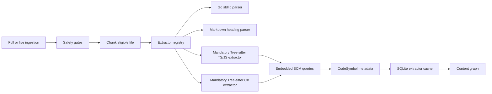
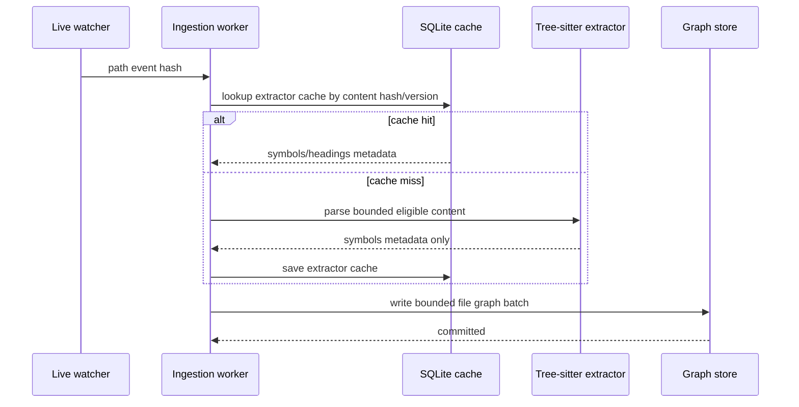

# Agent MCP Promoted AST Extraction And Live Rescan Plan

Date: 2026-05-30

## Scope

Plan mandatory AST-backed project-context extraction and live-rescan optimization after P2. This plan replaces the earlier "lightweight fallback" posture for TypeScript/JavaScript extraction: AST extraction must be promoted, initialized at startup, tested, and treated as required for supported Go, TS/JS, TSX/JSX, and C# file types.

Jira: not checked by repo constraint.
Confluence: not checked by repo constraint.

## External Evidence

- Official Tree-sitter Go bindings support parser setup, language setup, parsing, query creation, query cursor iteration, and explicit `Close()` lifecycle for C-backed objects: <https://github.com/tree-sitter/go-tree-sitter>.
- Official examples use separate grammar packages, for example JavaScript via `github.com/tree-sitter/tree-sitter-javascript/bindings/go`: <https://github.com/tree-sitter/go-tree-sitter>.
- TypeScript and TSX grammars are provided by the Tree-sitter TypeScript grammar repository: <https://github.com/tree-sitter/tree-sitter-typescript>.
- C# grammar is provided by the Tree-sitter C# grammar repository: <https://github.com/tree-sitter/tree-sitter-c-sharp>.

## Current Source Evidence

- Full project ingestion currently wraps the entire scan in one graph batch through `Service.withGraphBatch` and `Service.IngestProject` in `internal/projectingestion/service.go`.
- Persistent graph `Batch` holds the persistent graph mutex while executing the callback and appending recorded operations in `internal/platform/ladybug/persistent.go`.
- TS/JS extraction is currently regex-based in `internal/projectingestion/parser_javascript.go`.
- Infra/config extraction is currently lightweight line/regex/standard-library parsing in `internal/projectingestion/parser_infra.go`.
- Go extraction is already AST-backed through the Go standard library parser in `internal/projectingestion/parser_go.go`.
- `parseEligible` dispatches semantic extraction by extension in `internal/projectingestion/service.go`.
- Live path events log start/completion/failure and slow-task diagnostics in `internal/projectingestion/orchestrator.go`, but full live rescans can still occupy ingestion workers and graph writes for a long time.

## Goals

- Keep Go extraction AST-backed and mandatory through the Go standard library parser.
- Make TS/JS/TSX/JSX and C# extraction AST-backed and mandatory, with no regex fallback for those file types.
- Embed Tree-sitter query files in the binary with `go:embed`.
- Fail fast in tests and startup configuration if required AST grammars or queries cannot initialize.
- Cache parser output by content hash and extractor version to avoid reparsing unchanged files during large rescans.
- Bound live full-rescan work so live path events are not starved behind a long repository scan.
- Add project-level ingestion fairness so one project's full rescan cannot block another project's ingestion indefinitely.
- Update system architecture, README, guides, MCP skill docs, configuration docs, and runbooks so documented behavior matches the promoted AST architecture.
- Preserve privacy: no raw source, absolute roots, skipped sensitive content, matched sensitive text, prompts, provider payloads, or secrets in diagnostics.

## Non-Goals

- No embeddings or vector storage.
- No provider calls.
- No crawling.
- No public exposure or auth changes.
- No raw DB query endpoint.
- No exclusions of useful docs/infra/apps/libs/packages/policies/scripts/configs to fake scale.

## Architecture

Go remains part of the normal extractor registry through the Go standard library AST parser. Tree-sitter is part of the normal extractor registry for supported TS/JS and C# file types. If required grammars or embedded query files are not available, startup/test initialization must fail rather than silently downgrading to regex extraction.

## Sequence

## Implementation Plan

1. **Promote extractor abstraction** in `internal/projectingestion`.
   - Create `internal/projectingestion/extractor.go`.
   - Define `Extractor` and `Registry` interfaces with `Parse(ctx, relative, content)`.
   - Move extension dispatch out of `parseEligible` into the registry.
   - Keep Go and Markdown extractors as first-class native extractors.
   - Go must continue to use the Go standard library AST parser unless a later ADR approves replacing it.

2. **Replace TS/JS regex extraction with mandatory Tree-sitter**.
   - Remove TS/JS routing to `ParseJavaScriptLikeSymbols`.
   - Create `internal/projectingestion/treesitter_extractor.go`.
   - Add dependencies:
     - `github.com/tree-sitter/go-tree-sitter`
     - `github.com/tree-sitter/tree-sitter-javascript/bindings/go`
     - `github.com/tree-sitter/tree-sitter-typescript/bindings/go`
   - Add embedded queries:
     - `internal/projectingestion/queries/javascript.scm`
     - `internal/projectingestion/queries/typescript.scm`
     - `internal/projectingestion/queries/tsx.scm`
   - Initialize parser, language, query, and cursor objects with explicit `Close()` lifecycle.
   - Return `SkipReasonParseError` for per-file parse/query failures, preserving P0 fault tolerance.
   - Treat extractor initialization failure as service startup failure when content graph ingestion is enabled.

3. **Add mandatory C# Tree-sitter extraction**.
   - Add `.cs` routing through the promoted Tree-sitter extractor registry.
   - Add dependency on the Tree-sitter C# grammar Go binding if available from the maintained grammar package; if not available, add a checked-in generated Go binding step and document the generation command.
   - Add embedded query file:
     - `internal/projectingestion/queries/csharp.scm`
   - Startup must validate the C# grammar and query when content graph ingestion is enabled.
   - Per-file C# parse/query failures must become `SkipReasonParseError`, not run-level failure.

4. **Define supported AST symbol contract**.
   - TS/JS/TSX/JSX symbols:
     - exported functions
     - function declarations
     - const/let/var arrow functions
     - classes
     - interfaces
     - type aliases
     - enums only as parsed source symbols, not new Go enum types
     - import declarations
   - C# symbols:
     - namespace declarations
     - using/import declarations
     - classes
     - interfaces
     - structs
     - records
     - enums
     - methods
     - constructors
     - properties
   - Go symbols:
     - keep existing package, import, type, function, and method extraction through the Go standard library parser
   - Store only metadata already allowed by `SymbolMetadata`: kind, name, package/import path where applicable, receiver empty, start/end lines.
   - Do not store AST node text, raw matched source, or source snippets.

5. **Add extractor cache** in SQLite.
   - Bump SQLite schema version.
   - Add `project_extractor_cache` with:
     - `project_id`
     - `relative_path_hash`
     - `content_sha256`
     - `extractor_name`
     - `extractor_version`
     - `symbols_json`
     - `headings_json`
     - `created_at`
   - Add indexes by project/file/content/extractor.
   - Cache only metadata, never chunk text or skipped-sensitive data.
   - Invalidate automatically by content hash or extractor version change.

6. **Bound full-rescan graph commits**.
   - Replace one whole-project graph batch with bounded file batches in `internal/projectingestion/service.go`.
   - Commit graph writes every configurable batch size, default 500 files.
   - Preserve run state and reason counters across batches.
   - Keep run-level failure semantics for root traversal/state/graph corruption; keep file-local errors non-fatal.

7. **Prevent live path-event starvation**.
   - Add separate priority queue for live path events or pause full-rescan workers between bounded batches.
   - Ensure a queued path event can run after at most one active batch completes.
   - Log safe queue metrics:
     - project ID
     - queue depth
     - task type
     - elapsed duration
     - relative path hash only for path tasks
   - Do not log raw relative paths for denied/sensitive/unsafe cases.

8. **Add project-level ingestion fairness**.
   - Replace the current per-project watcher workers calling `IngestProject` directly with a shared ingestion scheduler in `internal/projectingestion`.
   - Scheduler requirements:
     - multiple projects can make progress concurrently up to a bounded global worker count;
     - a large full scan is split into project/file batches;
     - scheduling is round-robin or weighted-fair across projects;
     - live path events have priority over full-scan continuation for the same project;
     - one project's graph writes must not hold a global lock across the whole scan;
     - per-project queue depth and active task counts are exposed as safe diagnostics.
   - Add config:
     - `ingestion.global_worker_count`
     - `ingestion.per_project_worker_limit`
     - `ingestion.full_scan_batch_size`
     - `ingestion.live_path_priority = true`
   - Keep manual ingestion semantics: manual project ingestion returns a run ID/status and may execute through the same scheduler or a synchronous compatibility wrapper, but it must not block unrelated project live events for the full scan duration.
   - Logs must include project ID, task type, safe queue counters, elapsed time, and reason category only.

9. **Config and startup validation**.
   - Add `ast_extraction_enabled = true` default when content graph ingestion is enabled.
   - Add `full_scan_batch_size` default, bounded positive integer.
   - Add scheduler config validation for positive global and per-project worker limits.
   - Startup must validate required Tree-sitter grammars and embedded queries.
   - If validation fails, server startup fails with a sanitized error category, not a silent downgrade.

10. **Documentation and architecture updates are required in the same implementation**.
   - Update root `README.md` to describe promoted AST-backed project-context ingestion, supported languages, and no-fallback behavior for Go, TS/JS/TSX/JSX, and C#.
   - Update `docs/agent-context-guide.md` with the final MCP discovery flow:
     - `projects.files.list`
     - `projects.symbols.list`
     - `projects.headings.list`
     - `projects.file.outline`
     - bounded chunk reads only after outline/file metadata.
   - Update `docs/configuration/local-projects.md` with new config keys, startup validation behavior, parser cache location, full-scan batch-size behavior, and live rescan starvation guarantees.
   - Update `docs/runbooks/local-dev.md` with local startup checks, Tree-sitter dependency verification, and troubleshooting steps for AST initialization failures.
   - Update `.ai/skills/mivialabs-agent-mcp/SKILL.md` so agent guidance tells agents to use outline/symbol/headings before chunk text.
   - Add or update a system architecture document under `docs/architecture/`:
     - If an MCP/project-ingestion architecture doc already exists, update it.
     - Otherwise create `docs/architecture/agent-mcp-project-context-ingestion.md`.
     - Include diagrams for extractor registry, parser cache, graph write batching, live path-event prioritization, and fair project scheduling.
   - Update any references in `docs/reports/tests/2026-05-30-agent-mcp-ingestion-performance-reliability-review.md` or later implementation reports only if they would otherwise become misleading.
   - Documentation must not include absolute local roots, raw source content, skipped sensitive content, matched sensitive text, secrets, PII, prompts, provider payloads, or raw local config values.

## Required Tests

- Tree-sitter extractor initializes all required languages and queries.
- TS/JS/TSX fixtures extract functions/classes/interfaces/types/imports using AST captures.
- Go fixtures continue to extract package/import/type/function/method symbols through the Go standard library AST parser.
- C# fixtures extract namespace/using/class/interface/struct/record/enum/method/constructor/property symbols using AST captures.
- Regex TS/JS extractor path is removed or unreachable.
- Bad TS syntax records file-local parse error without failing full scan.
- Bad C# syntax records file-local parse error without failing full scan.
- Extractor cache hit avoids reparsing unchanged content.
- Extractor version change reparses and refreshes metadata.
- Full scan commits graph writes in bounded batches and still tombstones missing skipped/eligible states correctly.
- Live path event queued during a full rescan completes after one batch window, not after the whole rescan.
- Two projects with live initial scans both make progress under the scheduler; the smaller project is not blocked until the larger project completes.
- A live path event for project B completes while project A has a long full rescan active.
- Per-project worker limits and global worker limits are enforced.
- Scheduler diagnostics expose queue/active counts without raw paths, roots, source, or sensitive content.
- Slow live task diagnostics include hash/count/category only and do not include raw path/root/source.
- Documentation, README, guide, runbook, skill, and architecture updates are included and reviewed for consistency with implemented behavior.
- Existing required gates remain green:
  - `go test ./internal/projectregistry ./internal/projectingestion ./internal/projectregistry/httpapi ./internal/projectregistry/mcpapi ./internal/agentcontrol/mcpapi ./cmd/agent-server`
  - `go test ./...`
  - `git diff --check`

## Security And Privacy Review

- AST extraction processes local eligible source after existing safety gates only.
- No raw AST text, source snippets, matched sensitive text, roots, prompts, provider payloads, secrets, or skipped-sensitive content may be logged or returned.
- Cache stores symbols/headings metadata only and is keyed by content hash for eligible files.
- Sensitive/denied skipped files remain hash-only and must not get content hashes or cache rows.
- New native/parser dependencies require dependency review and reproducible WSL/CI setup.

## Risks And Mitigations

| Risk | Impact | Mitigation |
| --- | --- | --- |
| Native Tree-sitter lifecycle leaks | Long-running local server memory growth | Explicit `Close()` tests and leak-oriented stress benchmark |
| Grammar/query drift | Broken extraction after dependency bump | Pin versions and add fixture tests per supported syntax form |
| Mandatory AST startup failure | Server unavailable if native dependency missing | Validate during CI and local startup; fail with sanitized config/dependency error |
| Cache stores too much metadata | Privacy and disk growth risk | Metadata-only schema, no raw node text, bounded cache cleanup by project/file |
| Bounded graph commits produce partial run state | Diagnosability risk | Persist run progress and reason counters per batch; final status reflects partial failure categories |
| One large project monopolizes ingestion workers | Other project context becomes stale | Shared fair scheduler, bounded per-project workers, round-robin full-scan batches, live path priority |

## Human Decisions Needed

- Approve mandatory Tree-sitter native dependency for local `agent-server`.
- Choose default `full_scan_batch_size` target for MASS-scale repos.
- Choose default `global_worker_count` and `per_project_worker_limit` for local machines.
- Decide whether parser cache should live in current SQLite app DB or a dedicated local ingestion DB file.
- Decide whether AST extraction failure for a single eligible TS/JS file should skip that file or mark it eligible without symbols. Recommended: skip as `parse_error` to keep diagnostics honest.
